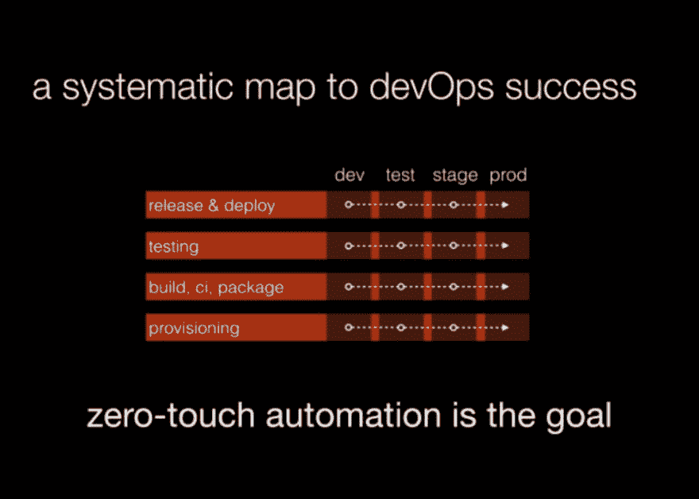
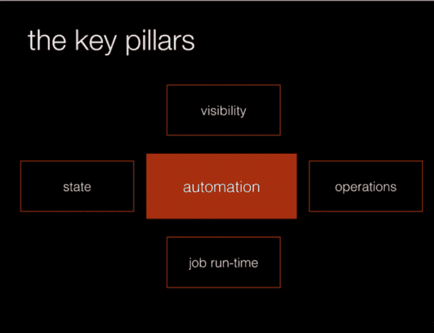

# 通往 DevOps 成功的明确路径

> 原文：<https://dev.to/pavanbelagatti/a-well-defined-path-to-devops-success-59j5>

*文章原载于[DevOpsCube](https://devopscube.com/systematic-map-devops-success/)T3】*

企业正在经历数字化转型，多年来交付软件一直是一个挑战，我们看到了许多摩擦，正因为如此，许多公司都试图变得敏捷，但每个人都以当地的方式适应了敏捷。如果你看一下应用程序从开发人员的机器一直到生产服务器，然后到最终客户的整个生命周期，整个工作流程一点也不敏捷。

自多年以来，组织一直在努力采用敏捷并变得敏捷。

# DevOps 是来救援的。

#### 如何实现 DevOps 成功的系统地图

您必须始终记住，零接触自动化是我们的目标，这并不意味着您必须直接部署到生产环境中，但是如果您想这样做，您应该能够做到。这应该很容易，甚至一个操作人员只需按一下按钮就可以做到，而不需要运行一堆服务器。

## DevOps 被分成 4 个不同的块，

### 1。准备金提取

### 2。构建、CI 和包装

### 3。测试

### 4。发布和部署

除了 4 个阶段之外，还必须经历如图所示的所有环境。

这里的目标应该是将组织中的自动化尽可能向右移动。

## 自动化建立在这 4 个核心支柱之上，

1.  作业运行时:所有完整的企业都应该使用一个公共的图像格式，或者一个构建所有应用程序的公共图像。这个支柱更多的是确保打包&在整个企业中安装什么版本。

2.  状态:仅仅运行一个特定的任务是不够的，你需要知道所有其他的任务都在运行，最后一次运行是什么时候，稳定版本，自动化中的 IP 地址，docker 容器标签等工件，所有这些都应该是系统可用的。

3.  可见性:你需要知道整个工作流程是如何进行的，而不需要去了解每一件事情。您需要能够在单个窗格中看到所有内容。这有助于直观地了解您的应用程序自动化流程和状态。

4.  运营:这更多的是解释如何进行部署，如何进行扩展等

DevOps 自动化流程在[shipping](https://www.shippable.com/devops-assembly-lines.html#download-whitepaper)首席执行官 Avi Cavale 的[网络研讨会](https://www.youtube.com/watch?v=j26OFEMlUm4)中得到了很好的解释

开始找出您可以自动化的关键流程，并以正确的方式进行开发，以取得巨大成功。