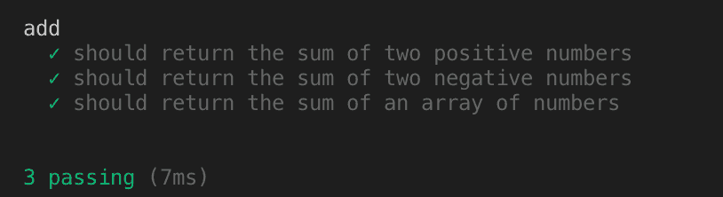
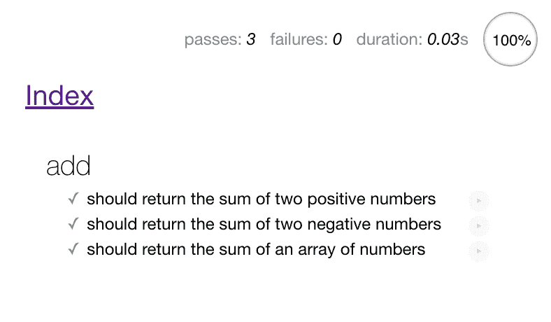

# 摩卡和柴☕️的美味测试

> 原文：<https://dev.to/basedenergy/tasty-testing-with-mocha-and-chai--51ek>

今天我将简要介绍一个使用[摩卡](https://mochajs.org/)和[柴](https://www.chaijs.com/)的自动化测试的简单工作流程。Mocha 是一个设置测试套件的测试框架，Chai 是一个期望框架，它添加了帮助器，使针对代码构建测试变得更加容易。

## 但是我为什么需要这样做呢？？

编写可靠的测试可以省去开发人员在应用程序中点击鼠标来手动测试应用程序每个特性的麻烦。当利用测试驱动开发或 TDD 时，这也很重要。虽然我不打算在这里完全深入 TDD，但它基本上是一种开发风格，其中:

1.  首先编写测试。只编写足够失败的测试。
2.  然后编写产品代码，明确的目的是使失败的单元通过测试。

#### 所以让我们从安装摩卡和柴开始吧

▶︎ [柴安装指令](https://www.chaijs.com/guide/installation/)▶︎[摩卡安装指令](https://mochajs.org/#installation)

一旦我们安装了这些，我们有两种方式来运行我们的测试:通过我们的控制台与节点，或在浏览器中。使用 browser 方法需要创建一个特殊的 html 文件，我们一会儿就会谈到。但是首先:

## 在节点中测试

假设我们正在构建一个加法函数，它需要能够将一个数字数组或作为参数传入的两个数字相加。让我们使用一个`npm init`来创建一个 package.json 文件。

接下来，我们需要将 chai 和 mocha 添加到我们的开发依赖项中，为了方便起见，添加一个运行 mocha 的脚本。这个练习中我的 package.json 看起来是这样的:

```
{
  "name": "mochachai-intro",
  "version": "1.0.0",
  "description": "",
  "main": "index.js",
  "scripts": {
    "test": "mocha"
  },
  "license": "ISC",
  "devDependencies": {   
     "chai": "^4.2.0",
     "mocha": "^5.2.0"
  },
  "dependencies": {}
} 
```

现在我们可以做一个`npm install`来安装我们所有有趣的依赖项并开始工作！

为了这个例子，我们将创建两个 Javascript 文件，一个名为`add.js`，另一个名为`test.js`。test.js 文件将包含针对 add.js 函数运行的测试。

因为我们正在利用 TDD，所以让我们首先进行测试。我们的 test.js 应该是这样的:

```
const expect = require('chai').expect;
const add = require('./add.js');

describe('add', function() {
  it('should return the sum of two positive numbers', function() {
    expect(add(2, 4)).to.equal(6);
  });

  it('should return the sum of two negative numbers', function() {
    expect(add(-2, -4)).to.equal(-6);
  });

  it('should return the sum of an array of numbers', function() {
    expect(add([1,2,3,4,5])).to.equal(15);
  });
}); 
```

现在我们只需要写一个函数，它只做这些测试指南所要求的事情。我的长这样:

```
const add = function (num1, num2) {

  if (Array.isArray(num1)){
    let sum = 0;
    for ( let i = 0; i < num1.length; i++){
      sum += num1[i];
    }
    return sum;
  }

  return num1 + num2;
}

module.exports = add; 
```

现在，如果我们运行`npm test`，我们应该会得到一条消息，表明我们所有的测试都通过了:

<figure>

[](https://res.cloudinary.com/practicaldev/image/fetch/s--blKP_SkU--/c_limit%2Cf_auto%2Cfl_progressive%2Cq_auto%2Cw_880/https://thepracticaldev.s3.amazonaws.com/i/ndj2meca7sdsl0q4dpdt.png)

<figcaption>VERY COOL!</figcaption>

</figure>

## 在浏览器中测试

如果您决定想要一个漂亮的 UI 来展示您通过的测试(老实说，谁不想呢)，您只需添加一个 html 页面，其中包含一些针对 mocha 和 chai 的脚本。我使用了一个样本 test.html 文件，看起来像这样:

```
<!DOCTYPE html>
<html>
<head>
  <meta charset="utf-8">
  Tests
  <link rel="stylesheet" media="all" href="https://cdnjs.cloudflare.com/ajax/libs/mocha/5.2.0/mocha.css">
</head>
<body>
  <div id="mocha"><p><a href=".">Index</a></p></div>
  <div id="messages"></div>
  <div id="fixtures"></div>
  <script src="https://cdnjs.cloudflare.com/ajax/libs/mocha/5.2.0/mocha.js"></script>
  <script src="https://cdnjs.cloudflare.com/ajax/libs/chai/4.2.0/chai.min.js"></script>
  <script src="add.js"></script>
  <script>
    mocha.ui('bdd');
    mocha.reporter('html');
    const expect = chai.expect;
  </script>
  <script src="test.js"></script>
  <script>mocha.run();</script>
</body>
</html> 
```

我们所要做的就是将这个 html 页面添加到我们的应用程序中，并在浏览器中打开它，我们应该会得到一个好看的结果页面，甚至会显示我们的测试运行需要多长时间！添加功能的页面应该如下所示:

<figure>

[](https://res.cloudinary.com/practicaldev/image/fetch/s--PsyvPGaW--/c_limit%2Cf_auto%2Cfl_progressive%2Cq_auto%2Cw_880/https://thepracticaldev.s3.amazonaws.com/i/i2pxnpw4x9qg9ccf1ycf.png)

<figcaption>Beautifully illustrated and functional!</figcaption>

</figure>

## 现在怎么办！？

现在我们对如何使用 Mocha 和 Chai 编写测试有了一个非常基本的想法，但是我们该如何处理这些信息呢？？在第 2 部分中，我将深入探讨一些更适用于真实场景的测试用途。

#### 务必做出反应并跟随🤠✌️