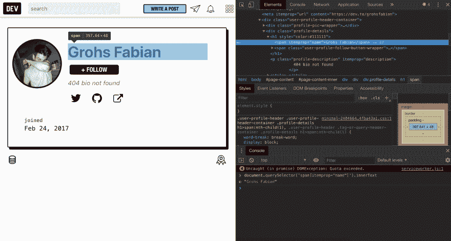
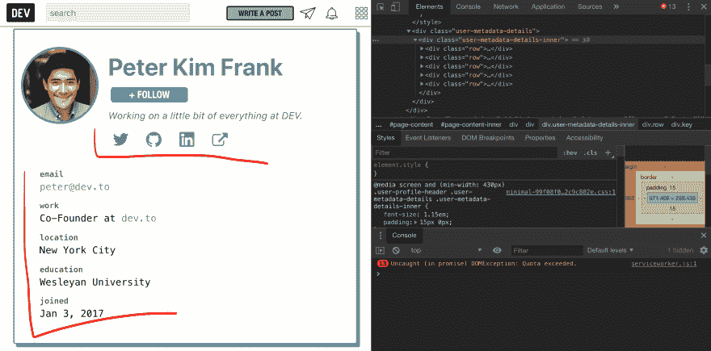
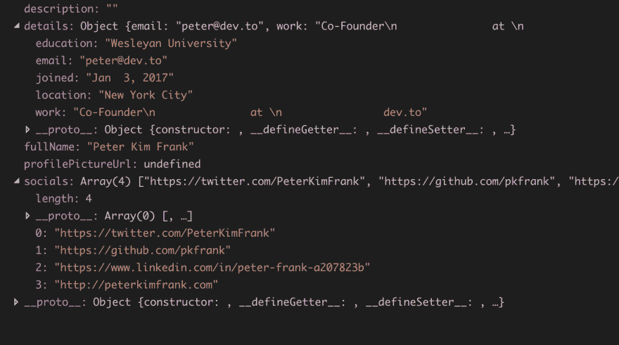

# 用 NodeJs 开始网页抓取

> 原文：<https://dev.to/grohsfabian/start-web-scraping-with-nodejs--4l62>

你好，

今天我们将从 NodeJs 的网页抓取开始，用一些**酷而简单的例子**

我们开始吧

# 简介

我不会用科学的技术解释来让你觉得无聊，

我给你举个简单的例子:

**让我们说**

您希望获得 instagram 个人资料、关注者、跟随者、上传、描述和其他信息，这些信息可能无法通过 API 获得，或者您可能无法访问该 API。

这种情况下，你去开始与网页抓取。

# 💻我们要用的工具

以下是我将在本例中使用的工具，它们是入门的完美工具

*   [请求](https://github.com/request/request) -对等依赖**请求-承诺**

*   [请求——承诺](https://github.com/request/request-promise)——为了提出请求并获得你想要抓取的网站内容。

*   [Cheerio](https://github.com/cheeriojs/cheerio)——可能是用 NodeJs 解析 html 内容最常用的库，NodeJs 具有类似于 **Jquery 的语法**

*   没别的了。对，没错！

# 入门

我将假设您已经有了[节点。Js](http://nodejs.org) 安装在你的笔记本电脑或 pc 上，如果没有，你还在等什么？🔥

现在，我们需要确保您有一个准备好编写代码的新项目。

您可以使用 **npm** 在新的空文件夹中轻松启动一个。

`npm init`

完成这些步骤后，您必须通过运行以下代码来安装我们将要使用的库(在同一个新项目中):

`npm install cheerio --save
npm install --save request
npm install request-promise --save`

# 我们在刮什么？🤔

在这个例子中，我将把这个社区网站**开发到**,因为我想让这个网站独一无二，直接献给你们所有人😋

我们将抓取任何**开发者到**成员页面的基本细节。

# 提及

我非常想提到的是，如果你仍然在用回调或连锁承诺来抓取网页，这将是一个很好的刷新，因为我们将使用**异步等待语法**。

我也在我的 **[抓取博客](https://learnscraping.com/)** 上发布了很多这样的内容，包括一篇关于[用 NodeJs](https://learnscraping.com/scraping-instagram-profile-data-with-nodejs/) 抓取 Instagram 个人资料的好文章💻

# 让代码👨‍💻👩‍💻

让我们开始吧，我不喜欢浪费时间谈论没有实际意义的代码和结果。

## 1。初始请求和解析

第一阶段非常简单。我们需要像普通浏览器一样模拟对 *dev.to* 网站的请求，并获取它的 HTML 内容。

你可以这样做:

```
const request = require('request-promise');
const cheerio = require('cheerio');

const BASE_URL = 'https://dev.to/';
const USERNAME = 'grohsfabian';

(async () => {

  /* Send the request to the user page and get the results */
  let response = await request(`${BASE_URL}${USERNAME}`);

  /* Start processing the response */
  let $ = cheerio.load(response);

  /* Parse details from the html with query selectors */
  let fullName = $('span[itemprop="name"]').text();

  console.log({ fullName });

})(); 
```

我真的认为这段代码非常简单明了，如果你看着它，即使是对于那些不太懂抓取或者可能什么都不懂的人来说。

这个例子向你展示了从 *dev.to* 网站的个人资料页面获取某人的**全名**有多容易。

[](https://res.cloudinary.com/practicaldev/image/fetch/s--OZnAfEsN--/c_limit%2Cf_auto%2Cfl_progressive%2Cq_auto%2Cw_880/https://i.imgur.com/tGaV8o0.png)

很酷吗？ **让我们更进一步👁**

## 2。获取更多数据

现在，我们有了一个开始的基础，我们需要继续做同样的事情，但是对于我们想要从概要文件中获得的其他数据。

同样，因为我们使用 **Cheerio** 作为解析 html 的方法，我们可以使用集成到 Cheerio 中的 jquery 库中的任何选择器。

所以，这意味着你至少应该对 [CSS 查询选择器](https://www.w3schools.com/cssref/css_selectors.asp)(可以在 Cheerio 中使用)和 [Jquery 选择器](https://api.jquery.com/category/selectors/)有一些基本的了解。

### 所以，在更进一步之前..

我想至少分解一下我们用来让**获得概要文件全名**的选择器。

`span[itemprop="name"]`

这告诉 cheerio 库寻找:HTML 元素是一个具有 **itemprop 属性**的 **span** ，并且该属性**等于“名称”**。

我们将为更多的选择器使用相同的结构和逻辑💻。

### 让我们创建。

为了从概要文件中解析更多的数据，我又做了一些选择器，如下所示🔥

```
let description = $('span[itemprop="description"]').text();
let profilePictureUrl = $('img[class="profile-pic"]').attr('href'); 
```

这仅仅是开始。这些是一些简单的例子，很容易得到，不需要太多的思考。

### 深入一点。

这里有一些有趣的信息，对初学者来说可能有点难度，但仍然是一个很好的练习。

[](https://res.cloudinary.com/practicaldev/image/fetch/s--H1NRJ_8P--/c_limit%2Cf_auto%2Cfl_progressive%2Cq_auto%2Cw_880/https://i.imgur.com/nvXQ9Yv.png)

这些细节可以存在，也可以不存在。人们可以添加他们的电子邮件公开与否，这是他们的选择。但是，这仍然是我们的选择，能够刮我们想要的一切。

这是我要做的..

```
 /* Get extra properties from the profile */
  let details = {};

  $('div[class="user-metadata-details-inner"] > div[class="row"]').each((i, elm) => {

    let key = $(elm).find('div[class="key"]').text().trim();
    let value = $(elm).find('div[class="value"]').text().trim();

    details[key] = value;
  }); 
```

这段代码将迭代这个概要文件的所有可能的属性，包括像**加入日期**、**电子邮件**(如果可用)、**位置**(如果可用)这样的东西..等等。

### 获取又一轮细节

我们不会在这里停下来，我会更深入地去做，让所有的社交链接都可以在个人页面上看到。

我将使用与上面类似的技术，下面是它的样子:

```
 /* Get socials from the profile */
  let socials = [];
  $('p[class="social"] > a').each((i, elm) => {

    let url = $(elm).attr('href');

    socials.push(url);
  }); 
```

在这段代码中，我基本上迭代了该类中的每个可用链接，包括社交图标按钮，并将它们存储在一个数组中。

## 3。完成它

当然，更多的数据可以根据你的需要收集，但是我想你现在明白了..

刮痧是一项很好的技能，如果你知道它的基本知识，那么它会打开你的想象力🔥

# 全码

TL；DR；如果你不想读这篇文章，这里有你需要的一切😅

```
const request = require('request-promise');
const cheerio = require('cheerio');

const BASE_URL = 'https://dev.to/';
const USERNAME = 'peter';

(async () => {

  /* Send the request to the user page and get the results */
  let response = await request(`${BASE_URL}${USERNAME}`);

  /* Start processing the response */
  let $ = cheerio.load(response, { normalizeWhitespace: true });

  /* Parse details from the html */
  let fullName = $('span[itemprop="name"]').text();
  let description = $('span[itemprop="description"]').text();
  let profilePictureUrl = $('img[class="profile-pic"]').attr('href');

  /* Get extra properties from the profile */
  let details = {};

  $('div[class="user-metadata-details-inner"] > div[class="row"]').each((i, elm) => {

    let key = $(elm).find('div[class="key"]').text().trim();
    let value = $(elm).find('div[class="value"]').text().trim();

    details[key] = value;
  });

  /* Get socials from the profile */
  let socials = [];
  $('p[class="social"] > a').each((i, elm) => {

    let url = $(elm).attr('href');

    socials.push(url);
  });

  console.log({
    fullName,
    profilePictureUrl,
    description,
    details,
    socials
  });

})(); 
```

这段代码将向您输出如下内容:

[](https://res.cloudinary.com/practicaldev/image/fetch/s--EDUKoKgU--/c_limit%2Cf_auto%2Cfl_progressive%2Cq_auto%2Cw_880/https://i.imgur.com/Ryma7w0.png)

但是请不要将此代码用于恶意目的和垃圾邮件！

# 视频教程

[https://www.youtube.com/embed/SLqASSu4-Q4](https://www.youtube.com/embed/SLqASSu4-Q4)

# 塞

*塞人来了..*

我最近发布了我的新博客，致力于帮助你**了解更多关于 NodeJs** 抓取的知识，我在那里有一些很好的文章，像这篇文章一样深入。

一定要去看看，我相信你会喜欢的-> [用 NodeJs](https://learnscraping/) 学习 Scraping。

如果你真的喜欢这种东西，我也有一个很棒的 **5 星课程**和在 Udemy 上最畅销的**。还有，**

我有一张给所有开发者会员的秘密优惠券

[用 NodeJs 学习网页抓取-速成班](https://www.udemy.com/nodejs-web-scraping/?couponCode=DEVTOX) 

问我任何问题，请让我知道你对这篇文章的看法🔥