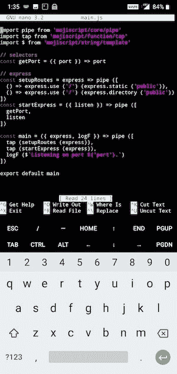
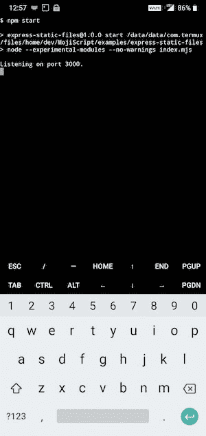
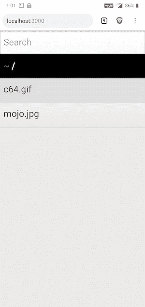
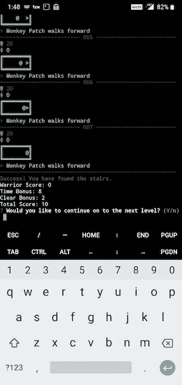

# 在我的上启动并运行 node.js 和 Express...电话？

> 原文：<https://dev.to/joelnet/getting-nodejs-and-express-up-and-running-on-my-android-phone-3plp>

我从 Play store 安装了 [Termux](https://play.google.com/store/apps/details?id=com.termux) 。它是免费的，不需要 root 访问。抱歉，如果你有 iPhone，去钓鱼吧。

我总是做的第一件事就是通过运行这些命令来检查更新。如果您已经离开终端一段时间了，那么再次运行它们是很好的。

```
apt update
apt upgrade 
```

Enter fullscreen mode Exit fullscreen mode

扩展键盘，提供`ESC`、`HOME`、`END`、`TAB`等按键选择。从左向右滑动打开 Termux 菜单，长按`KEYBOARD`字。

[](https://res.cloudinary.com/practicaldev/image/fetch/s--Zrd4opTT--/c_limit%2Cf_auto%2Cfl_progressive%2Cq_auto%2Cw_880/https://thepracticaldev.s3.amazonaws.com/i/0zfe5hmawqsu2gc1qm57.png)

安装`nodejs`、`curl`和`git`。我很确定我需要这些。

```
apt install nodejs curl git 
```

Enter fullscreen mode Exit fullscreen mode

安装你最喜欢的编辑器。vi 已经装了，但是我喜欢 nano。

```
pkg install nano 
```

Enter fullscreen mode Exit fullscreen mode

[](https://res.cloudinary.com/practicaldev/image/fetch/s--K_u7ZQ0W--/c_limit%2Cf_auto%2Cfl_progressive%2Cq_auto%2Cw_880/https://thepracticaldev.s3.amazonaws.com/i/fxcmrog7k0crh4hlk2e1.jpg)

我必须修复 npm，这样我才能在全球范围内安装软件包。

```
nano ../usr/lib/node_modules/npm/node_modules/worker-farm/lib/farm.js 
```

Enter fullscreen mode Exit fullscreen mode

将`maxConcurrentWorkers`设置为`1`。

我总是创建一个 dev 目录来保存我所有的项目。

```
mkdir dev
cd dev 
```

Enter fullscreen mode Exit fullscreen mode

# 时间到了

让我们启动一个示例 Express 应用程序，看看这个东西是否可行。

```
git clone https://github.com/joelnet/MojiScript.git
cd MojiScript/examples/express-static-files
npm ci
npm start 
```

Enter fullscreen mode Exit fullscreen mode

[](https://res.cloudinary.com/practicaldev/image/fetch/s--2tXWqGS1--/c_limit%2Cf_auto%2Cfl_progressive%2Cq_auto%2Cw_880/https://thepracticaldev.s3.amazonaws.com/i/2q2iyy2pa29k4gblhs7w.jpg)

好吧，它说它在监听端口`3000`，但我以前被骗过。

[](https://res.cloudinary.com/practicaldev/image/fetch/s--0EPwSlnB--/c_limit%2Cf_auto%2Cfl_progressive%2Cq_auto%2Cw_880/https://thepracticaldev.s3.amazonaws.com/i/4gec1uf9bgf7c2jypml2.jpg)

厉害！看来真的管用！

# 备注

我可以让 [`n`](https://www.npmjs.com/package/n) 安装，但是它没有访问`/usr`目录的权限并且失败了。此时这对我来说并不重要，所以我没有深究解决方法。也许如果你知道的话可以在评论里让我知道。

并非所有软件包都兼容。所以这不会很快取代我的开发机器。但是能够在旅途中修补也很好。

# 总结

我能够使用 Termux 在我的 Android 手机上运行 node 和 express。设置非常快速和直接。我真的很惊讶这有多简单。

当我不在电脑旁边时，我用这个设置来运行一些快速的 JavaScripts。这种事情发生的次数比我愿意承认的要多。

接下来我应该把这个带到哪里？请在评论中告诉我你会如何处理这个设置！

我也让[warriojs](https://warriorjs.com)开始运行了！

[](https://res.cloudinary.com/practicaldev/image/fetch/s--D8v83B3O--/c_limit%2Cf_auto%2Cfl_progressive%2Cq_auto%2Cw_880/https://thepracticaldev.s3.amazonaws.com/i/atgstb6ti1hm2vyiptk1.jpg)

如果你喜欢函数式 JavaScript，请在这里或 Twitter 上关注我。

[](https://res.cloudinary.com/practicaldev/image/fetch/s--PqqJmrxK--/c_limit%2Cf_auto%2Cfl_progressive%2Cq_auto%2Cw_880/https://thepracticaldev.s3.amazonaws.com/i/6jsy3a866frzp3u5oda0.jpg)