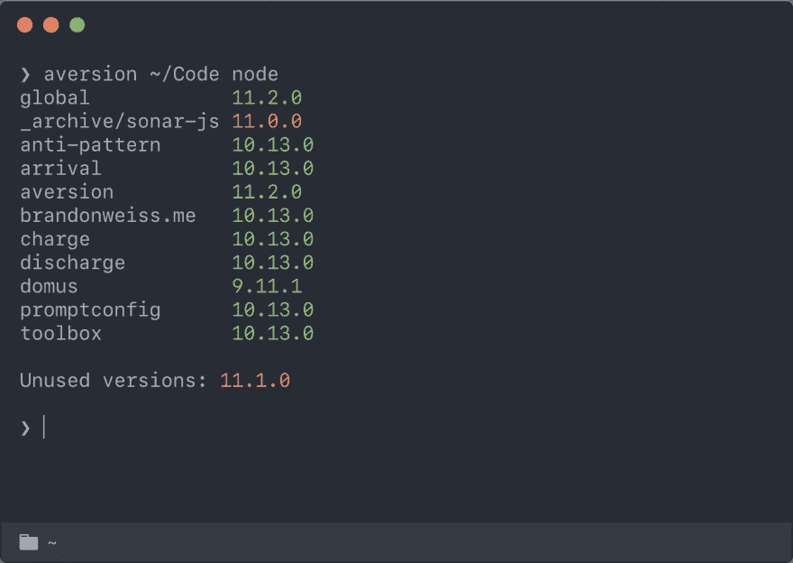

# 厌恶，升级使用旧语言版本的项目

> 原文：<https://dev.to/brandonweiss/aversion-upgrade-projects-that-are-using-old-language-versions-8go>

厌恶通过查看你的项目使用哪些语言版本，你安装了哪些，然后告诉你需要安装哪些，可以卸载哪些，来帮助你管理语言版本。它还为您提供了每个项目的概述，以及每个项目所使用的语言版本，以便于升级。

## 为什么？

语言版本管理器在轻松安装新语言版本方面非常出色。您可以看到您安装了哪些语言版本，但他们不知道您的项目或每个项目使用的语言版本。

升级您的项目所使用的语言版本是不均衡的。随着时间的推移，您会得到一堆项目，每个项目都使用不同的、可能过时的语言版本，还有一堆甚至更老的语言版本，没有一个项目在使用它们，它们可能会被卸载。

弄清楚哪些项目在旧语言版本上，需要升级，哪些语言版本可以卸载是很繁琐的，项目越多就越繁琐。

厌恶是你的语言版本经理和你的项目之间的桥梁。

在这个例子中，`11.0.0`正在被一个项目使用，但是没有安装，所以你知道要安装它，而`11.1.0`没有被任何项目使用，所以你知道要卸载它。

[看一看](https://github.com/brandonweiss/aversion)让我知道你的想法！