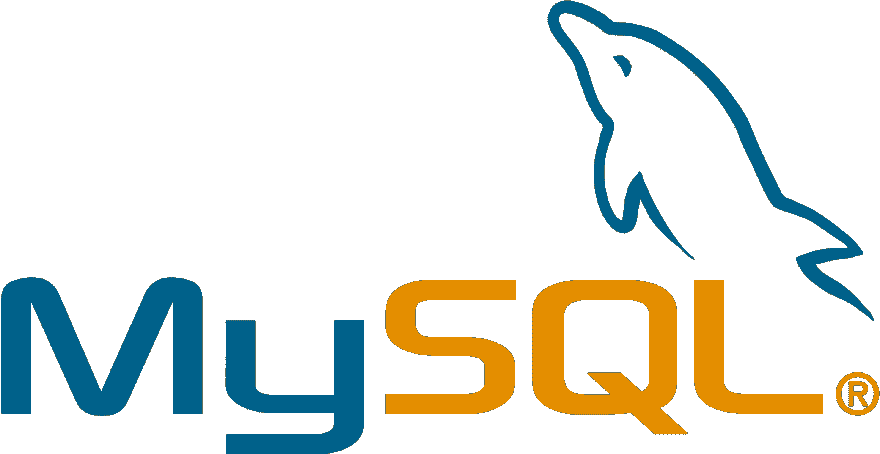

# MySQL:客户机和服务器模型数据库

> 原文：<https://dev.to/rmadisetti3/mysql-client-and-server-model-databases-3lfo>

 
各位 Javascript 程序员好，

在本文中，我们将讨论 MySQL，它是一个非常流行的基于客户机-服务器模型的数据库管理系统。为了了解这种构建应用程序的方式有多有用和广泛，我们可以看看你我日常使用的许多流行的网络应用程序，包括 YouTube、PayPal、Google、Twitter 和脸书。所有这些平台都使用 MySQL 来构建不同的、不计其数的数据，它们向网站上的每个用户发送和接收这些数据。

首先，让我们探索一下什么是 MySQL 数据库。MySQL 是一个数据库管理系统，可以运行在任何平台(Linux、MacOS 和 Windows)上，基于 SQL(结构化查询语言)。MySQL 运行在客户机-服务器模型上，这意味着 MySQL 服务器可以同时向多个用户发送客户机接口。这些与服务器的交互允许客户端发送单独的 SQL 语句，以便获得对其用户界面的响应。这些 SQL 语句包括 ADD、DROP、INSERT 和 UPDATE，可用于充分浏览数据库并对每个条目执行所需的操作。

如果任意一个客户端可以与 MySQL 服务器建立连接，并且恶意破坏服务器，那么就可能存在潜在的安全漏洞。幸运的是，MySQL 内置了安全特性来防止威胁的发生。MySQL 使用基于主机的验证系统，该系统使用访问权限和密码来防止匿名威胁服务器。