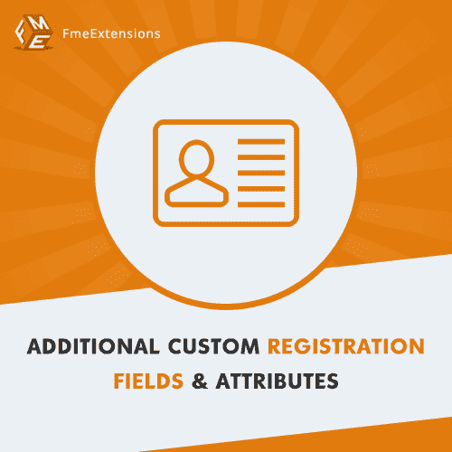
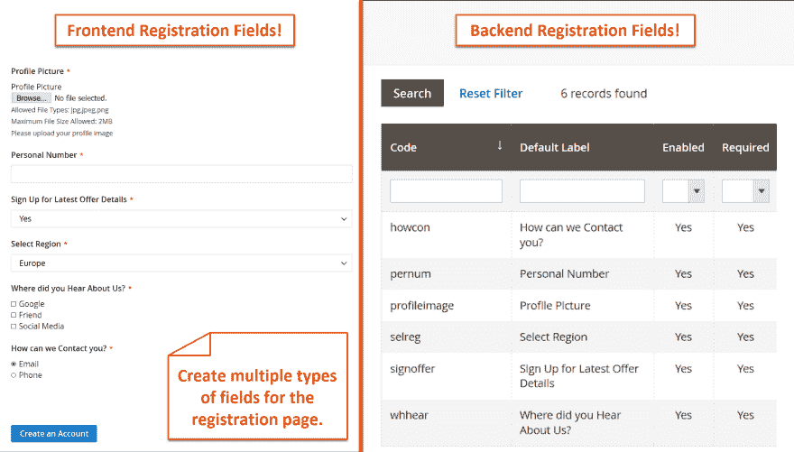
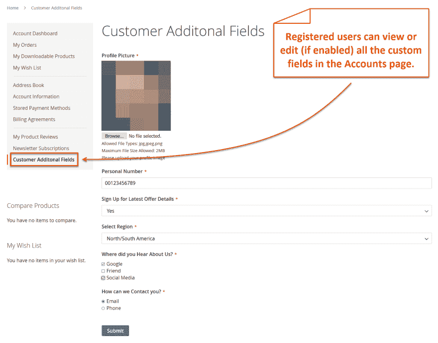
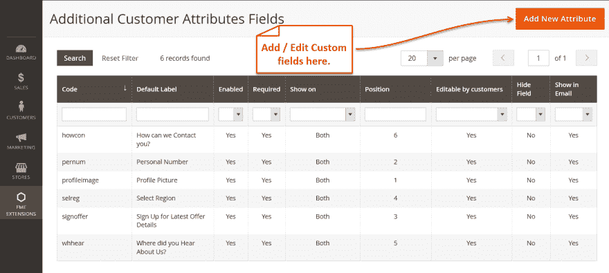
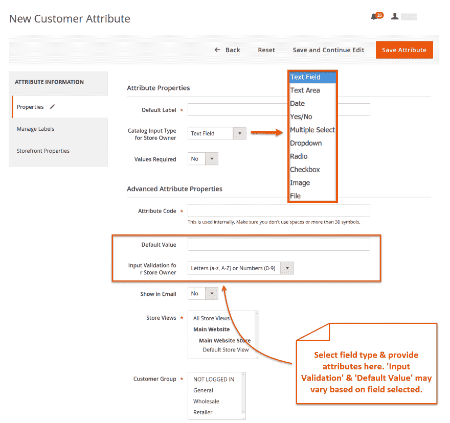

# Magento 2 客户属性扩展

> 原文：<https://dev.to/simonwalkerfme/magento-2-customer-attributes-extension-5bgh>

Magento 2 自定义属性扩展使您能够在自定义注册表中添加自定义属性，以便从潜在客户那里获得有针对性的信息。因此，客户在注册过程中不会遇到障碍。

这个扩展带有多种属性类型，可以帮助您以不同的形式获取用户数据。您可以创建的属性包括，文本字段、文本区域、文件上传、图像上传、单选按钮、下拉框、是/否、复选框等。您可以在注册表上定位自定义属性。您可以限制特定客户组的客户属性。

有了这个 Magento 2 自定义属性扩展，你可以在用户帐户中显示自定义注册属性和用户回复，让用户了解他们在注册帐户时提供的数据。即使在注册后，客户也可以更新其帐户部分的数据。令人惊讶的是，这个扩展完全符合 Magento 标准，并且是 100%开源的。

**主要特征**

将自定义属性添加到注册页面
按逻辑顺序整理自定义属性
为每个属性添加自定义标题
将属性设置为强制或可选
设置默认自定义属性值
您可以在注册表单中自由显示或隐藏属性。
·通过客户群限制附加属性

**创建自定义属性以获取不同类型的数据，如:**
*；文本字段*
*；文本区域*
*；文件上传*
*；图像上传*
*；日期*
*；下拉列表*
*；多选*
*；是/否*
*；单选*

**您可以验证输入属性，如:**

*【电子邮件】*
*【十进制数字】*
*【整数】*
*【字母数字】*
*【URL】*

**了解更多详情和演示-** [Magento 2 客户属性](https://www.fmeextensions.com/custom-registration-fields-attributes-extension-magento-2.html)

**截图**

