# 应用程序正在登录。具有 Seq 5 和 Serilog 的网芯

> 原文：<https://dev.to/alexhyettdev/application-logging-in-net-core-with-seq-5-and-serilog-2keb>

我过去用过不少日志框架，比如 Log4Net 和 Splunk。然而，它们中的大多数对于跟踪错误和查看服务执行情况并不是特别有用。当我在上一家公司工作时，我开始使用 Seq 和 Serilog，令人惊讶的是，它可以让有用的可搜索日志变得如此不同。

## Seq 是什么？

Seq 将你所有的日志放入一个快速搜索系统，让你可以很容易地找到错误。这是 Datalust 团队对 Seq 的描述。

> Seq 可帮助您快速识别和诊断复杂应用和微服务中的问题。通过对结构化应用程序日志进行集中、搜索和警报，使您的团队能够构建更好的软件。

虽然 Seq 通常花费 660 美元/年，但它在本地是免费使用的，现在 Seq 5 在生产中对单用户许可是免费的。缺点是在免费计划中它不能与 SSL 一起工作(除非你把它放在一个反向代理后面)。你也可以直接在 Windows 版本上使用 SSL，也可以通过 nginx/load balancer 与 docker 一起使用(感谢 Nicholas 的评论)。如果你正在创业，这是一个很好的工具。

Seq 具有许多非常有用的特性:

### 结构化日志记录

使用结构化日志，您还可以获得事件数据，这样您就可以更好地了解错误是如何发生的。您还可以使用自己的属性添加到这些数据中。

例如，我添加了我的应用程序 UserId，这样我就可以识别哪个用户发出了请求。这是我从一个日志中得到的数据。这只是一个信息消息，但是如果它是一个错误，它也会包含堆栈跟踪。

[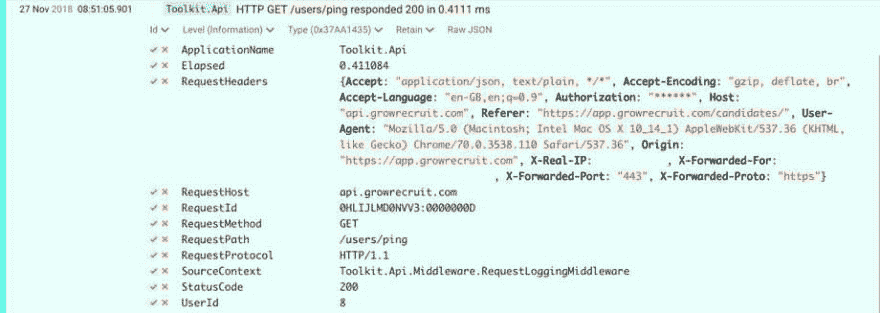](///static/2351472ece22a65e7c5e1d365a27187a/0c96e/structured-logs.jpg)

最佳做法是不要将敏感数据记录到日志中。如果您正在记录请求，请确保您事先删除了任何敏感数据，比如用星号替换 Auth 令牌，就像我在本例中所做的那样。

Datalust 有一个[示例中间件](https://github.com/datalust/serilog-middleware-example/blob/master/src/Datalust.SerilogMiddlewareExample/Diagnostics/SerilogMiddleware.cs)用于。Net Core 通过一个标题白名单来处理这个问题。

我特别喜欢这个中间件还记录了请求的运行时间，这样您就可以轻松地过滤性能问题。这个请求只用了 0.4111 毫秒，就得到爱。网芯。

### 高级搜索和过滤

Seq 利用其快速搜索和过滤能力，可以很容易地找到错误和性能问题。

有很多方法可以在 Seq 中搜索。您可以通过在搜索框中键入文字来进行文本搜索，搜索框将在日志标题中搜索特定的文本。

您也可以使用数字函数(如 StartsWith、EndsWith、Contains)来帮助查找特定的错误。如:

```
Contains(RequestId, '0NVV3') 
```

Enter fullscreen mode Exit fullscreen mode

或者为什么没有找到所有耗时超过 100 毫秒的请求

```
Elapsed > 100 
```

Enter fullscreen mode Exit fullscreen mode

您可以在这里找到内置[属性和函数](https://docs.getseq.net/docs/built-in-properties-and-functions)的列表。

您还可以单击勾号和叉号(参见上面的屏幕截图)来查找或排除特定属性的值。如果您有许多不同的应用程序记录到 Seq，这是很有用的。

我喜欢为每个应用程序创建过滤器，这样你就可以轻松地过滤日志。然后，可以通过单击>>按钮将这些内容保存在右侧供以后使用。Seq 调用这些信号，但它们基本上只是保存的过滤器。

[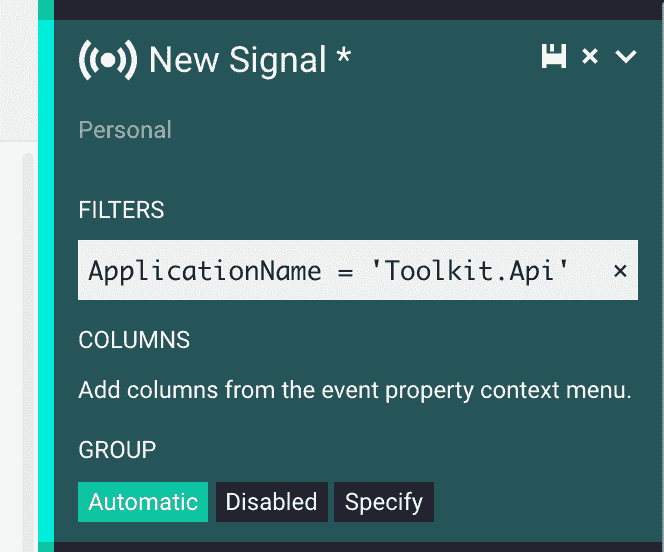](///static/226894704ad72e2a674bc0155c95bc73/31493/signals.png)

我特别喜欢 Seq 自动为你的信号创建分组，或者你也可以创建自己的分组。

过滤器也将适用于当你做额外的搜索，所以这是一个很好的方式来过滤下来的事件，如果你试图找到一些东西。

在 Seq 中搜索的亮点可能是能够使用类似 SQL 的表达式来提取数据。这也适用于 JSON blobs。

```
SELECT RequestHeaders.Referer FROM Stream 
```

Enter fullscreen mode Exit fullscreen mode

### 实时监控

默认情况下，您必须按下刷新按钮来获取新事件，但如果您想要实时查看事件，那么您可以按下按钮。如果您正在进行部署，这非常有用，您可以只按异常进行过滤，然后启用自动刷新。

### 仪表盘和图表

如果您打算定期监控某项服务，那么您可以为它创建一个仪表板。Seq 附带了一个默认的概览仪表板，但您也可以创建自己的仪表板。

[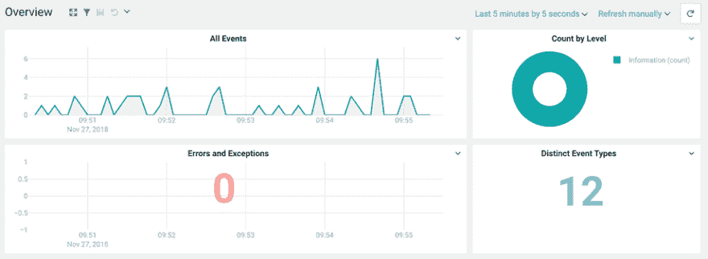](///static/2bcd7dce6760c55cf673da17eb69ba1f/97a96/dashboard.png)

这也可以设置为自动刷新。

您执行的任何 SQL 查询也可以在查询视图中转换成快速图表。

### 应用集成

如果你还没有被 Seq 说服，你可以通过一些应用程序集成让它变得更好。你可以在 [Nuget](https://www.nuget.org/packages?q=Tags%3A%22seq-app%22) 上找到可用的软件包。最常见的是电子邮件和 Slack，这样你就可以得到错误通知。

## 使用序列

想开始使用 Seq，最简单的方法是用 Docker 设置它。官方图片可以在 Docker Hub 上找到。

这可以本地旋转如下:

```
docker pull datalust/seq:latest

docker run \
  -e ACCEPT_EULA=Y \
  -v /path/to/seq/data:/data \
  -p 80:80 \
  -p 5341:5341 \
  datalust/seq:latest 
```

Enter fullscreen mode Exit fullscreen mode

或者如果您喜欢 docker-compose 文件:

```
version: '3'

services:
  seq:
    image: datalust/seq:latest
    ports:
      - 80:80
      - 5341:5341
    environment:
      ACCEPT_EULA: Y 
```

Enter fullscreen mode Exit fullscreen mode

## 用 Serilog 登录。网络核心

您可以将 Seq 用作许多不同日志框架的接收器，如 NLog、log4net。对于结构化日志记录，我更喜欢 Serilog。这些是您希望安装到项目中的 NuGet 包:

*   verilog
*   Serilog。扩展.日志记录
*   Serilog。设置.配置
*   串行计时
*   Serilog。水槽。顺序
*   Serilog。水槽。彩色控制台

最后一个对开发非常有用，顾名思义，在命令行上给你漂亮的彩色日志。注意:在生产中关闭它是值得的，因为我发现登录到控制台实际上会对高流量应用程序的性能产生影响。

您需要在您的应用程序中添加一个 Serilog 部分。设置:

```
 "Serilog": {
    "Using": [
      "Serilog.Sinks.ColoredConsole",
      "Serilog.Sinks.Seq",
    ],
    "MinimumLevel": {
      "Default": "Information",
      "Override": {
        "Microsoft": "Warning",
        "System": "Warning"
      }
    },
    "WriteTo": [
      {
        "Name": "ColoredConsole",
        "Args": {
          "restrictedToMinimumLevel": "Information"
        }
      },
      {
        "Name": "Seq",
        "Args": {
          "serverUrl": "http://localhost:5341",
          "restrictedToMinimumLevel": "Information",
          "apiKey": "your-seq-api-key"
        }
      }
    ],
    "Enrich": ["FromLogContext"],
    "Properties": {
      "ApplicationName": "Your.Api"
    }
  } 
```

Enter fullscreen mode Exit fullscreen mode

建议您为每个将记录到 Seq 的应用程序设置一个 API 键。还值得设置将在 Seq 中显示的应用程序名称，如底部所示。

在你身上。你只需在你的 Startup.cs
中指定日志程序

```
 public class Startup
    {
        public IConfiguration Configuration { get; }

        public Serilog.ILogger Logger { get; }

        public Startup(IHostingEnvironment env)
        {
            Configuration =
                new ConfigurationBuilder()
                .SetBasePath(env.ContentRootPath)
                .AddJsonFile("appsettings.json", optional : false, reloadOnChange : true)
                .AddJsonFile($"appsettings.{env.EnvironmentName}.json", optional : true)
                .AddJsonFile($"appsettings.local.json", optional : true)
                .AddEnvironmentVariables(prefix: "ASPNETCORE_")
                .AddEnvironmentVariables(prefix: "API_")
                .Build();

            Logger = new LoggerConfiguration()
                .ReadFrom.Configuration(Configuration)
                .Destructure.AsScalar<JObject>()
                .Destructure.AsScalar<JArray>()
                .Enrich.FromLogContext()
                .CreateLogger();

            // Rest of your startup config
        }

        public void ConfigureServices(IServiceCollection services)
        {
            services.AddSingleton<Serilog.ILogger>(Logger);

            // Other services
        }

        public void Configure(IApplicationBuilder app, IHostingEnvironment env, ILoggerFactory loggerFactory)
        {
            loggerFactory.AddSerilog(Logger);

            // Other settings here.

            Logger.Information("Application started");
        } 
```

Enter fullscreen mode Exit fullscreen mode

如果你想要一个工作版本来开始 DataLust，提供一个伟大的关于 GitHub 的。

### 定时操作

你可能已经注意到了上面我让你安装的一个包是 SerilogTimings。如果您试图测量系统中某些方法或代码行的性能，这是一个很好的包。

当您想要使用它们时，您需要导入这些包

```
using SerilogTimings;
using SerilogTimings.Extensions; 
```

Enter fullscreen mode Exit fullscreen mode

然后你就可以把你想要的时间用。

```
using (_logger.TimeOperation("Getting data from the database"))
{
    // Some code that is taking a while
} 
```

Enter fullscreen mode Exit fullscreen mode

然后，您将获得一个日志序列，例如**在 3506.6 ms** 内完成从数据库获取数据。显然，您不希望将所有内容都包含在计时中，因为这本身可能会导致性能下降，但这对于突出可疑的性能问题非常有用。

### 在日志文本中指定属性。

经常看到有人这样入门 Serilog 写日志:

```
_logger.Information($"Finished parsing data for file {fileName}"); 
```

Enter fullscreen mode Exit fullscreen mode

这样做的问题是 Seq 不知道“完成对文件 clients.csv 的数据解析”和“完成对文件 candidates.csv 的数据解析”是由同一个日志行触发的。这意味着两个事件的事件类型将是不同的，因此您只能使用文本搜索来查找这些事件。

你应该这样写你的日志:

```
_logger.Information("Finished parsing data for file {fileName}", fileName); 
```

Enter fullscreen mode Exit fullscreen mode

这样，serilog 将在结构化数据中为 fileName 创建一个属性，并且所有事件将具有相同的事件类型。

错误也是如此。确保在记录错误时添加一条消息，以便它们可以被赋予相同的事件类型。

```
_logger.Error(ex, "Error occurred parsing data for file {fileName}", fileName); 
```

Enter fullscreen mode Exit fullscreen mode

您还可以添加额外的属性来为您的日志提供更多的上下文。您可以这样做，而不必将其添加到日志消息中。

```
using(LogContext.PushProperty("RowsParsed", rows))
using(LogContext.PushProperty("ColumnsParsed", columns))
{
    _logger.Information("Finished parsing data for file {fileName}", fileName);
} 
```

Enter fullscreen mode Exit fullscreen mode

在上面的示例中，来自行和列的数据将作为日志事件的属性添加到 RowsParsed 和 ColumnsParsed 属性中。

### 使用 Docker 覆盖变量

如果你正在使用 Docker 部署你的应用程序，你需要在某些时候覆盖 app.settings 中的设置。您可以通过环境变量做到这一点。在我上面的例子中，你会注意到我设置了一个环境变量前缀。

```
.AddEnvironmentVariables(prefix: "API_") 
```

Enter fullscreen mode Exit fullscreen mode

这意味着它将只选取以这个前缀开头的环境变量。这里有一些您想要设置的环境变量:

```
API_Serilog __WriteTo__ 1 __Args__ serverUrl
API_Serilog __WriteTo__ 1 __Args__ apiKey
API_Serilog __WriteTo__ 1 __Args__ restrictedToMinimumLevel 
```

Enter fullscreen mode Exit fullscreen mode

注意，上述变量中的 1 对应于 JSON 数组中设置的位置(数组从 0 开始)。

## 在 AWS 中设置序列

正如我上面提到的，从 Seq 5 开始，如果你只有一个用户，你现在可以在生产中免费使用 Seq。缺点是免费版本不支持 SSL，但我想如果你愿意，你可以在 Nginx 反向代理后面运行它。

以下说明将使 Seq 启动并运行 SSL 设置，但根据您的使用情况，您可能希望在 VPN 后面运行它。

## 创造一个 VPC

如果您还没有为您的应用程序创建一个，您将需要从 VPC 仪表板创建一个 VPC。为您的 VPC 命名，然后使用默认的 10.0.0.0/16 作为 IPV4 CIDR 地址块。

[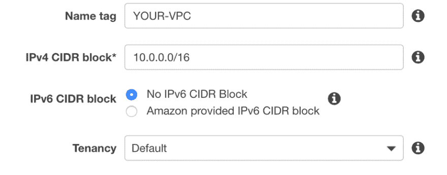](///static/cb020573918c7795ae5f4c58c7660700/f43e4/create-vpc.png)

## 创建公共子网

接下来，您需要在子网页面上创建 2 个公共子网。我们需要 2，因为我们将使用应用程序负载平衡器来提供 SSL。

您应该为您的公共子网命名，如公共子网 1 和公共子网 2，并使用 IPv4 CIDR 地址块，如 10.0.0.0/24 和 10.0.1.0/24。

选择不同的可用性区域是很重要的，否则以后应用程序负载平衡器会出现问题。

[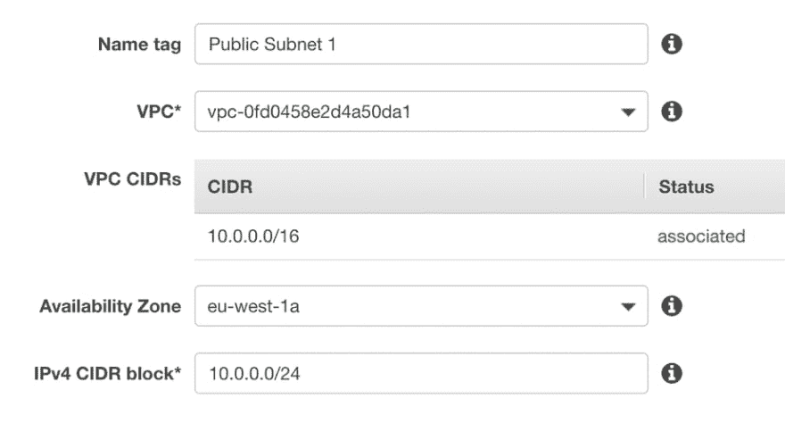](///static/b6370202207016b8d4c04b1835a1ca66/a3767/subnet-1a.png)

* * *

[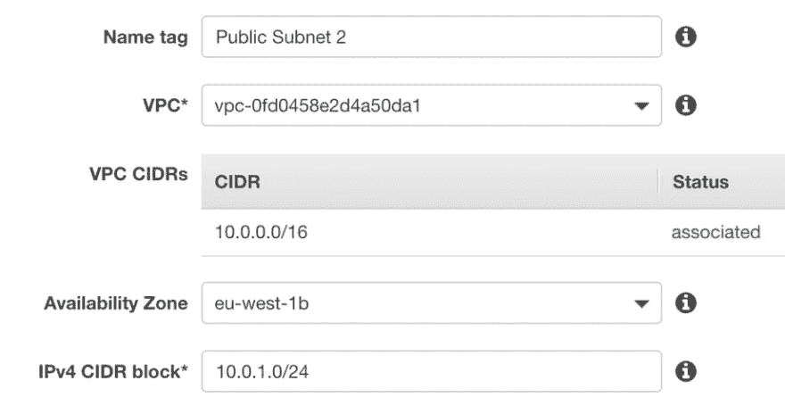](///static/32be70967246b0828195662c786d4260/f213e/subnet-2.png)

## 创建一个互联网网关

您需要创建一个 internet 网关，以便您的子网可以访问 internet。只要给它一个名字，然后点击创建。

选择您新创建的互联网网关，并从“操作”菜单中选择“连接到 VPC ”,然后从下一个屏幕中选择您的 VPC。

[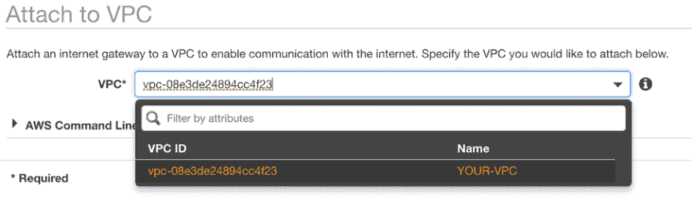](///static/929fd6c1f3f629acde1bad4fe877d521/569c6/attach-vpc.png)

## 路由表

您现在需要设置路由表，以便您的子网可以访问新创建的 internet 网关。

请转到路由表，找到与您的 VPC ID 相关的路由表。

转到操作>编辑子网关联。然后选择您之前创建两个公共子网。

接下来，您需要编辑路由表，添加一个目的地为 0.0.0.0/0 的路由表，并将您的 internet 网关作为目标。完成后，它应该是这样的。

[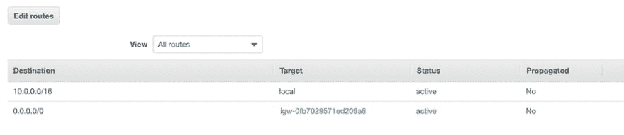](///static/dbf6507738c3b9b7f0d3eb3b310cd133/864a6/routes.png)

## 安全组

仍在 VPC 仪表板页面转到安全组。查找与您的 VPC 关联的默认安全组。我们需要为端口 443 添加入站规则，以便您可以通过 SSL 从互联网访问 Seq。您需要为端口 443 添加一个自定义的 TCP 规则。它应该是这样的:

[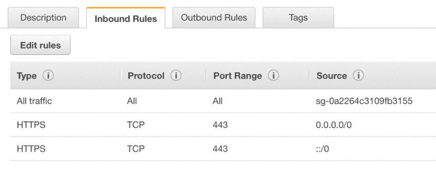](///static/24557b75fa2e0c3fa91e4e158cfe6b39/47218/security-group-443.png)

## 创建 ECS 集群

我们将使用官方的 docker 容器，并使用 ECS 托管它。第一步，我们需要创建一个 ECS 群集。在 AWS 中找到 ECS 服务，然后单击 Create Cluster。

*   选择 EC2 Linux +网络选项。
*   为您的集群命名。
*   选择按需实例，并选择实例类型 **t2.micro**

在 VPC 选项下，您需要选择您的 VPC 和两个子网，然后选择**创建一个端口为 80 的新安全组**。

您的设置应该如下所示:

[](///static/160566984d4211f55b71dc503e0a3133/c0255/cluster-config.png)

如果您是第一年使用 AWS，并且没有另一个 t2.micro，那么您应该免费获得这个实例。

## 创建应用负载平衡器

我们将使用一个应用程序负载平衡器，这样我们就可以在 SSL 上提供 Seq。SSL 将在负载平衡器处终止，因此 Seq 仍将在端口 80 上运行。如果您使用 Seq 的 Windows 版本，您可以在 Windows 服务器上设置 SSL，然后改为使用端口 443 进行连接。

转到 EC2 页面，从左侧菜单中选择负载平衡器。

单击创建负载平衡器并选择应用程序负载平衡器。

您需要设置负载平衡器来监听端口 443。

[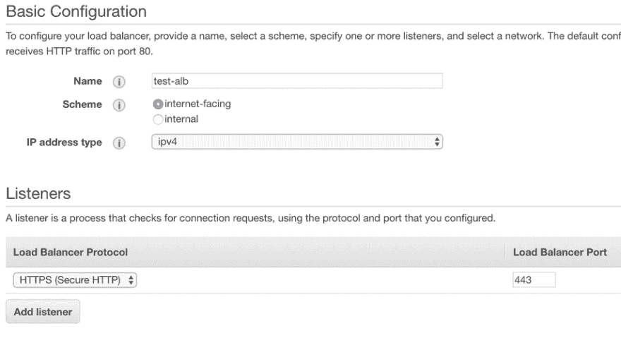](///static/9282cf8e32053ade1145e53c713925fd/09b15/alb-config.png)

然后选择您的 VPC，并分配我们之前创建的 2 个子网。

[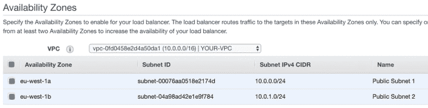](///static/bb95f3dcb22597cf02373b0f4769077c/58a91/availability-zones.png)

在下一个屏幕上，您需要选择 SSL 证书。如果你的域名没有，你可以用 Amazon 的 ACM 创建一个。

您应该看到一个从 ACM 请求新证书的链接。如果您需要新的证书，您需要添加 yourdomain.com 和*.yourdomain.com

需要在服务器所在的同一区域创建证书。

如果您在创建 SSL 证书时遇到错误，您可能需要联系 Amazon 更新您的配额。

你应该能够免费创建 100 个证书，但看起来默认设置为 0。当你在那里的时候，确保他们增加了你在 N.Virginia 的配额，如果你计划在未来使用 CloudFront，你也需要这个。

在下一个屏幕上，您需要选择您的安全组。如果你一直跟着你应该有 2 个安全组。为您的 VPC 选择一个，因为这将允许从互联网 443 访问。

[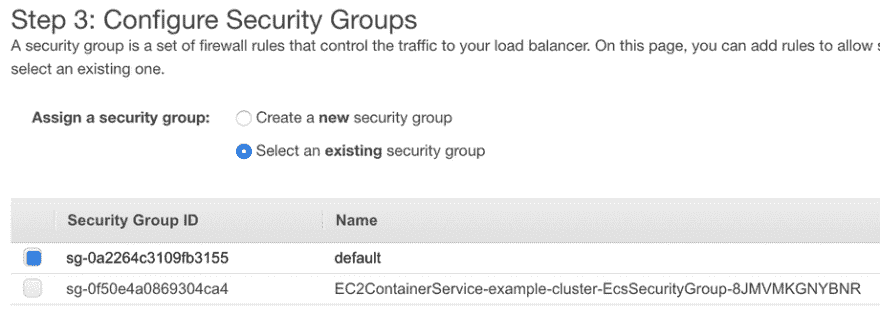](///static/f7c9a60427d7b0f6c60a93a77b1a45bc/0ef7e/alb-sg.png)

然后，我们需要设置路由目标。您需要将目标类型指定为实例，并将其配置为端口 80。记住 Seq 仍然在我们的 docker 容器中的端口 80 上运行。

[](///static/2f9702c5f6424be0ece8a6168079b49a/33d1d/target-groups.png)

最后，我们将实例添加到已注册的实例中。

[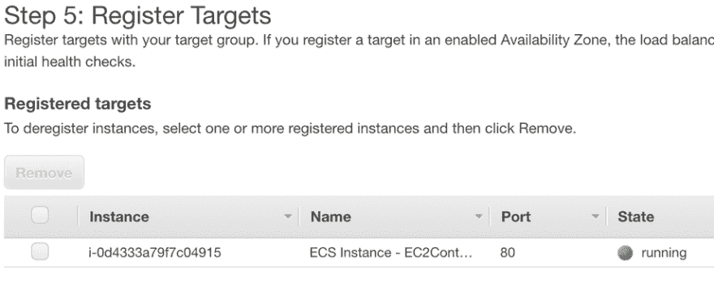](///static/81d39e07ff9eab16da0454dbf240fbed/d5b59/registered-instances.png)

您只需查看并点击“创建”。

## 配置集群安全组

为了使我们的设置更加安全，我们将更改我们群集的安全组设置，只允许来自负载平衡器的流量。

为此，请转到 EC2 页面，单击左侧菜单中的安全组。

找到您的群集安全组。它应该有一个组名，如 EC2ContainerService- **集群名**-ecsecuritygroup…

入站规则当前将被设置为在端口 80 上接受来自任何地方(0.0.0.0/0)的流量。我们将对此进行更改，仅接受来自负载平衡器使用的默认安全组的流量。

[](///static/11bb9624064b41333a1100ad25cda271/c8ad9/security-group-alb.png)

## 创建 Seq ECR 库

我们将把官方 docker 图像上传到 Amazon docker 存储库，这样我们就可以从中创建一个任务。转到 ECS 页面，然后转到存储库，并创建一个名为 seq 的新存储库。

然后，您将得到如何登录的说明。这些说明假设您已经安装了 amazon cli，并且以前使用过它。

登录亚马逊 ECR。

```
$(aws ecr get-login --no-include-email --region eu-west-1) 
```

Enter fullscreen mode Exit fullscreen mode

标记我们之前撤下的官方 Datalust 图像。请注意，您需要在这里使用您自己的地址。

```
docker tag datalust/seq:latest 11111111111.dkr.ecr.eu-west-1.amazonaws.com/seq:latest 
```

Enter fullscreen mode Exit fullscreen mode

然后我们可以将它推送到您的存储库:

```
docker push 11111111111.dkr.ecr.eu-west-1.amazonaws.com/seq:latest 
```

Enter fullscreen mode Exit fullscreen mode

根据你的网络连接，上传图片可能需要一段时间，因为它超过 200Mb。

## 创建任务

一旦图像已经上传，我们需要创建我们的任务。这是我们设置环境变量的地方。

*   转到任务定义，然后单击创建新任务定义。
*   为此选择 EC2 而不是 Fargate。
*   为您的任务选择一个名称，如“seq”
*   将内存设置为 300 兆字节左右

为了确保数据持久，我们将告诉容器将数据存储在 EC2 主目录中。但是，如果您关心日志的保存，您可能希望查看其他卷机制。

*   单击添加卷
*   将名称设置为数据
*   将源路径设置为/home/ec2-user

接下来，我们将添加容器。

*   单击添加容器
*   给容器起个名字，比如“seq”
*   将图像设置为我们上传的图像的地址，例如 11111111111.dkr.ecr.eu-west-1.amazonaws.com/seq:latest
*   设置 300 MiB 内存限制
*   将端口映射设置为主机端口= 80 容器端口= 80
*   向下滚动到环境变量，并将键 ACCEPT_EULA 设置为值 y
*   然后单击添加。
*   向下滚动到 Storage and Logging > Mount points，并选择我们之前创建的数据卷。
*   将容器路径设置为/data

最后点击创建。

## 创建服务

我们需要创建一个服务来运行我们的任务。转到“群集”并选择我们创建的群集。

在服务选项卡上，单击创建，然后您将需要以下设置:

*   发射类型:EC2
*   任务定义:选择我们刚刚创建的序列任务
*   应该已经选择了集群
*   服务名称:序列
*   服务类型:守护程序

然后将其余部分保留为默认值。

[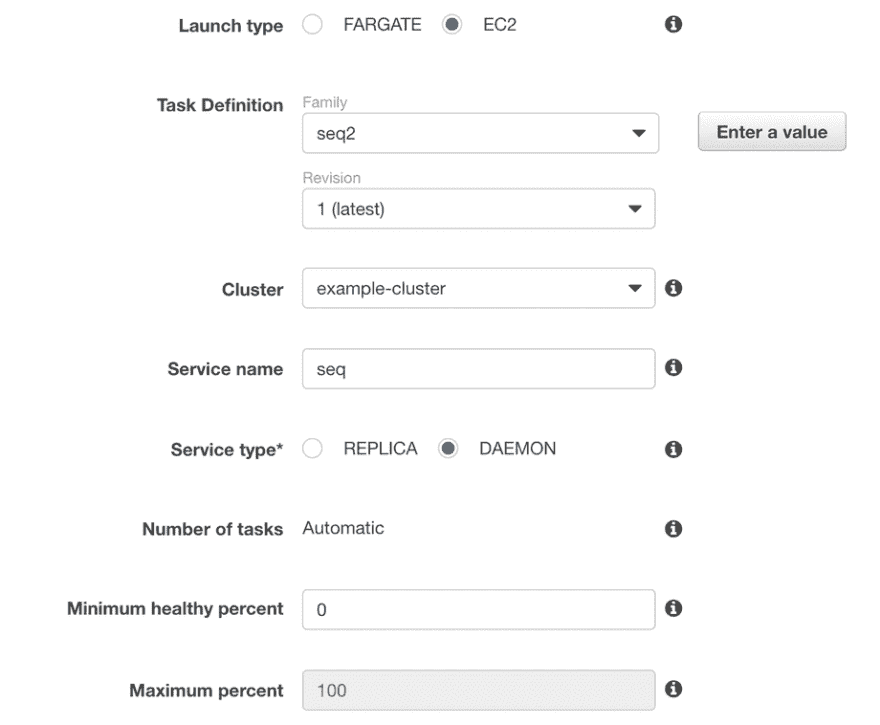](///static/94291126b09ff359eb54cf05431bd41e/1dbe8/service-settings.png)

在下一个屏幕上，将负载平衡器设置为应用程序负载平衡器，并选择我们之前创建的负载平衡器。

您需要将容器端口添加到负载平衡器，并选择我们之前创建的目标组。

[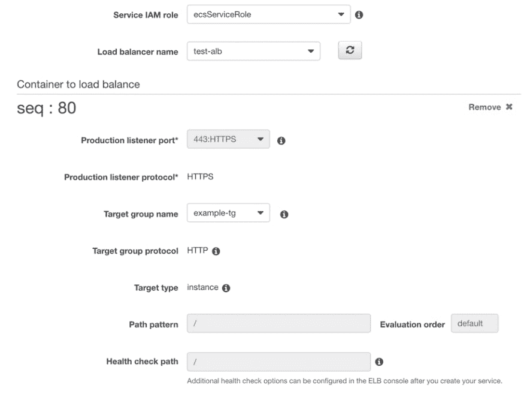](///static/7f774377c99fe3c4ba955ed857c082a1/2ed34/service-tg.png)

最后点击并创建您的服务。大约一分钟后，您的服务应该启动并运行。

## 查看顺序

现在，Seq 应该在 EC2 实例上运行。我们可以通过负载平衡器 URL 访问它。

转到 EC2 页面，向下滚动到左侧的负载平衡器。找到我们之前创建的负载平衡器，并找到描述中显示的 DNS 名称地址。

您应该可以在浏览器中访问 https://。您将得到一个无效的安全证书警告，因为它将您的证书用于您的域。绕过这一点，你应该看到序列加载。

[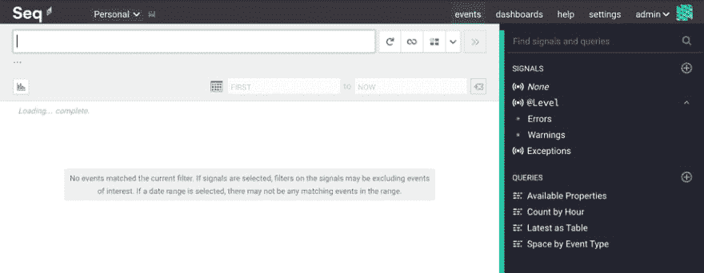](///static/ea84d40028463c3162d779659bd6f49e/ade5e/default-seq.png)

您要做的第一件事是启用身份验证，这样其他用户就看不到您的日志。这可以在设置>用户下完成。

[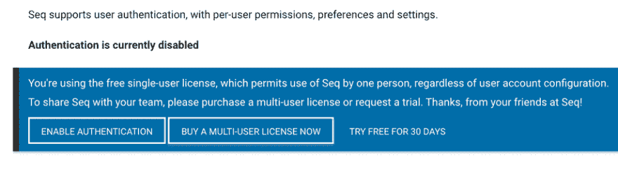](///static/28583b4c7977b16889a7750c11964596/49ee2/seq-auth.png)

## 路由 53 或替代 DNS

要让它与您的域一起工作，您需要创建一个 A 记录并指向该地址。

如果您使用的是路线 53，那么您可以设置一个 A 记录，并将 Alias 设置为 Yes。然后，您只需要从列表中选择您的负载平衡器。

## 结论

Seq 很棒，现在你可以在产品中免费运行它，这是一个巨大的胜利。你有机会使用 Seq 吗？请在评论中告诉我们你最喜欢的功能。