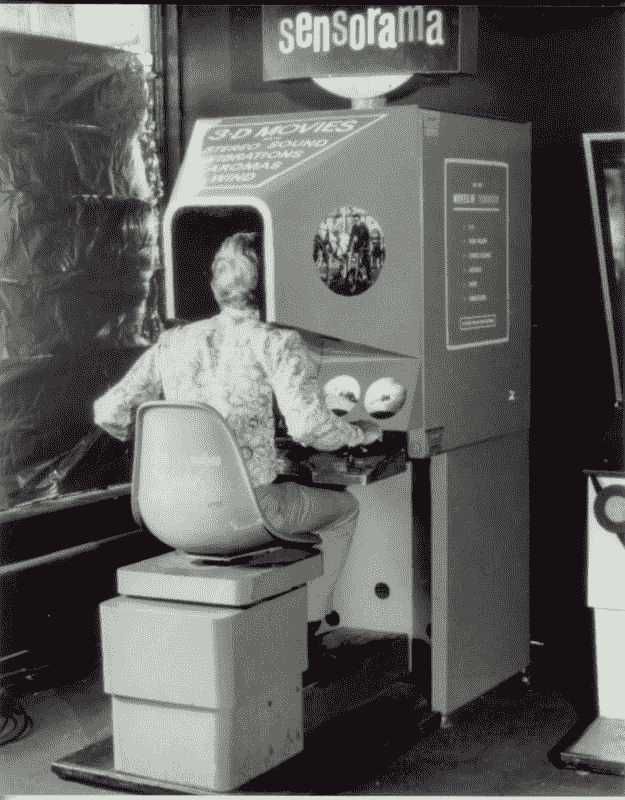
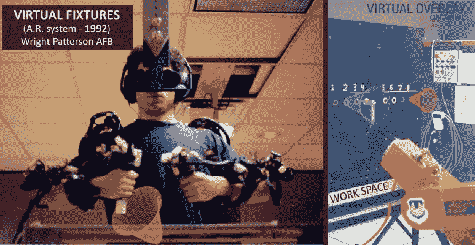
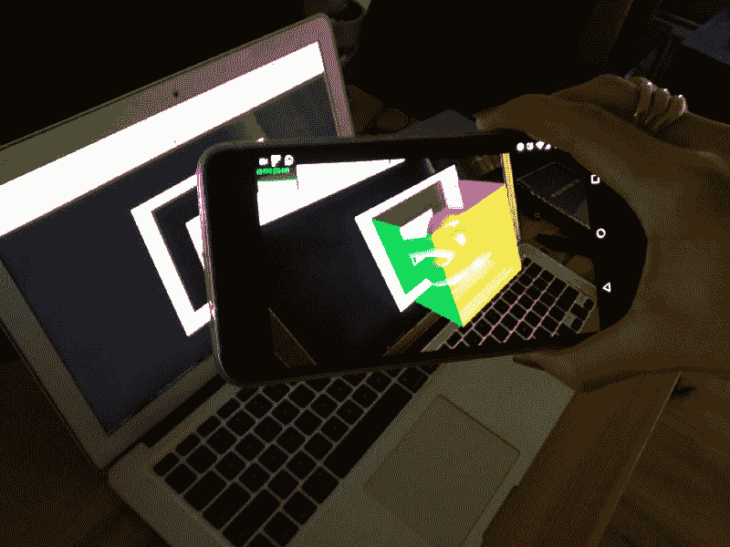
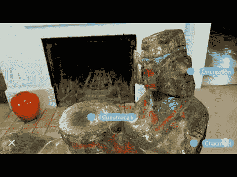

# 移动网络中的虚拟现实和增强现实

> 原文：<https://dev.to/oninross/vr-and-ar-in-the-mobile-web-2iab>

我们已经看到人们盯着耳机沉浸在虚拟世界中，看到人们将他们的设备指向各个方向，试图寻找他们周围有趣的东西。VR 和 AR 应用程序已经在应用程序商店中提供，这可能会阻碍观众的参与。如果它在移动网络中很容易获得会怎么样？

## 虚拟现实

虚拟现实是一种交互式计算机模拟，将用户带入虚拟世界。计算机生成一个模拟，欺骗大脑相信用户看到的一切都是真实的。它通常与怪异的护目镜联系在一起，有很长的电线，主要是为了娱乐。它很笨重，对象的清晰度很低，而且不知道在新的虚拟世界里你需要做什么。创建、维护和分发到消费者市场的成本很高。

*【sensor ama 机(scriptanime.wordpress.com)*

随着虚拟现实技术以指数速度追赶技术，护目镜和耳机现在变得越来越小，越来越轻，人们现在可以轻松佩戴。质量也有了很大的提高，投射出更真实、更流畅的体验。对消费者来说，价格也变得更便宜了。公司创造了自己的 VR 设备，消费者可以在不伤害钱包的情况下购买。

## 增强现实

AR 有点类似于 VR。计算机不是生成整个环境作为模拟，而是创建虚拟元素并将其嵌入到现实世界中。就像虚拟现实一样，它需要看起来怪异的护目镜、电线，并且仍然连接到计算机。例如，AR 的一个常见用途是在平视显示器(HUD)中，在透明显示器中显示数据或信息，而不会使用户从通常的视点移开视线。

 
*虚拟固定装置——第一个 A.R .系统(1992，美国空军，WPAFB)*

AR 曾经有一个利基市场，但现在已经扩展到更广泛的行业，如游戏、教育和商业。AR 随着 Pokemen Go 的成功变得更加流行。随着技术变得越来越好，谷歌和苹果等科技公司已经投资将 AR 融入他们的设备，供开发人员探索不同的可能性。

## 技术进步

虽然它仍然需要一台电脑和其他跟踪设备，但消费者现在能够购买自己的设备来跳入虚拟世界。开发者也有机会创建自己的内容，并在市场上轻松发布。在市场上引起共鸣的最著名的名字是 Oculus 和 HTC Vive。索尼很快加入了这股潮流，创造了自己的 VR 外设，比 PC 版本更便宜。

随着这些技术的进步，有一天 VR 和 AR 将完全支持我们的智能设备，这不是不可能的。科技巨头已经开始将这项技术整合到智能手机中。企业已经通过为用户创造丰富的体验利用了这一点。当 Mozilla 和 Google 的开发人员提出 WebXR API 的标准化时，web 开发人员已经开始创建插件来使 VR 和 AR 为 web 服务。

## 网络中的 VR 和 AR

由于所有开发人员都在等待 WebXR API 被标准化并向公众发布，因此有许多其他替代方案可供开发人员用来展示面向网络的 VR 和 AR。最受欢迎的是 Ricardo Cabello(doob 先生)的 Three.js。但是对于很少或没有 WebGL 经验的开发人员来说，这可能会令人望而生畏。一个更简单的替代方案是 A-Frame，这是一个专门设计来创建丰富的 VR 体验的框架，无需了解 WebGL。

参见 [CodePen](https://codepen.io) 上尼诺·罗斯·罗德里格兹( [@oninross](https://codepen.io/oninross) )的笔 [Hello World — A-Frame](https://codepen.io/oninross/pen/Mvmdzg/) 。

一个简单的虚拟现实世界就像上面的例子，只用了 17 行 HTML 代码就创建好了。它在桌面和移动设备上都运行良好，用户无需下载或安装任何额外的软件或硬件就可以立即投入使用。屏幕上还有一个图标，用户可以选择在桌面上全屏显示，在移动设备上显示立体虚拟现实。它在移动设备上变得更加有趣，因为设备就像虚拟现实世界中的相机，这意味着无论用户看向哪里，它都是虚拟现实中的实际表现。

 
*AR.js 演示在手机上使用 Hiro 标记显示 AR 对象*

AR.js 是由 Jerome Etienne 创建的，专注于使 web 的 AR 成为现实。虽然它仍然依赖并需要标记来在屏幕上显示元素，但这仍然是将 AR 带到网络上的一个相对较大的步骤。上面的示例只使用了 30 行 HTML 代码(稍微大一点，以显示显示 2 个不同对象的 2 个标记)。就像它是 a 字架妹子一样，在桌面和移动设备上都很好用。

## VR 和 AR 的未来

谷歌在今年的 IO 活动上展示了 WebARonARCore。我设法在 Chrome Canary 中玩了一把实验技术，我必须说它看起来真的很有前途，它为网络中的 VR 和 AR 铺平了更光明的未来。网络上的无标记 AR 将使用户更容易登上飞机并沉浸其中，而无需下载应用程序。一旦这一特性被默认启用并标准化，闸门肯定会大开。

 
*Google 演示的 WebXR 设备 API*

想象一个协作的虚拟世界，你只需要一部智能手机，你不需要下载应用程序，你不需要购买昂贵的设备来体验 VR，你可以随时随地可视化你需要的信息。对于移动网络来说，这确实是一个激动人心的时刻。