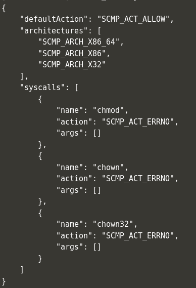
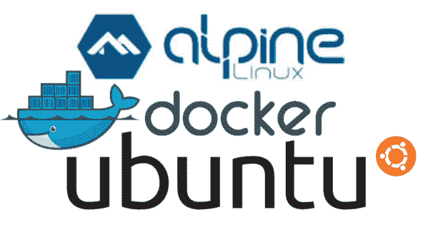

# 安全冲刺:为安全容器使用 Seccomp。

> 原文：<https://dev.to/terceranexus6/security-sprint-using-seccomp-for-secure-containers--3nk5>

上周我跳过了安全冲刺，哎呀！但是今天我给大家带来了另一个 **DevSecOps** 内容。在这种情况下，我们将了解 Seccomp 以及如何将其应用于安全容器。安全计算模式(seccomp)是 Linux 内核的一个特性，正如在 [docker 文档](https://docs.docker.com/engine/security/seccomp/)中所解释的。

您可以使用此功能来限制您的应用程序的访问，并使其安全性更强。它们是在一个 JSON 文件中定义的，该文件在容器启动时应用。这只有在 **Docker** 已经用`seccomp`构建并且内核配置为启用`CONFIG_SECCOMP`时才可用。为了检查我们的内核是否支持 seccomp，我们应该写:

```
$ grep CONFIG_SECCOMP= /boot/config-$(uname -r) 
```

Enter fullscreen mode Exit fullscreen mode

如果它返回`CONFIG_SECCOMP=y`，它确实支持它。现在，让我们来看一个 json 的例子，它被定义了 seccomp 权限，以禁止容器运行 seccomp。

[](https://res.cloudinary.com/practicaldev/image/fetch/s--xw1LHofo--/c_limit%2Cf_auto%2Cfl_progressive%2Cq_auto%2Cw_880/https://thepracticaldev.s3.amazonaws.com/i/dyqh1yr30wx18ellrg0m.png)

如果我们用 docker ( `docker run ...`)启动我们的容器并尝试`chmod`，我们将收到一个权限错误。这使我们能够防止攻击或防止不同版本中的漏洞，以防我们不想改变我们的应用程序。小心点，tho。Seccomp 与系统调用一起工作，为此我们需要知道哪些正在被使用，这取决于系统。例如，为基于 Alpine(使用`strace`)的容器和基于 Ubuntu(使用`strace-ubuntu`)的容器创建规则是不同的。在[的片尾曲](https://www.katacoda.com/courses/docker-security/intro-to-seccomp)中有一个这样的例子。

[](https://res.cloudinary.com/practicaldev/image/fetch/s--ZU-W1EvF--/c_limit%2Cf_auto%2Cfl_progressive%2Cq_auto%2Cw_880/https://admin.insights.ubuntu.com/wp-content/uploads/a5e4/Screenshot-from-2016-02-10-10-33-59.png)

默认配置文件已经屏蔽了一些`syscalls`，[下面是他们的列表](https://docs.docker.com/engine/security/seccomp/#significant-syscalls-blocked-by-the-default-profile)。当然，我们可以根据需要选择默认版本或定制版本。

我个人认为在你的容器中快速安全设置的一个好的选择是 vuln 扫描和执行一个关于那些版本 vuln 的阻塞系统调用列表，直到你能够改变版本(或者这个版本正在被修补，在零天的情况下)。扫描的话，我建议用 CoreOS，一个由-gasp- red hat 托管的开源项目。如果我们有一个填充的数据库，我们可以使用`docker-compose up -d clair`命令启动 Clair 服务，并向它发送 Docker 图像以扫描并返回它包含的漏洞。为此，我们使用了 [klar](https://github.com/optiopay/klar/releases/download/v1.5/klar-1.5-linux-amd64) ，[github repo](https://github.com/optiopay/klar/)，klar 是 Clair 和 Docker 注册表的集成。为了 jsonize 我们的数据，我们可以使用 [jq](https://stedolan.github.io/jq/) 。现在，使用所有这些的命令行的一个例子是:

```
CLAIR_ADDR=https://our_service CLAIR_OUTPUT=High CLAIR_THRESHOLD=15 JSON_OUTPUT=true klar postgres:latest | jq 
```

Enter fullscreen mode Exit fullscreen mode

最后一次扫描是公开的，来自公共 Docker 注册表。我们也可以用标签扫描私人图像。下面是命令行的另一个例子:

```
CLAIR_ADDR=http://our_service \
  CLAIR_OUTPUT=Low CLAIR_THRESHOLD=10 \
  klar our_tag/postgres:latest 
```

Enter fullscreen mode Exit fullscreen mode

你可以在这里看到这个[的例子。](https://www.katacoda.com/courses/docker-security/image-scanning-with-clair)

[](https://i.giphy.com/media/tQgB6lM6XCle8/giphy.gif)

一旦我们有了我们的输出(它将包含漏洞名称、ID、描述和其他内容),我们就可以在 json 中执行我们的 seccomp 规则定义，正如已经描述的那样。

韦尔普，就是它了。我希望你喜欢这个，请随时添加更多的工具，想法和信息。