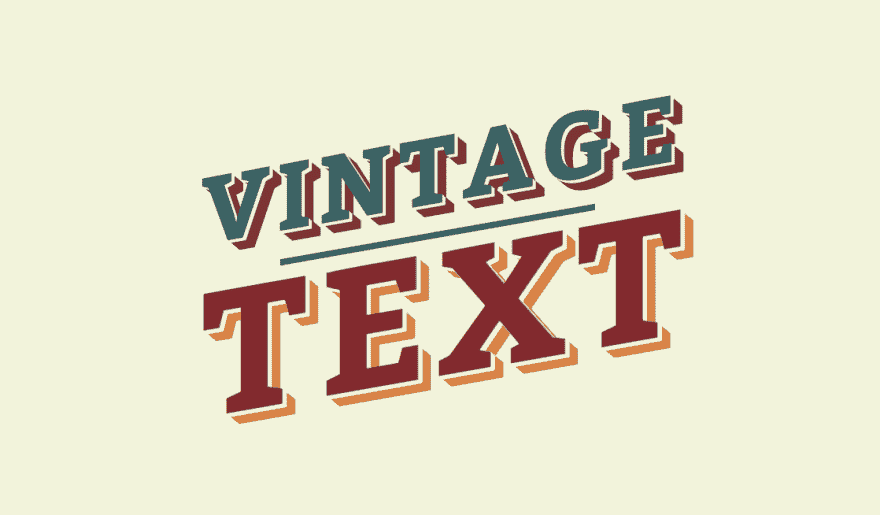

# 带有 css 的老式海报文本

> 原文：<https://dev.to/harrison_codes/vintage-poster-text-with-css-16l1>

分享我尝试制作复古/复古海报风格文本的一些乐趣的结果😁

[https://codepen.io/twosmalltrees/embed/EORRby?height=600&default-tab=result&embed-version=2](https://codepen.io/twosmalltrees/embed/EORRby?height=600&default-tab=result&embed-version=2)