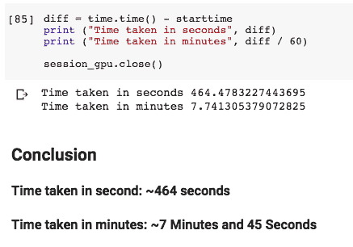
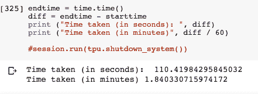
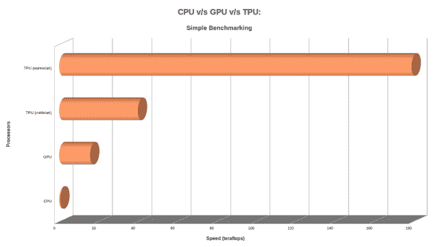
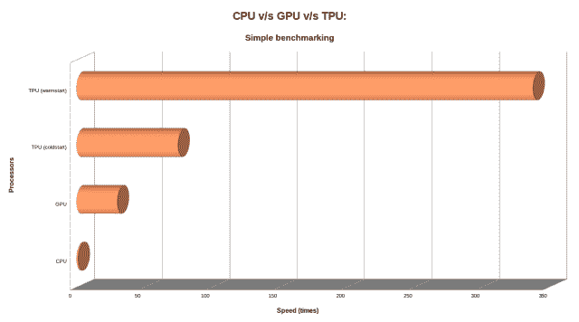
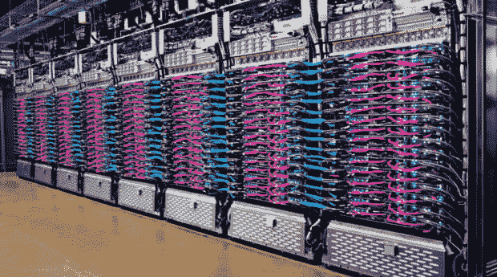

# 如何利用云 TPU 的力量？

> 原文：<https://dev.to/neomatrix369/how-to-harness-the-powers-of-the-cloud-tpu-3epb>

[来源](https://neomatrix369.wordpress.com/2018/11/21/how-to-harness-the-powers-of-cloud-tpus/)

# 如何驾驭云 TPU 的力量？

## 简介

大约几个月前，我被介绍给了[Google Colab](https://colab.research.google.com)(T2】JuPyteR 笔记本的增强版)，从那以后就没有再回头。作为一名研究人员，它拥有你需要的一切甚至更多。最初的想法是加载 python 笔记本并在上面运行。很快我们意识到，我们不仅可以在 GCP 的 CPU 上运行这些笔记本，还可以在 T4 的 GPU T5 和 T6 T7 上运行。此外，从其他来源阅读一些关于它的信息，见[谷歌揭示了 TPU 处理器的技术规格和商业原理](https://www.top500.org/news/google-reveals-technical-specs-and-business-rationale-for-tpu-processor/)(有点过时，但绝对有帮助)。

## 现在开始吧……

### **什么是 TPU？**

就像 GPU 是图形加速器 [ASIC](https://en.wikipedia.org/wiki/Application-specific_integrated_circuit) (帮助快速创建图形/图像以输出到显示设备)——很久以来人们就发现可以通过使用它进行大规模数字运算来利用它。同样，TPU 是谷歌专门为[神经网络](https://en.wikipedia.org/wiki/Artificial_neural_network) [机器学习](https://en.wikipedia.org/wiki/Machine_learning)开发的 AI 加速器 [ASIC](https://en.wikipedia.org/wiki/Application-specific_integrated_circuit) 。其中一个区别是，TPU 更多的是处理大容量低精度计算，而 GPU 则处理大容量高精度计算(请查看维基百科链接了解有趣的区别)。

### **然后呢？**

**TL；DR —笔记本和幻灯片是如何产生的**

要了解这些设备的工作原理，除了对它们进行基准测试，然后比较结果，我们还能采用什么更好的方法。这就是为什么我们从这些实验中得到了很多笔记本。然后我们也巧合地在伦敦 Excel Center 为 2018 年的 [Google Cloud Next 做准备。我花了一个晚上和一个周末准备我和 Yaz 被要求做的演讲的幻灯片——](https://cloud.withgoogle.com/next18/london)[利用云的力量 TPU](http://bit.ly/harnessing-tpu) 。

## 在其他事情发生之前，先发生了什么？

**TL；DR —我们如何在 GDG 云会议活动中工作**

这仅仅是一个巧合，当时我们定期在伦敦分会的 [GDG 云会议](https://www.meetup.com/gdgcloud/)上见面，在那里[亚兹](https://twitter.com/yazdotai)会在黑客会议(他称之为 Pomodoro 会议)上发现有趣的东西，建议我们与 TPU 一起玩一个会议，并对它们进行基准测试。事实上，我记得我建议我们在会议期间这样做，但后来我们都被其他同样有趣的想法分散了注意力(都保存在 [GitLab](http://gitlab.com) 的某个地方)。然后我疯狂地开始玩分别与 [GPU](https://colab.research.google.com/notebooks/gpu.ipynb) 和 [TPU](https://colab.research.google.com/notebooks/tpu.ipynb) 相关的两个笔记本，由 Colab 作为[示例提供，然后我开始在 TPU 上工作，然后改编它以在 GPU 上工作(不记得先用哪种方式了)。他们做的事情略有不同，测量 GPU 的性能，TPU 和我决定让他们做同样的事情，并测量在不同的设备上做这件事所花的时间。还显示设备本身的详细信息(您会在每个笔记本的顶部或底部看到)。](https://colab.research.google.com/notebooks/welcome.ipynb)

### CPU v/s GPU v/s TPU–通过 Google Colab 的简单基准测试示例

#### CPU v/s GPU–简单基准测试

[CPU v/s GPU–简单基准测试](https://colab.research.google.com/drive/1XmPDQu_GpwkiBioRZlreLaGVZ_BBEK5j#scrollTo=Ox1UF6DKkodB)笔记本完成处理，输出如下:

> TFLOP 是“teraflop”的简写，这是一种基于数学能力而不是 GHz 来测量计算机能力的方法。万亿次浮点运算是指处理器每秒计算一万亿次浮点运算的能力。
> 
> CPU TFlops: 0.53
> GPU 加速比 CPU:29 倍 TFlops: 15.70

我对 CPU 和 GPU 的内部结构很好奇，所以我(通过 Bash)运行了一些笔记本允许的 Linux 命令(谢天谢地),并获得了以下信息:

## T2】

您可以在笔记本中找到所有这些命令和上面的输出。

#### CPU v/s TPU–简单基准测试

[TPU-简单基准测试](https://colab.research.google.com/drive/11VnRHgG_067fwPGhMwBz0SmplLsf9X5h#scrollTo=zerhEjxGKN7Z)笔记本完成处理，输出如下:

> TFLOP 是“teraflop”的简写，teraflop 是一种基于数学能力而不是 GHz 来测量计算机能力的方法。万亿次浮点运算是指处理器每秒计算一万亿次浮点运算的能力。
> 
> CPU TFlops: 0.47
> TPU 加速超过 CPU(冷启动):75 倍 TFlops: 35.47
> TPU 加速超过 CPU(预热后):338 倍 TFlops: 158.91

不幸的是，我还没有机会玩 TPU 剖面仪来了解这个神奇设备的更多内部信息。

虽然上面的数字中有错误和不准确的地方，但你可能会对所有运行中使用的任务感到好奇——下面这段代码一直在为 ***简单基准测试*** 笔记本电脑制作 CPU、GPU 和 TPU 电路:

```
 def cpu_flops():
      x = tf.random_uniform([N, N])
      y = tf.random_uniform([N, N])
      def _matmul(x, y):
        return tf.tensordot(x, y, axes=[[1], [0]]), y

      return tf.reduce_sum(
        tf.contrib.tpu.repeat(COUNT, _matmul, [x, y])
      ) 
```

### CPU v/s GPU v/s TPU——通过 Google Colab 进行时间序列预测

运行 TPU 版本的时间系列笔记本电脑最初给我们带来了一些问题，这在 T2 的 StackOverflow 帖子中有所报道，来自谷歌云 TPU 团队的几个好朋友介入帮助了我们。但是我们设法让时间序列预测笔记本的 [GPU 版本工作起来，它明显显示出比时间序列预测](https://colab.research.google.com/drive/14BxQAgZwofEsMTMpCHBvN_MXDzeQxqjm)笔记本的 [CPU 版本好得多的响应——这个版本在 CPU 周期中途卡住了，Colab 问我是否要停止这个过程，因为我们需要更多的资源(更多的内存)！！！](https://colab.research.google.com/drive/1w4R2hdk-hTHlbYL15qDFw6WIkPuHeSWI)

#### 时间序列:GPU 版本

这里是笔记本的快照( ***训练递归神经网络*** 段)，完整的[笔记本可以在 Google Colab](https://colab.research.google.com/drive/14BxQAgZwofEsMTMpCHBvN_MXDzeQxqjm#scrollTo=xO_62Eea7old) 上找到，可以免费下载、分享和提取其中的 python 代码。

```
Epoch 1/10
 9/10 [==========================>...] - ETA: 4s - loss: 0.0047WARNING:tensorflow:Early stopping conditioned on metric `val_loss` which is not available. Available metrics are: loss
WARNING:tensorflow:Can save best model only with val_loss available, skipping.
WARNING:tensorflow:Reduce LR on plateau conditioned on metric `val_loss` which is not available. Available metrics are: loss,lr
10/10 [==============================] - 42s 4s/step - loss: 0.0048
Epoch 2/10
 9/10 [==========================>...] - ETA: 4s - loss: 0.0041WARNING:tensorflow:Early stopping conditioned on metric `val_loss` which is not available. Available metrics are: loss
WARNING:tensorflow:Can save best model only with val_loss available, skipping.
WARNING:tensorflow:Reduce LR on plateau conditioned on metric `val_loss` which is not available. Available metrics are: loss,lr
10/10 [==============================] - 42s 4s/step - loss: 0.0041
Epoch 3/10
 9/10 [==========================>...] - ETA: 4s - loss: 0.0047WARNING:tensorflow:Early stopping conditioned on metric `val_loss` which is not available. Available metrics are: loss
WARNING:tensorflow:Can save best model only with val_loss available, skipping.
WARNING:tensorflow:Reduce LR on plateau conditioned on metric `val_loss` which is not available. Available metrics are: loss,lr
10/10 [==============================] - 42s 4s/step - loss: 0.0046
Epoch 4/10
 9/10 [==========================>...] - ETA: 4s - loss: 0.0039WARNING:tensorflow:Early stopping conditioned on metric `val_loss` which is not available. Available metrics are: loss
WARNING:tensorflow:Can save best model only with val_loss available, skipping.
WARNING:tensorflow:Reduce LR on plateau conditioned on metric `val_loss` which is not available. Available metrics are: loss,lr
10/10 [==============================] - 43s 4s/step - loss: 0.0039
Epoch 5/10
 9/10 [==========================>...] - ETA: 4s - loss: 0.0048WARNING:tensorflow:Early stopping conditioned on metric `val_loss` which is not available. Available metrics are: loss
WARNING:tensorflow:Can save best model only with val_loss available, skipping.
WARNING:tensorflow:Reduce LR on plateau conditioned on metric `val_loss` which is not available. Available metrics are: loss,lr
10/10 [==============================] - 44s 4s/step - loss: 0.0048
Epoch 6/10
 9/10 [==========================>...] - ETA: 4s - loss: 0.0036WARNING:tensorflow:Early stopping conditioned on metric `val_loss` which is not available. Available metrics are: loss
WARNING:tensorflow:Can save best model only with val_loss available, skipping.
WARNING:tensorflow:Reduce LR on plateau conditioned on metric `val_loss` which is not available. Available metrics are: loss,lr
10/10 [==============================] - 44s 4s/step - loss: 0.0037
Epoch 7/10
 9/10 [==========================>...] - ETA: 4s - loss: 0.0042WARNING:tensorflow:Early stopping conditioned on metric `val_loss` which is not available. Available metrics are: loss
WARNING:tensorflow:Can save best model only with val_loss available, skipping.
WARNING:tensorflow:Reduce LR on plateau conditioned on metric `val_loss` which is not available. Available metrics are: loss,lr
10/10 [==============================] - 44s 4s/step - loss: 0.0041
Epoch 8/10
 9/10 [==========================>...] - ETA: 4s - loss: 0.0037WARNING:tensorflow:Early stopping conditioned on metric `val_loss` which is not available. Available metrics are: loss
WARNING:tensorflow:Can save best model only with val_loss available, skipping.
WARNING:tensorflow:Reduce LR on plateau conditioned on metric `val_loss` which is not available. Available metrics are: loss,lr
10/10 [==============================] - 44s 4s/step - loss: 0.0038
Epoch 9/10
 9/10 [==========================>...] - ETA: 4s - loss: 0.0040WARNING:tensorflow:Early stopping conditioned on metric `val_loss` which is not available. Available metrics are: loss
WARNING:tensorflow:Can save best model only with val_loss available, skipping.
WARNING:tensorflow:Reduce LR on plateau conditioned on metric `val_loss` which is not available. Available metrics are: loss,lr
10/10 [==============================] - 44s 4s/step - loss: 0.0039
Epoch 10/10
 9/10 [==========================>...] - ETA: 4s - loss: 0.0036WARNING:tensorflow:Early stopping conditioned on metric `val_loss` which is not available. Available metrics are: loss
WARNING:tensorflow:Can save best model only with val_loss available, skipping.
WARNING:tensorflow:Reduce LR on plateau conditioned on metric `val_loss` which is not available. Available metrics are: loss,lr
10/10 [==============================] - 44s 4s/step - loss: 0.0035
CPU times: user 10min 8s, sys: 1min 22s, total: 11min 30s
Wall time: 7min 12s 
```

在 Google Colab GPU 上运行上述代码大约需要 7 分钟(或总共 8 分钟):

> **CPU 时间:**用户 10 分 8s，系统 1 分 22s，总计 11 分 30s
> 
> **挂壁时间:**7 分 12 秒

我仍然不确定如何解释这个与时间相关的统计数据，但我会把大约 7 分钟作为我们的执行时间，直到这一点。

我们以以下统计数据结束:

[](https://res.cloudinary.com/practicaldev/image/fetch/s--s9xthIDL--/c_limit%2Cf_auto%2Cfl_progressive%2Cq_auto%2Cw_880/https://neomatrix369.files.wordpress.com/2018/11/screen-shot-2018-11-27-at-19-52-09.png)

现在你可以明白为什么我之前选择了 7 分钟作为执行时间了。因此，处理这个笔记本大约需要 7 分钟——给出温度、压力和风速的新预测，并将其与实际值进行比较(真实值从事后观察收集)。

### 时间序列:TPU 版

这里是笔记本的快照( ***训练递归神经网络*** 段)，完整的[笔记本可以在 Google Colab](https://colab.research.google.com/drive/1F6CuGVWN5TNgIjqxdu5glFeGBEr71TgO#scrollTo=wdSmXdvDw5HL) 上找到，可以免费下载、分享和提取其中的 python 代码。

```
Found TPU at: grpc://10.118.17.162:8470
INFO:tensorflow:Querying Tensorflow master (b'grpc://10.118.17.162:8470') for TPU system metadata.
INFO:tensorflow:Found TPU system:
INFO:tensorflow:*** Num TPU Cores: 8
INFO:tensorflow:*** Num TPU Workers: 1
INFO:tensorflow:*** Num TPU Cores Per Worker: 8
INFO:tensorflow:*** Available Device: _DeviceAttributes(/job:worker/replica:0/task:0/device:CPU:0, CPU, -1, 11845881175500857789)
INFO:tensorflow:*** Available Device: _DeviceAttributes(/job:worker/replica:0/task:0/device:XLA_CPU:0, XLA_CPU, 17179869184, 5923571607183194652)
INFO:tensorflow:*** Available Device: _DeviceAttributes(/job:worker/replica:0/task:0/device:XLA_GPU:0, XLA_GPU, 17179869184, 11085218230396215841)
INFO:tensorflow:*** Available Device: _DeviceAttributes(/job:worker/replica:0/task:0/device:TPU:0, TPU, 17179869184, 12636361223481337501)
INFO:tensorflow:*** Available Device: _DeviceAttributes(/job:worker/replica:0/task:0/device:TPU:1, TPU, 17179869184, 14151025931657390984)
INFO:tensorflow:*** Available Device: _DeviceAttributes(/job:worker/replica:0/task:0/device:TPU:2, TPU, 17179869184, 16816909163217742616)
INFO:tensorflow:*** Available Device: _DeviceAttributes(/job:worker/replica:0/task:0/device:TPU:3, TPU, 17179869184, 4327750408753767066)
INFO:tensorflow:*** Available Device: _DeviceAttributes(/job:worker/replica:0/task:0/device:TPU:4, TPU, 17179869184, 504271688162314774)
INFO:tensorflow:*** Available Device: _DeviceAttributes(/job:worker/replica:0/task:0/device:TPU:5, TPU, 17179869184, 14356678784461051119)
INFO:tensorflow:*** Available Device: _DeviceAttributes(/job:worker/replica:0/task:0/device:TPU:6, TPU, 17179869184, 6767339384180187426)
INFO:tensorflow:*** Available Device: _DeviceAttributes(/job:worker/replica:0/task:0/device:TPU:7, TPU, 17179869184, 1879489006510593388)
INFO:tensorflow:*** Available Device: _DeviceAttributes(/job:worker/replica:0/task:0/device:TPU_SYSTEM:0, TPU_SYSTEM, 17179869184, 17850015066511710434)
WARNING:tensorflow:tpu_model (from tensorflow.contrib.tpu.python.tpu.keras_support) is experimental and may change or be removed at any time, and without warning.
Epoch 1/10
INFO:tensorflow:New input shapes; (re-)compiling: mode=train (# of cores 8), [TensorSpec(shape=(32,), dtype=tf.int32, name='core_id0'), TensorSpec(shape=(32, 1344, 20), dtype=tf.float32, name='input_10'), TensorSpec(shape=(32, 1344, 3), dtype=tf.float32, name='Dense-2_target_30')]
INFO:tensorflow:Overriding default placeholder.
INFO:tensorflow:Remapping placeholder for input
INFO:tensorflow:Started compiling
INFO:tensorflow:Finished compiling. Time elapsed: 3.394456386566162 secs
INFO:tensorflow:Setting weights on TPU model.
 9/10 [==========================>...] - ETA: 1s - loss: 0.0112WARNING:tensorflow:Early stopping conditioned on metric `val_loss` which is not available. Available metrics are: loss
WARNING:tensorflow:Can save best model only with val_loss available, skipping.
10/10 [==============================] - 14s 1s/step - loss: 0.0115
Epoch 2/10
 9/10 [==========================>...] - ETA: 0s - loss: 0.0183WARNING:tensorflow:Early stopping conditioned on metric `val_loss` which is not available. Available metrics are: loss
WARNING:tensorflow:Can save best model only with val_loss available, skipping.
10/10 [==============================] - 5s 501ms/step - loss: 0.0187
Epoch 3/10
 9/10 [==========================>...] - ETA: 0s - loss: 0.0260WARNING:tensorflow:Early stopping conditioned on metric `val_loss` which is not available. Available metrics are: loss
WARNING:tensorflow:Can save best model only with val_loss available, skipping.
10/10 [==============================] - 5s 497ms/step - loss: 0.0264
Epoch 4/10
 9/10 [==========================>...] - ETA: 0s - loss: 0.0324WARNING:tensorflow:Early stopping conditioned on metric `val_loss` which is not available. Available metrics are: loss
WARNING:tensorflow:Can save best model only with val_loss available, skipping.
10/10 [==============================] - 5s 496ms/step - loss: 0.0327
Epoch 5/10
 9/10 [==========================>...] - ETA: 0s - loss: 0.0374WARNING:tensorflow:Early stopping conditioned on metric `val_loss` which is not available. Available metrics are: loss
WARNING:tensorflow:Can save best model only with val_loss available, skipping.
10/10 [==============================] - 5s 470ms/step - loss: 0.0376
Epoch 6/10
 9/10 [==========================>...] - ETA: 0s - loss: 0.0378WARNING:tensorflow:Early stopping conditioned on metric `val_loss` which is not available. Available metrics are: loss
WARNING:tensorflow:Can save best model only with val_loss available, skipping.
10/10 [==============================] - 5s 471ms/step - loss: 0.0372
Epoch 7/10
 9/10 [==========================>...] - ETA: 0s - loss: 0.0220WARNING:tensorflow:Early stopping conditioned on metric `val_loss` which is not available. Available metrics are: loss
WARNING:tensorflow:Can save best model only with val_loss available, skipping.
10/10 [==============================] - 5s 489ms/step - loss: 0.0211
Epoch 8/10
 9/10 [==========================>...] - ETA: 0s - loss: 0.0084WARNING:tensorflow:Early stopping conditioned on metric `val_loss` which is not available. Available metrics are: loss
WARNING:tensorflow:Can save best model only with val_loss available, skipping.
10/10 [==============================] - 5s 493ms/step - loss: 0.0081
Epoch 9/10
 9/10 [==========================>...] - ETA: 0s - loss: 0.0044WARNING:tensorflow:Early stopping conditioned on metric `val_loss` which is not available. Available metrics are: loss
WARNING:tensorflow:Can save best model only with val_loss available, skipping.
10/10 [==============================] - 5s 495ms/step - loss: 0.0044
Epoch 10/10
 9/10 [==========================>...] - ETA: 0s - loss: 0.0040WARNING:tensorflow:Early stopping conditioned on metric `val_loss` which is not available. Available metrics are: loss
WARNING:tensorflow:Can save best model only with val_loss available, skipping.
10/10 [==============================] - 5s 491ms/step - loss: 0.0040
CPU times: user 10.8 s, sys: 2.7 s, total: 13.5 s
Wall time: 1min 6s 
```

笔记本上还有几件事要做，其中之一就是去掉在 TPU 上训练时出现的警告。根据我们之前的分析，在 TPU 上运行应该比 GPU 快得多，更正:即使在运行 Timeseries TPU 版本时，TPU 也比 GPU 快(我对齐了两台笔记本，即 Timeseries 笔记本的 GPU 和 TPU 版本，并重新运行了两个实验)。~由于输入形状错误，需要修复并重新运行笔记本，因此在笔记本结束之前，我们无法成功执行代码单元格。所有这些对我和其他人来说都是很好的学习机会。~从上面可以看到，我们的新结果更有希望。而且整个笔记本只花了~2 分钟就跑完了，比 GPU 版本快了那么多倍(从下图)。

[](https://res.cloudinary.com/practicaldev/image/fetch/s--cwBHpi9c--/c_limit%2Cf_auto%2Cfl_progressive%2Cq_auto%2Cw_880/https://neomatrix369.files.wordpress.com/2018/11/screen-shot-2018-11-27-at-19-44-15.png)

### 观察

虽然我们看不到 [TPU 版时间系列笔记本](https://colab.research.google.com/drive/1F6CuGVWN5TNgIjqxdu5glFeGBEr71TgO)的最终结果，但最初的 ***简单基准*** 相关示例确实帮助我们做出了以下观察:

> TPU 比 CPU 快**~ 85 倍到 312 倍**，GPU 比 CPU 快**~ 30 倍**
> 
> *这也意味着*
> 
> TPU 比 GPU 快**~ 3 倍**到**~ 10 倍**，而 GPU 又比 CPU 快**~ 30 倍**

**一些绘制了以万亿次浮点运算为单位的速度和 CPU v/s GPU v/s TPU 之间的时间的图表:**

[](https://res.cloudinary.com/practicaldev/image/fetch/s--nlbkkwrp--/c_limit%2Cf_auto%2Cfl_progressive%2Cq_auto%2Cw_880/https://neomatrix369.files.wordpress.com/2018/11/cpu-gpu-tpu-teraflopschart1.png%3Fw%3D640)

[](https://res.cloudinary.com/practicaldev/image/fetch/s--M0RhrdRJ--/c_limit%2Cf_auto%2Cfl_progressive%2Cq_auto%2Cw_880/https://neomatrix369.files.wordpress.com/2018/11/cpu-gpu-tpu-speed-times2.png%3Fw%3D640)

***注意:**在 GCP 的一些运行中，上述数字显示比这里提到的要高，所以也请小心。也许笔记本电脑利用了 GCP 基础设施的一些改进。*

不同的设备以不同的速度运行这个简单的任务(上一节提到的代码块),对于一个更复杂的任务，数字肯定会不同，尽管我们认为它们的相对性能不应该偏离太多。

## 结论

此外，我要感谢 [Yaz](https://twitter.com/yazdotai) 在整个过程中，包括在 2018 年 Google Cloud Next 的演示中，一直给予我极大的鼓励。不要忘记克劳迪奥，他在我们调试的时候为《时代》系列笔记本的 [TPU 版本做出了很大贡献。](https://colab.research.google.com/drive/1F6CuGVWN5TNgIjqxdu5glFeGBEr71TgO)

最后，这一切都很棒，我们将解决人类的所有问题，但现在，我们已经基本完成了《时代》系列笔记本的 [TPU 版本的工作，我欢迎每个人尝试一下，看看你是否能帮助它工作。无论如何，请回复您的反馈和/或贡献。](https://colab.research.google.com/drive/1F6CuGVWN5TNgIjqxdu5glFeGBEr71TgO)

[](https://res.cloudinary.com/practicaldev/image/fetch/s--saFxxfiJ--/c_limit%2Cf_auto%2Cfl_progressive%2Cq_auto%2Cw_880/https://neomatrix369.files.wordpress.com/2018/11/googles-new-tpu-3-revealed-requires-liquid-cooling.png%3Fw%3D640)

***(谷歌数据中心第三代 TPU:TPU 3.0)***

**阅读一下其他人(例如 [Jeff Hale 的文章](https://towardsdatascience.com/maximize-your-gpu-dollars-a9133f4e546a))对各种云提供商的不同 pu 的讨论，你会发现 GCPCloud 在许多此类领域处于领先地位。**

在不远的将来，以更多博客文章的形式出现的更多笔记本盛会，请做好准备。请将您的意见、反馈或任何贡献分享给 [@theNeomatrix369，](http://twitter.com/@theNeomatrix369)您可以通过[关于我的页面](http://neomatrix369.worpress.com/aboutme)找到更多关于我的信息。

## 资源

*   利用云 TPU 的力量(幻灯片)—bit.ly/harnessing-tpus
*   笔记本电脑
    *   [Tensorflow 带 CPU & GPU](https://colab.research.google.com/drive/1XmPDQu_GpwkiBioRZlreLaGVZ_BBEK5j#scrollTo=BlmQIFSLZDdc)
    *   [Tensorflow with TPU](https://colab.research.google.com/drive/11VnRHgG_067fwPGhMwBz0SmplLsf9X5h)
    *   [时序预测— CPU 版本](https://colab.research.google.com/drive/1w4R2hdk-hTHlbYL15qDFw6WIkPuHeSWI)
    *   [时序预测— GPU 版本](https://colab.research.google.com/drive/14BxQAgZwofEsMTMpCHBvN_MXDzeQxqjm)
    *   [时间序列预测— TPU 版本](https://colab.research.google.com/drive/1F6CuGVWN5TNgIjqxdu5glFeGBEr71TgO)

## 引文

本帖中嵌入的所有图片(包括特写图片)归图片的作者/创作者/所有者所有。

## 关于我

Mani Sarkar 是一名充满激情的开发人员，主要从事 Java/JVM 领域的工作，目前作为一名自由软件工程师/数据/ml 工程师，他正在加强团队，并帮助他们在与小型团队和初创公司合作时加快速度。

**Twitter:**[@ the neomatrix 369](https://twitter.com/@theNeomatrix369)|**github:**[@ new matrix 369](https://github.com/neomatrix369)