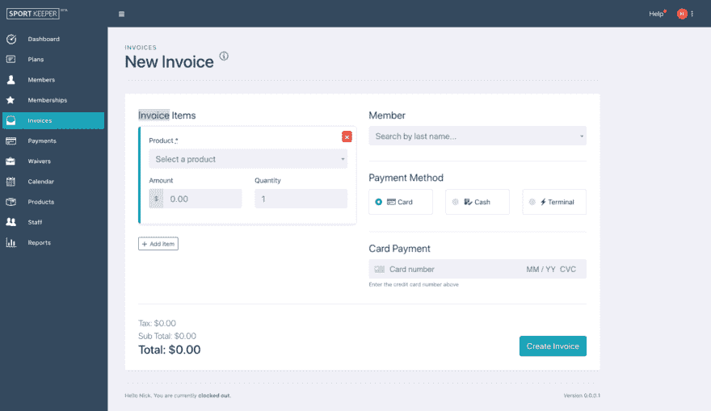

# 我如何将 Stripe 终端与 Ruby on Rails 集成

> 原文：<https://dev.to/nphaskins/how-i-integrated-stripe-terminal-with-ruby-on-rails-33pg>

今天我们将讲述我如何将 [Stripe Terminal](https://stripe.com/terminal) 集成到一个多租户 Rails 应用程序中。 [Stripe 终端](https://stripe.com/terminal)是 SDK 和刷卡物理硬件的组合。这是 web 开发中的一个重要时刻，因为 Stripe Terminal 提供了一个基于 JS 的 SDK 用于 web 应用程序。

它在我的软件平台 [Sport Keeper](https://sport-keeper.com/?utm_source=dev_blog&utm_medium=link&utm_campaign=blog&utm_content=stripe-terminal-guide) 中发挥了关键作用——这是一个商业管理平台，为攀岩馆和滑板公园等场所提供自动计费和会员管理。它包含一个利用条带终端的订单组件。

在我们开始之前，我们假设你已经安装了一个 rails 应用程序。您还需要 Stripe 的[开发套件](https://stripe.com/docs/terminal/developer-kit/verifone)，其中包括 Verifone P400 P.O.S .硬件单元。

开发者工具包售价 300 美元。这是一笔难以接受的收购，尤其是作为一家白手起家的初创公司。终端是在邀请只测试，所以如果你纠缠他们足够的时间，他们可能会邀请你，并给你如何购买开发工具包的指示。

抬头！我的实现还利用了[条带连接](https://stripe.com/connect)，所以所有 API 调用都将`stripe_account`作为附加参数。如果您没有使用条带连接，只需删除添加的参数。

### 工作流程概述

熟悉 Stripe 终端的工作原理，以及它将如何集成到 web 应用程序中是一个好主意。我花了几天时间才真正理解这个工作流程，因为在真正刷卡之前需要采取很多步骤。我希望在它退出测试版之前，步骤的数量能够减少。本质上，这是我们从高层次上看到的情况:

*   注册读卡器。
*   获取连接令牌
*   发现要联系的读者
*   连接到阅读器
*   创建付款意向
*   收款付款方式
*   确认付款意向
*   捕捉支付意图

也可以参考[官方文档](https://stripe.com/docs/terminal/js)。让我们开始吧！

### 添加 JS SDK

这是整个过程中最容易的部分。添加脚本。

```
<script src="https://js.stripe.com/terminal/v1/"></script> 
```

### 注册阅读器

用注册码和至少一个标签调用 API 端点。在我的应用程序中，我在采购订单流程之外做了这件事，因为它只需要发生一次。

我创建了一个读卡器模型，并使它们与 Stripe 保持同步。这允许用户创建、编辑读取器(当前版本的 Stripes API 还不允许销毁读取器)，并将特定的读取器设置为要连接的首选读取器。当用户创建一个新的阅读器时，我们只需将其发送给 Stripe API 进行注册。

```
 class RegisterReader

    def initialize(params)
      @stripe_account       = params[:stripe_account]
      @reader_params        = params[:reader_params]
    end

    def call
      reader = Stripe::Terminal::Reader.create(@reader_params,{stripe_account:@stripe_account})
    rescue Stripe::StripeError => e
      OpenStruct.new({success?: false, error: e})
    else
      OpenStruct.new({success?: true, payload: reader})
    end

  end 
```

注册后，您可以在控制器中调用以下代码来列出可用的阅读器以供参考。在撰写本文时，Stripe 仪表盘中还没有终端阅读器的 ui。

```
 class RetrieveReaders

    def initialize(params)
      @stripe_account    = params[:stripe_account]
    end

    def call
      readers = Stripe::Terminal::Reader.list({},{stripe_account:@stripe_account})
    rescue Stripe::StripeError => e
      OpenStruct.new({success?: false, error: e})
    else
      OpenStruct.new({success?: true, payload: readers})
    end

  end 
```

### 设置令牌端点

从现在开始，我们将在表单的上下文中工作。当 Stripe Terminal 完成支付后，我们希望提交带有费用 id 的表单。

我设置了一个单独的控制器来处理与条带终端相关的所有事情。第一种方法从 Stripe 获取连接令牌。这是一个短期令牌，用于单个终端会话。

```
 def fetch_connection_token
    result = StripeServices::FetchConnectionToken.new(stripe_account:current_tenant_stripe_account).call
    render json: result.payload
  end 
```

`current_tenant_stripe_account`是我的应用程序中的一个自定义方法，它根据当前租户查找 Stripe Connect 帐户 ID。上面的控制器方法调用下面的服务方法，服务方法又返回令牌。

```
module StripeServices

  class FetchConnectionToken

    def initialize(params)
      @stripe_account       = params[:stripe_account]
    end

    def call
      token = Stripe::Terminal::ConnectionToken.create({},{stripe_account:@stripe_account})
    rescue Stripe::StripeError => e
      OpenStruct.new({success?: false, error: e})
    else
      OpenStruct.new({success?: true, payload: token})
    end

  end

end 
```

同样，如果你没有使用条带连接，不要传递`stripe_account`参数。

### 获取连接令牌

在 JS 文件中添加下面的代码。我们调用上面的控制器方法，并从服务返回`client_secret`。

```
 function fetchConnectionToken() {
    return fetch('/terminal/fetch-connection-token.json').then(response => response.json()).then(response =>
      response.secret
    );
  } 
```

如何或何时获取令牌由您决定。目前还没有文档或指南说明如何在 web 应用程序的环境中做到这一点。这是第一个！对于我的应用程序，我有一个多种付款方式的发票表单。我增加了一种新的终端支付方式。当收银员单击终端支付选项时，我们获取连接令牌开始流程。

有了令牌，我们就可以实例化终端了。

```
 var terminal = StripeTerminal.create({
    // fetchConnectionToken must be a function that returns a promise
    onFetchConnectionToken: fetchConnectionToken,
    onUnexpectedReaderDisconnect: unexpectedDisconnect,
  }); 
```

注意，2019 年 5 月 3 日，此功能更新为与终端文档保持一致。他们现在要求回调 onUnexpectedReaderDisconnect 就位，函数 job“通知用户阅读器断开连接”。您还可以包括尝试重新连接到阅读器的方法。

### 发现读者连接

同样，当收银员单击终端选项时，我们获取连接令牌，实例化终端，然后在侧面板中列出收银员可以连接的可用读取器。这假定安装了 P.O.S .装置的设施有多个阅读器。

如果只有一个读卡器，您可以通过将 id 存储在本地存储器中来自动连接到它。请参见条纹文档。在本教程中，我们将让收银员选择要连接的读卡器。

将以下内容添加到您的 JS 文件中。

```
 terminal.discoverReaders().then(function(discoverResult) {
    if (discoverResult.error) {
      console.log('Failed to discover: ', discoverResult.error);
    } else if (discoverResult.discoveredReaders.length === 0) {
      console.log('No available readers.');
    } else {
      buildReaderList(discoverResult.discoveredReaders)
    }
  }); 
```

`buildReaderList()`是一个自定义 JS 函数，建立一个读者列表。它们每个都有一个“连接”按钮。如何在 JS 中构建这种逻辑取决于您自己。所有酷小孩用的 React，Vue，还有别的什么。我只使用 jQuery，因为它已经被加载了。超级简单。这个过程看起来是这样的:

[](https://res.cloudinary.com/practicaldev/image/fetch/s--lQLhBeb7--/c_limit%2Cf_auto%2Cfl_progressive%2Cq_66%2Cw_880/https://thepracticaldev.s3.amazonaws.com/i/3hr7hvp3im6xsv1itkjm.gif)

### 连接阅读器

当我们点击阅读器上的“连接”时，我们将调用 Stripe 终端中的`connectReader()`。这是点击事件。

```
 $(document).delegate('.js--select-reader', 'click', function(e){
    e.preventDefault()
    connectReader($(this).data('reader'))
  }) 
```

我只是将 reader 对象作为数据属性存储起来。当点击 connect 按钮时，我们将其传递给`connectReader()`以连接到阅读器单元。

```
 function connectReader(selectedReader) {
    terminal.connectReader(selectedReader).then(function(connectResult) {
      console.log(connectResult)
      if (connectResult.error) {
         console.log('Failed to connect: ', connectResult.error);
       } else {
         createPaymentIntent()
         //console.log('Connected to reader: ',connectResult.connection.reader.label);
       }
    });
  } 
```

注意，我最初连接时遇到了一些问题。这个过程大约需要 15 秒钟，然后超时，我会返回一个错误。我相当确定设置是正确的，所以我跳到#stripe IRC 频道，和他们的工程师聊了聊。超级助人群！

很明显，Chrome 在解析 DNS 时有零星问题，所以我被指示更新我的 MAC 本地 DNS 以连接到 Googles 的 DNS。如果你谷歌搜索“更改 Mac DNS 谷歌 DNS”，你会发现怎么做。

### 创建付款意向

在阅读器连接之后，我们立即以[付款意向](https://stripe.com/docs/api/payment_intents)的形式创建一个收款意向。这包括金额和客户(可选)。如果您要将它与一个客户相关联，那么在创建支付意向之前，您需要派生出另一个服务来获取该客户 id。我自己甚至还没有这样做过，但是下面的代码块中显示了一个@todo，应该会发生这种情况。

在我的应用程序中，我通过对终端控制器的 POST 调用来创建支付意图。如果成功，它将发送回我们可以用来收集付款的付款意向秘密。

```
 function createPaymentIntent() {
    $.rails.refreshCSRFTokens()
    $.ajax({
      url: '/terminal/create-payment-intent.json',
      type: 'POST',
      beforeSend: function(xhr) {xhr.setRequestHeader('X-CSRF-Token', $('meta[name="csrf-token"]').attr('content'))},
      data: {charge_amount:$('#js--invoice-total').attr('data-amount')},
      success: function(response) {
        collectPaymentMethod(response.client_secret)
      }
    });
  } 
```

我在我的应用程序中使用 Turbolinks，这意味着你在使用 JS 时经常会遇到陈旧的 CSRF 令牌的问题。这以错误“无法验证 CSRF 令牌”的形式出现。为了解决这个问题，我在发帖前打电话给`$.rails.refreshCSRFTokens()`。

上面的 POST 调用调用下面的控制器方法。如果需要的话，您还可以查看将客户作为附加参数传入 Stripe 的位置。

```
 # @todo pass customer here
  def create_payment_intent
    result = StripeServices::CreatePaymentIntent.new(intent_params:{
      amount: params[:charge_amount],
      currency: 'usd',
      payment_method_types: ['card_present'],
      capture_method: 'manual',
    }, stripe_account:current_tenant_stripe_account).call

    render json: result.payload
  end 
```

同样使用我们的服务对象模式，上面的控制器方法调用下面的服务对象。

```
module StripeServices

  class CreatePaymentIntent

    def initialize(params)
      @intent_params    = params[:intent_params]
      @stripe_account   = params[:stripe_account]
    end

    def call
      intent = Stripe::PaymentIntent.create(@intent_params,{stripe_account:@stripe_account})
    rescue Stripe::StripeError => e
      OpenStruct.new({success?: false, error: e})
    else
      OpenStruct.new({success?: true, payload: intent})
    end

  end

end 
```

我知道，这是一个漫长的过程。在我们继续之前，让我们回顾一下到目前为止我们做了什么。

1.  注册了读者
2.  获取连接的令牌以实例化终端。
3.  使用令牌列出已注册的读者。
4.  已使用 connectTerminal 连接到读卡器。
5.  一旦连接，它立即创建一个支付意向
6.  我们现在有了付款意向的秘密。

### 收款方式

此时，我们需要从客户那里收取货款。

```
 function collectPaymentMethod(secret){
    terminal.collectPaymentMethod(secret).then(function(result) {
      if (result.error) {
        console.error("Collect payment method failed: " + result.error.message);
      } else {
        //console.log("Payment method: ", result.paymentIntent.payment_method)
        confirmPaymentIntent(result.paymentIntent)
      }
    });
  } 
```

现在会提示顾客刷卡。出于测试目的，如果金额以. 00 结尾，则视为成功。以. 05 结尾的金额将模拟信用卡拒绝错误。如果出现错误，我们会将其显示给收银员，然后重新设置流程。

利用这个结果，我们称之为`confirmPaymentIntent()`。

### 处理付款(事先确认付款意向)

在 JS 文件中，我们添加了`confirmPaymentIntent()`函数。

```
 function confirmPaymentIntent(paymentIntent) {
    return terminal.processPayment(paymentIntent).then(function(confirmResult) {
      if (confirmResult.error) {
        console.log(confirmResult.error.message)
      } else if (confirmResult.paymentIntent) {
        capturePaymentIntent(paymentIntent)
      }
    });
  } 
```

当确认成功时，资金被授权，但是还没有被捕获。为此，我们需要捕捉支付意图。

### 捕捉支付意图

从 JS 开始，将下面的代码添加到您的 JS 文件中。我们正在传递上一步确认中的付款意向。

```
 function capturePaymentIntent(paymentIntent){
    $.rails.refreshCSRFTokens()
    $.ajax({
      url: '/terminal/capture-payment-intent',
      type: 'POST',
      beforeSend: function(xhr) {xhr.setRequestHeader('X-CSRF-Token', $('meta[name="csrf-token"]').attr('content'))},
      data: {payment_intent_id:paymentIntent.id},
      success: function(response) {
        // Append Transaction ID
        terminalFormHandler(response.charges.data[0].id)
      }
    });
  } 
```

我们在终端控制器中调用一个新方法`capture_payment_intent`。

```
 def capture_payment_intent
    result = StripeServices::RetrievePaymentIntent.new(intent_id:params[:payment_intent_id], stripe_account:current_tenant_stripe_account).call
    render json: result.payload
  end 
```

它又调用下面的服务对象。

```
module StripeServices

  class RetrievePaymentIntent

    def initialize(params)
      @intent_id        = params[:intent_id]
      @stripe_account   = params[:stripe_account]
    end

    def call
      intent = Stripe::PaymentIntent.retrieve(@intent_id,{stripe_account:@stripe_account})
      intent.capture
    rescue Stripe::StripeError => e
      OpenStruct.new({success?: false, error: e})
    else
      OpenStruct.new({success?: true, payload: intent})
    end

  end

end 
```

这听起来很多，但它发生得很快。捕获付款是最后一步。从技术上讲，确认付款后，你有 24 小时的时间来捕捉付款，但我只是让这个过程在最后一下子发生。

成功捕获后，我们调用另一个定制 JS 函数`terminalFormHandler()`来处理响应。我们在隐藏字段中填写费用 ID，然后提交表单。

### 总结

我花了大约一天的时间来确定这个过程，我对最终的结果非常满意。现在我认为有太多的步骤，但是这个*是* beta，所以可能会改变。你的 web app 里实现过 Stripe 终端吗？你对 ePOS 运动的开始有什么想法？

### 更新

2019 年 2 月 21 日-根据 API 更新 2019-02-19，allowed_source_types 重命名为 payment_method_types

2019 年 5 月 3 日-终端更新:

*   将 SDK 从 sdk-b1.js 更新为 sdk-rc1.js
*   向终端实例化块添加了 onUnexpectedReaderDisconnect 回调
*   terminal.confirmPaymentIntent 已重命名为 terminal.processPayment

2019 年 12 月 15 日-终端更新
Stripe 终端现已退出测试。根据[迁移指南](https://stripe.com/docs/terminal/beta-migration-guide)和 [SDK 更新变更](https://stripe.com/docs/terminal/js-api-reference#changelog)仅需要一处变更。

*   JS SDK 脚本的更新源