# 步步 React，NodejS 和 MySQL 简单全栈应用 2018(第五部分)

> 原文：<https://dev.to/kmaryam27/step-by-step-react-nodejs-and-mysql-simple-full-stack-application-2018-part-5-5a8c>

#### 在这篇文章中，我试图解决项目的错误，上传到 Github。

运行项目后，您可能在浏览器上看不到任何内容，右键单击浏览器并打开检查部分，您将在控制台选项卡中看到以下错误:

[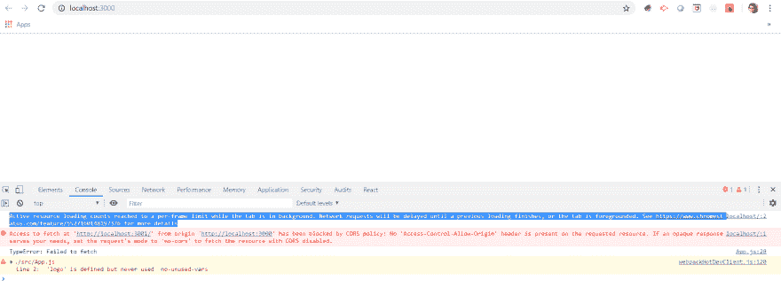](https://res.cloudinary.com/practicaldev/image/fetch/s--7py4K6pt--/c_limit%2Cf_auto%2Cfl_progressive%2Cq_auto%2Cw_880/https://thepracticaldev.s3.amazonaws.com/i/tjg79dzm3i98aqt9203o.png)

对于 Cors 问题，我们必须在定义连接代码之前，在服务器(app.js)上为后端添加以下代码:

```
//CORS
app.use(function(req, res, next) {
  res.header("Access-Control-Allow-Origin", "*");
  res.header("Access-Control-Allow-Headers", "Origin, X-Requested-With, Content-Type, Accept");
  next();
}); 
```

然后使用 npm install axios for backend 和 bower install axios for use axios to frontend 命令在终端中访问并使用 axios。现在打开客户端文件夹，并再次打开 app.js 文件，以更改获取代码，并使用 axios 来响应我们的项目

```
import React, { Component } from 'react';
import axios from 'axios';
import './App.css';

class App extends Component {
  state = {
    users:[]
  }
  componentDidMount(){
    this.getUsers();
  }

  getUsers = _ => {
        axios.get('/users')
    .then((data) => {
      console.log(data.data.users);
      this.setState({users: data.data.users});
    })
    // .then(({response}) => this.setState({users: response.users}))
    .catch(error => console.log(error));
  }
  showUsers = user => <div key={user.id}>{user.username}</div>
  render() {//building react method that comes inse od react component
    const { users } = this.state;
    return (//jsx code and can return only a single parent tag
      <div className="App">
        {users.map(this.showUsers)}
      </div>
    );
  }
}

export default App; 
```

恭喜您部署了第一个项目:

[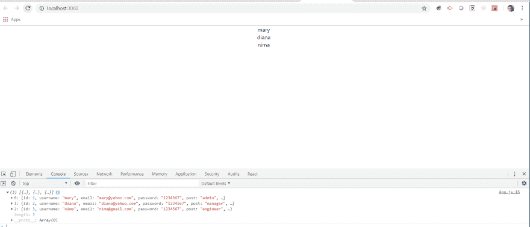](https://res.cloudinary.com/practicaldev/image/fetch/s--kHgICN-j--/c_limit%2Cf_auto%2Cfl_progressive%2Cq_auto%2Cw_880/https://thepracticaldev.s3.amazonaws.com/i/909jkx98qhf33rw47cu0.png)

现在，在我们尝试将项目的第一个版本部署到 Github 和 Heroku 之前，我们可以一步一步地设计和改进项目。首先:去[Github.com](https://github.com/)为你的项目建一个账户 **Github** 是一个基于网络的托管服务，使用 Git 进行版本控制。它主要用于计算机代码。它提供了 Git 的所有分布式版本控制和源代码管理(SCM)功能，并添加了自己的特性。它为每个项目提供了访问控制和几个协作特性，比如 bug 跟踪、特性请求、任务管理和 wikis。在终端中打开客户端文件夹，使用 npm 运行构建命令，使其准备好部署: [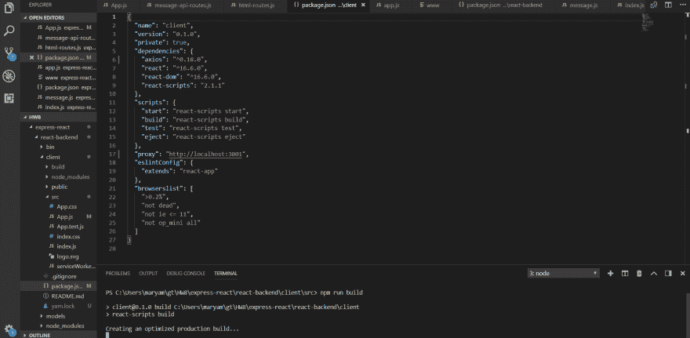](https://res.cloudinary.com/practicaldev/image/fetch/s--hJh5mwtw--/c_limit%2Cf_auto%2Cfl_progressive%2Cq_auto%2Cw_880/https://thepracticaldev.s3.amazonaws.com/i/gs9nymedit5va785d1kc.png) 打开您的 GitHub 帐户，转到“资源库”选项卡，然后按“新建”按钮，为您的项目创建一个新的资源库:

[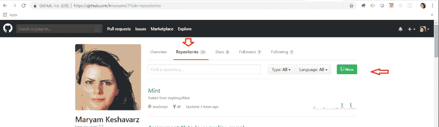](https://res.cloudinary.com/practicaldev/image/fetch/s--8Fkr2yui--/c_limit%2Cf_auto%2Cfl_progressive%2Cq_auto%2Cw_880/https://thepracticaldev.s3.amazonaws.com/i/xh2mokk6hbikspgz52ef.png)

键入您的存储库名称，并添加使用带有清单的自述文件初始化此存储库，然后单击 pes。gitignore 按钮忽略要部署的节点模块文件夹，这样下载和上传项目会更快，但请记住，在 VSCode 终端中使用(npm install)命令下载项目后，应该添加包含项目所有要求的节点模块文件夹。在文本框上键入 Node，然后按“创建存储库”按钮:

[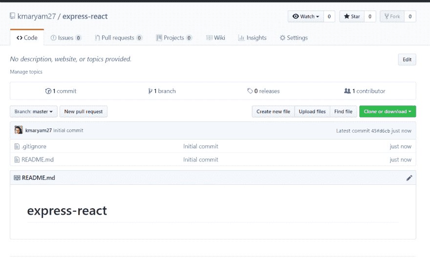](https://res.cloudinary.com/practicaldev/image/fetch/s--aE5Bh-Pt--/c_limit%2Cf_auto%2Cfl_progressive%2Cq_auto%2Cw_880/https://thepracticaldev.s3.amazonaws.com/i/0zuwlpqz1phnjmuslmxu.png)

按下 Repo 上的克隆或下载按钮，然后按下复制按钮，我们可以访问存储库地址的链接:

[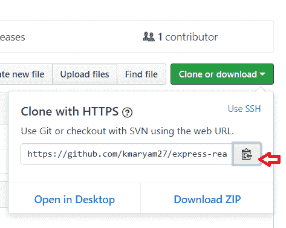](https://res.cloudinary.com/practicaldev/image/fetch/s--CAYdKGXC--/c_limit%2Cf_auto%2Cfl_progressive%2Cq_auto%2Cw_880/https://thepracticaldev.s3.amazonaws.com/i/kibchxpgrwtet8dby7yx.png)

打开 Git Bash，转到您想要 github repo 副本的特定地址。now 命令:git clone CTL+v(粘贴 Github 库的地址)

[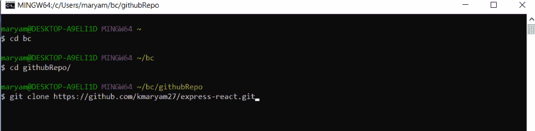](https://res.cloudinary.com/practicaldev/image/fetch/s--lLyan-d0--/c_limit%2Cf_auto%2Cfl_progressive%2Cq_auto%2Cw_880/https://thepracticaldev.s3.amazonaws.com/i/gz6vbnuekqzxb4w2j9u8.png)

在这一部分复制你所有的项目并把它们粘贴到 repo:

[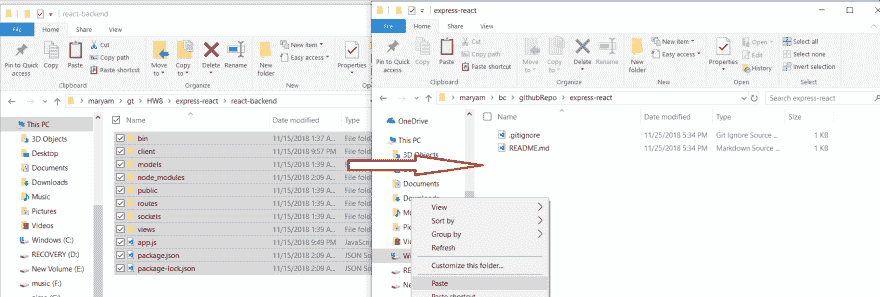](https://res.cloudinary.com/practicaldev/image/fetch/s--3GHIcYm8--/c_limit%2Cf_auto%2Cfl_progressive%2Cq_auto%2Cw_880/https://thepracticaldev.s3.amazonaws.com/i/mso86c49f25t3z7u5tq8.png)

在下面的命令应该上传代码到 Github 的结尾。

[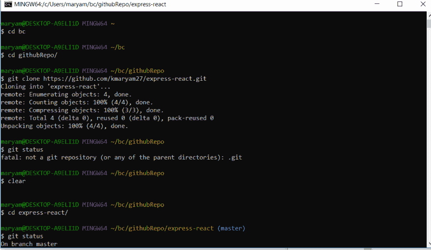](https://res.cloudinary.com/practicaldev/image/fetch/s--IDCAtxmg--/c_limit%2Cf_auto%2Cfl_progressive%2Cq_auto%2Cw_880/https://thepracticaldev.s3.amazonaws.com/i/ng8rq8x3592p5coqfaur.png)
[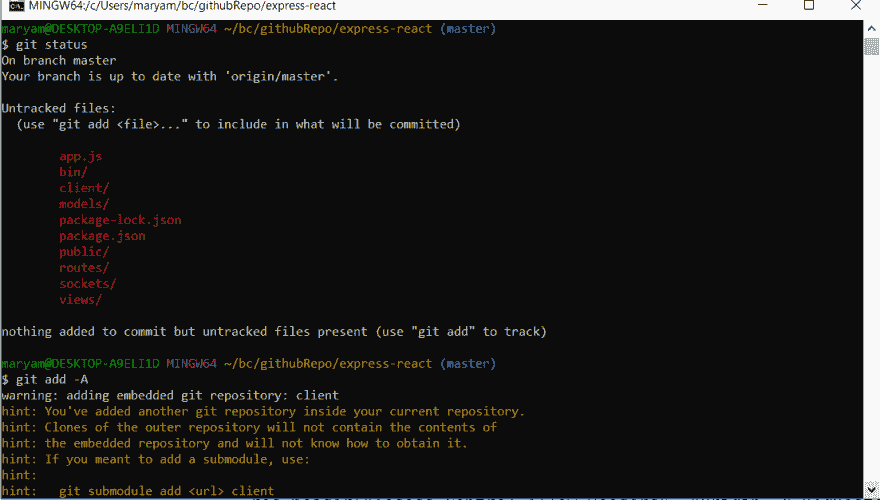](https://res.cloudinary.com/practicaldev/image/fetch/s--cOYYD2t9--/c_limit%2Cf_auto%2Cfl_progressive%2Cq_auto%2Cw_880/https://thepracticaldev.s3.amazonaws.com/i/q5zazd3imlxvi6vydsbr.png)
[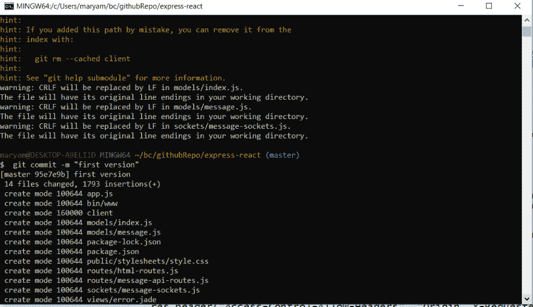](https://res.cloudinary.com/practicaldev/image/fetch/s--_ISKWewo--/c_limit%2Cf_auto%2Cfl_progressive%2Cq_auto%2Cw_880/https://thepracticaldev.s3.amazonaws.com/i/soa5ub62kt4st2z8i7tj.png)
[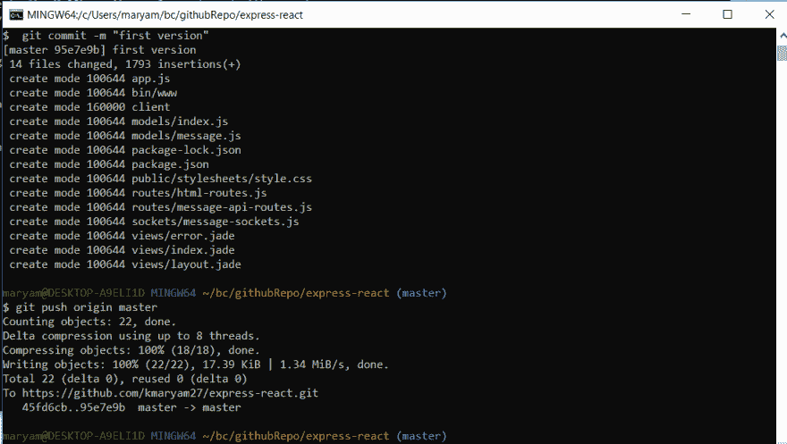](https://res.cloudinary.com/practicaldev/image/fetch/s--fbX4RZ3O--/c_limit%2Cf_auto%2Cfl_progressive%2Cq_auto%2Cw_880/https://thepracticaldev.s3.amazonaws.com/i/mkn9me1txbvv47ypzhyk.png)
最后我们就部署客户端文件夹的问题:
[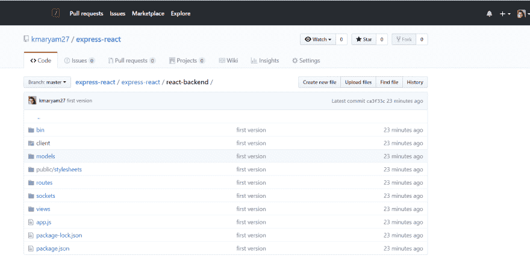](https://res.cloudinary.com/practicaldev/image/fetch/s--JzMMTtZ6--/c_limit%2Cf_auto%2Cfl_progressive%2Cq_auto%2Cw_880/https://thepracticaldev.s3.amazonaws.com/i/47x0msk1e17lpzgsglxf.png)

在下一部分，我们将尝试解决客户端文件夹问题，并在 Heroku 网站上部署该项目，并开发更多的这个项目

资源:

[https://en.wikipedia.org/wiki/GitHub](https://en.wikipedia.org/wiki/GitHub)
T3】https://www.youtube.com/watch?v=7yA7BGos2KQT5[https://github.com/gitname/react-gh-pages](https://github.com/gitname/react-gh-pages)