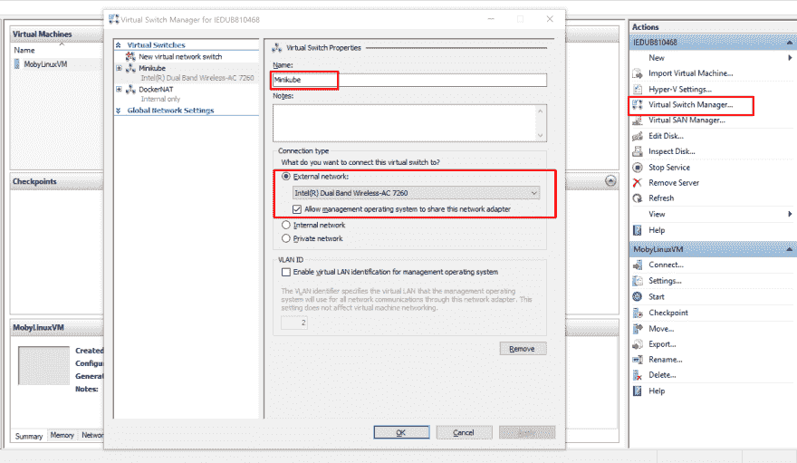
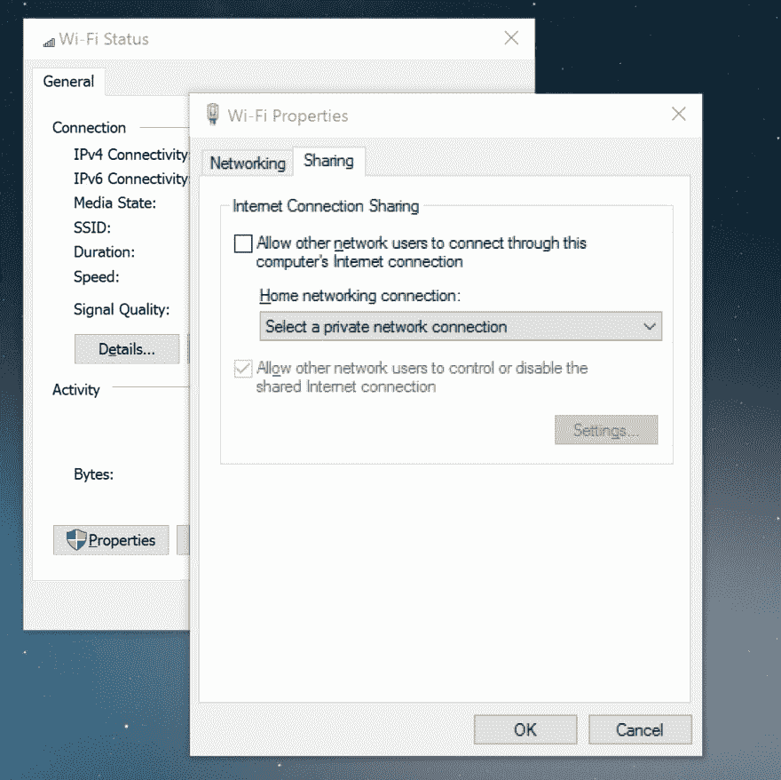

# 使用 Minikube 在 Windows 上设置 Kubernetes

> 原文：<https://dev.to/harshadranganathan/setting-up-kubernetes-on-windows-with-minikube-2pp6>

最初发表于[rharshad.com](https://rharshad.com/kubernetes-minikube-windows-setup/)

Minikube 是一个工具，它使得在本地运行 Kubernetes 变得很容易。Minikube 在笔记本电脑上的虚拟机中运行一个单节点 Kubernetes 集群，供希望尝试 Kubernetes 或日常使用它进行开发的用户使用。

Minikube 可以安装在多种操作系统(Linux、MacOS 和 Windows)中，并支持多种驱动程序(Windows 中的 [VirtualBox](https://www.virtualbox.org/) 、 [Hyper-V](https://docs.microsoft.com/en-us/virtualization/hyper-v-on-windows/about/) )。

我们将使用 VirtualBox 和 Hyper-V 驱动程序来查看 Minikube 的 Windows 设置。

如果您的本地系统中有 [Docker](https://www.docker.com/) ，那么您应该已经启用了 Hyper-V。在这种情况下，使用 Hyper-V 驱动程序而不是 VirtualBox 是有意义的，因为后者不能在启用 Hyper-V 的情况下工作。

因此，在这种情况下，如果您选择 VirtualBox 作为您的驱动程序，您可能最终会切换 Hyper-V 并重新启动您的系统，这取决于您是想使用 Docker 还是 VirtualBox 来运行 Kubernetes。

## 安装巧克力

Chocolatey 是一个用于 Windows 的软件包管理器，类似于 homebrew 用于 MacOS。它简化了我们的安装过程，所以我们将在这里使用它。

以管理员身份打开`PowerShell`并运行以下命令。

```
# Check the execution policy and ensure that it is not restricted  Get-ExecutionPolicy  # If execution policy is restricted then set the policy to All-Signed  Set-ExecutionPolicy  AllSigned  # Install chocolatey  iex  ((New-Object  System.Net.WebClient).DownloadString('https://chocolatey.org/install.ps1')) 
```

## 安装 Minikube

一旦安装了 chocolately，我们运行下面的命令来安装 Minikube

```
choco  install  minikube  --version  0.27  -y 
```

注意:高于 0.27 的版本会出现[关闭](https://github.com/kubernetes/minikube/issues/2914)的问题

## 安装 VirtualBox

如果你计划使用 VirtualBox 作为 Minikube 的驱动程序，那么运行下面的命令。否则跳过这一步。

```
choco  install  virtualbox  -y 
```

接下来我们将看看在 VirtualBox 和 Hyper-V 中运行 Kubernetes 集群。

## 在 VirtualBox 中运行 Kubernetes 集群

### 启动 Minikube

以管理员身份在 PowerShell 中运行此命令。

```
minikube  start  --alsologtostderr 
```

Minikube 将执行以下步骤

*   下载 MinikubeISO 并将其放置在。用户目录中的 minikube 文件夹
*   连接到 VirtualBox 并运行一个`minikube`虚拟机
*   下载必要的文件并将它们移动到群集
*   在虚拟机内运行单节点 Kubernetes 集群

跳转到[与您的集群部分](#interacting-with-your-cluster)互动。

### 故障排除

如果您在设置过程中遇到任何问题，请执行以下步骤:

删除 minikube 虚拟机

```
minikube  delete 
```

删除。迷你库贝和。您个人目录中的 kube 文件夹

使用适当的选项运行 minikube start 命令。

## 在 Hyper-V 中运行 Kubernetes 集群

### 创建 vSwitch

第一步是在 Hyper-V 中创建一个虚拟交换机。

在你的 windows 系统中打开`Hyper-V Manager`。在右侧窗格中，选择`Virtual Switch Manager`选项。

选择`External`并在`Virtual Switch Manager`窗口中选择`Create Virtual Switch`选项。

为虚拟交换机命名，例如 Minikube，连接类型为`External`并启用以下选项

*   允许管理操作系统共享此网络适配器

现在选择`Apply`创建一个新的虚拟开关。

[](https://rharshad.com/assets/img/2018/11/hyper-v-manager-vswitch.png)

如果您看到一条错误消息`Failed while adding virtual Ethernet switch connections`,这意味着您已经在需要禁用的 wifi 连接上启用了共享。

前往`Network and Sharing Center`并选择您的 Wi-Fi 连接。在`Wi-Fi`状态窗口中选择`Properties`。

在`Sharing`选项卡下的`Wi-Fi`属性窗口中，取消选中该选项

*   允许其他网络用户通过这台计算机的 Internet 连接进行连接

[](https://rharshad.com/assets/img/2018/11/windows-wifi-properties.png)

### 启动 Minikube

以管理员身份在 PowerShell 中运行此命令。

```
minikube  start  --vm-driver  "hyperv"  --hyperv-virtual-switch  "Minikube"  --disk-size  10g  --memory  4096  --alsologtostderr 
```

Minikube 将执行以下步骤

*   下载 MinikubeISO 并将其放置在。用户目录中的 minikube 文件夹
*   连接到 Hyper-V 并运行一个`minikube`虚拟机
*   下载必要的文件并将它们移动到群集
*   在虚拟机内运行单节点 Kubernetes 集群

如果一切顺利，你会看到下面的日志。

```
Connecting  to  cluster...  Setting  up  kubeconfig...  I1125  23:05:12.192115  4588  config.go:125]  Using  kubeconfig:  Starting  cluster  components...  I1125  23:05:12.196100  4588  ssh_runner.go:80]  Run  with  output:  sudo  /usr/bin/kubeadm  init  --config  /var/lib/kubeadm.yaml  ts  --ignore-preflight-errors=DirAvailable--data-minikube  FileAvailable--etc-kubernetes-manifests-kube-scheduler.yaml  fests-kube-apiserver.yaml  --ignore-preflight-errors=FileAvailable  --ignore-preflight-errors=FileAvailable--etc-kubernetes-manifests-etcd.yaml  flight-errors=CRI  &&  sudo  /usr/bin/kubeadm  alpha  phase  addon  kube-dns  Kubectl  is  now  configured  to  use  the  cluster.  Loading  cached  images  from  config  file. 
```

### 故障排除

如果您在设置过程中遇到任何问题，请执行以下步骤:

删除 minikube 虚拟机

```
minikube  delete 
```

删除。迷你库贝和。您个人目录中的 kube 文件夹

使用适当的选项运行 minikube start 命令。

## 与你的集群互动

使用以下命令
检查 minikube 是否正在运行

```
minikube  status 
```

哪个输出

```
PS  C:\WINDOWS\system32>  minikube  status  minikube:  Running  cluster:  Running  kubectl:  Correctly  Configured:  pointing  to  minikube-vm  at 
```

为了确保所有集群组件都在运行，我们使用下面的命令

```
PS  C:\WINDOWS\system32>  kubectl  get  pods  -n  kube-system  NAME  READY  STATUS  RESTARTS  AGE  coredns-c4cffd6dc-565mc  1/1  Running  0  12m  etcd-minikube  1/1  Running  0  11m  kube-addon-manager-minikube  1/1  Running  0  11m  kube-apiserver-minikube  1/1  Running  0  11m  kube-controller-manager-minikube  1/1  Running  0  12m  kube-dns-86f4d74b45-vxrr9  3/3  Running  0  12m  kube-proxy-fn5c9  1/1  Running  0  12m  kube-scheduler-minikube  1/1  Running  0  11m  kubernetes-dashboard-6f4cfc5d87-hgdnq  1/1  Running  5  12m  storage-provisioner  1/1  Running  0  12m 
```

如果以上任何一个 pod 处于失败状态，您可以获得如下日志，用于调试

```
kubectl  logs  kubernetes-dashboard-6f4cfc5d87-hgdnq  -n  kube-system 
```

如果您注意到任何 pod 处于`CrashLoopBackOff`状态，则执行前面故障排除指南中提到的步骤。

要访问 Kubernetes 仪表板，运行以下命令

```
minikube  dashboard 
```