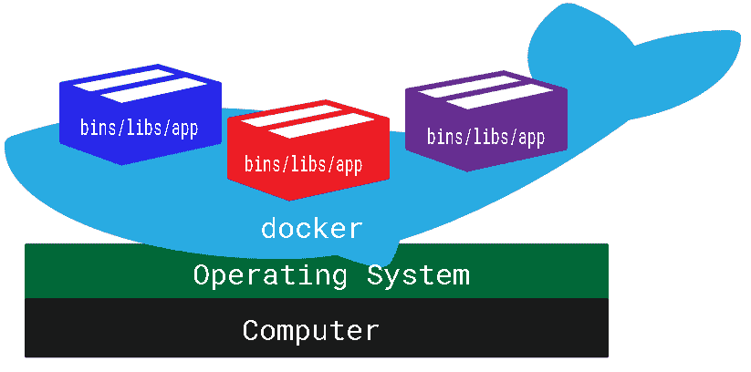
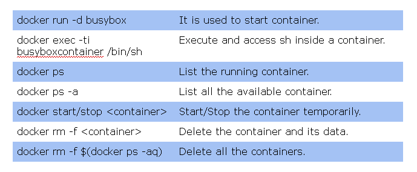
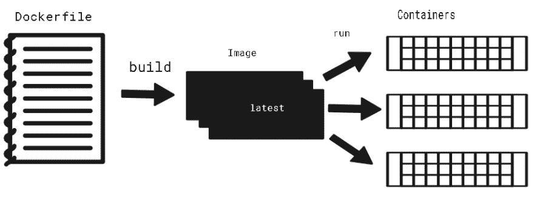
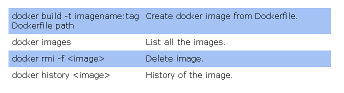
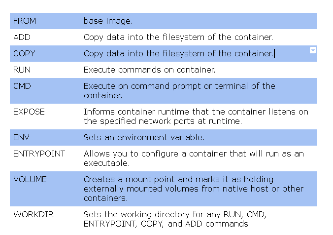

# 了解 docker 容器和图像

> 原文：<https://dev.to/prabusubra/understanding-docker-containers-and-images-ed7>

容器——一种在独立和隔离的环境中运行一个或多个流程的技术。

这里的流程是什么？
程序的执行(指令集)。它可以是应用程序、数据库、消息队列等…

独立执行流程需要哪些资源？

内存
CPU
I/O 设备
文件系统

在我们的日常生活中，我们不知不觉地使用容器。例如，Android 手机中的平行空间/第二空间和双应用程序功能正在使用 Linux 容器技术。

在 Linux 内核中，我们可以选择创建一个以上的并行空间，并在其中运行一个进程，比如 jail，这些被称为容器。

容器背后的 Linux 内核特性:-

使用 linux 内核的特性，如 Namespace、Cgroup、chroot 和 UnionFS，宿主 Linux 内核可以拆分其资源，在隔离的环境中运行进程。

名称空间→此功能将以下术语与主机和其他容器隔离开来。

挂载—隔离文件系统挂载点。
UTS —隔离主机名和域名。
IPC —隔离进程间通信(IPC)资源。
PID —隔离 PID 数字空间。
网络—隔离网络接口。
用户—隔离 UID/GID 数字空间。

Cgroups →限制 CPU、内存、网络等资源...

Chroot →更改指定进程及其子进程的根目录。

UnionFS →分层文件系统。
1。不可变层
docker 映像构建为不可变层。
2。可变层
数据持久化在这一层。可以挂载到

本地存储或者外部云存储。
它有助于 docker 图像和数据管理的有效重用。

如果容器共享主机操作系统，那么

为什么 docker 注册表中有操作系统映像(容器 OS)？容器在主机内核上运行，但由于隔离(命名空间)，操作系统实用程序和库不可用。容器无法访问安装在主机操作系统上的软件。因此，我们必须将每个 docker 容器所需的软件配置为 docker 文件中的 docker 映像。

什么是操作系统映像(容器操作系统)？这些映像不是成熟的操作系统，只是一堆实用程序/库。

因此，要运行一个容器，我们只需要加载一些实用程序，而不是完整的操作系统。

码头集装箱 CLIs:

图像—一个蓝图或模板，从中可以创建一个或多个容器。
[T3】](https://res.cloudinary.com/practicaldev/image/fetch/s--ByTNpX7x--/c_limit%2Cf_auto%2Cfl_progressive%2Cq_auto%2Cw_880/https://thepracticaldev.s3.amazonaws.com/i/1tgvgkwgzqbk6abeq3h9.png)

大多数图像都是基于临时图像构建的。这就像超级父母的形象。Scratch 没有任何效用，是大小为零的空图像。图像大小取决于其实用程序、库和应用程序。

docker image CLIs:-

Dockerfile:-

Docker 映像是从 Dockerfile 创建的。它有一套词汇表来独立地执行带有依赖项的流程。
[T3】](https://res.cloudinary.com/practicaldev/image/fetch/s--2ys3ro4T--/c_limit%2Cf_auto%2Cfl_progressive%2Cq_auto%2Cw_880/https://thepracticaldev.s3.amazonaws.com/i/9gkt96151dj9uiuqunj4.png)

最终，使用容器技术可以比传统方式更快地创建/更改、包装、测试和运输软件，障碍更少。它简化了软件业务。可编程平台(PaaS)加速软件开发和部署(SaaS)。

感谢阅读…这是我使用 docker 几个月后的理解。请随意评论您的建议！！！