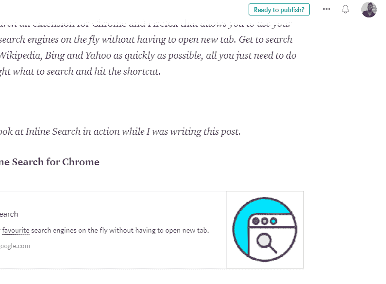

# 使用在线搜索 Chrome/Firefox 扩展更快更智能地搜索网页

> 原文：<https://dev.to/ahkohd/search-the-web-faster-and-smarter-with-inline-search-chromefirefox-extension-1dg4>

最近我在维基百科上读了一篇文章，我偶然发现了这个词，我不知道它是什么意思，但我太饿了，这篇文章让我不愿意打开一个新标签来搜索它的意思。我能回忆起自言自语“我必须打开一个新的标签来做这件事吗”。

火花，一个刚刚闪现的想法，为什么我不能为谷歌 Chrome 写一个扩展，当然还有 Mozilla Firefox，让我不用离开页面就可以用搜索引擎搜索东西。“是的，我当然也会喜欢”，我一边继续读文章，一边对自己说。

读完之后，我去了 Figma 做一些设计，一周之后，我终于开发出了扩展。

***内嵌**搜索 Chrome 和 Firefox 的一个扩展，让你不用打开新标签就能使用你最喜欢的搜索引擎。尽快搜索谷歌、维基百科、必应和雅虎，你只需要突出显示要搜索的内容，然后点击快捷方式。*

在 medium 上写文章时，看看在线搜索的运行情况。

[下载 Chrome 在线搜索](https://chrome.google.com/webstore/detail/inline-search/mihhpdfdjlgmpmgbajjfbepmfeedgnnj)

[下载 Firefox 内嵌搜索](https://addons.mozilla.org/en-US/firefox/addon/inline-search/)

内联搜索源代码可以在 [Github](https://github.com/ahkohd/Inline-Search) 上找到。谢谢！