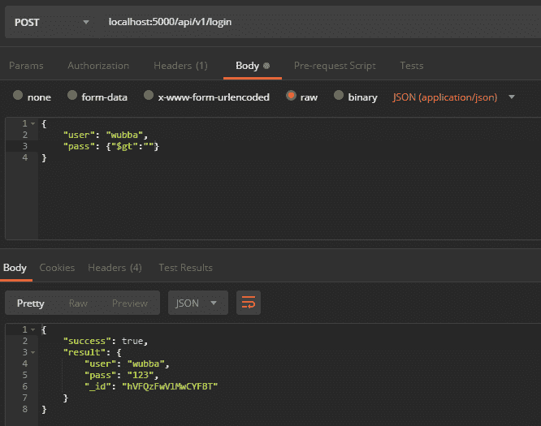

# 当心 findOne 函数

> 原文：<https://dev.to/nulldreams/beware-of-the-findone-function-15g>

你好，自从我在 NodeJS 上一篇文章 [Easy Requests 以来，我转到了信息安全行业，并开始研究/调查许多关于现代应用程序中的漏洞。](https://dev.to/nulldreams/easy-requests-in-nodejs-1fke)

在本帖中，我们将了解如何保护我们的网络应用程序免受 NoSQL 病毒的攻击

根据 [OWASP Top 10 - 2017](https://www.owasp.org/index.php/Top_10-2017_Top_10) ，去年最频繁的漏洞是 [A1:2017-Injection](https://www.owasp.org/index.php/Top_10-2017_A1-Injection) ，它是指在易受攻击的系统中的某一点注入恶意代码，最知名的注入是 SQL 注入，通过 URL、表单我们可以向受害者的数据库发送恶意查询。

如今，通常会发现系统有一个 API 来认证用户，并使用非关系数据库来存储这些信息，一个常用的银行是 [Mongo](https://www.mongodb.com/) 。

在下面的例子中，我们使用了 [NeDB](https://github.com/louischatriot/nedb#finding-documents) bank，它的语法与 Mongo 非常相似。

**控制器**

```
exports.login = async (req, reply) => {
    try {
        let { user, pass } = req.body

        let result = await findOne({user, pass})

        return reply.code(200).send(result)
    } catch (e) {
        return reply.code(500).send({ success: false, result: 'user/pass not found' })
    }
} 
```

Enter fullscreen mode Exit fullscreen mode

db。**芬多内**

```
async function findOne(query) {
    return new Promise((resolve, reject) => {
        db.findOne(query, (err, result) => {
            if (err) return reject(err)

            resolve({ success: true, result })
        })
    })
} 
```

Enter fullscreen mode Exit fullscreen mode

[](https://res.cloudinary.com/practicaldev/image/fetch/s--omHVT0If--/c_limit%2Cf_auto%2Cfl_progressive%2Cq_auto%2Cw_880/https://i.imgur.com/RQB8lPB.png)

进行登录是因为我们传递给 **findOne** 的对象是一个有效的对象，也就是说，**用户**和 **pass** 都有实际存在于数据库中的值。

在这篇文章的开始，我评论了 SQL 注入，但是你听说过 NoSQL 注入吗？不是吗？好了，你会明白这是什么，看下一个函数:

```
 db.findOne(query, (err, result) => {
    if (err) return reject(err)

    resolve({ success: true, result })
}) 
```

Enter fullscreen mode Exit fullscreen mode

基本上这个函数所做的是在数据库中进行检查，以了解是否有任何记录具有我们传递给**用户** & & **传递**的值，注意我使用了逻辑运算符 **& &** (和)。

这不会让你认为，如果我们至少通过了有效的**用户**，而不是通过通知另一个返回*真值*的验证，函数会工作吗？

Mongo 和 NeDB 都有可以在数据库查询中使用的过滤器，例如 **$gt** ，它相当于关系运算符“ **>** ”。让我们用这个过滤器代替密码来做一个查询。

[](https://res.cloudinary.com/practicaldev/image/fetch/s--shpqPVcp--/c_limit%2Cf_auto%2Cfl_progressive%2Cq_auto%2Cw_880/https://i.imgur.com/6npi4xl.png)

也就是说，我们在数据库中进行查询，询问它是否有与用户**“wubba”的记录，以及**通行证**的值是否大于“无”，如果有具有该名称的用户，当然密码将大于“无”。**

 **如果我们在**用户**中传递同一个对象`{"$ gt": ""}`并且**传递**，银行将返回它拥有的第一条记录！

这向我们表明，如果我们不对传递给它的值进行处理，findOne 函数是危险的，在这种情况下，我们可以验证被通知的信息是否不是一个对象。

为了解决这个问题，我们可以使用下面的函数

**控制器**

```
exports.loginProtected = async (req, reply) => {
    try {
        let { user, pass } = req.body
        await isObject({ user, pass })

        let result = await findOne({user, pass})

        return reply.code(200).send(result)
    } catch (e) {
        return reply.code(500).send({ success: false, result: 'user/pass not found' })
    }
} 
```

Enter fullscreen mode Exit fullscreen mode

**isObject**

```
 async function isObject(params) {
    return new Promise((resolve, reject) => {
        Object.keys(params).forEach((v, i) => {
            if (typeof params[v] === 'object') return reject(false)
        })
        resolve(true)
    })
} 
```

Enter fullscreen mode Exit fullscreen mode

这个案例是用 [NeDB](https://github.com/louischatriot/nedb#finding-documents) bank 重现的，但也是用 [Mongo](https://docs.mongodb.com/manual/reference/method/db.collection.findOne/) 和 [Sails/Waterline](https://sailsjs.com/documentation/reference/waterline-orm/models/find-one) 模拟的，如果你在另一家银行发现，请在这里评论以帮助其他人😉

Github 项目[https://github.com/nulldreams/nosql-pentest](https://github.com/nulldreams/nosql-pentest)**