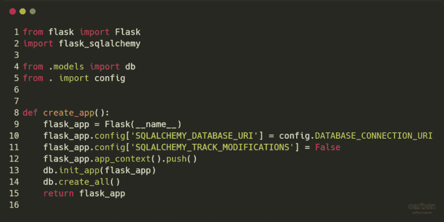
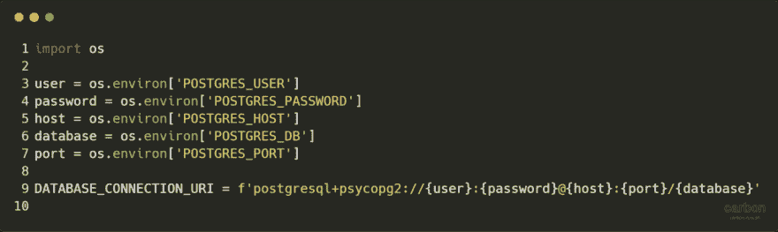
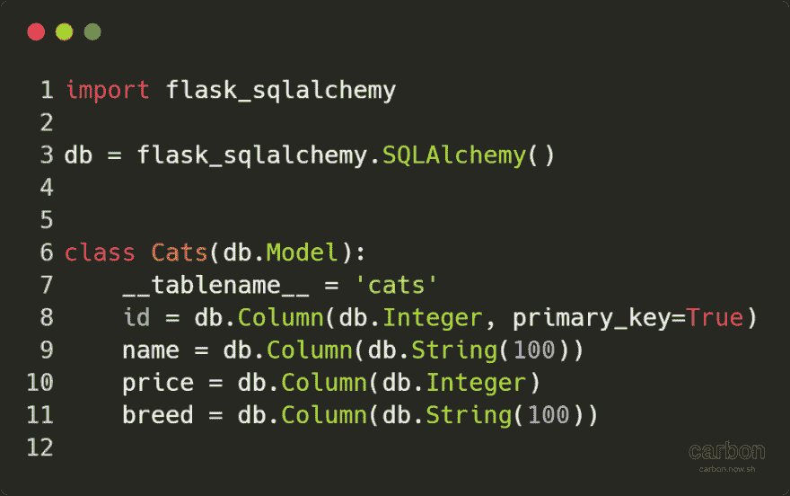
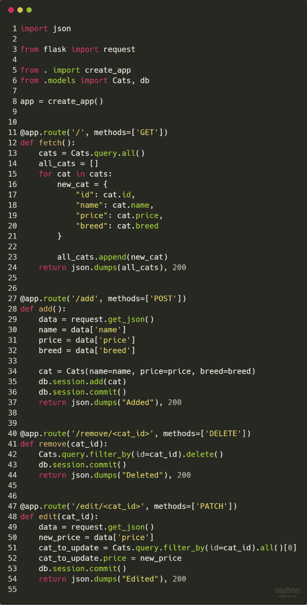
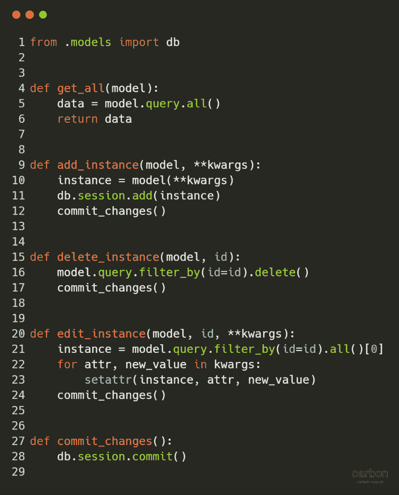
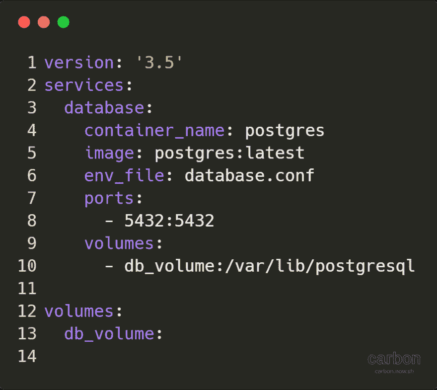

# 用 Docker 实现 SQLAlchemy

> 原文：<https://dev.to/ghost/implementing-sqlalchemy-with-docker-18c9>

### 带有烧瓶、SQLAlchemy 和 Docker 的简单应用程序

[https://medium . com/media/8 cf 6a 3d 07 B4 aed 423 ee 2 e 2 CCD 9d 0682 a/href](https://medium.com/media/8cf6a3d07b4aed423ee2e2ccd9d0682a/href)

SQLAlchemy 是一个对象关系映射器(ORM)，它允许我们使用 Python 函数和对象与数据库进行交互。例如，如果我们有一个名为 Cats 的表，我们可以用 Cats.query.all()这样的命令检索每一行。这样做的主要优点是它允许我们抽象出 SQL。

码头工人🐳允许我们在 Docker 容器中快速打开数据库，这意味着我们不必在本地机器上设置和配置数据库。当我们处理完数据库时，我们可以简单地终止 Docker 容器。在本文中，我将向您展示如何使用 Flask 和 SQLAlchemy 创建一个非常简单的 RESTful API，它将连接到运行在 Docker 容器中的数据库。

**注意:** Flask 服务器将在本地运行，而不是在 Docker 容器中。

在这个例子中，我将使用 Postgres，但是使用任何其他关系数据库，比如 MySQL，也应该很容易。我还将使用 flask-sqlalchemy，它是 sqlalchemy 的包装器，它简化了我们的代码，意味着我们可以使用更少的样板代码。

#### 先决条件

*   [安装对接器](https://docs.docker.com/install/)
*   (可选)安装坞站-复合
*   安装 Python3.6
*   使用 pip install -r requirements.txt(或 pip3 而不是 pip)安装以下依赖项

其中 requirements.txt 为:

```
flask==1.0.2
flask-sqlalchemy==2.3.0
psycopg2==2.7.6.1 
```

#### **init** 。巴拉圭

[](https://res.cloudinary.com/practicaldev/image/fetch/s--cF6LGe93--/c_limit%2Cf_auto%2Cfl_progressive%2Cq_auto%2Cw_880/https://cdn-images-1.medium.com/max/1024/1%2AgiwoLMTSN0Hs_q0WjiuiAg.png) 

<figcaption>**init** 。py</figcaption>

init 文件有一个函数 create_app()，有趣的是，它用下面这行 Flask(__name__)创建了我们的 Flask 应用程序。然后，它从 config.py 文件中为 Flask 应用程序的配置分配一个 URI。这个 URI 用于连接到 Postgres 数据库。

关于这个函数的一个重要的事情是我们必须使用 Flask 上下文。由于 Flask 可以有多个应用程序，我们必须指定我们使用 SQLAlchemy 的应用程序，因此我们使用新创建的应用程序推送上下文。否则我们会看到下面的错误，[更多信息在这里](http://flask-sqlalchemy.pocoo.org/2.3/contexts/)。

```
No application found. Either work inside a view function or push an application context. 
```

在推送我们的上下文之后，我们使用下面的行 db.init_app(flask_app)将我们的 db 链接到 Flask 应用程序。然后我们使用 db.create_all()创建所有的表(如果它们还不存在的话)。表是使用 models.py 中定义的类创建的。

#### config.py

[](https://res.cloudinary.com/practicaldev/image/fetch/s--Z31auenK--/c_limit%2Cf_auto%2Cfl_progressive%2Cq_auto%2Cw_880/https://cdn-images-1.medium.com/max/1024/1%2Auxo548oUAjNW2gPGDia81A.png) 

<figcaption>config.py</figcaption>

这个模块目前唯一的工作是生成这个 URI，但是如果需要的话，可以很容易地扩展来添加额外的配置变量。

```
DATABASE\_CONNECTION\_URI = f'postgresql+psycopg2://{user}:{password}@{host}:{port}/{database}' 
```

**注意:**用于格式化字符串的 F-string(如上图)只能和 Python3.6 一起使用。

#### database.conf

这些是需要作为环境变量传递给 Flask 应用程序的变量的例子。

```
POSTGRES\_USER=test
POSTGRES\_PASSWORD=password
POSTGRES\_HOST=localhost
POSTGRES\_PORT=5432
POSTGRES\_DB=example 
```

**注意:**如果您在 Docker 容器中运行 Flask 应用程序，您将需要更改变量 POSTGRES_HOST=postgres，(来自 localhost)，其中 POSTGRES 是我们正在连接的 Docker 容器名称。

**警告:**确保这些是传递给 Flask 应用程序和 Postgres 数据库的相同值。

#### [T1】models . py](#modelspy)

[](https://res.cloudinary.com/practicaldev/image/fetch/s---vX5EMVA--/c_limit%2Cf_auto%2Cfl_progressive%2Cq_auto%2Cw_880/https://cdn-images-1.medium.com/max/1024/1%2AWUFUiWxEHMhJ17LRjHGndQ.png)T3】models . py

这个模块定义了我们的类，然后这些类成为数据库中的表。例如，Cats (cats)类是表名，每个属性成为该表中的一列。因此，cats 表有四列:id、名称、价格和品种。

db 变量由 __init__ 从这里导入。py 文件，db.create_all()函数就是这样知道要在数据库中创建哪些类/表的。

#### app.py

[](https://res.cloudinary.com/practicaldev/image/fetch/s--dKFatB7i--/c_limit%2Cf_auto%2Cfl_progressive%2Cq_auto%2Cw_880/https://cdn-images-1.medium.com/max/1024/1%2A2-qTeOTSJmtNRSv5jnNkcA.png)T3】app . py

这是一个简单的 Flask 文件，它通过从 __init__ 调用 create_app()函数来创建我们的应用程序。py 模块。然后，它为“RESTful”API 的四个路由定义了四个函数:

*   获取:获取所有猫的信息
*   帖子:添加新的猫
*   删除:删除一只猫
*   补丁:编辑猫的价格

#### database.py

[](https://res.cloudinary.com/practicaldev/image/fetch/s--nkeOvri7--/c_limit%2Cf_auto%2Cfl_progressive%2Cq_auto%2Cw_880/https://cdn-images-1.medium.com/max/1024/1%2AnPIGUts7iQx7ctMPq7XfaQ.png)T3】database . py

创建这个模块是为了让我们能够抽象出与数据库交互的方式。我们简单地使用这个模块中的函数与数据库进行交互。这意味着更容易改变我们用来与数据库交互的库。这也意味着如果由于某种原因我们需要改变我们与数据库的交互方式。我们只需要在一个模块中改变它(这个)。

app.py 模块调用该文件中的函数与数据库进行交互。

*   GET — get_all()
*   POST —添加实例()
*   删除—删除实例()
*   PUT — edit_instance()

一些函数使用这个特殊的关键字，称为**kwargs，kwargs(关键字参数)可以被称为任何东西，但最好是将其称为 kwargs。这允许函数的调用者传入任意数量的关键字参数。

让我们以 add_instance()函数为例来看看。在 app.py 中调用该函数，就像 so database.add_instance(Cats，name=name，price=price，breed = breed)model = Cats 和 kwargs 是传递给 Cats 模型的其余参数，因此我们可以将 cat 对象添加到数据库中。

**注意:**kwargs 只是将参数存储为一个字典，而**操作符将我们的字典解包并作为关键字参数传递。

#### 码头工-化合物. yml

[](https://res.cloudinary.com/practicaldev/image/fetch/s--a6r9Rgk---/c_limit%2Cf_auto%2Cfl_progressive%2Cq_auto%2Cw_880/https://cdn-images-1.medium.com/max/890/1%2ATbut3uWeXWVn8eHMq6cxrw.png) 

<figcaption>码头工-化合物. yml</figcaption>

对于开发，我喜欢使用 docker-compose。在 docker compose 中，我们可以使用 YAML 来指定 docker 容器。当试图构建/运行多个 Docker 容器时，它可以帮助简化我们需要键入的命令。在这个例子中，我们只定义了一个 Docker 容器。

看一下文件:

首先，我们定义我们的版本号版本:' 3.5 '，Docker 建议您至少使用版本 3。你可以在这里找到更多信息。

然后我们给我们的一个服务名，在这个例子中是 database。我喜欢用通用名称来命名我的服务，比如 web 服务器、数据库或消息代理。这意味着我可以在不改变服务名称的情况下改变底层技术。

在此之后，我们将我们的容器命名为 postgres，这是 Docker 容器的名称。它可以用来与容器交互(杀死它或执行它),而不需要使用 ID。

我们在 [Docker Hub](https://hub.docker.com/_/postgres/) 上使用官方 Postgres 图像，我们提取标记为最新的图像。

这个图像需要我们使用一些变量来设置它，如用户名，密码和数据库。我们以文件的形式传递这些，使事情变得简单一点(与上面定义的`database.conf`相同)。

然后，我们将主机端口 5432 映射到来宾 Docker 容器端口 5432，这是 Postgres 侦听的端口。如果您想更改主机端口，例如 9000，这意味着主机端口 9000 上的所有流量都将被发送到端口 5432 上的 Postgres 容器。我们还需要更新 Flask 应用程序正在使用的环境变量。

最后，我们挂载一个卷，以便我们的数据是持久的，如果没有这个，当数据库 Docker 容器被终止时，您将丢失所有的数据。通过挂载 db_volume，即使在您终止容器时，比如当您想要更新 Postgres 映像时，您的数据也会持久化。

#### 运行我们的应用

用 docker-compose 构建并运行我们的 Docker 容器:

```
docker-compose up --build -d 
```

仅使用普通 Docker 的等效命令是

```
docker volume create --name db\_volume
docker run -d --name postgres -p 5432:5432 \
 --env-file docker/database.conf \
 -v db\_volume:/var/lib/postgresql postgres:latest 
```

启动我们的 Flask 应用程序(必须与 app.py 在同一个文件夹中)

```
export FLASK\_APP=app.py
flask run 
```

你可以在 127.0.0.1:5000 上向你的 Flask 服务器发送 HTTP 请求，你可以使用 Postman 或者失眠症这样的 REST 客户端。您也可以在 cli 上使用 cURL。

```
curl -XPOST -H "Content-type: application/json" -d \
'{"name": "catty mcCatFace", "price": 5000, "breed": "bengal"}' \
'127.0.0.1:5000/add' 
```

#### 附录

*   [示例源代码](https://github.com/hmajid2301/medium/tree/master/8.%20Docker%20with%20SQLAlchemy)
*   [用碳制作的代码图像](https://carbon.now.sh)
*   [邮递员](https://www.getpostman.com/)
*   [失眠](https://insomnia.rest/)