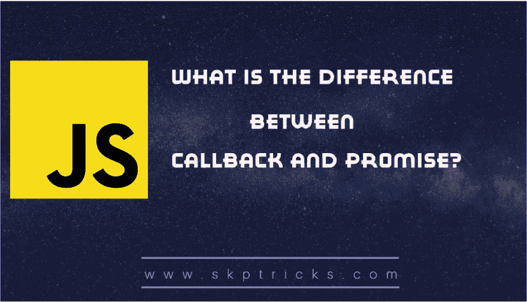

# 回调和承诺有什么区别？

> 原文：<https://dev.to/skptricks/what-is-the-difference-between-callback-and-promise-5211>

帖子链接:[回调和承诺有什么区别？](https://www.skptricks.com/2018/11/what-is-difference-between-callback-and-promise.html)

在本教程中，我们将讨论回拨和承诺之间的区别。如今回调和承诺广泛应用于 web 应用开发，如 react js、javascript 等。

[回调和承诺有什么区别？](https://www.skptricks.com/2018/11/what-is-difference-between-callback-and-promise.html)

