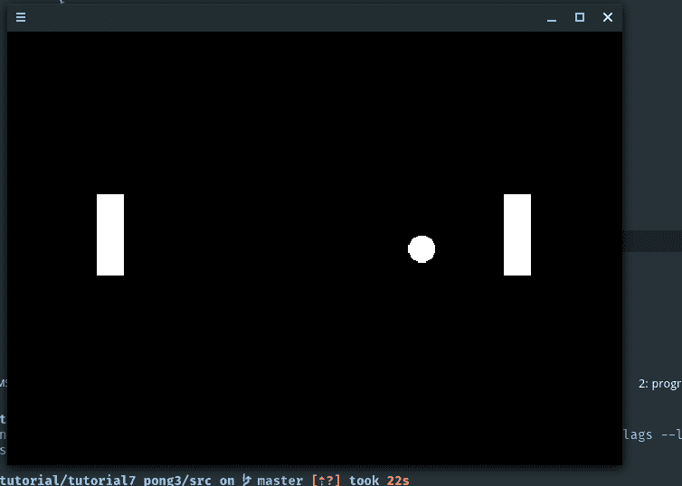

# 使用 SDL2: Pong 3

> 原文：<https://dev.to/noah11012/using-sdl2-pong-3-206b>

在这篇文章中，我们将把球放在屏幕上。我做的第一件事是创建一个叫做`Ball`的球类。它遵循与前面的类相同的结构:更新和绘制方法。让它脱颖而出的一个方法是`init()`方法。这将初始化对象并把它放在我们选择的位置。

**为什么不使用构造函数？**

在`Pong`类中，我添加了另一个名为`m_ball`的对象。因为 SDL2 不提供画圆的功能，所以我使用了一个图像，并决定再次使用 SDL2_image。

使用构造函数初始化列表是不可能的，因为渲染器直到稍后才被创建，在`m_ball`已经被默认初始化之后。

ball.hpp:

```
#pragma once 
#include <SDL2/SDL.h>
#include <SDL2/SDL_image.h> 
#include <random> 
class Ball
{
public:
    Ball() = default;
    ~Ball();
    void init(SDL_Renderer *renderer, int x, int y);
    void update(double delta_time);
    void draw(SDL_Renderer *renderer);
private:
    int m_velocity;
    double m_x;
    SDL_Texture *m_image;
    SDL_Rect m_position;
}; 
```

Enter fullscreen mode Exit fullscreen mode

Ball::init():

```
void Ball::init(SDL_Renderer *renderer, int x, int y)
{
    IMG_Init(IMG_INIT_PNG);

    SDL_Surface *image = IMG_Load("ball.png");

    m_image = SDL_CreateTextureFromSurface(renderer, image);
    SDL_FreeSurface(image);

    IMG_Quit();

    m_position.x = x;
    m_position.y = y;

    m_x = m_position.x;

    SDL_QueryTexture(m_image, nullptr, nullptr, &m_position.w, &m_position.h);

    std::random_device dev;
    std::mt19937 rand_gen(dev());
    std::uniform_int_distribution<> dist(0, 1);

    if(dist(rand_gen) == 0)
    {
        m_velocity = -3;
    } else {
        m_velocity = 3;
    }
} 
```

Enter fullscreen mode Exit fullscreen mode

这个函数中发生了很多事情。首先，我们初始化 SDL2_image 的 PNG 加载器，打开一个图像并将其保存到一个`SDL_Surface`。接下来，我们将它转换成一个`SDL_Texture`，并释放`SDL_Surface`。最后，我们退出 SDL2_image。

我们将引入一个名为`SDL_QueryTexture()`的新函数。它接受一个指向我们想要查询的属性的`SDL_Texture`的指针。其余的是我们想要的数据的输出参数。第一个是指向一个`Unit32`的指针。通过使用这个输出参数，我们可以看到一个`SDL_Texture`的格式。对于下一个，我们将挥动我们的手，并集中在最后两个。宽度和高度的输出参数。

为了让这个游戏更刺激一点，我们将随机选择球的方向。如果它是 0，那么它将向左移动。当值为 1 时，它向右移动。

我们使用一些出色的 C++ 11 特性来获得均匀分布。这是我们无法得到的。我不会说太多细节，但我所做的要点是创建一个随机设备，然后一个梅森扭扭引擎。最后，使用`std::uniform_int_distribution`创建一个从 0 到 1 的范围。

根据这个值，我们将`m_velocity`变量设置为正确的值。

球::更新():

```
void Ball::update(double delta_time)
{
    m_x = m_x + (m_velocity * delta_time);
    m_position.x = m_x;
} 
```

Enter fullscreen mode Exit fullscreen mode

没什么新鲜的。

Ball::draw():

```
void Ball::draw(SDL_Renderer *renderer)
{
    SDL_RenderCopy(renderer, m_image, nullptr, &m_position);
} 
```

Enter fullscreen mode Exit fullscreen mode

这里也没什么新鲜的。

就像它之前的每一个类一样，我们在`Pong`的更新方法中调用`update()`方法，在`Pong`的绘制方法中调用`draw()`方法。

```
void Pong::update(double delta_time)
{
    ...
    m_ball.update(delta_time);
} 
```

Enter fullscreen mode Exit fullscreen mode

```
void Pong::draw()
{
    m_ball.draw(m_game_window_renderer);
} 
```

Enter fullscreen mode Exit fullscreen mode

编译并运行。

[](https://res.cloudinary.com/practicaldev/image/fetch/s--V2VBTLaU--/c_limit%2Cf_auto%2Cfl_progressive%2Cq_auto%2Cw_880/https://thepracticaldev.s3.amazonaws.com/i/v882d9o38x47akfyzwaq.png)

## 接下来是什么

目前，球只在水平直线上运动。在下一篇文章中，这个问题将会得到解决。

Github 库:[https://github.com/Noah11012/sdl2-tutorial-code](https://github.com/Noah11012/sdl2-tutorial-code)