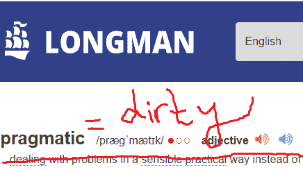

# TDD 不点击的时候，别的东西要点击“更用力”！

> 原文：<https://dev.to/yaser/when-tdd-doesnt-click-something-else-should-click-harder-2h9h>

早前， [@ben](https://dev.to/ben) 写了这两个牛逼的帖子:

1.  你的 TDD 啊哈时刻是什么时候？

2.  [当测试驱动开发点击](https://dev.to/ben/when-test-driven-development-clicks-3lpc)

### 以防你不知道 TDD 是什么

TDD(测试驱动开发)是一种通过首先编写测试来开发软件的方法。

### 嗯...先测试？！

是的，在编写实际代码之前编写测试，否则你就不是在进行 TDD。

### 何苦还要 TDD 呢？

鲍勃叔叔说，你不能重构你的代码:

> 你害怕你创造的东西，你失去了对它的控制...现在它控制了你；你不再是主人了！

### Buuut...TDD 从来没有为我工作过😓

我试了三次 TDD:

1.  类似 Spotify 的安卓应用
2.  大学应用网络应用
3.  甚至一个演示应用程序只是为了学习那该死的东西！

所以，我想是时候四处问问了，十个月前我在 reddit 上写过一个问题:[控制器测试变得无聊乏味了吗？](https://www.reddit.com/r/dotnet/comments/7n8obj/did_controller_testing_became_ridiculously_tedious/)

我学到了很多...唉，**还是不点击**😞

### 为什么不点击？

让我展示我尝试过 TDD 的三个例子:

在这里，我尝试使用包装器方法`DownloadPage`下载一个页面，该方法使用。NET 框架内部，那么在一个经过全面测试的框架之上测试一个方法构建有什么意义呢？

```
public async Task<string> DownloadPage(string songName)
{
    try
    {
        using (HttpClient wClient = new HttpClient())
        {
            var queryString = new StringContent("search=" + songName, Encoding.UTF8, "application/x-www-form-urlencoded");
            Task<HttpResponseMessage> task = wClient.PostAsync(new Uri(_songsSource), queryString);
            var result = await task;
            result.EnsureSuccessStatusCode();
            if (task.Status == TaskStatus.RanToCompletion) return await result.Content.ReadAsStringAsync();
            else return ErrorOutputs.ErrorServer;
        }
    }
    catch
    {
        if (CheckInternetConnection()) return ErrorOutputs.ErrorServer;
        else return ErrorOutputs.ErrorNoInternet;
    }
}

[TestMethod]
public void DownloadPageShouldFailWhenNotHavingInternet()
{
    //Arrange
    string path = @"C:\Users\DarkOne\Downloads\test2.html";
    InternetUtils.SetSource(InternetUtils.SourceMp3Int);

    //Act
    var downloadedHtml = DownloadPage("Sia");

    //Assert
    System.IO.File.WriteAllText(path, downloadedHtml.Result);
    Assert.AreNotEqual(downloadedHtml.Result, ErrorOutputs.ErrorNoInternet);
} 
```

Enter fullscreen mode Exit fullscreen mode

我的第二个想法是测试用户是否登录，然后他可以显示那个页面，但是 auth 是`AspNetCore.Identity.EntityFrameworkCore`包的一部分，所以**为什么要测试已经证明可以工作的东西**(意思是你只需要根据他们的文档写一个工作代码，而不是测试它)

```
public class StudentController : Controller
{
    // GET: Agent/Student/Details/5
    [Route("/Agent/Student/Details/{id}")]
    public async Task<IActionResult> Details(int id)
    {
        var student = await _repository.StudentData.GetById(id);
        if (student == null)
        {
            return NotFound();
        }
        if (await _authorizationService.AuthorizeAsync(User, student, new HisOwnStudentRequirement()
        {
            return View(student.ToStudentDetailsViewModel(_environment));
        }
        return new ChallengeResult();
    }
}

[Fact]
public void ShowDataJustForHisOwn_ForAgent_Details()
{
    int studentId = 4;
    var agent = new Agent() { UserName = JunkyData.AgentsEmails[0] };
    JunkyDataManager.FixJunkyStudents(agent);

    MyMvc
        .Controller<StudentController>()
        .WithAuthenticatedUser(user =>
        {
            user.InRole(nameof(Role.Agent));
            user.WithUsername(agent.UserName);
            user.WithIdentifier(agent.UserName);
        })
        .WithDbContext(dbContext => dbContext
            .WithEntities(entities => entities.AddRange(JunkyDataManager.JunkyStudents)))
        .Calling(c => c.Details(studentId))
        .ShouldReturn()
        .View()
        .WithModelOfType<StudentDetailsViewModel>()
        .Passing(s =>
            Assert.Equal(JunkyDataManager.JunkyStudents[studentId - 1].Name, s.Name));
} 
```

Enter fullscreen mode Exit fullscreen mode

在 reddit 中，他们建议将我的代码放到一个服务中，而不是我的控制器中，并测试那个服务。

我就是不能，因为服务应该粘在框架内部来完成它的工作...这就是原因！

不管是不是服务，有了单元测试，**你最终测试的是框架而不是逻辑！**

我不会提到我的第三次拍摄，因为同样的事情又发生了...测试框架！

* * *

### 务实的做法

上次我查阅朗文词典时，它对实用主义的定义(用漂亮的字体)是:

[](https://res.cloudinary.com/practicaldev/image/fetch/s--17ReDGRd--/c_limit%2Cf_auto%2Cfl_progressive%2Cq_auto%2Cw_880/https://thepracticaldev.s3.amazonaws.com/i/44tazmi8butcdnyknx89.png)

所以，我会引用我自己的话(不确定是否有效😁):

> 当有人提到“务实的方法”这个词时，确保他不是指“肮脏的方法”。

### 那么，谈到 TDD，有什么务实的做法呢？

我们已经试过了...是 BAAAD！

非常简单:不完全做 TDD，做集成测试。

我们针对 Coretabs Academy API 进行了集成测试:

[https://github . com/coretabs-academy/website-v2/blob/master/tests/postman/academy _ API _ collection . JSON](https://github.com/coretabs-academy/website-v2/blob/master/tests/postman/academy_api_collection.json)

但是接下来是**棘手的部分**，我们**在我们的 API 中测试了我们的业务逻辑**；测试你的 API 应该仅仅是**检查你响应的 HTTP 状态码**的事情...仅此而已！

(比如:打 GET/workshop 返回 200 可以吗？).

* * *

### F#$k TDD，看来**不行了**，给我解决方案！！

让我们改天再来讨论这个问题吧(另一篇文章即将发布)。

**更新** : [这里看第二部分:https://dev . to/0x rumple/BDD-而不是-TDD-result-oriented-testing-3n 67](https://dev.to/0xrumple/bdd-rather-than-tdd-result-oriented-testing-3n67)

### 固执己见的提示

[](https://i.giphy.com/media/5XNEIKcohVG8w/giphy.gif)

我应该提那些把事情说清楚(呃)。

1.  **TDD 对于构建你自己的框架/库来说很棒**。

2.  **TDD 最适合 DDD**
    假设你正在使用 MVC 架构风格，你将在哪里存储你的业务逻辑？型号还是控制器？
    DDD(领域驱动设计)建议最好有丰富的模型，这意味着你要测试你的模型而不是控制器。(参考资料中有更多关于 DDD 的内容)。

3.  **不要测试框架**，测试你使用的组件的**目的**是什么。
    例如在 Django，不要测试 ORM 是否会更新一个特定的对象...因为**应该是**！

4.  永远不要对你的 UI 进行单元测试(前端)
    这只是一个粘合测试，UI 上的任何改变，你都要更新你的测试。就像测试 1 + 1 = 2 对吗？
    那么当你改变等式
    1 + 2 = 2 时...啊，失败了
    1 + 2 = 3...终于通过了！测试这种东西毫无意义。

5.  与其测试你的 UI ，不如在你的前端使用一个**输入系统**
    我知道这还不够，但我认为这是最有效的方法。无论是 TypeScript 还是 elm 或其他什么工具，都可以节省您重新加载浏览器以查看其是否工作的时间。

#### 参考文献

不放这些我睡不着，否则我会感到内疚😁

1.  鲍勃大叔(部分)谈论 TDD:[https://www.youtube.com/watch?v=OrsT94FJOQc](https://www.youtube.com/watch?v=OrsT94FJOQc)

2.  盖梅梅:【https://giphy . com/gifs/cdjo 4 eghwbaps】

3.  meme 意见:[https://giphy . com/gifs/discussion-fandom-意见-5XNEIKcohVG8w](https://giphy.com/gifs/discussion-fandom-opinion-5XNEIKcohVG8w)

4.  朱莉·勒曼和史蒂夫·史密斯在 Pluralsight 的 DDD 精彩课程:[https://app . plural sight . com/library/courses/domain-driven-design-fundamentals/table-of-contents](https://app.pluralsight.com/library/courses/domain-driven-design-fundamentals/table-of-contents)

5.  (我需要睡觉，请让我也这么说)朗文实用主义定义:[https://www.ldoceonline.com/dictionary/pragmatic](https://www.ldoceonline.com/dictionary/pragmatic)