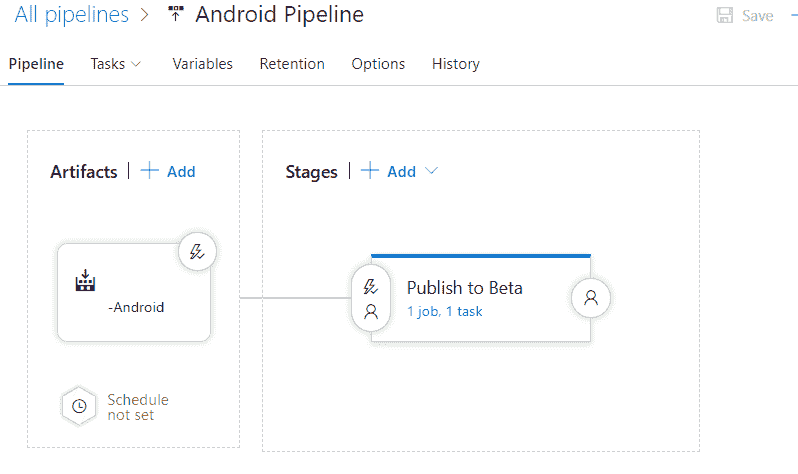

# 自动发布您的 Android/iOS 应用程序(Azure Pipelines)

> 原文：<https://dev.to/hazemtorab/automatic-publish-for-your-androidios-apps-azure-pipelines-5gek>

## 什么是 devops CI 工具

我用它来构建和发布我的 Android/iOS 项目真是太棒了。

Azure Pipelines 是基于[浪子](https://fastlane.tools/)的，但是它更加用户友好，并且给你 [10 个免费的并行工作](https://azure.microsoft.com/en-us/pricing/details/devops/azure-pipelines/)。

## 构建和发布 Android 应用程序时的提示

*   最好使用托管的 macOS
*   确保您输入了正确的 gradlew 文件路径
*   使用“Google Play - Release”任务将您的签名 APK 发布到 Alpha、Beta 或生产版

## 构建和发布 iOS 应用程序时的提示

*   确保输入正确的工作空间路径
*   创建包含软件包名称和预配配置文件名称的 exportoptions.plist 文件
*   最好使用 Xcode 9.4 来构建你的应用，在 azure pipeline 上构建之前，确保所有的包都与这个版本兼容
*   确保没有将 podfile.lock 推送到您的 git

试试看，如果有任何问题，请告诉我

哈齐·托拉布
[伊诺克姆](https://www.enozom.com)