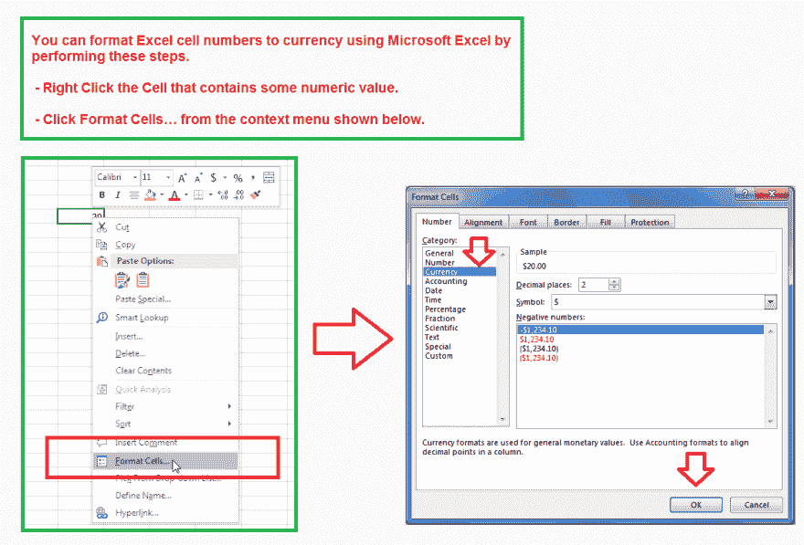
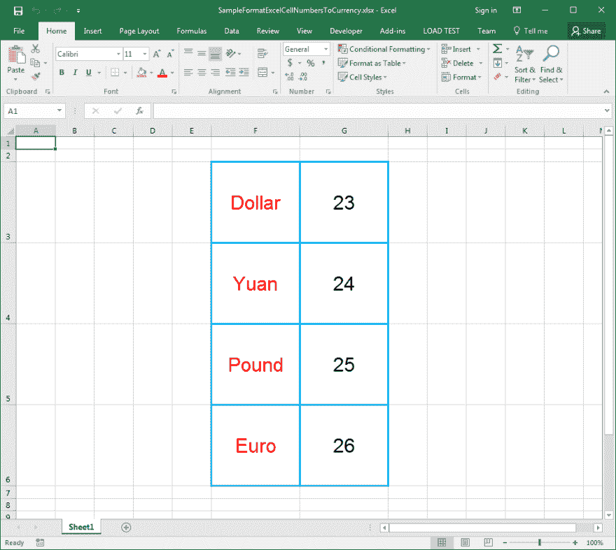

# 在 C#中将 Excel 单元格数字格式化为货币。网

> 原文：<https://dev.to/asposecells/format-excel-cell-numbers-to-currency-in-cnet-683>

Microsoft Excel 支持多种数字格式。其中一种数字格式是*货币*。如果单元格值包含数字，则可以通过指定货币符号和小数位数来应用货币格式。同样，您可以使用[将 Excel 单元格中的数字格式化为货币。的单元格。网](https://products.aspose.com/cells/net)得心应手。为了完成它的操作。Cells 不需要 Microsoft Excel 或任何种类的 Microsoft Office Automation、VBA(*Visual Basic for Applications*)、VSTO(*Visual Studio Tools for Office*)等。

**文章描述**

> 本文的目的是解释开发人员如何在 C#.NET 中将 Excel 单元格数字格式化为货币。NET 框架支持的语言，如 VB.NET 等。

**支持的平台**

> [Aspose。Cells](https://products.aspose.com/cells/) API 支持所有。NET 框架，例如。NET 2.0，。NET 3.5，。NET 4.0，。NET 7.0，。网芯，。NET Standard 2.0、Xamarin 等。它也可用于其他平台，如 Java、C++、Android、JavaScript、PHP 等。此外，[阿斯波斯。Cells 在云中作为 REST 或 RESTful APIs 提供。](https://products.aspose.cloud/cells)

**发牌**

> 阿斯波斯。Cells 是付费或商业 api，所以不是免费或开源的。没有许可证，它将在评估模式下工作，有一些限制。如果你想测试一只蜘蛛。Cells 没有评估版本限制，您还可以请求一个 *30 天的临时许可证*。更多信息，请通过[许可](https://docs.aspose.com/display/cellsnet/Licensing)。

# 使用 Microsoft Excel 将 Excel 单元格数字格式化为货币

通过执行以下步骤，可以使用 Microsoft Excel 将 Excel 单元格数字格式化为货币。

*   *右击*包含某数值的单元格。
*   点击上下文菜单中的*格式单元格…* ，如下图所示。
*   从*数字类别*中选择*货币*，按*确定*。

[](https://res.cloudinary.com/practicaldev/image/fetch/s--A0WaQXit--/c_limit%2Cf_auto%2Cfl_progressive%2Cq_auto%2Cw_880/https://raw.githubusercontent.com/AsposeCells/AsposeCells-Screenshots-and-Sample-Files/master/Format-Excel-Cell-Numbers-to-Currency/Format-Excel-Cell-Numbers-to-Currency-Microsoft-Excel.png)

# 货币单元格自定义数字格式字符串

您可以使用各种类型的货币自定义数字格式字符串来显示货币，如美元，人民币，英镑，欧元等。和许多其他人。

## 美元

```
"$"#,##0.00 
```

Enter fullscreen mode Exit fullscreen mode

## 雅恩

```
[$¥-804]#,##0.00 
```

Enter fullscreen mode Exit fullscreen mode

## 磅

```
[$£-809]#,##0.00 
```

Enter fullscreen mode Exit fullscreen mode

## 欧元

```
#,##0.00[$€-40B] 
```

Enter fullscreen mode Exit fullscreen mode

# 使用 Aspose 将 Excel 单元格数字格式化为货币。细胞

在接下来的几节中，我们将学习如何使用 Aspose。单元格 API 将 Excel 单元格数字格式化为货币。

# 样本输入微软 Excel 文档

为了演示，我们将使用下面的[样本输入 Microsoft Excel 文档](https://github.com/AsposeCells/AsposeCells-Screenshots-and-Sample-Files/blob/master/Format-Excel-Cell-Numbers-to-Currency/SampleFormatExcelCellNumbersToCurrency.xlsx)，其中包含单元格 G3、G4、G5 和 G6 中的一些数字。我们将在这些单元格上分别应用货币格式，即美元、人民币、英镑、欧元。

[](https://res.cloudinary.com/practicaldev/image/fetch/s--9bDnxV4G--/c_limit%2Cf_auto%2Cfl_progressive%2Cq_auto%2Cw_880/https://raw.githubusercontent.com/AsposeCells/AsposeCells-Screenshots-and-Sample-Files/master/Format-Excel-Cell-Numbers-to-Currency/Input-Excel-File-Format-Excel-Cell-Numbers-To-Currency.png)

# 样本代码

以下示例代码通过执行以下步骤，分别使用美元、人民币、英镑、欧元等货币格式对 Excel 单元格(即 G3、G4、G5 和 G6)进行格式化。

*   将[输入的 Excel 文件](https://github.com/AsposeCells/AsposeCells-Screenshots-and-Sample-Files/blob/master/Format-Excel-Cell-Numbers-to-Currency/SampleFormatExcelCellNumbersToCurrency.xlsx)加载到*文件中。Cells.Workbook* 对象并访问第一个工作表。
*   访问第一个单元格，即 G3，并使用*样式应用货币格式。自定义*属性。
*   对单元格 G4、G5 和 G6 重复第二步，使用更多的货币格式。
*   将*保存为建议。XLSX 格式的 Cells.Workbook* 对象。您也可以根据需要将其保存为 XLS 或其他 Excel 格式。