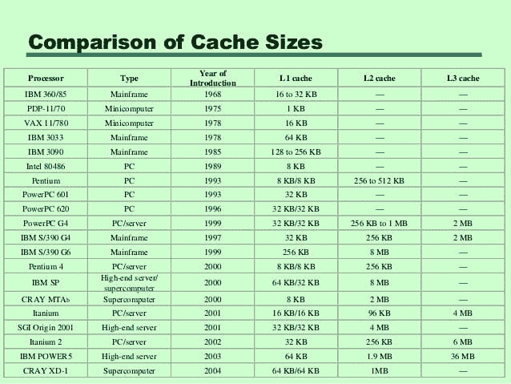

# 从 1990 年到 2020 年，潜伏期数字如何变化。

> 原文：<https://dev.to/sahilrajput/how-latency-numbers-changes-from-1990-to-2020-173n>

## 什么是潜伏期

在计算中，“延迟”描述了某种类型的延迟。它通常指传输或处理数据的延迟，这可能是由多种原因造成的。

`Note: 1 ns = 1 * 10^-9 sec`

**1990 年:**

*   L1 高速缓存参考:181 纳秒
*   L2 高速缓存参考:784 ns
*   分支预测失误:603 ns
*   主存储器参考:207 ns
*   使用 Zippy 压缩 1K 字节:362，000 ns
*   通过商用网络发送 2K 字节:1448 ns
*   从内存中顺序读取 1mb:3038000 ns
*   同一数据中心内的往返行程:500，000 纳秒
*   磁盘寻道:20，000，000 纳秒
*   从磁盘顺序读取 1mb:640，000，000 ns
*   从 SSD 中顺序读取 1mb:50，000，000 ns

**2000 年:**

*   L1 缓存参考:6 ns
*   L2 高速缓存参考:25 ns
*   分支预测失误:19 ns
*   互斥锁/解锁:94 ns
*   主存储器参考:100 ns
*   使用 Zippy 压缩 1K 字节:11，000 ns
*   通过商用网络发送 2K 字节:45，000 纳秒
*   从内存中顺序读取 1mb:301，000 ns
*   同一数据中心内的往返行程:500，000 纳秒
*   磁盘寻道:10，000，000 纳秒
*   从磁盘顺序读取 1mb:20，000，000 ns
*   从 SSD 中顺序读取 1mb:5，000，000 ns

**2010 年:**

*   L1 缓存参考:1 ns
*   L2 高速缓存参考:4 ns
*   分支预测失误:3 ns
*   互斥锁/解锁:17 ns
*   主存储器参考:100 ns
*   用 Zippy 压缩 1K 字节:2000 ns
*   通过商用网络发送 2K 字节:1000 ns
*   从内存中顺序读取 1mb:30，000 ns
*   同一数据中心内的往返行程:500，000 纳秒
*   磁盘寻道:5，000，000 纳秒
*   从磁盘顺序读取 1mb:3，000，000 ns
*   从 SSD 中顺序读取 1mb:494，000 ns

**2020 年:**

*   L1 缓存参考:1 ns
*   L2 高速缓存参考:4 ns
*   分支预测失误:3 ns
*   互斥锁/解锁:17 ns
*   主存储器参考:100 ns
*   用 Zippy 压缩 1K 字节:2000 ns
*   通过商品网络发送 2K 字节:44 ns
*   从内存中顺序读取 1mb:3000 ns
*   同一数据中心内的往返行程:500，000 纳秒
*   磁盘寻道:200 万纳秒
*   从磁盘顺序读取 1mb:825，000 ns
*   从 SSD 中顺序读取 1mb:49000 ns

## 缓存大小比较

*Image source: [Tweet by Tim Chase](https://twitter.com/gumnos/status/1066058931036987392)* 

*Reference: [berkeley.edu](https://people.eecs.berkeley.edu/~rcs/research/interactive_latency.html)*