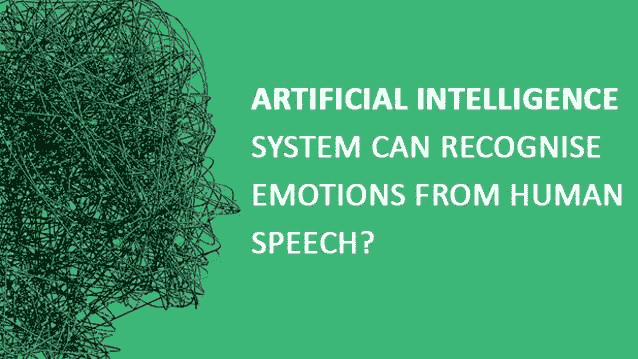

# 人工智能系统可以从人类语音中识别情感？

> 原文：<https://dev.to/wenso_smith/artificial-intelligence-system-can-recognise-emotions-from-human-speech-187f>

智慧是人类最大的天赋，这也是它与众不同的原因。在这种智能的帮助下，它发明了许多类型的简单和复杂的技术。

专家创新了 [**人工智能**](https://yourstory.com/mystory/how-can-humans-keep-the-upper-hand-on-artificial-i-q00cl8ewkk) 系统，能够识别一系列人类情绪；从快乐到厌恶。

很久以来，计算机用来把人类的语言转换成文本形式。然而，人类离不开情感，而这一因素在由言语转换而来的文本中是缺失的。神经网络是处理从一个来源到另一个来源的信息的主要链接，也能够学习、分析和综合。这种系统超越了传统的算法，在这种情况下，人和计算机之间的交流变得更加协作。

科学家发明了一种叫做人工智能的新技术，它可以通过人类的语言识别一系列情绪，从快乐到悲伤。最初，计算机成功地将人类语言转换成文本，排除了其中的情感成分。

但是现在，在神经网络的帮助下，人们可以从自己的经验中学习，并在此基础上，在时间数据点的帮助下，采取未来的行动。这些数据促进了系统中的人工智能，并创建了利用基于其过去经验和先前存储的数据的推断来破译更复杂输入的能力。

在俄罗斯，国家研究大学高等经济学院已经训练了一个神经网络来识别大约八种不同类型的情绪:中性、平静、快乐、悲伤、愤怒、害怕、厌恶和惊讶。显然，在几乎 70%的情况下，计算机识别了确切的情绪，正如研究人员所声称的那样。

这些研究人员将声音转换成图像频谱图，这使他们能够使用图像识别的方法来处理声音。

这整个研究是用深度学习方法完成的。这种方法建立了一个“神经网络”，有点类似于人脑的模型。大约成千上万的神经元被组织在不同的层中，每一层都转换输入，例如，它根据特定方向和位置的边缘集，自动识别更高抽象级别的面部图像。

这一代的人工智能在任务中具有很强的竞争力，这要归功于计算机学习的数据可用性的增加以及它们增强的处理能力。

人工智能甚至有能力识别其他东西，如人脸、草图到照片、语音和围棋。

调查小组也用它来辨认罪犯。研究人员最近开发了一种人工智能，它能够通过观察一个人的面部特征来判断他是否是罪犯。在中国身份证照片数据库的帮助下对该系统进行了评估，结果令人吃惊。然而，人们不能完全依赖人工智能，因为在大约 6%的案件中，它错误地将无辜者归类为罪犯，而它却能够成功地识别大约 83%的罪犯。这表明了惊人的 90%的整体准确率。

*最初发表于*[*【www.wenso.co.uk】*](http://www.wenso.co.uk/news/artificial-intelligence-recognise-emotions-from-human-speech/)*。*