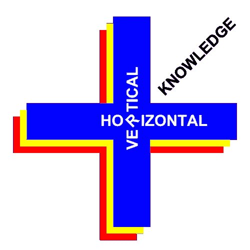

# 作为开发人员工作，像工程师一样思考:纵向+横向知识

> 原文：<https://dev.to/manuelbarzi/life-of-a-pro-developer-must-be-a-plus-vertical--horizontal-knowledge-403c>

我看到很多 dev 爱上了 React，Redux，Node，…等等。好吧，那很酷，但是那会让你走多远呢？这是纯技术。

软件工程、架构、原则、设计模式、最佳实践、测试等等呢？

这就是交叉知识或纵向和横向知识发挥作用的地方。

让我们保持知识是一个广泛的概念，涉及学习和经验。

关于垂直...例如，你可以或多或少地了解不同的技术，你可以是 React 和 Redux 的专家，你也可以是 HTML、CSS 和 Sass 的初学者。你在这些特定学科中的知识量的多少决定了你的垂直知识。

所以垂直意味着你在某一特定事物上的知识深度。你在这个领域的知识越多，你在这个特定领域的垂直优势就越大。

那么水平的呢？

学习和获取适用于不同领域、场景和技术的知识的过程就是我们所说的“横向知识”。

我这里指的并不是特定的技术或语言，比如 JavaScript，例如，既应用于客户端又应用于服务器端。这不是横向知识，而是纵向知识:它被应用于堆栈的不同区域的事实并不意味着您增加了横向知识。

水平知识意味着纯粹的软件工程，意味着设计和架构的深度。

当你把纵向和横向的知识结合起来，这就是“优势”。

因此，如果此刻你发现自己爱上了各种技术——React、Redux、TypeScript 等——也是时候开始采用软件工程原则了，例如设计模式、最佳实践等，并将这些横向元素添加到你的编码实践中。这样会把你的“猫眼”(|)(|)提升为“狮子眼”(+)(+)。

如果你这样做，你会看得更远，你也会获得直觉:你会发现“模式”，你会获得更多的思考方式，你可以在不止一个场景中应用。你将能够继续开发代码，但是要更加小心，以一种不同的，“更广泛的”方式。你的代码将遵循一个不同的思维模式，一个更高的投射。

对我来说，我认为这就是“只为你自己编码”和“为我、我的同事和我的公司编码”的区别。当你为一家公司工作时，你的代码是一个集体事物的一部分，公司，一个项目，这是不能掉以轻心的。这涉及到很多责任。

因此，当您同时进行水平和垂直编码时——不仅要考虑最新和最棒的技术，还要考虑基本的软件工程原则——不仅您会受益，而且您工作的公司也会受益:可维护性、可重用性、效率、可伸缩性——以及对开发采取“全局”方法的能力——都为您的代码增加了价值。

例如，当您处理 CSS 时，通过 Sass 和 BEM 应用合成，您可以在使用 React 进行合成时使用合成知识。或者，当您为使用 API 的 SPA 在客户机和服务器架构上设计业务逻辑时，您会注意到双方都需要类似的关注点分离、分层投影、测试...等等等等。

每个人都受益:你、你的伙伴和公司。

这就是了。不要满足于做一个简单的技术大师，推动自己走得更远，学习软件工程、设计和架构，并将纵向和横向知识添加到日常实践中。总而言之，这也是一个提高的问题，一个态度的问题。做一名开发人员，像工程师一样思考。做一个专业的开发者！

更新

*   20181124:拼写和表达更正
*   20181127:文字改进(谢谢罗伯特·安东尼！,)