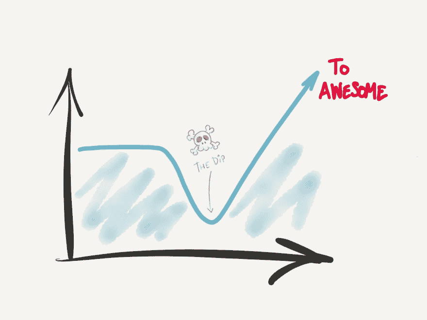
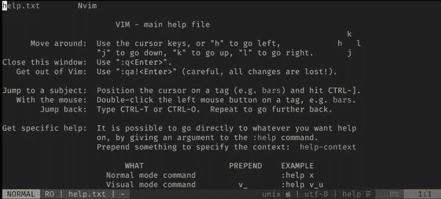

# 探索 Vim:经历低谷时你需要知道的 10 件事

> 原文：<https://dev.to/vintharas/exploring-vim-the-10-or-so-things-you-need-to-know-to-go-through-the-dip-2dj>

*本文最初发布于[barbarianmeetscoding.com](https://www.barbarianmeetscoding.com/blog/2018/11/22/exploring-vim-the-10-or-so-things-you-need-to-know-to-go-through-the-dip)。😊这些视频应该可以自动播放，但看起来我不能添加一个链接到我博客的视频标签，所以我把它们上传到 youtube，你需要手动播放它们😅。*

> ### 欢迎来到探索 Vim 系列！
> 
> 如果你还没看过的话。看看这个系列之前的[篇。祝你生活愉快！](https://www.barbarianmeetscoding.com/blog/categories/exploring-vim)

斗争是真实的。下降是真实的。每当我们采用新工具、新框架、学习新技能时，都会有一段时间我们的生产率会下降，我们会变得糟糕。没有人能在第一次做某件事时一直表现出色。问题是:你是否有耐心和勇气穿过低谷，到达等待你的技能、生产力和精通的彼岸？

[](https://res.cloudinary.com/practicaldev/image/fetch/s--bxH36xHu--/c_limit%2Cf_auto%2Cfl_progressive%2Cq_auto%2Cw_880/https://www.barbarianmeetscoding.cimg/getting-through-the-vim-dip.jpg)

熬过低谷可能会非常艰难...

你可能认识这种模式。你发现了一个新事物[^1].]你充满了兴奋和热情，你如饥似渴地开始尝试和了解它。过了一段时间，兴奋消退，热情消失，突然，你发现自己变得压抑，并找到借口不再做了。就在那里。

那么你会放弃还是继续努力？你是唯一能做这个决定的人。它配得上你吗？想象自己被新工具、新技能赋予了力量。现在，值得吗？

如果不是，那么在你浪费更多时间之前，最好现在就放弃。如果值得，那就卷起袖子，让我们踢一些屁股。

[](https://res.cloudinary.com/practicaldev/image/fetch/s--PtjNu1EE--/c_limit%2Cf_auto%2Cfl_progressive%2Cq_auto%2Cw_880/https://thepracticaldev.s3.amazonaws.com/i/f0p0lo4zl0tpab921s80.jpg)

极少数能够比大多数人推得更久一点的人获得了额外的好处。塞思·戈丁，蘸酱。

在这篇文章中，我收集了一套 vim 技巧来帮助你轻松度过低谷。先学习这些技巧，然后练习，达到中等水平的能力，你就能越过低谷，走上令人敬畏的文字编辑之路。

你不需要一下子全部学会。只要阅读这篇文章，熟悉可用的东西，并把它们融入到你的工作流程中，因为这对你有意义。如果你读过我以前的一些文章，你可能会发现一些重复。别担心。重复是好的。重复是你学习的方式。当命令成为你肌肉记忆的一部分时，vim 带来的最大效率提升就来了，为此你需要大量的练习和重复。在文章的最后，我还会分享一些关于如何在 vim 中更好地学习和提高的技巧。

哦，在我们继续之前还有最后一件事。对于那些对使用 vim 作为主要编辑器感兴趣的人，或者那些不太想跨越但仍然对在当前编辑器中使用 vim 感兴趣的人(如 [VSCode](https://github.com/VSCodeVim/Vim) )来说，本文都适用。如果你在后一个阵营，那么只需挑选完成你当前工作流程的特征(例如，正常模式操作符和运动是一个完美的开始)。

> ### 批注上的注释
> 
> 每当你看到类似 so `<C-R>`的组合键时，这意味着你必须同时按下 *CTRL* 和 *R* 键。也就是说<和>里面的什么都是指一个组合键。当这样表示时，你不应该键入<和>。

好吧！**我们开始吧！**先做最重要的事情...为了使用 vim，您需要打开它！

## 在 Vim 中打开、创建和保存文件

打开 vim 最常见的方式是通过终端，使用`vim`(如果使用 neovim，则使用`nvim`)。或者，您可以使用`gvim`或`mvim`作为 vim 的 GUI 副本。

所以:

```
$ vim 
```

Enter fullscreen mode Exit fullscreen mode

将在当前目录中打开 vim(您可以通过键入代表*打印工作目录*的`:pwd`命令来验证)。`:h pwd`了解更多信息)。

> ### 别名为赢
> 
> 发现自己在终端中一遍又一遍地输入相同的内容？然后考虑创建一个别名。
> 
> 例如，使用 *v* 而不是 *vim* 或 *nvim* 。在 zsh 中创建别名就像在您的`zshrc`中写入下面的位一样简单:
> 
> T2`alias v="nvim"`
> 
> 创造一次，享受一生。

稍微好一点的方法是指定当前目录如下:

```
$ vim . 
```

Enter fullscreen mode Exit fullscreen mode

这改进了前面的示例，现在您将能够看到一个文件资源管理器，您可以通过它来打开一个特定的文件。为了做到这一点，你使用与你在**正常模式**时相同的动作。例如，`jk`允许你上下移动光标，而`<ENTER>`将打开一个文件:

[https://www.youtube.com/embed/1ZDgIPRZQ-g](https://www.youtube.com/embed/1ZDgIPRZQ-g)

> ### 正常模式
> 
> 正如您在本系列的前几篇文章中了解到的，vim 是一个模态编辑器。这意味着 vim 有不同的模式，在这些模式中你可以做不同的事情，比如改变文本、插入文本、选择文本、操作文本行等等。通过使用不同的模式来执行不同的任务，vim 可以提供非常容易键入的键绑定，因为它们可以舒适地放在键盘的 home 行及其附近。
> 
> vim 中最常见的模式是正常模式。在这种模式下，您可以使用键盘快速浏览文件，以外科手术般的精度修改文本。如果你需要复习一下正常模式[，看看探索 Vim](https://www.barbarianmeetscoding.com/blog/2018/10/14/exploring-vim) 。

Vim 自带一个名为 [netrw](https://github.com/vim-scripts/netrw.vim) 的内置文件浏览器，但是你可能想检查一下 [NERDTree](https://github.com/scrooloose/nerdtree) 插件。NERDTree 为您提供了更好的用户体验，更类似于现代编辑器中的内容:

[https://www.youtube.com/embed/3aoufLSf7pI](https://www.youtube.com/embed/3aoufLSf7pI)

总之，比打开一个文件夹更好的方法是直接打开一个文件或一组文件:

```
# open a file
$ vim src/hello.js

# open multiple files in separate tabs
$ vim -p src/hello.js src/world.js
# open multiple files in separate windows split horizontally
$ vim -o src/hello.js src/world.js
# open multiple files in separate windows split vertically
$ vim -O src/hello.js src/world.js

# open multiple files using a glob pattern
# This particular glob means, open all js files in the src folder
# The -O opens them in separate windows split vertically
# you can also use -o and -p
$ vim -O src/*.js 
```

Enter fullscreen mode Exit fullscreen mode

[https://www.youtube.com/embed/syvIHpU6aiI](https://www.youtube.com/embed/syvIHpU6aiI)

令人惊讶的是，您还可以从 vim 中打开文件(Woaaaa！).你可以通过使用`:edit {pathToFile}`(简写`:e`)在当前窗口打开一个文件来实现这个壮举。与许多其他命令一样，该命令支持制表符结束。如果你写`:edit <TAB>`，你会得到一个选择列表，就像你在终端时一样。

您可以使用相同的命令创建新文件。键入`:e {pathOfTheNewFile}`，瞧，一个新的文件跃然纸上。但是要小心！新文件将只保留在内存中，直到你用`:write`(速记`:w`)保存它。

`:e`命令需要一个相对于您的工作目录的完整路径(还记得`:pwd`？).在你正在编辑的文件夹中创建新文件的一个有用的命令是使用`:e %:h\{newFileName}`。`%`代表当前文件，`:h`是一个修饰符，给你它的路径，然后我们只需添加我们感兴趣的新文件的名称。

完成编辑后，您可以:

*   保存一个文件，用`:exit`(速记`:x`)退出。
*   不保存退出`:quit!`(速记`:q!`)。

如果有多个文件，您可以:

*   使用`:xall`(简写`:xa`)保存所有文件并退出
*   或者，使用`:qall!`(简写`:qa!`)退出而不保存

有很多`:write`和`:quit`的组合，会在不同的条件下提示你是想保存还是退出。如果你很好奇，你可以看看这些命令的帮助，但是知道上面的命令在 99%的情况下就足够了。

所以现在你可以打开，更重要的是**退出** vim。再也不会被困在 vim 里了。永远不会。又来了。

> ### 被所有的命令淹没？
> 
> 我知道！有成千上万的命令。但是请原谅我。许多命令很容易通过猜测来学习。想想你想做什么或者你想执行什么动作。很有可能你正在思考的单词就是你正在寻找的命令的名字:*编辑*一个文件，*关闭*或*退出*当前窗口，等等。
> 
> 如有疑问，请使用 vim 的帮助。

所以！我们在一个代码文件里。接下来我们能做什么？

## 以 Vim 动作在文件内快速移动

> ### 你是触摸打字员吗？
> 
> 你会打字吗？在学习和使用 vim 时，触摸输入非常有用。为了最有效地使用 vim，你的手必须放在最后一排，你的手指应该像打字员一样上下伸展。在[探索 Vim](https://www.barbarianmeetscoding.com/blog/2018/10/14/exploring-vim) 中，我分享了一些资源，可以帮助你成为更好的打字员。没看过的就去看看吧！

是游戏的名字。这四把钥匙是你的新宗教。不要。他们不是。它们非常适合短距离运动，但是在 vim 有更好的运动方式。

要**水平移动**(即左右或左右)，您可以通过键入`w`从一个 word[^2 跳到下一个(如在 **w** ord 中)或使用`b`后退(如在 **b** ack 中)。或者，你可以使用`e`跳到下一个单词的末尾(如 **e** nd)或使用`ge`后退。

[https://www.youtube.com/embed/twJdaBl4C2U](https://www.youtube.com/embed/twJdaBl4C2U)

> ### 关于音符、旋律和和弦
> 
> Vim 很特别。如果你使用过其他编辑器，你可能习惯于键入和弦。即同时键入组合键。例如，CTRL-C 用于复制，CTRL-V 用于粘贴。Vim 也使用和弦，但更依赖于琴键的旋律。
> 
> 如果你把琴键看作音符，那么旋律就是一系列一个接一个的音符。在正常模式下，这是使用 vim 最常见的方式。所以，当你读到你需要键入`f{char}`来找到一行中的一个字符时，这意味着首先你键入`f`，然后你键入字符`{char}`。这虽然不熟悉而且有点奇怪，但是非常方便，因为控制编辑器突然感觉就像输入文本一样。这对你的手腕健康也有好处。

为了使**水平移动得更快**，你可以使用`f`和`t`(它们有`F`和`T`变体来后退)。`f`让您 **f** 在您所在的行中找到下一个出现的字符。`f{char}`(如`f"` f.i .)将您带到该字符的下一个出现处(在我们的示例中为`"`)。

然后，您可以键入`;`转到下一个事件，或者键入`,`转到上一个事件。你可以看到`;`和`,`在重复搜索。

`t`动作很像`f`。唯一的区别是`f`将光标放在你想要查找的字符的上面，而`t`(想想联合国* *t* *ill)将它放在前面。在将这些动作与操作符(如稍后您将看到的 delete 和 change)结合起来时，了解它们之间的区别会很有帮助。

[https://www.youtube.com/embed/Gu71ueNgC1I](https://www.youtube.com/embed/Gu71ueNgC1I)

向**极水平方向移动**，即移动到一行的开头或结尾，您可以使用:

*   `0`移动到一行的第一个字符
*   `^`移动到一行的第一个非空白字符(这样就排除了一行代码的缩进)
*   `$`移动到一行的末尾
*   `g_`移动到行尾的非空白字符

由于这些键有点难以键入，我更喜欢使用这些映射，认为`H`和`L`是`h`和`l` :
的**更强**版本

```
nnoremap H ^
nnoremap L g_ 
```

Enter fullscreen mode Exit fullscreen mode

因此，`h`将您向左移动一个字符，`H`将您带到一行的开头。其中`l`将您向右移动一个字符`L`将您带到一行的末尾。

> ### 为什么要早早地绘制地图？
> 
> 为什么不使用缺省值，而在早期使用定制映射呢？**肌肉记忆**！熟能生巧，熟能生巧。您不希望花费时间使用低效的映射，因为您会习惯于它们，然后您需要在改进之前忘记这种行为。
> 
> 从一开始就使用和学习更好的映射要好得多。

由于`H`和`L`法线映射不是非常有用，我们不需要重新映射它们(`H`带你到窗口的顶部，而`L`带你到窗口的底部)。如果你还想，试试这些:

```
nnoremap <Leader>H H
nnoremap <Leader>L L 
```

Enter fullscreen mode Exit fullscreen mode

要使**垂直移动**，您可以使用`{`和`}`向前和向后跳转段落。在我看来，这两个有几个缺点:

1.  `{`和`}`很难输入(它们需要你弯曲两个小手指)
2.  向下移动一个段落可能会让你走得太远。例如，如果你有一个很长的没有空格的方法，你可能会被带到这个方法的末尾，或者更糟糕的是，在很多其他方法之后被带到类的末尾。这可能不是你想要的。

你想要的是有一个可靠的方法来上下浏览代码。一个很好的方法是在您的`vimrc`文件中创建以下映射:

```
nmap J 5j
nmap K 5k
vmap J 5j
vmap K 5k 
```

Enter fullscreen mode Exit fullscreen mode

现在，每当你键入`J`时，你向下移动 5 行，同样，每当你键入`K`时，你向上移动 5 行。对于浏览代码来说，这些是非常好的映射。

但是哎呀！重新映射某些东西是要付出代价的。`J`和`K`字母确实有些人(比如我)会称之为有用的东西:

*   `J`let ' s you join a line with next line(我发现自己在 vim 中写文章时一直在使用这一行)。
*   `K`允许您快速导航到光标下单词的帮助(默认情况下，它与 vim 的帮助一起工作，但是您可以配置它与其他文档一起工作)。

将这些绑定放在指尖附近的一个好方法是利用如下的`<Leader>`键:

```
nnoremap <Leader>J J
nnoremap <Leader>K K
vnoremap <Leader>J J
vnoremap <Leader>K K 
```

Enter fullscreen mode Exit fullscreen mode

> ### vimrc？领导？Map 和 Noremap？
> 
> 这些术语让你感到困惑吗？放心吧！本系列的前一篇文章解释了所有这些问题！

为了让**更快地垂直移动**当你实际上已经有了目标时，你的最佳选择是用`/{pattern}`和`?{pattern}`命令**搜索**(分别向前和向后搜索)。

尝试使用`/{pattern}`在文件中查找内容(f.i. `/cucumber`)。您会看到，在您输入时，与您所写内容匹配的模式会在 vim 中高亮显示。当你找到你想要的东西时，你可以输入`<Enter>`，你的光标就会跳到搜索中的第一个匹配项。如果你愿意，你可以在那里进行一些编辑，然后使用`n`跳到下一场比赛(或者使用`N`跳到上一场比赛)。你可以把`n`想象成重复搜索。而且，与许多其他命令一样，您可以将`n`和`N`与计数结合使用(f.i. `2n`会将您发送到下一个第二场比赛)。

[https://www.youtube.com/embed/sAgBFHys24U](https://www.youtube.com/embed/sAgBFHys24U)

Vim 喜欢为您节省时间，所以如果您碰巧将光标放在一个单词上，并且想要查看该单词在文档中的其他实例，您可以键入`*`。星号将触发对相当于`/{wordUnderTheCursor}`的那个单词的搜索，并把你带到那个单词的下一个出现处。

> ### 搜索时看不到任何亮点？
> 
> 根据 vim 的配置，您可能看不到您输入时高亮显示的模式。如果是这种情况，尝试将以下内容添加到您的 vimrc 中:
> 
> ```
> " highlight matches as you type
> set incsearch
> " highlight matches once a search is complete
> set hlsearch 
> ```

在我们继续之前，这里有一个很好的提示:当你进行搜索时，你要寻找的模式将会一直被高亮显示**，直到你说不要为止。这样做的原因是，当你用`n`和`N`重复搜索时，这很有帮助。但最终你会希望这些亮点消失，这样你就可以平静地继续做其他事情。**

 **有一个命令叫做`:nohlsearch`或者简称为`:noh`，可以帮助你清除之前搜索的所有高亮文本(更多信息见`:h :noh`)。这是如此常见的事情，你一定会希望有一个更快的映射。这是我用的:

```
nnoremap <Leader><Space> :noh<CR> 
```

Enter fullscreen mode Exit fullscreen mode

最后要知道的伟大动作利用了 Vim 的**跳转列表**和**变更列表**，让你回到你刚才所在的地方，或者你刚才改变了什么东西的地方。

**跳转列表**是 vim 记录你在 vim 中的位置的地方，是所有动作的集合。您可以使用以下方式在跳转列表中前后移动:

*   `<C-O>`返回跳转列表
*   `<TAB>`或`<C-I>`在跳转列表中向前移动

以类似的方式， **changelist** 记录了您在 vim 中所做的所有更改。您可以使用以下选项在列表中来回移动:

*   `g;`返回变更列表
*   `g,`前进到变更列表

如果您想找到更多关于这两个列表的信息，请使用帮助:`:h jumplist`和`:h changelist`。

还有几个您可能偶尔会用到的命令。它们不会改变生活，但值得一提的是:

*   `%`帮助您在匹配的括号之间移动。如果您想移动到方法或类的末尾，这可能会很有帮助。
*   `gg`将您发送到文件的开头，而`G`将您发送到文件的结尾。如果您想对整个文件执行操作，这可能会很有帮助:`gg{action}G`。gg 也处理计数，如果你输入`{count}gg`，它会把你转到一个文件中的特定代码行。

好吧！所以现在你有了一个快速移动文件的良好基础。这本身很酷，但是如果你能把它和实际的文本编辑结合起来不是更好吗？接下来让我们来看看！

## 文字编辑喜欢没有明天

让我们从一个非常简单的命令开始:**删除**或`d`。Delete 让你删除字符、单词、句子和其他东西。但是仅仅单独使用**删除**命令是没有意义的，你需要把它和指定你想要删除的东西结合起来。好吧，你刚刚学了一堆动作命令，如果你仔细想想，它们代表了光标的位置。是啊！运动对于定义我们想要删除的内容来说是完美的！

将删除命令与`l`结合，你删除了一个 **l** 更好。但事实并非如此(尽管这是一种很棒的记忆方法)。`dl`或`d{motion}`实际上是指**删除`{motion}`移动到**上的文本。

**我想说的是什么？为了实现这一点，我们还可以用`dh`删除前面的字母，或者用`dj`和`dk`上下删除。Vim 不会给你一堆你需要记忆的任意命令，它给你乐高积木，你可以把它们组合在一起达到预期的效果。当你把一块肉和盐混合在一起会发生什么？你会得到咸肉。当你把`d`(删除)和`w`(移到下一个单词)组合在一起会发生什么？你删掉所有东西直到下一个单词。所以:**

*   `dJ`因为重新映射之前删除了 5 行
*   `df'`删除当前行中的所有内容，直到第一次出现`'`字符(包括该字符)
*   会像上面那样做，但不包括字符(直到刚才)
*   `d/hello`删除所有内容，直到第一次出现`hello`
*   `ggdG`删除整个文档

是不是超级酷？！这种惊人的命令可组合性是 vim 中最棒的特性之一。

除了将操作符与运动相结合，操作符还有另外两种变体:

1.  **逐行操作符**在整个行上应用一个操作符。你得到它如果你*【双】*原符。例如，在`d`的情况下，行方式变量是`dd`，其**删除当前行**。
2.  大写操作符是原始操作符的一个*更强的*版本，并将其从光标处应用到行尾(我全部使用这个。的。时间)。在`d`的情况下，大写的变量是`D`，被**从光标处删除到行尾**。

当组合操作符和动作时，还有一些更有趣的事情需要发现:**计数**和**文本对象**。

你之前已经看到了我们如何使用**计数**动作，这样我们就可以，例如，用`5j`减少 5 行。同样，我们可以使用带操作符的计数，删除 5 个单词`5dw`或 5 行`5dd`。

最后我们有了文本对象。我跟你说实话，这个名字听起来很吓人，很复杂(至少对我来说是这样)。文本对象意味着结构化的文本片段，或者，如果你愿意，文档域模型的实体。文档由什么组成？单词、句子、引用文本、段落、块、(HTML)标签等。这些是文本对象。

在命令中指定文本对象的方法是将字母`a`(代表文本对象加空格)或`i`(没有空格的内部对象)与代表文本对象本身的字符结合起来:`w`代表单词，`s`代表句子，`'` `"`代表引号，`p`代表段落，`b`代表被`(`包围的块，`B`代表被`{`包围的块，`t`代表标签。因此，要删除不同的文本，您可以:

*   `daw`到**d**delete**a**T5】word(加上尾随空格)
*   `diw`到 **d** 删除 **i** nner **w** ord
*   `das`to**d**delete**a**T6】sentence(`dis`删除内部句子)
*   `da"`删除双引号中的内容，包括引号
*   `di"`删除双引号内的内容
*   `dap`删除一个段落
*   `dab` `da(`或`da)`删除一个被`(`包围的块
*   `daB` `da{`或`da}`删除一个被`{`包围的块
*   `dat`删除一个 HTML 标签
*   `dit`删除一个 HTML 标签的内容

将文本对象和操作符结合起来是非常强大的，你会经常用到它们。像`cit`、`ci"`和`cib`这样的东西真是太棒了。

**与常规动作相比，使用文本对象有什么优势？**如果这是你第一次听说文本对象，你可能会与`dw`和`daw`混淆。有什么区别？`dw`不也删个字吗？你的困惑是完全合理的，因为为了简单起见，我之前掩盖了一个小细节。事情是这样的:

*   `dw`删除从光标当前位置到下一个单词开头的内容。
*   `daw`删除光标位于**顶部的单词+尾随空格，而不管光标在哪里的**。

**那么`dw`和`daw`什么时候等价呢？**当光标放在一个单词的开头时，`dw`和`daw`的结果一致。(不过要小心，我们稍后会看到 repeat 操作符如何让`daw`比`dw`有用得多)。

最后，vim 还为您准备了另一个技巧，它忍受了所有这些文本，旨在为您节省更多的击键次数:神奇的`.`命令。`.`命令允许您重复上次所做的更改。想象一下，你运行`dd`删除一行。你可以再次输入`dd`来删除另一行，但是你也可以使用`.`，这只是一个简单的击键。好吧，你保存了一个按键，那又怎么样？嗯，你可以使用`.`命令来重复**任何类型的改变**，而不仅仅是单个命令。例如，你可以把单词“Awesome”改成这样的`cawAwesome<CR>`，然后使用`.`重复所有这些击键的命令。想想可能性吧！

`.`命令与重复搜索命令(`;`、`,`、`n`或`N`)结合使用效果很好。假设您想要删除所有出现的`cucumber`。alternative[^3]就是搜索黄瓜`/cucumber`，然后用`daw`删除它。从那以后你可以用`n`去下一场比赛，用`.`删除！两次击键！？！再次考虑各种可能性！！

正如我们前面提到的，点命令`.`使文本对象比运动好得多，因为操作符与文本对象的组合比与运动的组合更具可重复性。也就是说，当在其他文本上重复时，文本对象更有可能导致所需的行为(因为您不需要太在意光标的位置)。

现在！让我们看一个稍微复杂一点并且**更好一点的**命令:`c`代表**改变**。为什么`c`比`d`好？因为`c`可以让你同时做两件事。它可以让你改变一些文本，这相当于删除一些东西(`d`)和插入一些东西(`i`)。用更少的命令做更多的事？我觉得不错。`c`的机制如下。你输入:

```
{count}c{motion or text-object} 
```

Enter fullscreen mode Exit fullscreen mode

你可以删除由 count 和 motion/text-objects 指定的文本，就像`d`命令一样。但除此之外，你可以自动切换到插入模式，在那里你可以输入东西。例如，假设我们想改变下面这个字符串的内容:

```
const salute = 'I salute you oh Mighty Warrior' 
```

Enter fullscreen mode Exit fullscreen mode

我们可以使用(1) `d` + `i` :

```
f'di'iHi<ESC> 
```

Enter fullscreen mode Exit fullscreen mode

或者(2) `c` :

```
f'ci'Hi<ESC> 
```

Enter fullscreen mode Exit fullscreen mode

两者都产生一个新的字符串:

```
const salute = 'Hi!' 
```

Enter fullscreen mode Exit fullscreen mode

[https://www.youtube.com/embed/gKuanqg49vU](https://www.youtube.com/embed/gKuanqg49vU)

我们救了一个角色，但还有更重要的事情在进行。通过使用`c`而不是`d` + `i`，我们使得改变更具可重复性。在第一个例子(1)中使用`.`命令会插入`Hi`，而在(2)中，`.`命令封装了对`Hi`的任何字符串的修改。现在看来，保存击键和进行可重复的修改似乎很奇怪，但是随着你越来越熟练地使用 vim，这将是自然而然的事情。过一会儿，这些事情会从你的意识转移到肌肉记忆和潜意识中，你会把它们当成第二天性。

除此之外，`c`处理所有的动作和文本对象，我们到目前为止已经看到了:`caw` **c** 改变一个 **w** ord，`cas` **c** 改变一个 **s** entence，`c/wop` **c** 改变一切，直到匹配`/wop`，`cc`改变一个完整的行，`C`改变从光标到行尾的一切。

作为本节最后的命令，我们将看看`y`和`p`。`y`是 **y** ank 命令，或者用 vim 行话抄。`p`是 **p** ut 命令，或者用 vim 行话来说就是 paste。

你可以将`y`与我们到目前为止看到的任何动作和文本对象结合起来，随心所欲地猛拉(复制)东西:`yaw` **y** anks a **w** ord，`yas`T7】yanks a**s**entence 等等。

另一方面，`p`命令允许你在光标之后粘贴内容(在光标之前粘贴`P`)。关于`p`和`P`的一件很酷的事情是它们也可以使用计数。也就是说，结合使用`y`和`{count}p`可以让你很容易地复制很多次。

如果`y`复制东西...你怎么在 vim 里切东西？啊哈！惊喜来了。你还记得 30 秒前的`d`和`c`吗？好吧，当我说他们删除了被遗忘的文本时，我撒谎了！他们实际上把**文本切**进了寄存器。如果这是您想要的，您可以稍后粘贴的文本(**mindfuld**)。

使用 vim 中提供的 10 种不同类型的寄存器可以做很多有趣的事情，但那是另一篇文章的内容。对于初学者来说，知道`d`、`c`、`y`和`p`就足够了。

一件非常方便的事情是让你的系统复制和粘贴使用与`d`、`c`、`y`和`p`相同的寄存器(称为未命名寄存器)。这使得从 vim 向其他应用程序复制内容变得非常容易，反之亦然。如果你正在使用 neovim，你可以在你的 vimrc:
中启用这个行为

```
set clipboard+=unnamedplus " use system clipboard 
```

Enter fullscreen mode Exit fullscreen mode

同样，在传统的 vim 中:

```
set clipboard=unnamed " use system clipboard 
```

Enter fullscreen mode Exit fullscreen mode

> ### 复制粘贴字符 vs 线条
> 
> 你可能需要注意的一件事是，根据你复制的内容，粘贴的工作方式会略有不同。如果你复制了一些字符，那么粘贴是按字符顺序进行的，也就是说，当你粘贴它们的时候，它们会被放置在同一行的光标之后。但是，如果您复制完整的行，那么粘贴是逐行进行的。在这种情况下，复制的行将被粘贴到光标下方的行中。
> 
> 如果你复制了一行，并想把它附加在同一行的光标之后，你可以进入插入模式，用`CTRL-R "`从插入模式粘贴。

还有[更多可用的二次运算符](https://neovim.io/doc/user/motion.html#operator)，如`=`(格式代码)`<` `>`(减少和增加缩进)`~`(切换大写)`x`(删除一个字符)`s`(改变一个字符)，但你不需要马上学会它们。根据我们在这一章到目前为止所看到的，你可以开始你的编辑冒险，像时代英雄一样踢屁股。

> ### 扩展 Vim 的惊人方法...
> 
> vim 令人惊叹的一点是其无限的可扩展性。一种非常有趣的扩展 vim 的方法是创建自己的操作符和文本对象。例如，您可以[创建一个新的操作符，用引号、括号甚至 HTML 标签之类的字符将东西](https://github.com/tpope/vim-surround)括起来。或者你可以创建新的文本对象，比如一个完整的文档，或者一个降价标题，或者一个 JavaScript 函数，等等...
> 
> 为什么这很酷？
> 
> 因为您可以将这些新的操作符和文本对象与所有现有的操作符和文本对象结合起来，甚至与那些尚未发明的操作符和文本对象结合起来。定义了一个新的操作符 surround 之后，您就可以用它来包围一个单词、一个句子、一个块和 HTML 标签等等。定义了降价标题文本对象后，您可以对其进行更改、删除等等。厉害！！

## 插入代码又称编写代码

迟早你将不得不写一些代码。在 vim 中，您以**插入模式**编写代码。当使用`c`命令时，你已经看到了一点插入模式，但是让我们再看一下。有两个核心命令可以让你进入插入模式:`i`表示 **i** nsert，`a`表示 **a** ppend。

`i`插入命令将你置于光标之前的插入模式**。而`a` append 命令使你在**光标后进入插入模式**(就好像在光标所在的任何地方追加内容)。从那时起，您就处于插入模式，vim 的行为与其他编辑器非常相似。**

像许多其他 vim 命令一样,`i`和`a`有大写的对应物，执行**更强的**版本的插入和追加。`I`让你在当前行的开头进入插入模式，而`A`让你在末尾进入插入模式。

除了`i`和`a`之外，还有另外三个**非常有用的**命令，我喜欢用它们来进入插入模式:

1.  在当前行下方插入新的一行，并进入插入模式(助记符 **o** 在下方插入一行)
2.  在当前行的上方插入新的一行，并使你进入插入模式
3.  `gi`从上次离开插入模式的位置进入插入模式。如果您不小心退出了插入模式，并想回到原来的位置继续输入，这非常有用。

好的，让我们假设现在你处于插入模式，正在打字，你犯了一个错误，比如一个错别字。你会回到正常模式，修正打字错误，然后回到插入模式吗？不要！有几个绑定可以帮助您直接在插入模式中修复错误:

*   `C-h`让您删除最后输入的字符
*   `C-w`让您删除最后键入的单词
*   `C-u`让您删除您输入的最后一行

现在你继续打字，你想粘贴一些你以前复制的东西。你已经学会了用`p`命令粘贴，但这只在正常模式下有效。怎么办？嗯，在某些情况下(f.i. gvim 和 mvim)，你也许可以使用你的系统复制/粘贴键绑定，但是你总是可以依靠`<C-R>"`从未命名的寄存器粘贴(当你用`y`、`d`或`c`复制时，你使用的就是这个寄存器)。R 代表 **R** 寄存器，`"`代表未命名寄存器。我不会在本文中详述寄存器，但是如果你感兴趣的话，请看一下`:h registers`。

> ### 自动补全？
> 
> 您知道 vim 支持自动完成吗？我不会在本文中涉及它，但是如果你感兴趣的话，看看用户手册`:h 24.3`。

不过，最终你会想退出插入模式，做其他事情。有三种方法:`<ESC>`、`C-[`和`C-C`。在所有这些中，更容易输入的是`C-C`，但是对于一些你经常在离开插入模式时做的事情，最好创建一个漂亮的映射:

```
" Thank to Steve Losh from Learn Vimscript the Hardway for this one!
" I was using jj before, but this one is so much nicer...

" map jk to <ESC>
inoremap jk <ESC>
" burn the ships so you can't go back
inoremap <ESC> <nop> 
```

Enter fullscreen mode Exit fullscreen mode

现在，无论何时你处于插入模式，你只要输入`jk`，瞧。回到正常状态。`jk`是如此的自然和快捷，以至于你一开始都不会明白你是如何使用`<ESC>`的。

## 撤销和重做

你迟早也会犯错误。在 vim 中输入内容的命令再直观不过了。不，不是`C-Z`或`Command-Z`。这是`u`的 **u** ndo。如果你需要重做，你可以使用`C-R` ( `R`表示重做)，尽管如果你只需要重做一次，你可以使用`.`命令重复最后一次更改(你刚刚撤销的)。同样，像往常一样,`U`是`u`的**更强的**版本，并且撤销对最后一行所做的所有更改。

Vim 非常特别，它提供了多级撤销，也就是说，每次你撤销一些东西并开始做一些不同的事情时，你就创建了一个新的撤销分支。Vim 保留了所有这些分支供您修改，因此不会丢失任何更改。你可以在`:h undo-branches`中找到关于这个主题的更多信息。有一点很重要:如果你使用`:earlier 1f`，你可以撤销上次保存文件后所做的所有修改。`:later 1f`不为自己能做的事而担心，要在时间中前进。(您也可以重复这些命令中的任何一个来在时间上后退和前进。酷还是什么？).

## 缩写。他们听起来很无聊，但他们很棒

缩写是 vim 的片段。它们可能是你在其他编辑器和 ide 中找到的代码片段的简单版本(有 vim 插件)，但是它们仍然非常方便。关于缩写的一件很酷的事情是，在键入它们并按下`<space>`后，它们会自动扩展，这与键入文本的自然流程完美契合。尽管如果你需要的话，可以通过输入`C-]`显式扩展它们。

使用`:iabbrev`(简写`:iab`)命令定义缩写。`iab`中的`i`代表*插入模式*，因为这些是仅适用于插入模式的缩写。例如:

```
:iab konw know 
```

Enter fullscreen mode Exit fullscreen mode

现在，每当我像往常一样拼错单词“know”时，vim 就会来帮我纠正。我甚至不需要自己做任何事情。我只需输入`konw`，vim 就会修复它。

[https://www.youtube.com/embed/SGtWOuy_deQ](https://www.youtube.com/embed/SGtWOuy_deQ)

但是缩写不仅仅是为了拼写错误。你可以用它们作为缩写:

```
:iab bmc http://www.barbarianmeetscoding.com/ 
```

Enter fullscreen mode Exit fullscreen mode

或者片段:

```
" The Left command puts the cursor
" inside the function argument section
:iab f function(){}<Left><Left><Left> 
```

Enter fullscreen mode Exit fullscreen mode

代码片段与自动命令或文件类型插件配合得很好，所以它们只在有意义的文件类型中加载。也就是说，您希望您的 JavaScript 代码片段仅在 JavaScript 中可用。然而现在我们不会深入这些水域。我们将为以后的文章保留自动命令和文件类型插件。(但是如果你等不及，就去[看看这个](http://learnvimscriptthehardway.stevelosh.com/chapters/12.html)和[这个](http://learnvimscriptthehardway.stevelosh.com/chapters/13.html)和[这个](http://learnvimscriptthehardway.stevelosh.com/chapters/42.html#vimftplugin))

到目前为止，我们只是使用 Ex 命令来定义缩写。因为你很可能想要重复使用你的缩写。你会想把它们添加到你的 vimrc 文件中(你甚至会想把它们放在一个来源于你的 vimrc 的[单独文件中):](https://www.barbarianmeetscoding.com/blog/2018/10/24/exploring-vim-setting-up-your-vim-to-be-more-awesome-at-vim) 

```
iab konw know
iab bmc http://www.barbarianmeetscoding.com/
iab f function(){}<Left><Left><Left> 
```

Enter fullscreen mode Exit fullscreen mode

## 窗口和标签向导

vim 中的一个令人惊奇的特性是它为生成窗口和选项卡提供了一个奇妙的工具。让我们先看看 windows，因为它们绝对是我的最爱。

前面我们看到了如何使用`:edit`命令在当前窗口中打开一个文件。有一个替代命令可以打开一个水平分割的文件`:split`(简写`:sp`)，还有一个命令可以做同样的事情，但是是垂直分割的`:vsplit`(简写`:vs`)。这一点在图表中更容易理解:

[](https://res.cloudinary.com/practicaldev/image/fetch/s--KLV4nsS2--/c_limit%2Cf_auto%2Cfl_progressive%2Cq_auto%2Cw_880/https://www.barbarianmeetscoding.cimg/vim-window-splitting.jpg)

并配有视频:

[https://www.youtube.com/embed/g2s5ExXiGH8](https://www.youtube.com/embed/g2s5ExXiGH8)

你可以随心所欲地分割你的工作空间。当您想要从一个分割移动到下一个分割时，可以使用以下绑定:

*   `<C-W>h`带你去左边的分割线(也叫`<C-W><C-H>`)
*   `<C-W>j`带你到下面的分割线(也叫`<C-W><C-J>`
*   `<C-W>k`带你到上面的裂口(也叫`<C-W><C-K>`)
*   `<C-W>l`带你到右边的分割线(也叫`<C-W><C-L>`)
*   `<C-W>W`允许您切换窗口(也称为`<C-W><C-W>`

这些都很棒，但还可以做得更好。让我们重新映射它们:

```
nnoremap <c-h> <c-w>h
nnoremap <c-j> <c-w>j
nnoremap <c-k> <c-w>k
nnoremap <c-l> <c-w>l
nnoremap <c-\> <c-w>w 
```

Enter fullscreen mode Exit fullscreen mode

另一个有用的窗口相关绑定是:

*   `<C-W>o`或`<C-W><C-O>`关闭所有其他窗口，使当前窗口成为屏幕上唯一的窗口。注意所有这些绑定在第二个字母按住或不按住 control 键的情况下是如何工作的？这很好，因为这意味着你可以在从`W`到`O`的过程中一直按住控制键。小心这种模式，它很常见，旨在给你更多的速度。

你也可以用`<C-W>s` (split)和`<C-W>v` (vertical split)命令创建分割，但是你应该避免它们。打开一个文件需要 2 个步骤:(1)创建分割，(2)打开文件。使用`:sp {file}`和`:vsp {file}`要有效得多，因为它们只需一步就能完成。

窗口术士不仅可以创建窗口，还可以随意移动和调整它们的大小。你不需要任何这些来度过这个低谷，但它看起来确实令人印象深刻。让我们简单看看如何调整窗口的大小:

*   使用`<C-W> >`和`<C-W> <`来调整垂直分割线的大小(作为一种记忆方法，想象垂直分割线增加和减少它的宽度)
*   使用`<C-W> |`让垂直分割取其最大宽度
*   使用`<C-W> +`和`<C-W> -`调整水平分割的大小
*   使用`<C-w> _`让水平分割达到其最大高度
*   使用`<C-W> =`使所有分割尺寸相等

这两种方法都适用于计数，因此您可以键入`5 <C-W> >`或`<C-W> 5 >`来进行更大的垂直分割。感觉这些映射很难记住？然后尝试使用`:resize`和`:vertical resize`命令。

如果您有兴趣了解更多关于调整大小或移动的信息，请查看`:h window-resize`和`h: window-moving`。我通常不调整大小或移动我的窗口，但如果你这样做，那么我估计你可能想做一些重新映射，使这些更容易达到。

我们见过窗户。标签呢？我不经常使用制表符，我发现拆分对我很有用，但如果你是一个制表符爱好者，你会很高兴听到 vim 也有很好的制表符支持。

你可以使用`:tabedit`命令创建一个新的标签(简写为`:tabe`)，键入它自己，你将创建一个空标签，使用`:tabedit {file}`，你将在一个新标签中打开一个文件。如果你想把一个现有的窗口移到它自己的标签页，你可以做`<C-W>T`。

打开一堆选项卡后，您可以使用以下命令在选项卡之间移动:

*   `gt`移动到下一个标签页
*   `gT`移至上一个标签页
*   `{count}gt`移动到标签号`count`

您也可以使用`:tabonly`命令关闭除活动选项卡之外的所有选项卡。

因为键入一个完整的命令来打开一个标签页可能是一件相当了不起的事情。如果您喜欢频繁使用制表符，您可能希望创建一些方便的映射。例如:

```
" Create new tab with no name
map <Leader>tt :tabedit<CR>
" Create new tab with a file for editing
" Since there's no <CR> it allows you to specify a filename.
" The name of a new file to create or an existing one.
map <Leader>te :tabedit
" Close all tabs but the active one
map <Leader>to :tabonly<CR> 
```

Enter fullscreen mode Exit fullscreen mode

[https://www.youtube.com/embed/PtSYLuXZYkI](https://www.youtube.com/embed/PtSYLuXZYkI)

## 关于视觉模式你应该了解的一件事

到目前为止，我们主要关注正常模式和插入模式，但还有很多。当你需要选择一些文本时，**视觉模式**会非常方便，因为它会在你选择时给你视觉反馈。有三种方式可以启动视觉模式:

*   `v`为可视模式**逐字符**。当你四处走动的时候，你会一个接一个地选择角色
*   `V`对于视觉模式**逐行**。当你四处走动时，你会一行一行地选择
*   `<C-V>`对于可视模式**逐块**。当你四处走动时，你会选择矩形文本块

视觉模式对于复制和粘贴内容以及操作文本或代码块非常有用。例如，假设您有一个列表行:

```
<h1>Inventory</h1>
<ul>
  <li>Rusty Sword</li>
  <li>Sword</li>
  <li>Obsidian Dagger</li>
</ul> 
```

Enter fullscreen mode Exit fullscreen mode

并且您想要将相同的类添加到所有的`li`元素中。一种方法是进入可视模式，逐块`<C-V>`选择 li 元素，然后使用`A`添加类，这在可视模式中意味着**一个**出现在所选块的末尾:

[https://www.youtube.com/embed/dAx6tA5CAuA](https://www.youtube.com/embed/dAx6tA5CAuA)

*2jww<C-V>lAclass&eq；【库存-项目】< ESC >*

有时做出适当的选择可能很棘手。Vim 将只允许你一次移动选择的一个极端(这是有意义的)，所以如果你需要操纵任何一个，你可以使用`o`(在视觉块模式中为`O`)来改变你在给定时间移动的一端。这看起来比读起来容易:

[https://www.youtube.com/embed/LcAUDtf-zZU](https://www.youtube.com/embed/LcAUDtf-zZU)

## 一个非常有用的 Ex 命令

**命令行模式**是一个自成一体的世界，它需要一篇又好又长的文章来介绍。但是在本文中，我们将重点关注一个非常有用的命令，它非常方便:`:substitute`(简写为`:s`)。

使用`:s`命令，你可以在文档中的任何地方替换任意的文本片段，这对于重命名非常有用。假设您有以下文本:

```
<h3>Spell book:</h3> 
```

Enter fullscreen mode Exit fullscreen mode

你可以运行`:s/Spell/Incantation/`来替换`Spell`为`Incantation`。该命令将查找一行中第一个出现的模式(`Spell`)并替换它(在本例中为`Incantation`)。好的。现在你可能会想...*好的，我可以用普通搜索和`caw`来完成。有什么大不了的？*

关于`:s`命令的一个很酷的事情是它允许你一次操作大范围的文本。假设我们扩展前面的例子来表示一本魔法书:

```
<h3>Spell book:</h3>

<dl>
    <dt>Fireball Spell</dt>
    <dd>A bright streak flashes from your pointing finger to a point you choose within range and then blossoms with a low roar into an explosion of flame. Each creature in a 20-foot-radius sphere centered on that point must make a Dexterity saving throw. A target takes 8d6 fire damage on a failed save, or half as much damage on a successful one. The fire spreads around corners. It ignites flammable objects in the area that aren't being worn or carried.</dd>

    <dt>Cone of Cold Spell</dt>
    <dd>
A blast of cold air erupts from your hands. Each creature in a 60-foot cone must make a Constitution saving throw. A creature takes 8d8 cold damage on a failed save, or half as much damage on a successful one. A creature killed by this spell becomes a frozen statue until it thaws.
    </dd>

    <dt>Raise Dead Spell</dt>
    <dd>
You return a dead creature you touch to life, provided that it has been dead no longer than 10 days. If the creature's soul is both willing and at liberty to rejoin the body, the creature returns to life with 1 hit point.
    </dd>
</dl>

// Credit for descriptions goes to: https://roll20.net/compendium/dnd5e 
```

Enter fullscreen mode Exit fullscreen mode

您可以运行`:%s/Spell/Incantation/g`来一次替换文件中所有出现的`Spell`。然而`%`和`g`是什么意思呢？`:s`命令的一般形式(和许多用于操作文本行的 ex 命令一样)如下:

```
:{range}s/{pattern}/{replace}/{flags} 
```

Enter fullscreen mode Exit fullscreen mode

所以`%`是一个特殊的**范围**，它告诉 vim 在文件的所有行中应用替换命令。使用范围，您可以将`:s`命令的应用范围限制到特定的行(以及任何其他 ex 命令)。例如，命令`0,2s/Spell/Incantation/g`会将替换限制在文档的前三行。

范围在可视模式下也很好用，因为你可以可视地选择一点文本，然后只在那个选择上运行`:s`。试试看。当你在可视模式下选择一些文本并键入`:`时，你会惊奇地发现命令区中有如下文本:`:'<,'>`。该文本是表示视觉模式选择的特殊范围。您可以继续键入替换命令，运行它，它将只适用于该区域。您可以在 vim 用户手册`:h 10.3`中找到更多关于使用范围的信息。

`g`是*全局* **标志**，它告诉 vim 替换一行中出现的所有模式。一起使用`%`和`g`可以让你替换整个文件中的模式。有许多有用的标志可以修改替换的工作方式:例如，`c`让您逐个确认每个替换。如果你对学习其他旗帜感兴趣，看看`:h :s_flags` ( *替代旗帜*)。

进行替换的一个很好的技巧是在搜索和替换中将它们分开。例如，前面的命令可以分解为:

1.  搜索`/Spell`
2.  换人`:%s//Incantation/g`

也就是说，通过将`{pattern}`留空，替换命令将使用最后一次搜索。这非常有帮助，因为搜索命令为您提供了视觉反馈。

`:s`命令不仅用于重命名事物，如果你有创意，你还可以做更复杂的任务。搜索模式并不寻找精确的匹配，它实际上使用了正则表达式，所以您可以抓取一个像这样的长的一行:

```
Between the time when the oceans drank Atlantis, and the rise of the sons of Aryas, there was an age undreamed of. And unto this, Conan, destined to wear the jeweled crown of Aquilonia upon a troubled brow. It is I, his chronicler, who alone can tell thee of his saga. Let me tell you of the days of high adventure! 
```

Enter fullscreen mode Exit fullscreen mode

并把它分成几个句子。运行`:%s/\. /\.\r/g`将导致一个新的文本被分解成单独的句子:

```
Between the time when the oceans drank Atlantis, and the rise of the sons of Aryas, there was an age undreamed of.
And unto this, Conan, destined to wear the jeweled crown of Aquilonia upon a troubled brow.
It is I, his chronicler, who alone can tell thee of his saga. Let me tell you of the days of high adventure! 
```

Enter fullscreen mode Exit fullscreen mode

`:s`的真正强大之处在于，您可以使用正则表达式匹配任何模式，创建该模式的子匹配，并使用表达式甚至任意 vim 脚本将它们转换成其他文本。同样，这超出了本文的范围，当您开始使用 vim 时也不需要它。

作为一个**奖励提示**考虑下面的映射:

```
" map ; to :
nnoremap ; :

" Remember that ; and , where used to repeat character searches
" fix command that you shadowed with the prevoius one
nnoremap <Leader>; ;
" for symmetry add the following command
nnoremap <Leader>, , 
```

Enter fullscreen mode Exit fullscreen mode

你会发现你会经常使用`:`来输入 ex 命令。使用`;`而不是`:`,让你的小手指不用按住左边的 *shift* 键，这非常好。

> ### 记住速记符号！
> 
> Wop！使用 Ex 命令时，请记住速记符号。它可以让你一生中省去很多按键。

Ex 命令擅长对整行进行操作，为您节省了大量重复性工作。如果你想知道如何节省大量时间，那就先睹为快吧。

## 从一个文件跳到另一个文件

前面我们看到了如何用`:edit`、`:split`和`:vsplit`打开文件，但是在现代文本编辑器或 IDE 中，你**真正想要的是**转到文件**功能。您希望能够键入`<C-P>`(或另一个组合键)，键入文件名，然后像变魔术一样被传送到该文件。**

我在 vim 中发现的最好的体验是使用 [fzf](https://github.com/junegunn/fzf.vim) 插件。它包括:

*   fzf 模糊搜索命令行实用程序
*   fzf-vim 插件是这个工具的 vim 包装器

使用您最喜欢的插件管理器安装它们([参见本系列的前一篇文章以获得更多关于插件管理器的信息](https://www.barbarianmeetscoding.com/blog/2018/10/24/exploring-vim-setting-up-your-vim-to-be-more-awesome-at-vim))并享受闪电般快速的文件打开。

安装后:

1.  使用`<C-P>`打开模糊文件搜索
2.  键入所需文件的名称或类似名称
3.  当你输入名字时，你会得到不同的选择
4.  选择你想要的文件，用`<Enter>`在当前窗口打开，用`<C-V>`在垂直分割中打开，用`<C-X>`在水平分割中打开，用`<C-T>`在新标签中打开。

[https://www.youtube.com/embed/eLFiiGlwYgE](https://www.youtube.com/embed/eLFiiGlwYgE)

*使用 fzf-vim 导航*

## 给自己一个漂亮的配色方案

我们人类真的欣赏美，美对我们很重要。以至于我们认为漂亮的东西更好用，更容易使用。因此，一些起初可能被认为是平庸的东西，比如配色方案，实际上对于提供良好的用户体验非常重要。所以去为你的 vim 找一个[漂亮的配色方案](https://vimawesome.com/?q=color+scheme)，然后用你最喜欢的插件管理器安装它。你会喜欢的。我用的是[这个](https://github.com/keitanakamura/neodark.vim)。

## 如何学习 Vim

嘣！就是这样！这就是你需要知道的克服低谷并进入你的超级生产力之路的全部。这篇文章很长，我们讨论了很多在 vim 中可以做的不同的小事情。拍拍自己的背，现在你知道如何:

1.  在 vim 中打开、创建和保存文件
2.  以不同的动作像风一样快速移动文件
3.  使用运算符、计数和动作像猎豹一样编辑文本
4.  以前所未有的方式插入代码
5.  以思维的速度撤销和重做
6.  使用缩写来纠正你的拼写错误，节省你宝贵的击键时间，避免压力
7.  通过让窗口和标签凭空出现来增强您的工作流程
8.  选择材料，并在可视模式下一次更改多行
9.  用*替换*搜索并替换整个文档中的内容
10.  像大法师一样使用 fzf 从一个文件跳到另一个文件
11.  给自己一个漂亮的配色方案

尽管我们讨论了很多内容，但我还是很难决定要包括哪些内容，并省略了很多很酷的东西，我把它们留到了以后的文章中。不管怎样，如果你是 vim 新手，请不要感到不知所措。这个想法并不是要你在读完这篇文章后马上精通 vim。没有。这个想法是这篇文章和里面的教导作为一个参考，灵感和基础，在此基础上开始你的 vim 之旅。如果你愿意的话，这里有一些建议可以帮助你沿着这条路走下去:

*   **练习，练习，练习**
*   养成提高你活力的习惯。感受你工作流程中的困难，并解决它
*   **学会使用和依靠 vim 的帮助**
*   如果你还没有**尝试 vimtutor 至少一次**

### 刻意练习

当命令成为你肌肉记忆的一部分时，vim 的大部分回报就来了。为了做到这一点，你需要大量的练习。最好的练习方法是把你正在积极练习的东西分离出来，一次专注于提高一点点。所以，选择一件事，并专注于实践，直到你觉得舒服为止。例如，专注于使用搜索命令`/{pattern}`将光标移动到源代码中的某个位置，而不是使用鼠标或像`hjkl`这样效率较低的方法。

### 养成改善 Vim 的习惯

无论何时，当你在 vim 内(甚至在 vim 外)做某事时开始感到疼痛，想想是否有更好的方法。你能更有效地做你正在做的事情吗？你能创建一些命令或映射来使它更快吗？

培养这个习惯的一个重要部分是尽可能无摩擦地访问和更新你的`vimrc`。创建以下绑定:

```
" Make easy editing and sourcing vimrc
command! RefreshConfig source $MYVIMRC <bar> echo "Refreshed vimrc!"

" <Leader> ev for edit vimrc
:nnoremap <leader>ev :vsplit $MYVIMRC<cr>
" <Leader> sv for sourcing vimrc
:nnoremap <leader>sv :RefreshConfig<cr>

" Thanks to Steve Losh for inspiring me to create these bindings
" Go read 'Learn Vimscript the Hard Way'! :D 
```

Enter fullscreen mode Exit fullscreen mode

现在，每当您遇到需要改进的地方，只需轻击几下键盘，就能使用 vimrc:

1.  `<leader>ev`将以垂直分割方式打开您的 vimrc
2.  添加你的新魔法
3.  `<leader>sv`将获取它，刷新您的 vim 配置
4.  您已经准备好开始在 vim 中使用新的改进了。Wiho！

### 学习使用 Vim 的帮助

Vim 的帮助确实令人惊叹。键入`:h {keyword}`，vim 会尽力满足你的愿望，找到你需要的帮助。`{keyword}`本身可以是一个命令、一个组合键或者只是一个你想了解更多的动作:

*   要知道`:global`命令是如何工作的？然后试试`:h :global`。
*   要知道`daw`组合键是做什么的？测试`:h daw`。
*   关于 vim 中的`motions`需要了解什么？然后试试`:h motions`。
*   学什么怎么退出 vim？是的。你猜对了。转到`:h quit`

> ### 找不到自己想要的东西？
> 
> 有时，vim 会有多个匹配项来匹配您正在搜索的内容。如果你似乎找不到你想要的，试着输入`:h {keyword}`，而不是按下*，输入*使用`CTRL-D`。这将向您显示该关键字在 vim 帮助中的所有出现情况，并可能揭示您真正想要的内容。

Vim 的帮助对于好奇和/或需要的精确闪电攻击是很棒的，就像上面的那些，但是像读书一样细读也是很棒的。键入`:h`或`:help`，你将被带到以 help 开始的 helps 索引...关于`:help`:

[](https://res.cloudinary.com/practicaldev/image/fetch/s--NgY3BL_l--/c_limit%2Cf_auto%2Cfl_progressive%2Cq_auto%2Cw_880/https://www.barbarianmeetscoding.cimg/vim-help.jpg)

哦，主人，我该怎么帮你呢？

这里有几个亮点可以帮助您浏览 Vim 的帮助:

*   `<C-]>`跟随一个链接(它们被突出显示)
*   `<C-T>`或`<C-O>`返回
*   像往常一样使用`/{pattern}`在文档内搜索

在帮助之后，你就有了用户手册和参考手册。**用户手册**本质上是一本关于如何使用 vim 的书，从新手到专家，主题从如何在 vim 中移动到如何创建自己的语法高亮器。**参考手册**是 vim 所有内容的深入参考。

很酷的一点是，vim 第三方插件也出现在帮助中。刚刚安装了一个流行插件，不太清楚它的工作原理？然后尝试`:h {nameOfPlugin}`或检查`:help`底部:

[](https://res.cloudinary.com/practicaldev/image/fetch/s--wkkFa19Z--/c_limit%2Cf_auto%2Cfl_progressive%2Cq_auto%2Cw_880/https://www.barbarianmeetscoding.cimg/vim-plugin-help.jpg)

### Vimtutor 至少一次

如果你还没有检查过 vimtutor，那就看看吧。这是开始使用 vim 的完美教程。如果您在终端中使用 vim 类型`vimtutor`。Neovim 对 vimtutor 做了一些很好的改进:首先，您可以使用`:Tutor`命令在 vim 中打开它；其次，它是 vimtutor 的一个更好的版本，在你做练习的时候给你反馈。

## 去踢屁股！！

> 下一次当你发现自己想要放弃却表现平平时，意识到你只有两个好的选择:放弃或者变得与众不同。
> 
> 塞斯·戈丁。下探

[^1]:

这个东西可能是你想学的东西，你想发展的新技能，一个兼职项目，等等，等等。

[^2]:

vim 中的一个单词由一系列由空格分隔的字母、数字和下划线组成。你可以用`w`、`b`、`e`和`ge`来前后移动单词。Vim 还有一个单词的概念(大写)。一个单词由一系列用空格分隔的非空白字符组成。您可以使用前面命令的大写版本来移动单词(`W`、`B`、`E`、`gE`)。例如，您需要键入`www`来将光标移动到`I'm Jaime`中的`Jaime`，而您只需要键入一次`W`来执行相同的任务。

[^3]:

在 vim 中有更快的方法可以做到这一点。但这又是一个很好的、说明性的简单例子。**