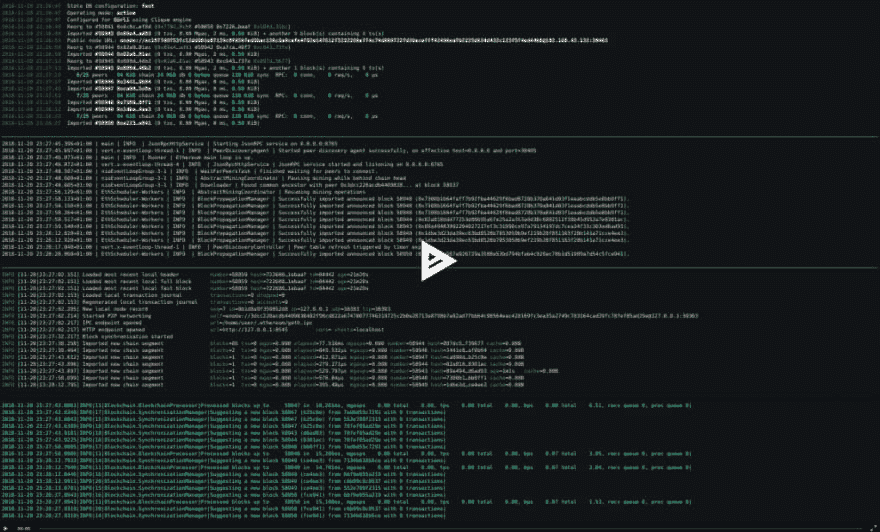

# 格利试验网倡议奖金公告

> 原文：<https://dev.to/5chdn/the-grli-testnet-initiative-bounties-announcement-3gp>

更新:奖金已经支付。

* * *

rli testnet 计划是一项开发活动，旨在为以太坊创建第一个跨客户端的权威证明网络。在进入公共链之前，有各种各样的测试网可以用来试验合同和 d-apps。然而，没有一个测试网既能在所有客户机上广泛使用，又足够健壮以保证一致的可用性和高可靠性。这就是格利试图成为的人。阅读之前发布的[glri Testnet 提案](https://dev.to/5chdn/the-grli-testnet-proposal---a-call-for-participation-58pf)中有关动机的更多信息。

自从这个想法诞生的 ETHBerlin hackathon 和[我们被取消资格](https://medium.com/ethberlin/proof-of-transparency-ff31c4911462)以来，我们[已经走了很长的路](https://www.ethnews.com/the-goerli-testnet-has-arrived)，当前的 *test-testnet* 已经得到了四个不同客户的支持，即 Geth、Pantheon、Nethermind 和奇偶以太坊。尽管代码还没有最终完成，并且不是所有的客户端都具备完整的功能，但是他们很乐意同步 gorli 链。

以太坊社区的许多成员确信这个项目是非常需要的，并且[加入了我们的 Gitter](https://gitter.im/goerli/testnet) 来帮助运行节点、[街区探索者](https://blockscout.com/eth/goerli)，并且在许多其他方面做志愿者。看看这个。人们甚至在推特上谈论这个项目。

> 这些人很整洁！——[奥斯格里菲斯](https://twitter.com/austingriffith/status/1063898676240748547)，骇客
> 
> Goerli 不仅仅是另一个测试网，它被证明是一个协作开发和跨团队交流与协调的好环境。 " - [如加兰诺](https://twitter.com/egalano/status/1064034649679118336)，基建
> 
> 说我是#Goerli testnet maximalist 是不是太早了？——[玛利亚·保拉·费尔南德斯](https://twitter.com/MPtherealMVP/status/1064877800413261824)，mvp

到目前为止，我们收到的反馈是令人鼓舞的，但它没有支付任何人的账单。因此，我们激动地宣布，格利倡议收到了来自 ETC 合作社的第一笔 [$DAI 52_200 赠款](https://medium.com/@pyskell/building-a-better-unified-testnet-3f48490cd4e1)和一笔匿名的[捐款$DAI 10_000](https://etherscan.io/address/0x6974df01bf293ab9af66127c03aac79b81d494c7) ( [谁在多 sig？](https://twitter.com/5chdn/status/1063851317028954112))。现在可用的资金可以用来帮助开发这个项目所需的所有工具和基础设施。

未来的路线图将包括启动两个测试网，一个完全支持君士坦丁堡的 gorli 测试网，用于 Geth、奇偶以太坊、Pantheon 和所有其他以太坊客户端；以及用于 Geth Classic、奇偶以太坊和模仿以太坊经典 mainnet 条件的 Mantis 的 rli Classic testnet。

第一批奖金将于今天公布，按照优先顺序排列如下:

1.  @karalabe 声称的小团体 POA 引擎规格为[225](https://github.com/ethereum/EIPs/pull/1570)/[ECIP 1048](https://github.com/ethereumclassic/ECIPs/pull/7)
    T5】$ DAI 5 _ 000

2.  一个用 Rust 编写的团引擎为[宇称以太坊# 9981](https://github.com/paritytech/parity-ethereum/pull/9981)
    T3】$ DAI 30 _ 000 可由 [@thefallentree](https://dev.to/thefallentree) 和@jwasinger (chunks [A](https://etherscan.io/tx/0xa3424fbc2eb472a89700b7f276d847fc093a84f199e13f75ffb7bb41152c76ba) ， [B](https://etherscan.io/tx/0x5244da2a481cc43c4816941e91acce6000c4d04cfa98b53d04e6d07b5a007f18) ， [Gitcoin](https://gitcoin.co/profile/goerli) )认领

3.  [创世纪](https://github.com/goerli/testnet/commit/92383483481d541e90adfb58ea43ea55e5bc4ea3)和[链条规格](https://github.com/goerli/testnet/commit/f10cee16d46a8db8272f8d4ca46703a949ba110c)为格里尔
    T5】$戴 2_500 [由@5chdn](https://etherscan.io/tx/0x227e9bb276ef77f0ecd0bace60932bdf3adad4aced80c5a50d1fdff99fbfab3f) 认领

4.  [创世纪](https://github.com/goerli/testnet/commit/5fb2226121516baf398b275f01d466cde476915a)和[链条规格](https://github.com/goerli/testnet/commit/be2b82362103b38c841056954b02f7e737cbdd33)为 Kotti【经典】 **$DAI 2_500** [由@5chdn](https://etherscan.io/tx/0xed6f9fa97e2b6a24efadc1a120fadee9172a3c0efb6683209f03bf6f8a589af6) 认领

5.  @karalabe 声称对[Geth # 18121](https://github.com/ethereum/go-ethereum/pull/18121)
    **$ DAI 2 _ 500**[中的格利的原生支持](https://etherscan.io/tx/0x3026a899de41c5de9dcec7584bba23bc62c01bade3da5b57db9df047cfad5ee5)

6.  原生支持 Kotti(经典)在[Multi Geth # 17](https://github.com/ethoxy/multi-geth/pull/17)
    **$ DAI 2 _ 500**[由@5chdn](https://etherscan.io/tx/0xe99cd5ee49ffaad0eadee7da77da1d3562b0e9e76cf2cb59a1e8ac31aaaefa13) 认领

7.  @5chdn 声明支持[奇偶派# 10](https://github.com/goerli/parity-goerli/pull/10)
    **$ DAI 2 _ 500**[中的格利](https://etherscan.io/tx/0xcf7b4639be806dd14d105f8ef9b462578274478f3afb9a358940b2f82e5200c2)

8.  原生支持 Kotti(经典)在[奇偶派# 45](https://github.com/goerli/parity-goerli/pull/45)
    **$ DAI 2 _ 500**[由@5chdn](https://etherscan.io/tx/0xa7baa4840c1eea897d4e9535ceffe0cca7d58598ecd1f5526edd8548d706f09c) 认领

9.  @Nashatyrev 声明对[先贤祠# 370](https://github.com/PegaSysEng/pantheon/pull/370)
    **$ DAI 2 _ 500**[中格利的原生支持](https://etherscan.io/tx/0xd756941ee9e3f0068ce6a859568e02eeb2fb0236e2a5f5df534d1c914ae95bb6)

10.  @ tkstanzak 声称对[虚空之心# 234](https://github.com/NethermindEth/nethermind/pull/234)
    **$ DAI 2 _ 500**[中的格利的原生支持](https://etherscan.io/tx/0x70db693e6bcb7d84397c60599eb62e661baa1d07e34566bcd1c03f93839c37e2)

11.  @ChainSafe 认领的 [Ropsten、Kovan、Rinkeby](https://bridge.goerli.com/)
    **$ DAI 5 _ 000**[的单向节流桥龙头](https://etherscan.io/tx/0x70804ddbdc678525258fe52159c0c0456fe82f0b53f434d3fd63cfa2c31a5c38)

但是你可能会问，为什么在这个公告发布之前，一些奖金已经分配给开发者了呢？这仅仅是因为人们对 gorli testnet 倡议如此兴奋，以至于他们未经许可就开始着手这项工作；却不知道我们已经计划在未来提供这些奖金。这是一个罕见的例子，我们有更多的开发人员比资金可用。

希望能有更多的奖金，并在更多的资助到位后尽快公布。我们的[项目和工具的愿望清单是绝对无止境的](https://github.com/goerli/testnet/issues)。一旦奇偶以太坊团体引擎被合并到上游，可申请的开放任务将在 Gitcoin 上可用，该引擎是所有其他任务的主要拦截器，并且 rli testnet 准备好重新启动，网络 ID 为`0x5`以取代 Ropsten。