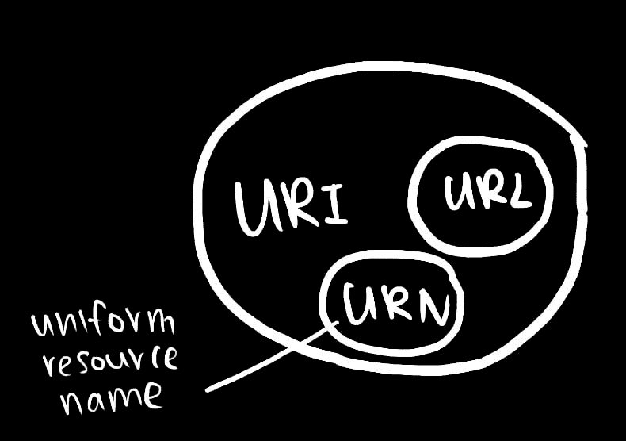

# 当你在浏览器中输入 URL 时会发生什么[第一部分:URI]

> 原文：<https://dev.to/annlin/what-happens-when-you-enter-url-in-a-browser-part-1-uri-35hg>

[https://www.youtube.com/embed/gtY88BlO7d4](https://www.youtube.com/embed/gtY88BlO7d4)

# 真正发生的事情，

1.  在浏览器中输入网站链接，`www.example.com`。
2.  浏览器知道是网站，在前面加了`https://`。

## `https://`是 URI 众多方案中的一个

T3】URI =统一资源标识符
URL =统一资源定位符
骨灰盒(不是那个骨灰盒🌝)=统一资源名称

URN 和 URL 是 URI 的子集。骨灰盒只是一个名字或参考，可能没有办法找到那个东西。URL 知道资源的确切位置，并返回那个东西。

### URL 示例(粘贴在浏览器上):

*   `data:text/plain;base64,SGVsbG8sIFdvcmxkIQ%3D%3D`
    *   你好，世界！
*   `tel:+6598765432`
    *   在电脑中打开 facetime，在移动设备中呼叫号码
*   `[https://example.com](https://example.com)`
    *   开个网站，咩
*   `file://path`
    *   在本地机器上打开一个文件
*   `mailto:[test@gmail.com](mailto:test@gmail.com)`
    *   打开电子邮件
*   `telnet://0.0.0.0`
    *   打开终端登录到远程计算机
*   这里还有[更多](https://www.iana.org/assignments/uri-schemes/uri-schemes.xhtml)

### 瓮例:

*   `urn:isan:0000-0000-9E59-0000-O-0000-0000-2`
    *   “蜘蛛侠(电影)”的骨灰盒，通过其视听编号识别

“在浏览器中输入 URL 时会发生什么”的第 1 部分到此结束。

P/S:目前的浏览器已经在使用国际化资源标识符(IRI)，这是一个新的协议，是 URI 的扩展，允许 unicode 字符编码。例如[https://en.wiktionary.org/wiki/厉害](https://en.wiktionary.org/wiki/%E5%8E%89%E5%AE%B3)(感谢@jxerome 指出这一点)

参考资料:
[https://www . immagic . com/e library/ARCHIVES/GENERAL/WIKIPEDI/w 110302 u . pdf](https://www.immagic.com/eLibrary/ARCHIVES/GENERAL/WIKIPEDI/W110302U.pdf)
[https://www . iana . org/assignments/uri-schemes/uri-schemes . XHTML](https://www.iana.org/assignments/uri-schemes/uri-schemes.xhtml)

在 [Twitter](https://twitter.com/linxea_) 与我交谈

🤦:感谢指出帖子中的错误！ [@joeflateau](https://dev.to/joeflateau) ，@dangtu_work