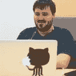

# 谢谢你，开发者贡献者🙏

> 原文：<https://dev.to/devteam/thank-you-dev-contributors--31ak>

自从我们在八月份开源以来，已经有 90 个社区成员为开发代码库做出了贡献。太神奇了。

我们非常感谢和赞赏所有贡献时间来支持社区和改进平台的人。代码库比以往更加强大。我们的开发者体验比以往更加顺畅。我们的功能比以往更加有用。我们的虫子被压扁的速度比以往任何时候都快。我们有一个 iOS 应用程序！

这是令人难以置信的几个月，我们真的只想对你们所有人说谢谢。

下面是犯了 3 次或更多次错误的人！

## [丹尼尔小鸡](/chickdan) <button name="button" type="button" data-info="{&quot;className&quot;:&quot;User&quot;,&quot;style&quot;:&quot;full&quot;,&quot;id&quot;:90508,&quot;name&quot;:&quot;Daniel Chick&quot;}" class="crayons-btn follow-action-button whitespace-nowrap  " aria-label="Follow user: Daniel Chick" aria-pressed="false">跟随</button>

## [梅根(她/她)](/nektro) <button name="button" type="button" data-info="{&quot;className&quot;:&quot;User&quot;,&quot;style&quot;:&quot;full&quot;,&quot;id&quot;:10538,&quot;name&quot;:&quot;Meghan (she/her)&quot;}" class="crayons-btn follow-action-button whitespace-nowrap  " aria-label="Follow user: Meghan (she/her)" aria-pressed="false">跟随</button>

[24\. Local trans witch who prefers to do magic with a keyboard. she/her. Currently hacking away at making the Web less centralized.](/nektro)

## [杉光平](/koheisg) <button name="button" type="button" data-info="{&quot;className&quot;:&quot;User&quot;,&quot;style&quot;:&quot;full&quot;,&quot;id&quot;:93066,&quot;name&quot;:&quot;Kohei Sugi&quot;}" class="crayons-btn follow-action-button whitespace-nowrap  " aria-label="Follow user: Kohei Sugi" aria-pressed="false">跟随</button>

## [莫妮卡·鲍威尔](/m0nica) <button name="button" type="button" data-info="{&quot;className&quot;:&quot;User&quot;,&quot;style&quot;:&quot;full&quot;,&quot;id&quot;:18864,&quot;name&quot;:&quot;Monica Powell&quot;}" class="crayons-btn follow-action-button whitespace-nowrap  " aria-label="Follow user: Monica Powell" aria-pressed="false">跟随</button>

[Hi, I'm Monica! I'm a product engineer who is building technology to elevate people and is currently focusing on growing the React Ladies community for React developers.](/m0nica)

## [尼克·泰勒](/nickytonline)T2【跟随】T3】

[My name is Nick Taylor. I am a Lead Software Engineer with a focus on the front-end. I am a big fan of TypeScript, JavaScript, (P)React and Node.](/nickytonline)

## [迈克尔·科尔](/citizen428) <button name="button" type="button" data-info="{&quot;className&quot;:&quot;User&quot;,&quot;style&quot;:&quot;full&quot;,&quot;id&quot;:503,&quot;name&quot;:&quot;Michael Kohl&quot;}" class="crayons-btn follow-action-button whitespace-nowrap  " aria-label="Follow user: Michael Kohl" aria-pressed="false">跟随</button>

[Your friendly neighborhood anarcho-cynicalist. ¯\_(ツ)_/¯ and (╯°□°）╯︵ ┻━┻) are my two natural states.Tag mod for #ruby, #fsharp, #ocaml](/citizen428)

## [瓦育·苏玛尔塔](/wahyusumartha) <button name="button" type="button" data-info="{&quot;className&quot;:&quot;User&quot;,&quot;style&quot;:&quot;full&quot;,&quot;id&quot;:90844,&quot;name&quot;:&quot;Wahyu Sumartha&quot;}" class="crayons-btn follow-action-button whitespace-nowrap  " aria-label="Follow user: Wahyu Sumartha" aria-pressed="false">跟随</button>

[I play paintball if i am away from my keyboard.](/wahyusumartha)
![[deleted user] image](img/56fbc1337a9836e0802365a3a3022a53.png)

## [已删除的用户]

![[deleted user] image](img/56fbc1337a9836e0802365a3a3022a53.png)

## [已删除的用户]

## [Xavier Vercruysse](/xvercruysse) <button name="button" type="button" data-info="{&quot;className&quot;:&quot;User&quot;,&quot;style&quot;:&quot;full&quot;,&quot;id&quot;:65860,&quot;name&quot;:&quot;Xavier Vercruysse&quot;}" class="crayons-btn follow-action-button whitespace-nowrap  " aria-label="Follow user: Xavier Vercruysse" aria-pressed="false">跟着</button>

## [史蒂文·洛克斯](/rockarts) <button name="button" type="button" data-info="{&quot;className&quot;:&quot;User&quot;,&quot;style&quot;:&quot;full&quot;,&quot;id&quot;:88343,&quot;name&quot;:&quot;Steven Rockarts&quot;}" class="crayons-btn follow-action-button whitespace-nowrap  " aria-label="Follow user: Steven Rockarts" aria-pressed="false">跟随</button>

[I'm a Swift developer that loves climbing mountains, ice and rock.](/rockarts)

## [本尼异能🇮🇱🇨🇦](/bennypowers)跟随

[Coding is as much a matter of personal growth as it is of logic and control-flow. I keep patience, curiosity, & exuberance in the same toolbox as vim and git. *Opinions posted are my own*](/bennypowers)

## 叶歇尔·卡尔门森 <button name="button" type="button" data-info="{&quot;className&quot;:&quot;User&quot;,&quot;style&quot;:&quot;full&quot;,&quot;id&quot;:14816,&quot;name&quot;:&quot;Yechiel Kalmenson&quot;}" class="crayons-btn follow-action-button whitespace-nowrap  " aria-label="Follow user: Yechiel Kalmenson" aria-pressed="false">跟随</button>

[He/Him/His I'm a Software Engineer and a teacher. There's no feeling quite like the one you get when you watch someone's eyes light up learning something they didn't know.](/yechielk)

## [弗雷德里克·克利门斯·<button name="button" type="button" data-info="{&quot;className&quot;:&quot;User&quot;,&quot;style&quot;:&quot;full&quot;,&quot;id&quot;:12652,&quot;name&quot;:&quot;Frederik 👨‍💻➡️🌐 Creemers&quot;}" class="crayons-btn follow-action-button whitespace-nowrap  " aria-label="Follow user: Frederik 👨‍💻➡️🌐 Creemers" aria-pressed="false">继续</button>](/_bigblind)

[I'm never sure what to put in a bio. If there's anything you want to know, don't be afraid to ask!](/_bigblind)

## [阿拉诺夫](/araslanove)尤金<button name="button" type="button" data-info="{&quot;className&quot;:&quot;User&quot;,&quot;style&quot;:&quot;full&quot;,&quot;id&quot;:91767,&quot;name&quot;:&quot;Araslanov Eugene&quot;}" class="crayons-btn follow-action-button whitespace-nowrap  " aria-label="Follow user: Araslanov Eugene" aria-pressed="false">跟随</button>

[Software developer (web, ruby)](/araslanove)
![[deleted user] image](img/56fbc1337a9836e0802365a3a3022a53.png)

## [已删除的用户]

## [押韵](/rhymes) <button name="button" type="button" data-info="{&quot;className&quot;:&quot;User&quot;,&quot;style&quot;:&quot;full&quot;,&quot;id&quot;:2693,&quot;name&quot;:&quot;rhymes&quot;}" class="crayons-btn follow-action-button whitespace-nowrap  " aria-label="Follow user: rhymes" aria-pressed="false">跟随</button>

[Such software as dreams are made on. I mostly rant about performance, unnecessary complexity, privacy and data collection.](/rhymes)

## [尼克·霍尔登](/nholden) <button name="button" type="button" data-info="{&quot;className&quot;:&quot;User&quot;,&quot;style&quot;:&quot;full&quot;,&quot;id&quot;:53506,&quot;name&quot;:&quot;Nick Holden&quot;}" class="crayons-btn follow-action-button whitespace-nowrap  " aria-label="Follow user: Nick Holden" aria-pressed="false">跟随</button>

[I run, lose bar trivia, and sling Ruby and JavaScript in San Diego.](/nholden)

## [丹尼尔·戈兰特](/dangolant) <button name="button" type="button" data-info="{&quot;className&quot;:&quot;User&quot;,&quot;style&quot;:&quot;full&quot;,&quot;id&quot;:24116,&quot;name&quot;:&quot;Daniel Golant&quot;}" class="crayons-btn follow-action-button whitespace-nowrap  " aria-label="Follow user: Daniel Golant" aria-pressed="false">跟随</button>

## [【竖琴】](/arpitgogia) <button name="button" type="button" data-info="{&quot;className&quot;:&quot;User&quot;,&quot;style&quot;:&quot;full&quot;,&quot;id&quot;:77905,&quot;name&quot;:&quot;Arpit Gogia&quot;}" class="crayons-btn follow-action-button whitespace-nowrap  " aria-label="Follow user: Arpit Gogia" aria-pressed="false">跟着</button>

下面是一些由你们中的*作者*发布的新功能:

 [## 变更日志:导出帖子

### 押韵 11 月 21 日 182 分钟阅读

#meta #changelog](/rhymes/changelog-export-posts-1kdm)

## 文章不再可用

 [## 将 GitLab 链接添加到您的个人资料中

### 西登特

#changelog #meta](/siideemt/changelog-add-gitlab-link-to-your-profile-3fn4)
 [## Changelog:对评论框的更新

### 尼克·卡尔尼克 10 月 21 日 181 分钟阅读

#meta #changelog](/theoutlander/changelog-updates-to-the-comment-box-3f04)

您可以看到在我们的存储库上做出贡献的每个人:

##  [ forem ](https://github.com/forem) / [ forem](https://github.com/forem/forem)

### 为社区赋权🌱

<article class="markdown-body entry-content container-lg" itemprop="text">

# Forem <g-emoji class="g-emoji" alias="seedling" fallback-src="https://github.githubassets.cimg/icons/emoji/unicode/1f331.png">🌱</g-emoji>

**For Empowering Community**

[T11】](https://gitpod.io/from-referrer/)

欢迎来到 [Forem](https://forem.com) 代码库，这个平台为[开发到](https://dev.to)提供动力。我们很高兴你能来。在你们的帮助下，我们可以增强 Forem 的可用性、可伸缩性和稳定性，从而更好地为我们的社区服务。

## 什么是 Forem？

Forem 是用于构建社区的开源软件。为你的同行、客户、粉丝、家人、朋友以及任何其他需要聚集在一起成为集体一员的时间和空间的社区[参见我们的公告帖子](https://dev.to/devteam/for-empowering-community-2k6h)以获得 Forem 是什么的高级概述。

[dev.to](https://dev.to) (或者只是 dev)由 Forem 托管。这是一个软件开发人员的社区，他们撰写文章，参与讨论，并建立自己的专业档案。我们重视支持性和建设性的对话，为所有成员追求伟大的准则和职业发展。该生态系统涵盖从初学者到高级开发人员，欢迎所有人找到自己的位置…

</article>

[View on GitHub](https://github.com/forem/forem)

## [forem](https://github.com/forem)/[DEV-IOs](https://github.com/forem/DEV-ios)

### 开发社区 iOS 应用程序

<article class="markdown-body entry-content container-lg" itemprop="text">

# 开发 iOS <g-emoji class="g-emoji" alias="sparkling_heart" fallback-src="https://github.githubassets.cimg/icons/emoji/unicode/1f496.png">💖</g-emoji>

这是对 iOS 应用程序[开发到](https://dev.to)的回购。

# 状态:

发布了第一个版本，更多信息:[https://twitter.com/bendhalpern/status/1061323718058786822](https://twitter.com/bendhalpern/status/1061323718058786822)

# 设计精神

随着时间的推移，我们将增加更多的本机代码，但目前我们采用的是*本机 shell/web 视图*的方法。这种方法在 iOS 时代很早就失宠了，但我相信这是一种非常有效的方法。它的灵感来自于 Basecamp 的工作方式。我们的技术有点不同，但理念是一样的。

[https://m . signalvnoise . com/base camp-3-for-IOs-hybrid-architecture-AFC 071589 c 25](https://m.signalvnoise.com/basecamp-3-for-ios-hybrid-architecture-afc071589c25)

[https://signalvnoise . com/posts/3743-hybrid-sweet-spot-native-navigation-web-content](https://signalvnoise.com/posts/3743-hybrid-sweet-spot-native-navigation-web-content)

[https://signalvnoise . com/posts/3766-hybrid-how-we-take-base camp-多平台小型团队](https://signalvnoise.com/posts/3766-hybrid-how-we-took-basecamp-multi-platform-with-a-tiny-team)

[https://www.youtube.com/watch?v=SWEts0rlezA](https://www.youtube.com/watch?v=SWEts0rlezA)

通过尽可能多地利用`wkwebviews`,我认为我们可以让这一切变得非常棒，并与我们的网络开发工作非常顺利地同步。在有意义的地方，我们可以完全原生地重新实现某些东西，或者构建完全原生的特性。生活是一次旅行，而不是目的地。

# 贡献的

1.  派生并克隆项目。
2.  在 XCode 中构建并运行项目。
3.  …

</article>

[View on GitHub](https://github.com/forem/DEV-ios)

编码快乐！