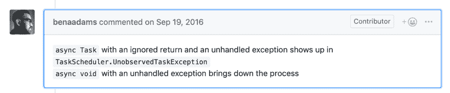
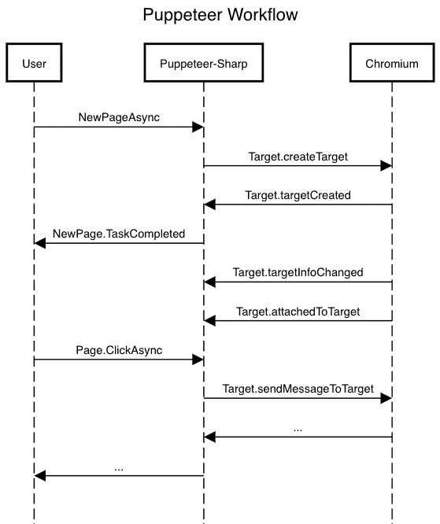

# 关于异步空隙、事件和错误处理的童话

> 原文：<https://dev.to/hardkoded/a-fairy-tale-about-async-voids-events-and-error-handling-1afi>

让我告诉你一个关于异步空洞、同步上下文和异步编程的故事。几天前，我们收到了[一个关于木偶戏-夏普](https://github.com/kblok/puppeteer-sharp/issues/717)的问题，描述了两个问题:

*   木偶戏-尖锐的崩溃与异常无法捕捉。
*   KeyNotFoundException 试图获得一个[帧](https://github.com/kblok/puppeteer-sharp/blob/master/lib/PuppeteerSharp/Frame.cs)代码非常简单:

```
var launchOptions = new LaunchOptions() { Headless = true };
var sites = new List<string>()
{
    "somesites.com",
}
// Act
try
{
    await new BrowserFetcher().DownloadAsync(BrowserFetcher.DefaultRevision);
    using (var browser = await Puppeteer.LaunchAsync(launchOptions))
    {
        var page = await browser.NewPageAsync();

        foreach (var site in sites)
        {
            try
            {
                await page.GoToAsync($"http://{site}");
                Console.WriteLine(await page.GetTitleAsync());
                await page.ScreenshotAsync($"D:\\bin\\screenshots\\{site}.png");
            }
            catch (Exception exception)
            {
                // Catches most exceptions such as timeouts but does not catch others, see below.
                Console.WriteLine($"Unable to take screenshot of: {site}. Exception: {exception.Message}");
            }
        }
    }
}
catch (Exception exception)
{
    // Never enters the catch.
    Console.WriteLine($"Unable to proceed: {exception.Message}");
} 
```

## try-catch 块怎么可能捕捉不到异常？

说真的，那是不可能的。这就是 try-catch 块的用途，对吗？
嗯，[本·亚当斯](https://twitter.com/ben_a_adams)给了我一个提示[这里](https://github.com/dotnet/roslyn/issues/13897#issuecomment-248098377)

[](https://res.cloudinary.com/practicaldev/image/fetch/s--TuLf11t---/c_limit%2Cf_auto%2Cfl_progressive%2Cq_auto%2Cw_880/https://raw.githubusercontent.com/kblok/kblok.github.io/master/img/async-void-fairy-tale/benadamscomment.png)

我想我们大多数人都至少读过一遍这条规则:

> 避免异步无效！让异步方法返回 void 是可能的，但是只有在编写异步事件处理程序时才应该这样做。没有返回值的常规异步方法应该返回 Task，而不是 void。

*[克利里，斯蒂芬。C#菜谱中的并发](https://www.amazon.com/dp/B00KCY2CB4)*

但是很多时候我遇到了需要编写异步 void 事件的情况。这看起来是一个完美的借口:“我知道异步 void 不好。但是我需要编写一个异步事件处理程序，所以我必须使用异步 voids。我在遵守规则，一切都会好的”。

嗯……没有。

> 当异步 void 方法传播异常时，该异常在异步 void 方法开始执行时处于活动状态的 SynchronizationContext 上引发。如果您的执行环境提供了 SynchronizationContext，那么它通常有办法在全局范围内处理这些顶级异常。例如，WPF 就有应用。DispatcherUnhandledException，WinRT 有应用程序。UnhandledException 和 ASP.NET 有应用程序错误。

*[克利里，斯蒂芬。C#菜谱中的并发](https://www.amazon.com/dp/B00KCY2CB4)*

但是，正如 Ben 所说，在控制台应用程序中，异常将被传播到线程池，而不会被捕获，从而关闭整个进程。

## 那些异步空洞在哪里？

你可能会想:“好吧，但是你为什么要谈论异步空洞呢？那段代码没有异步 void？”
嗯，异步空隙事件处理程序正在被木偶师内部使用。所以，从`Puppeteer.LaunchAsync`到被 using 块调用的`Dispose`，内部会触发很多事件。
当一个新消息来自 Chromium 时， [IConnectionTransport](https://github.com/kblok/puppeteer-sharp/blob/master/lib/PuppeteerSharp/Transport/IConnectionTransport.cs) 将解析并使用 [MessageReceived 事件](https://github.com/kblok/puppeteer-sharp/blob/master/lib/PuppeteerSharp/Transport/IConnectionTransport.cs#L33)广播它。
许多类，如 [Page](https://github.com/kblok/puppeteer-sharp/blob/master/lib/PuppeteerSharp/Page.cs#L1774) 类，会监听来自连接的事件并执行**异步**任务。
这里我们有我们的**异步空隙**。

故事结束。

不，开个玩笑，我们还没找到漏洞。

## 异步 void 是问题吗？

在过去的一周里，我被这个异步 void 问题困扰着。我考虑过用其他工具替换那些事件调用，比如[数据流](https://docs.microsoft.com/en-us/dotnet/standard/parallel-programming/dataflow-task-parallel-library)或[系统。被动](https://github.com/dotnet/reactive)，但我无法找到一个干净且(最重要的)正确的解决方案。

几周前，当我完成了《并发性 C#食谱》,我决定碰碰运气，在 Twitter 上联系[史蒂夫·克利里](https://twitter.com/aSteveCleary)。他超级友好，回复了我的推特。令我惊讶的是，在谈话中间，他说:

[](https://res.cloudinary.com/practicaldev/image/fetch/s--3kKtNFEA--/c_limit%2Cf_auto%2Cfl_progressive%2Cq_auto%2Cw_880/https://raw.githubusercontent.com/kblok/kblok.github.io/master/img/async-void-fairy-tale/stevetweet.png)

我就想

[](https://i.giphy.com/media/91fEJqgdsnu4E/giphy.gif)

最了解异步编程的人怎么可能告诉我这些？`async void`不就是万恶之源吗？

但是这个奇怪的问题让我明白，我不明白我的问题是什么。让我们来看看当我们有这样一段简单的代码时会发生什么:

```
try
{
    using (var browser = await Puppeteer.LaunchAsync(options))
    using (var page = await browser.NewPageAsync())
    {
            await Page.ClickAsync("body");
    }
}
catch(Exception ex)
{
    Console.WriteLine(ex.Message);
} 
```

一个简化的序列图应该是这样的。

[](https://res.cloudinary.com/practicaldev/image/fetch/s--rLlHjSUx--/c_limit%2Cf_auto%2Cfl_progressive%2Cq_auto%2Cw_880/https://raw.githubusercontent.com/kblok/kblok.github.io/master/img/async-void-fairy-tale/puppeteerworkflow.png)

因此，假设我们未能处理`Target.targetCreated`。用户代码中的哪一行会失败？简单，`browser.NewPageAsync`
但是如果我们处理`Target.targetInfoChanged`失败了呢？我们无法向用户发送该异常，因为用户没有触发该操作。

这在 puppeter-Sharp 上是一个非常糟糕的问题，**无法将内部错误告知用户**。

> 如果你的库使用了来自其他来源的事件，你需要非常小心的处理你的异常并设计你的 API，这样你就能够交流这些异常。

## 这个我是怎么解决的？

木偶戏-夏普有两种类型的连接。`Connection`本身，每个进程一个。和会话连接，每个目标一个。
所以，我们在图书馆的每个`MessageReceived`事件上添加了一个`try-catch`块。如果我们得到任何错误，我们关闭连接，并添加该异常作为一个`close reason`。

```
private async void Client_MessageReceived(object sender, MessageEventArgs e)
{
    try
    {
        //Message Processing
    }
    catch (Exception ex)
    {
        var message = $"NetworkManager failed to process {e.MessageID}. {ex.Message}. {ex.StackTrace}";
        _logger.LogError(ex, message);
        _client.Close(message);
    }
} 
```

下一期。

## KeyNotFoundException 试图获取一个[帧](https://github.com/kblok/puppeteer-sharp/blob/master/lib/PuppeteerSharp/Frame.cs) …什么？

如果你再看一下序列图，你会看到我们从 Chromium 得到的第一条消息是“Target.targetCreated”。我们怎么可能得到 KeyNotFoundException 异常呢？

给你个提示，以`async`开头，以`void`结尾。

一个 [IConnectionTransport](https://github.com/kblok/puppeteer-sharp/blob/master/lib/PuppeteerSharp/Transport/IConnectionTransport.cs) 将开始接收来自 Chromium 的消息流，解析它们并触发一个`MessageReceived`事件。

这里的问题是`MessageReceived?.Invoke`将触发并忘记一个`async void`事件处理程序。*当然！*这里不涉及`await`！这个**会**火了就忘了。

现在，当你在 ASP.NET 4.5 版本中使用异步方法在[上阅读这篇文章时，它会更有意义](https://docs.microsoft.com/en-us/aspnet/web-forms/overview/performance-and-caching/using-asynchronous-methods-in-aspnet-45)

> 异步 void 事件的缺点是开发人员不再能够完全控制事件的执行时间。例如，如果两个。aspx 和 a .Master 定义 Page_Load 事件，其中一个或者两个都是异步的，执行的顺序无法保证。对于非事件处理程序(如 async void Button_Click)来说，同样的不确定顺序也适用。

当然，不能保证执行的顺序，因为* *的`Invoke`方法不会等待你的`async`事件处理程序。

## 等待帧创建。

框架问题很容易解决，尽管实现起来很麻烦。基本上。这是一个替换所有:

```
Frames[someFrame]; 
```

用

```
await _frameManager.GetFrameAsync(someFrame); 
```

# 最后的话

虽然这听起来可能过于专业，但我认为这给了我们一些有趣的东西，让我们在设计一个为另一个源使用事件的库时可以考虑。

不要停止编码！

最初发布于[harkoded.com](http://www.hardkoded.com/blog/async-void-fairy-tale)