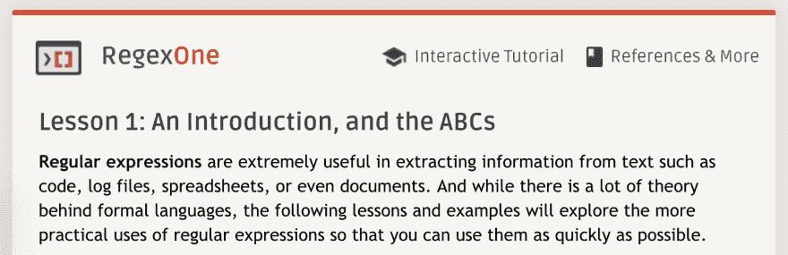
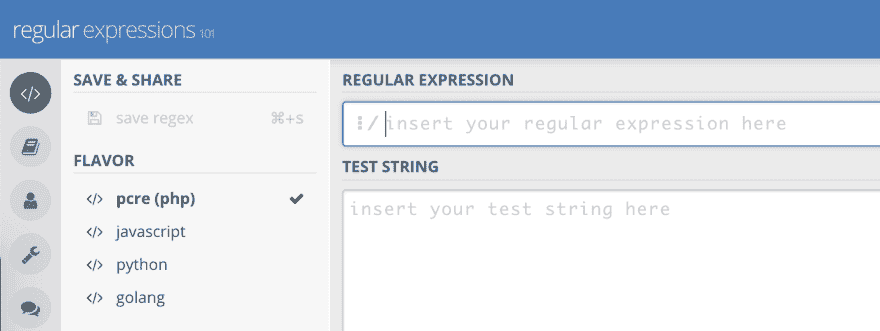

# 2 个交互式资源，帮助您复习正则表达式知识

> 原文：<https://dev.to/jarroo/2-interactive-resources-for-brushing-up-your-regex-knowledge-2bn4>

长久以来，正则表达式对我来说一直是个谜。尽管在各种编程语言中有很多很多的学习机会，但我对它们令人费解的语法的无知通常会引导我实现自己的基于代码的算法。很明显，在大多数情况下，这种自己动手的解决方案并不会降低性能，并且可能在几周或几个月后变得晦涩难懂。

在我最近努力学习 Python 的过程中，对 RegEx 的需求很快出现了。这一次，我开始努力，至少掌握了基础知识。当我在网上四处点击，寻找优质的学习资源时，我对关于这个主题的*互动资源*的收获感到惊喜，我想向你强调两个。从众多关于这个问题的[动物书籍中挑选出来，它们是一个令人耳目一新的变化。](https://ssearch.oreilly.com/?q=regular+expression)

## RegexOne.com

[RegexOne.com](https://regexone.com/)是一个受捐赠支持的令人愉快的网站，它通过十几节简短扼要的课程来指导你学习基本的正则表达式，每节课都有一个交互式输入框。练习建立在前面的基础上，介绍每个后续的概念，在您键入时突出显示当前的匹配。小测验并不太难，万一你遇到困难，只需点击一下鼠标就能找到解决方案。

一旦你快速浏览了这些课程，你可以依靠 5 种特定语言的指南:

*   C#
*   java 描述语言
*   Java 语言(一种计算机语言，尤用于创建网站)
*   服务器端编程语言（Professional Hypertext Preprocessor 的缩写）
*   计算机编程语言

## 用于动态测试和调试的 RegEx101.com

带着你刚刚掌握的知识，去 RegEx101.com 吧，这是一个在线开发和调试套件。除了突出显示匹配项之外，您的测试字符串还会显示大量有用的小部件:

*   完全匹配信息
*   捕获组
*   英语，RegEx 语句含义的上下文相关翻译
*   快速参考框
*   9 种语言的代码生成器(Javascript、PHP、Python、C#、Java、Ruby 和 Rust)
*   一种共享和存储作品的方式

在不到一个小时的时间里——在这两个免费资源的帮助下——我能够精心设计一个表达式，简洁地提取我需要的信息，而不用求助于我自己的模糊且毫无疑问低效的一次性算法。