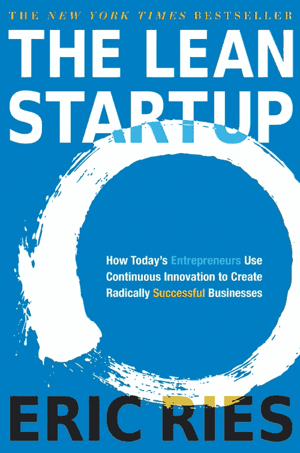
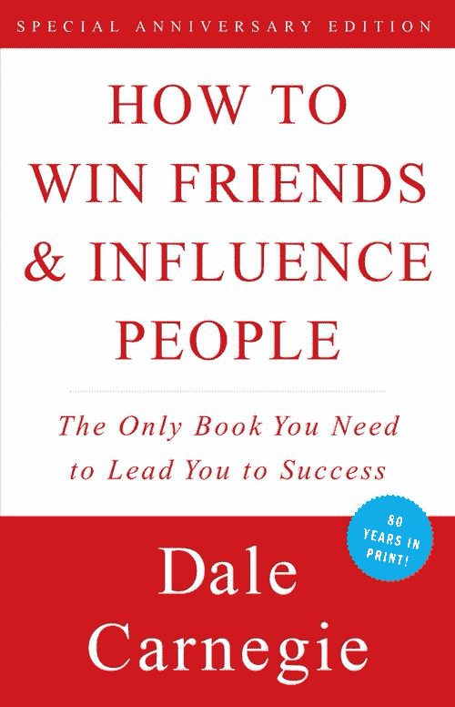
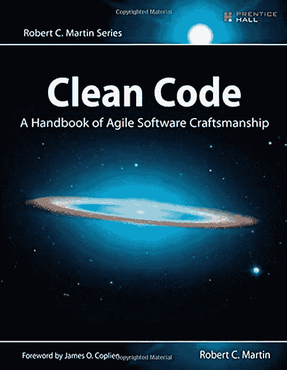
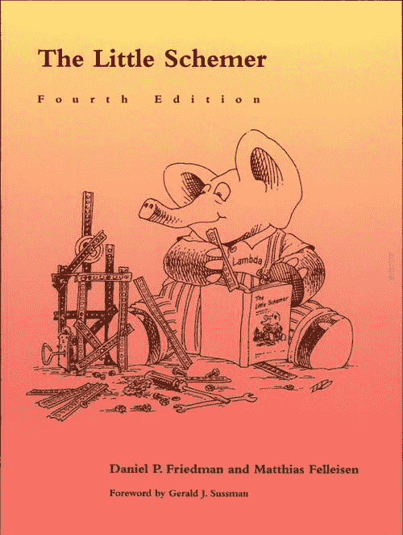
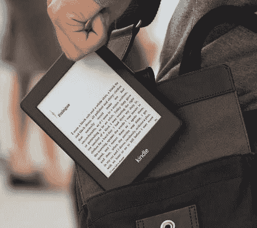
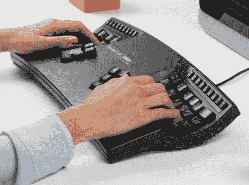
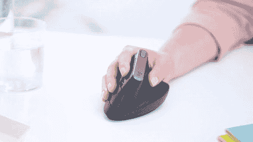
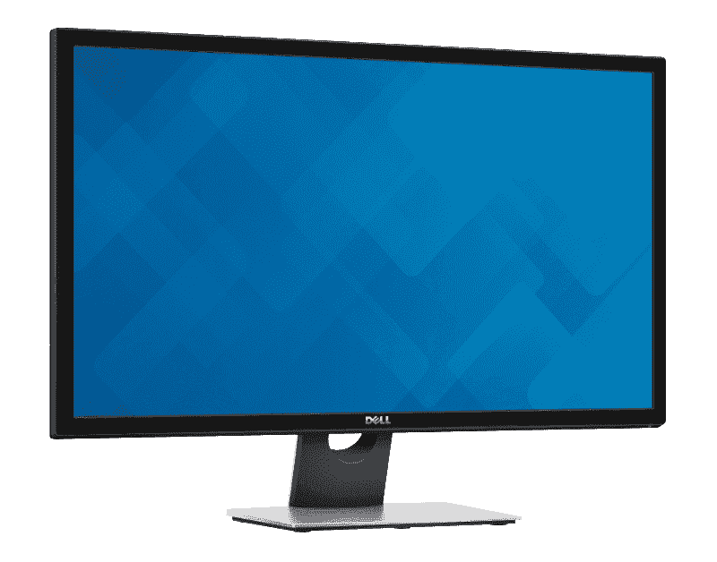
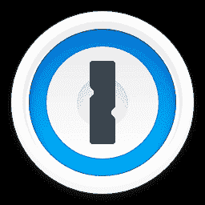
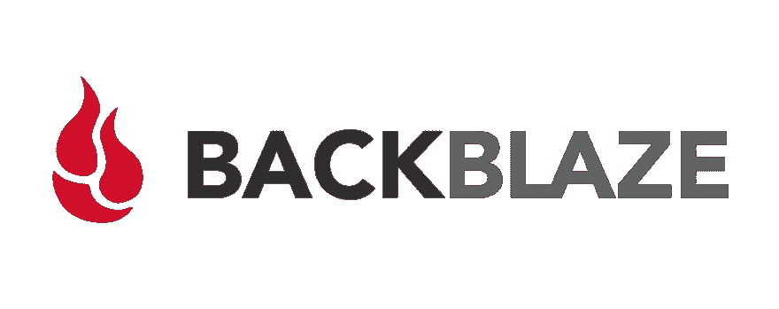

# 2018 年给新的和有抱负的网络开发者的礼物想法

> 原文：<https://dev.to/raddevon/2018-gift-ideas-for-new-and-aspiring-web-developers-28hp>

无论你是想在生活中扮演一个特殊的网络开发人员的圣诞老人，还是想在自己的树下放一些有助于工作的东西，我都有一个伟大的礼物清单，任何网络开发人员都会喜欢。

## 书籍

大多数有抱负的开发人员只想学习如何编码。很刺激。令人欣慰。这是现在的时代精神。(大家都在说大家应该如何学习编码。)

要成为一名优秀的开发人员，你需要知道的不仅仅是代码。我会推荐一些关于软件开发的书籍，但我会从那些帮助大多数开发人员缺乏技能和知识的书籍开始。

### [个人 MBA](https://amzn.to/2PqSNXG)

您可能想知道商业与 web 开发有什么关系。事实是，如果没有商业原因，没有人会为你建立网站付钱。理解商业是如何运作的**是成为一名优秀网络开发者的关键**。不要只是建造人们告诉你建造的任何东西，你可以挖掘项目背后的推理，并决定这个项目是否是正在解决的问题的最佳解决方案。

个人 MBA 是一种可读的快速入门方式。它将向你介绍商业术语，帮助你理解是什么驱动着一个企业，并向你展示各个部分是如何结合在一起的。

### [精益创业](https://amzn.to/2QxK3Ub)

如果你想与初创公司合作，理解精益方法是至关重要的。即使你不希望与初创公司合作，你也可以通过随意的交谈和正式的提议，与你的雇主/客户分享一些信息，让自己看起来很有创新精神。一旦你说服某人不要生产他们*认为*他们的客户想要的产品，从而为他们节省了数千美元，你将成为他们不可或缺的一员。

精益创业公司 教你如何在你的客户身上测试产品的时候逐步构建产品。帮助你的客户应用这些经验，大家都赢了！

### [如何赢得朋友和影响人](https://amzn.to/2KYqLSD)

在我第一次读完这本书后，我真的觉得我需要洗个澡。感觉它应该被命名为“如何操纵他人以得到你想要的”不过，它真的一直困扰着我，我已经开始接受它了。我仍然觉得有些地方很恶心，但我不认为在与人交往中刻意取悦他人是件坏事。

看完[如何赢得朋友和影响人](https://amzn.to/2KYqLSD)，你会更清楚自己被人感知的方式。

### [干净的代码:敏捷软件工艺手册](https://amzn.to/2rmpBHu)

无论开发人员使用什么语言或编写什么类型的软件，编程的某些部分都是相关的。各行各业的 Web 开发人员都应该考虑如何正确命名变量、编写可读性强的代码而不是不必要的简洁代码，以及在代码失控之前对难以维护的代码进行重构。

干净的代码提醒你，我们实际上不是为机器而是为其他人写代码。

### [小阴谋家](https://amzn.to/2Ui2J9j)

直到我读了这本书，我才知道如何写递归代码或者理解递归。通过教授一种叫做 Scheme 的语言，这是对这个概念的一个温和的介绍。

这个小阴谋家超越了它所专注的语言(我还从未在野外见过)，因此，它仍然是我最喜欢的学习编写递归函数的方法。

### [Kindle Paperwhite](https://amzn.to/2QCutX7)

Web 开发人员在不断地学习，但是谁有空间放这些书呢？电子书是一条出路。就像人们渴望纸质书的味道和感觉一样，便利性是不可否认的。在一个小小的设备里，你想要多少书就有多少书。书籍是可搜索的，您可以突出显示重要的文本，以便以后参考。你失去了快速翻阅这本书的能力，但你获得了更多。

Kindle Paperwhite 有一个内置灯，因此可以随时阅读。这是一个触摸屏，所以你可以通过触摸文本来突出显示。电池几乎可以永远使用。这确实是一个简单的设备，但它使用起来很有趣，也是给一个新的 web 开发人员的一个很好的礼物。

## 硬件

作为一名新的 web 开发人员，最难学会的一件事是——特别是如果你的思维方式是稀缺的——你需要在你的技术工具上花钱。木匠可以用石头钉钉子来省钱，而不用买锤子。问题是，他们会浪费时间，做劣质工作，对自己的工作不太满意。

Web 开发也不例外。我们有每天都在使用的工具，可以做得更好，但我们倾向于满足，因为我们来自低薪职业，我们习惯于凑合。确保你生活中的网络开发人员拥有完成伟大工作所需的工具。

### [达斯键盘 4 专业](https://amzn.to/2PlhW5W)

键盘是 web 开发人员最难使用的设备。我们每天连续几个小时不停地敲击键盘。网站开发人员的键盘应该舒适、方便、耐用。

Das Keyboard 4 Professional 一直是我五年来的首选工具。它很漂亮，像坦克一样建造，它有一些很酷的便利功能，如集成的 USB 3 集线器，媒体控制和音量旋钮。我喜欢 clicky 机械按键开关的感觉，这也是我不去换不同键盘的一个原因。当你按下一个键时，它会记录下一个小的凸起，从而加快打字速度。

#### [另类挑:身势优势 2](https://amzn.to/2rr2ICV)

如果不是因为我对按键开关上瘾，我会改用**[Kinesis advantage 2](https://amzn.to/2rr2ICV)**。Das 键盘的一个弱点是人体工程学。这正是 Kinesis 的出名之处。我拥有其中一个键盘大约一个星期了，差别立刻就很明显。我能感觉到我的手和手腕不那么紧张了。如果你不在乎 clicky 开关，并且有预算，这是一条路要走。

无论您决定使用哪种键盘，都要确保您的操作系统版本正确，以便正确标记按键。

### [罗技 MX 垂直](https://amzn.to/2PoEu5Q)

鼠标很容易被认为是理所当然的，在鼠标的世界里，人类工程学的意识似乎没有键盘那么成熟。为了符合人体工程学的趋势，让我们来看看一款鼠标，它将帮助您最大限度地降低重复性压力损伤的风险。

**[罗技 MX 立式](https://amzn.to/2PoEu5Q)** 是我清单上唯一没用过的项目，但我刚刚把它放在了我的愿望清单上。我已经用一个非常简单的鼠标逛了好几年了，但是我可以把我的手腕扭到这个鼠标的角度，然后立刻感到轻松。

### [28 英寸戴尔 4K 显示器(S28)](https://amzn.to/2rqYPh8)

屏幕空间允许 web 开发人员更高效地工作。我可以同时看到我正在编写的代码和它产生的结果，而不必在应用程序之间来回切换。再加一个(或两个)显示器，我就可以转头了。

我有几台已经停产的 27 英寸戴尔 4K 显示器，但这台 **[28 英寸戴尔 4K 显示器](https://amzn.to/2rqYPh8)** 是个不错的替代品。大小和分辨率一起给了 web 开发人员大量的空间来运行他们需要的任何应用程序并同时查看它们。

### [雨设计 mStand 笔记本电脑支架](https://amzn.to/2EkuBVR)

带着笔记本电脑支架回到人体工程学领域。对于像我一样主要在桌子上使用笔记本电脑的开发人员来说，笔记本电脑支架是一种非常简单的改善生活的方法，可以将笔记本电脑的显示器放在眼睛的高度。减少颈部劳损，让一天的工作变得更加愉快。

[**Rain Design mStand 笔记本电脑支架**](https://amzn.to/2EkuBVR) 是一个很棒的笔记本电脑支架，尽管它们几乎都可以使用。我推荐这款，因为我用的就是这款，非常棒。笔记本电脑支架需要做的就是保持稳定，同时将笔记本电脑举到与眼睛齐平的位置。挑一个你最喜欢的。

### [索尼 WH1000XM3](https://amzn.to/2Qlvu6H)

在家工作最困难的事情是保持“工作模式”,周围发生的大量事情会让你分心。耳机是脱离周围环境的好方法，这样你就可以专注于完成工作。

查看一下 [**索尼 WH1000XM3**](https://amzn.to/2Qlvu6H) 。这是另一个例子，我拥有的型号较旧，推荐一个新型号是有意义的。这些器件的关键特性是噪声消除。这真的能让你排除那些干扰，听一些白噪音，咖啡店的声音，甚至是器乐来让你集中注意力。(如果你感兴趣，我详细写了关于[我的对焦系统](https://raddevon.com/articles/focus-for-better-work-life-balance-as-a-web-developer/)。)

## 软件/服务

奇怪的是，编写代码的人有时最难支付费用，即使这会使他们的工作和生活变得容易得多。更糟糕是，一些开发人员欺骗自己，认为他们应该只写自己的解决方案，而不是购买别人写的优秀软件。

请不要允许你生命中任何一个心爱的开发者走上这条毁灭之路。**给他们一个有用的软件或几个月的服务，向他们展示一个优质软件有多棒**。他们会为此感谢你的。

### [1 密码](https://1password.com/giftcards/)

Web 开发人员必须管理密码。好家伙，我们必须管理密码。你认为记录你的苹果密码、银行和网飞很糟糕吗？我和我的客户使用的各种服务有超过 3000 个密码。如果我把它们都写下来，我需要在我的公寓里多一个房间。

修复是一个密码柜。这是一个软件，它可以记录你所有的密码，当你需要的时候可以很容易地找到它们。我知道有几个选项，但是除了**[1 密码](https://1password.com/giftcards/)** 之外，我从来没有探索过其中的任何一个，因为它工作得非常好。当你这么做的时候，[为自己争取一份订阅](https://1password.com/sign-up/)。它让你的数字生活变得更加轻松。

### [懒散](https://www.backblaze.com/partner/af9rzg?redirect=gift.htm)

你听说过你应该备份你所有的文件吗？如果这些文件是你的生计，这一点尤其重要。过去，我们会有包含所有文件副本的外部硬盘。问题是要保持更新。没有人这样做，所以，如果您由于某种原因丢失了文件，您可以从 6 个月前的快照中恢复。

今天，这个问题很容易解决。Backblaze 在我的电脑上后台运行，并在云端保存我所有文件的最新备份。这比手动备份好得多，原因有二。首先，它总是当前的。第二，它不在现场，所以如果发生火灾，我仍然有我的文件，不会让我的客户失望。你可以下载你的备份，或者，如果你很着急，他们会给你一个硬盘驱动器，上面有你的全部备份。

这是另一个你可能也想为自己抓住的。对于你所获得的内心的平静来说，这是非常便宜的。

*如果你想要更多类似这样的帖子，前往[拉德德文](https://raddevon.com/)。当你在那里的时候，注册一个免费的指导课程，这样我就可以帮助你成为一个网络开发者。期待见到你！*