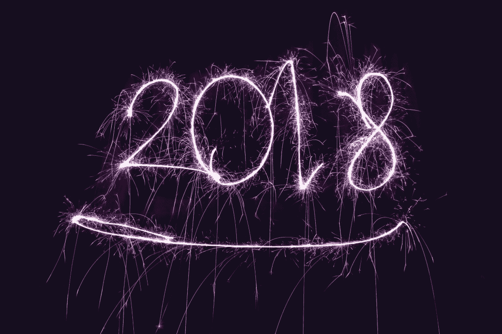

# 2018 年回顾

> 原文：<https://dev.to/pavsaund/2018-in-review-1g3j>

按照传统，我想花几分钟时间回顾一下 2018 年。我发现花时间反思能让我看到自己在旅程中的位置。反思也有助于结束，让我把我的思想和努力引向我未来想要实现的目标。

从职业角度来看，2018 年是最激动人心的一年。从个人成长的角度来看，2018 年既有收获，也有挫折。你可能会问(或者不会问)，这是怎么回事？我至少会问这个问题，并且会在这篇文章中探讨这个问题。

### 透视事物

对你在生活中的位置有一些看法会带来背景。它让你明白你需要把精力集中在哪里，以及你能从结果中期待什么。没有远景，期望就会失控，这是我去年的一个主题。

让我们通过回顾过去几年的主题来补充一些观点:

*   2015 年:我第一次真正精疲力竭的一年。一次令人大开眼界的人生低谷。我也第三次当爸爸了。
*   2016 年:反弹的一年，发现我可以提供更多。我最活跃的博客年，播客出现和一次会议发言。
*   2017 年:探索想法、视频和漏洞。把自己放在各条战线上，博客，视频博客，斯多葛主义，还有一些会议讨论。
*   2018:改变、挑战、奋斗、失败、成长。让我们开始吃吧！

### 变化、挑战、奋斗

今年带来了一个重大的变化——职业的转变。我从一个在大公司担任敏捷蔻驰/管理/领导角色的 Web 开发人员/团队领导，转变成了一家初创公司的创始员工。

我现在担任的角色是用户体验主管/网站开发者，和任何(小)公司一样；头衔毫无意义。用户体验对我来说是一个新的领域，我可以在其中钻研、实践和培养技能。尽管我已经做了很多年的开发人员，但是用现代 JavaScript 构建应用程序一直是一个令人兴奋的挑战。

这些天来，前端和 JavaScript 工作比以往任何时候都多，无论是对于我们的产品和客户项目，还是对于建设伟大文化的所有方面，以及对于一家将持续多年的公司的基础。

### 失败

在任何创业公司工作都是令人兴奋的，这也是我所经历的，即使我们把自己限制在正常的工作日，我们需要应付的球的数量有时也是惊人的。这种转变令人兴奋、振奋，也很痛苦。一方面，我想探索并确立 UX 在杜立德的地位，另一方面，编码和与客户合作带来一些收入自然成为优先考虑的事情。一直以来，我都在摸索着跟上现代 JavaScript Web 开发的步伐。这导致我对自己所做的任何工作都感到不胜任。

感觉我所有的精力都用在没有完成的事情上的另一个后果是消极的想法和我告诉自己的故事。幸运的是，我决定和杜立德一起工作的人是我有幸认识的最好的人，仅次于我的生活伴侣，他们提供了支持。但是这种感觉仍然挥之不去——这是我自己需要解决和处理的事情。这导致了我下一个真正的失败——没有花时间反思和处理我学到了多少。

与此相关的是，我意识到以前的成就一直阻碍着我未来的成就。出于几个原因，我一直在努力把我的自我和内容放在那里，其中一个原因是我一直在根据以前的成就不断比较和提高标准，而没有应用任何形式的背景或观点。“应该”这个词被用得太频繁了，这导致了一场羞愧的内心对话。

### 成长

快到年底时，事情看起来要光明得多。我对我们在工作中面临的日常挑战感到更加自在，也能够承认我的角色和我所做的贡献。更光明的前景给了我一些空间来反思我的学习。我还发现了自己的一个弱点(在同事的帮助下)，那就是我经常自我审查。这一弱点表现在不在会议上发言，不通过其他沟通渠道分享我对我认为重要的事情的想法，这也给我在公共场合写任何东西的尝试设置了坚实的障碍。抑制想法并不等同于在形成观点之前对一个话题进行反思和思考(我也会这样做)，而是当我显然有话要问或要说的时候——我没有。

我很害怕。害怕没有正确的答案，害怕显得愚蠢，害怕把想法藏在心里。识别这种特殊的行为是一个重要的发现。害怕让自己变得不完美是我所面临的许多问题的根源，也是我在未来一年将努力解决的事情。

正如我前面提到的，创业意味着身兼数职，今年我用 AureliaJS 重新拥抱了现代 javascript web 开发。这是一个痛苦的过程，想要交付和发布伟大的产品，但却被“简单”的事情绊倒，比如识别组件抽象、理解 es6 语法，以及学习框架本身。我内心的声音认为这些学习是简单的事情，这是不切实际期望的“应该”问题的另一种表现。

当我现在回头看时，我为我在这个领域取得的进步感到自豪。在不到一年的时间里，从感觉能力不足到能够编写和构建应用程序，编写可重用的和业务组件，以及用 TDD 驱动应用程序逻辑，这是一个巨大的胜利。

如果没有我周围的人，我不可能学到任何东西。他们说你是最亲近的 5 个人中的平均水平，而我身边有 5 个在我的职业生涯中最有影响力的人，更不用说他们身边还有其他同样受他们影响的人。能够在这样的条件下工作，我感到谦卑、荣幸和荣幸。

### [私人笔记上的](#on-a-private-note)

私下里，我想提一下跑步。2018 年是我有目的地让跑步成为习惯的一年。谈到跑步，我对 2019 年有一些重大的目标，即在年底前完成一场马拉松，这意味着养成习惯并应用跑步计划和结构。

我也大幅减少了家里的电话使用量。禁用了我的 facebook 账户，删除了我手机上的 twitter，优化了更多的时间与他们在一起。当我们的第三个孩子从天真的蹒跚学步的孩子转变为混沌怪物(3 岁)时，它就派上了用场。

我还能在上下班途中浏览不少书籍。对于任何感兴趣的人，你可以在 Goodreads 上看到我的进展[。](https://www.goodreads.com/pavsaund)

### 总之

在一篇博文中总结一整年的起起落落本身就很有挑战性，写这篇文章比预期的要困难得多。我知道我想在花时间做其他事情之前写这个，所以它有可能成为我的障碍。

我也希望这是一个个人反思的帖子，而不是一套有用的技巧、我学到的东西、速赢——成就、贡献和附带项目的列表。外面已经够了。相反，我希望这个帖子提醒人们，生活是混乱的。我们都有自己的起起落落，成长、扩张和反思的周期。这并不意味着你在任何方面不如别人，只是你是人，在你自己的旅途上。

在一天结束的时候，我很荣幸能和一些优秀的人一起工作，一起完成一个伟大的使命，建立我们一直想工作的公司。与此同时，拥有一个珍贵的家庭生活，能够和我的孩子共度美好时光。

回想起来，2018 年正是我需要为 2019 年做准备的一年。至少我是这样看待它的，也许这就够了？

2018 年对你来说是怎样的？你是如何过渡到 2019 年的？请分享你的想法和反思。

*原载于 2019 年 1 月 14 日*[*【codingwithempathy.com】*](https://codingwithempathy.com/2019/01/14/2018-in-review/)*。*