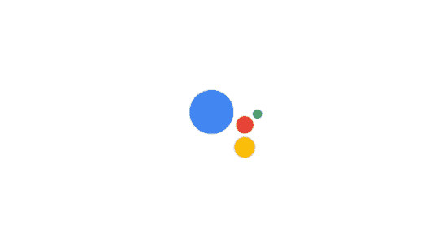
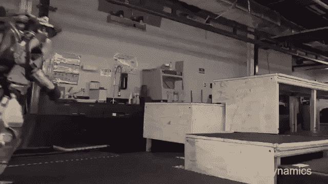
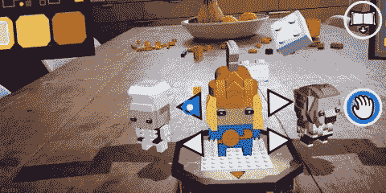

# 2018:人工智能年

> 原文：<https://dev.to/oninross/2018-the-year-of-artificial-intelligence-1onm>

【原贴于*】*

 *又一年很快过去了——然而，今年却一直如此。人工智能(AI)一直在不断地成为科技头条，我很幸运能够玩玩其中的一些。随着技术以指数速度增长和发展，人工智能在未来能为我们提供什么？

## 人工智能——AI 将继续进步，不管是好是坏

贾维斯、天网和哈尔是科幻小说中众所周知的具有自我意识和感知能力的计算机程序。虽然这些角色可能离遥远的未来不远了，但谷歌和 IBM 等公司正在不断开发系统，要么帮助我们更快地完成特定任务，要么比我们人类更好，希望有一天机器人或机器人会在那里为我们做脏活。人工智能曾一度让人们担心失去工作。请放松，因为在这个时间点上，人工智能只能在非常特定的领域表现出色。

借助机器学习，我们将看到公司利用人工智能来自动化任务，如快速准确的数据学习、自主移动机器人、数字助理和对话平台等。我们首先看到人工智能在智能手机中得到应用，如苹果的 Siri 和谷歌的 Assistant，最近几个月，我们看到智能扬声器突然激增，向消费者发布。在未来几年，人工智能将继续像野火一样在整个行业蔓延。2019 年，我们肯定会看到更多的人工智能被集成到其他设备中，帮助我们快速完成更多任务，而不会让我们人类弄脏自己的手。

## 对话平台——“您好，今天有什么可以帮您的吗？”

“好吧谷歌，嘿 Siri，Alexa，”谷歌，苹果和亚马逊的个人助理的初始化命令。各自科技公司开发的平台已经铺平了道路，并利用人工智能和机器学习开发了语音识别算法。聊天机器人冲击了这个行业，最初对呼叫中心构成了威胁，这些呼叫中心通过回答最常见的问题来帮助减轻人们的负担，或者在不需要人类驾驶的情况下通过对话帮助消费者购买物品。

在其炒作周期的高峰期，我试验了这项技术， ***[学到了一些关于构建聊天机器人](https://dev.to/#/article/what-i-have-learned-from-building-a-chatbot)*** 的东西。我学到的最重要的一个教训是“永远不要因为炒作而建造聊天机器人”，因为这将是项目的失败。2019 年，随着科技公司继续开发和改进这些平台，消费者更有可能接受这些对话平台。因为创建聊天机器人真的很容易，我们会看到更多的聊天机器人在任何地方出现，我们甚至可能在不知不觉中与一个人 ***[交谈。](http://nat-ai.herokuapp.com/)***

## 由于一直在线，智能手机的使用将稳步增长

我们都知道，我们的智能手机是我们的“数字瑞士军刀”，我们不能离开家没有它。浏览器一直是让用户上网的平台，科技公司也在不断改进产品，以满足忠实消费者的需求。除了改善电池寿命、屏幕尺寸和相机质量，谷歌和苹果还将人工智能集成到他们的软件中，提供了更好、更流畅的用户体验。不仅你的手机中一直有一个虚拟助手，它还会学习并“预测”你在一天中的特定时间可能最常使用的应用程序。

在 2019 年和未来几年，浏览器不会停止改进。浏览器正在获得越来越“原生”和“类似应用”的特性和功能。机器学习甚至已经登陆浏览器，我已经成功地尝试了这些技术，使我能够使用相机和网络浏览器***[检测物体。开发者甚至计划将虚拟和增强现实作为网络浏览器的标准，以便让更多用户无需下载应用程序就能获得身临其境的体验。](https://dev.to/#/article/identifying-objects-using-your-browser-with-tensorflowjs)***

## 超级超级超级个性化——更好的客户体验意味着更忠诚的客户

我打开浏览器，开始浏览脸书或亚马逊，起初我没有注意到，但我看到了一个熟悉的模式:我看到了与我过去的搜索相关的广告或帖子。我听 Spotify，看 YouTube 上的视频或网飞上的电影，我注意到正在播放的音乐或电影是我感兴趣的。我没有告诉任何人，也没有保存任何偏好。就这么发生了。这是什么魔法？

随着个性化的出现，人们仅仅从他们订阅的网站和服务的电子邮件中读出自己的名字是不够的。这已经是数字营销的标准。超个性化则更进一步，通过提供人们想要或更感兴趣的东西来定制他们的客户体验或旅程。在未来几年，人工智能帮助下的超个性化将使公司能够尽快提供消费者想要或感兴趣的东西，提供更好的客户体验，并使他们忠于品牌。更好的客户体验意味着更忠诚的客户。更忠诚的顾客意味着公司能赚更多的钱。我对此无能为力。

## 自主移动机器人——机器人跑步开门，sh*t 渐入现实

我一直以为无人机只会是有钱人的玩具，在空旷的地方飞来飞去，拍下任何人都不可能拍到的照片或视频。随着无人机变得越来越便宜，它们现在被用来运输包裹、食物或其他货物到各地。这些无人驾驶飞行器(UAV)可以帮助向难以到达的地方运送医疗物资。在人工智能的支持下，这些无人机不再需要人类的帮助。它们被设计成这样，一旦出现问题，它们知道该做什么。他们知道去哪里，如何在没有人干预的情况下回到总部。

在看了黑镜的《金属头》一集和波士顿动力公司的机器人短片后，未来变得有点令人兴奋(或者更可怕，取决于你如何看待它)。随着无人机现在能够运送货物，机器人可以跑酷，狗可以开门，显然，拥有机器人或机器人作为助手的梦想将在不久的将来帮助我们。也许有一天，我们会有自己的 3po 来帮助我们。

## 奖励回合:沉浸式体验(AR，&VR)——融合数字世界与物理世界

增强现实和虚拟现实已经有一段时间了。然而，它只是在游戏领域获得了最大的吸引力。最著名的 AR 游戏是 Pokemon Go，玩家可以通过在物理世界中行走来“锻炼”，在数字世界中搜索口袋妖怪。虚拟现实游戏也通过让玩家沉浸在另一个世界中而受到欢迎。他们可以在自己置身的虚拟世界中看到、听到和互动。Zero Latency 和 VR Zone Shinjuku 等科技公司向公众提供 VR 体验。我很幸运在日本享受和体验了 VR 游戏，我想说这不仅有趣，而且对任何游戏玩家来说都是一次难忘的经历。

AR 和 VR 现在已经将他们的触角延伸到了游戏世界之外。在接下来的几年里，它将延伸到培训、教育和旅游等部门。一些公司已经接受了这项技术，并为他们的客户提供了身临其境的体验。零售公司投资了 AR 摊位，在那里他们的顾客可以试穿衣服，甚至不用在虚拟世界中脱下自己的衣服。随着谷歌和 Mozilla 等科技公司开发 AR 和 VR 成为浏览器的标准，我相信有一天，我们会看到更多的 ***【移动网络中的沉浸式体验*】(/#/article/VR-and-AR-in-the-mobile-web)**。

## 总结一下:前途是光明的

2019 年将是令人兴奋的一年，因为人工智能，增强现实和虚拟现实继续获得牵引力，技术变得越来越好，越来越便宜。我认为，明年将会是这些技术趋势融入更多智能设备和可穿戴设备的一年。我们可能会看到智能眼镜的崛起(或回归)。几年前，谷歌眼镜还没有为消费市场做好准备，可能是因为价格标签、电池寿命或隐私问题，但改变智能眼镜的方法和目的可能会改变人们对该设备的看法。*