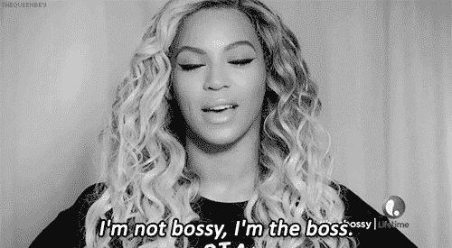

# 2018 年回顾

> 原文：<https://dev.to/lkopacz/2018-year-in-review-2le8>

[https://api.parler.io/ss/player?url=https://www.parler.io/audio/7119149108/2807a3de0b61446fdc71a748f040f6d531a264b4.6718b88f-04db-48db-98f8-88ca7c5cfb49.mp3](https://api.parler.io/ss/player?url=https://www.parler.io/audio/7119149108/2807a3de0b61446fdc71a748f040f6d531a264b4.6718b88f-04db-48db-98f8-88ca7c5cfb49.mp3)

又到了一年中的这个时候，我会说出同样一句可预测的话:“今年感觉如此漫长却又如此短暂！”有些人可能已经注意到了，我在 12 月暂停了写博客。然而，积极的一面是我有很多时间来反思这一年和我来年的目标。

## 博客

这个博客是我从今年四月就想开始的。我和我的朋友 Raquel(页脚链接)一起设计了标志，并决定了配色方案。她是一个了不起的资源，我已经把她推荐给正在寻找设计师的朋友。但是在路上的某个地方，因为我在 Drupal 中建立我的博客，我被托管成本拖慢了一点。Drupal 托管很贵，考虑到我没有从博客中获得任何收入，我需要一个更便宜的替代方案。直到我的朋友阿里·斯皮特尔告诉我盖茨比和奈利菲的事，我才真正重新振作起来。知道成本不再是一个因素，它重新点燃了我的兴奋！

我在 10 月 3 日(我的生日)开通了我的博客，从那天到年底，我的统计如下:

*   9 个帖子，全部交叉发布在开发到上
*   1 个帖子仅发布在开发到
*   我博客网站上的 2.6k 个会话
*   dev.to 上的 11，208 次浏览

我从中学到的是:永远不要越界。我写博客的主要目标之一是与世界分享我的知识。在 [dev.to](https://dev.to/) 上已经有这么多的读者，如果我没有在那里交叉发布，他们都不会看到我的内容。虽然我写博客有一些商业动机，但我的大部分目标都与分享我的知识和让自己成为主题专家有关。

我也从许多了不起的专家那里学到了东西，比如马克斯·安东努奇、T2、马西·萨顿、T4、塔蒂亚娜·麦克、T5 等等。如果你还没有关注这些人，你应该关注一下！

## 事业

对我的职业生涯来说，这是激动人心的一年。我一直认为我的职业与我的工作主题高度相关。我寻找的职位通常与我希望的职业发展方向高度相关。虽然情况依然如此，但我的职业生涯也开始融入副业。

### 一边招摇撞骗

根据谈话对象的不同，侧推似乎有着非常不同的含义，所以首先我想澄清一下它对我来说是什么，不适合我:

**我不喜欢这种小把戏**

1.  一种从我的伴侣、朋友和家人那里偷走我时间的方式。
2.  一种用“挤来挤去”的心态去倦怠的方式。
3.  成为一名企业家。
4.  以编码为中心。

**对我来说这是一个多么大的挑战**

1.  我自己的资产。
2.  掌控自己的事情。
3.  一种让我定义自己职业而不是另一家公司的方式。
4.  一种调查什么有效什么无效的方法。

如果你两年前问我是否有创业精神，我可能会当面嘲笑你。字面上。我的父母都是个体户，我一直不明白那条路。我从来不想担心管理费用、税收或不一致的钱。我只想去工作，做自己的事，让他们给我工资和福利。

我仍然看到其中的价值，这就是为什么我没有 100%为自己工作。副业是一种很好的方式，可以让你轻松地进行创业思维，但它降低了压力和风险，因为我仍然有全职工作带来的福利和薪水。虽然我还没有赚到钱，但是我已经得到了将我的教学货币化的机会，这真的很令人兴奋，我计划在新的一年里做这件事！

### 白天的工作

自从我开始从事技术工作以来，今年是我开发生涯中最重大的转变。我知道这听起来很夸张，但是我做开发人员时的每份工作都是在 Drupal 中完成的。今年，我过渡到做 JavaScript 和数据可视化工作！这种转变有几个原因。

首先，我只是觉得无聊。Drupal 已经走过了很长的路，并且有很多创新的东西要做。在使用 Drupal 的过程中，我参与了很多很酷的定制工作。但是工作不再适合我了。虽然您可以使用 Drupal 来构建应用程序，但现实情况是，大多数被 Drupal 吸引的客户仍然希望开发网站，并且不喜欢使用 Drupal 作为一种为解耦框架提供内容的方式。

第二，由于我住的地方的生活成本，我做 Drupal 工作赚的钱不够多，不足以节省很多钱，也不足以享受我的生活。过渡到 JavaScript 工作是一个不错的加薪(大约 32%)。从个人角度来说，我很高兴能够节省我的钱，并从中获得一点乐趣。我很高兴能时不时地给自己做个漂亮的发型和面部护理。老实说，我可能会保存其中的大部分，但对治疗自己不感到内疚也很好！

最后，这是一个扩展我的无障碍知识的绝佳机会！我真的很高兴了解更多关于 JavaScript 和 DataViz 社区在解决可访问性问题方面的问题，以及如何帮助他们解决这个问题。

我相信这会框定我未来的很多内容。敬请期待:)。

## 个人

我将长话短说，因为这不是我的私人日记。如果你想知道更多关于这方面的东西，我在 Twitter 上谈了很多。

我越来越喜欢举重，变得超级强壮！

> 你们所有人。我有两个 PRs(个人记录而不是拉动请求)。
> 
> 卧推 135 磅
> 硬拉 200 磅
> 
> 💪🏼💪🏼💪🏼
> 
> — Lindsey Kopacz (@littlekope0903) [December 9, 2018](https://twitter.com/littlekope0903/status/1071567729843421184?ref_src=twsrc%5Etfw)

我订婚了！

> 在我们告诉家人之前，我一直没有在社交媒体上发布这个....但是我和我的男朋友在🥰度假的时候订婚了😍。
> 
> 我和这个男人在一起 4 年了。他支持我度过了所有的高潮和低谷。我太激动了😁pic.twitter.com/ihXNnEE1zP
> 
> — Lindsey Kopacz (@littlekope0903) [December 26, 2018](https://twitter.com/littlekope0903/status/1077757311362519040?ref_src=twsrc%5Etfw)

最后，我的心理健康有所改善，因为我不再让自己感到羞耻，并学会了给自己和他人设定界限。

## 2019 聚焦

这篇文章比我想象的要长。所以我将长话短说，谈谈我明年的计划:

1.  管理我们的婚礼，同时管理我的个人目标。
2.  管理好我的时间，因为你可能会看到，我有很多事情要做。新的工作领域，额外收入，婚礼，成为好朋友，好女儿，好伴侣。
3.  每周发一篇博客，如果太多的话，每隔一周发一篇。
4.  每周录制一个 egghead.io 视频，如果太多的话，每隔一周录制一次。
5.  专注于增加我的电子邮件列表。我正在考虑创建一个免费的无障碍介绍课程。
6.  如果我的目标对我的精神健康和生活有负面影响，请随时重新评估

为美好的 2019 年干杯！我很想看看你的一些回顾！

