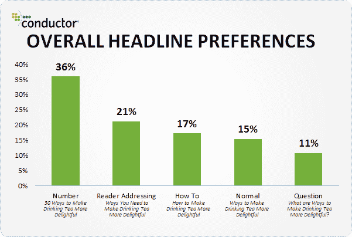
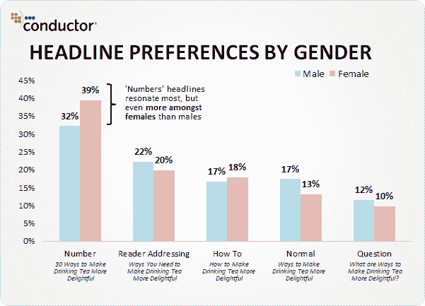
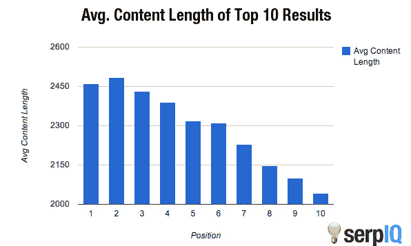
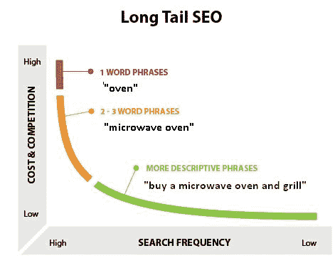
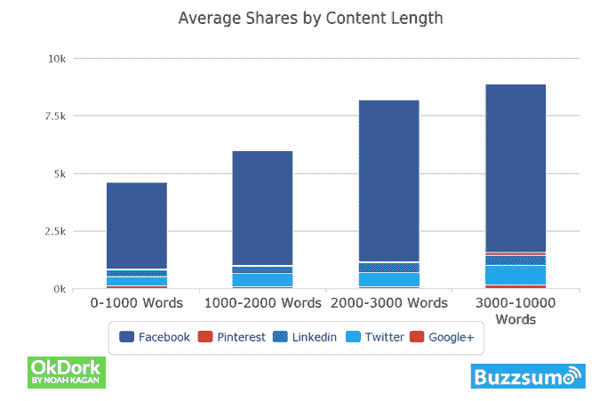

# 29 个简单的技巧来增加你网站的访问量，写出更好的文章

> 原文：<https://dev.to/gligan/29-easy-tricks-to-increase-the-visits-in-your-website-5em>

在这篇*超级文章*中，你将学到一些技巧，通过这些技巧，你将能够提高网站的访问量，写出更好的内容。

一篇制作精良的文章可以有以下优点:

*   **吸引用户和搜索引擎到你的网页**当许多用户点击你的文章，使搜索引擎认为内容可能是好的，并显示更多。
*   **如果人们喜欢你的文章，他们会想要更多**一个好的标题也可以帮助人们开始记住你的网站(和你的品牌),并更经常地访问它。
*   你的文章也可以虚拟化的确，你需要做一些修改，但这很简单，我现在就展示给你看。

## 制作更好的片头。

当你在创作一篇文章时，一个常见的问题是标题，你必须想到这些将是你的用户看到的第一件事，无论是在谷歌上，在你上传文章的平台上，还是在文章的页面上。

### 为什么头衔很重要？

标题通常用来吸引人们关注你的内容，但是搜索引擎(Google，Bing，DuckDuckGo，Yahoo 等。)将它们作为在他们的大型数据库中对你的内容进行排名的因素之一。

您的头衔将出现在三个主要位置:to

1.  搜索引擎结果页面
2.  浏览器标签
3.  社交网络

### 立即学习 Clickbait。

Clickbait 是一种提高点击率(点击率，点击次数)的策略。

#### click bait 是如何工作的？

Clickbait 利用了人类与生俱来的好奇心。

这里您可以看到一个清晰的 clickbait 示例:

在 clickbait 中，通常有两个常见的部分:新闻和在 T1 之后发生的事件。

在这种情况下，新闻是关于*男子**试图**拥抱一只野生狮子*并且事件发生后还不为人知，它引发了阴谋，结尾说*你不会相信接下来发生了什么！*。

#### 13 个 Clickbait 模板。

这里有 13 个模板，在你写 clickbait 文章时会对你有用。

1.  **【数量】秘密【为了/为了】【可取的东西】**
2.  **如何【想要的东西/成就/话题】**。例如:*如何销售恐惧*。
3.  **【数字】大多数人在【动作】时犯的错误**
4.  **如何在【时间的空间】**中【想要的结果】。例子:*我们是如何在一年内赚到 200 万美元的？*
5.  **权威的[指南/列表][到/的][主题/想要的东西]**
6.  **【关键字】:【定义它的环节不完整】**。例子:*假设:虚荣心表明一个人……*
7.  **【祈使令】**。你可以使用像*不，停止，停止等等*这样的词语。例句:*别再相信共产主义之类的废话了。它们不起作用。*。
8.  我们已经分析了大量的东西，这就是我们的发现。
9.  **【数字】行之有效的技术【达到效果】**
10.  **我学到的【数】个教训【做某事】**。
11.  **【某人】【做了某事】【还有/。][看看发生了什么/这是怎么回事/……]**。这是最常见的点击诱饵。
12.  **【做点名人的事】**。例子:*学着像希特勒一样留胡子*。
13.  **补习到【修成正果】**。例子:*在 Instagram* 获得关注者最简单的教程。

* * *

### 在标题中使用数字。

与其他方法相比，使用数字(通常在句首)的标题往往有 15%的点击率。这太棒了！

所有这些数据都来自 Moz 的一项研究，你可以点击[这里](https://moz.com/blog/5-data-insights-into-the-headlines-readers-click)阅读。

在这里，您可以看到与其他方法相比，使用数字进行的转换:

这项研究除了普遍吸引任何人之外，还可以观察到它吸引的女性比男性多一点:

你可以在很多方面使用这种方法，但这里有一个简单的指南:

*   **使用它们在标题**的开头创建列表。最好把编号写在文章开头(如果可能的话)。示例:
    *   *17 种赢得战斗的方法*。
    *   创建网站的 13 个技巧。
*   **单子大一点就好很多**。内容越多的列表吸引的用户就越多。示例:
    *   *学习建筑的 23 种方法*。
    *   *巴黎你不知道的 31 件事*。
*   **使用奇数**这看起来很奇怪，但出于某种原因，它吸引了更多的注意力，例如:15，这个数字给人的感觉是 14 + 1 个元素的列表。

### 让你的标题清晰、简单、直接。

你的标题必须简洁突出，尽量用最少(最好)的字数表达文章的关键概念。

当标题少于 60 个字符时，谷歌通常会显示不带点( *…* )的标题。尽量不要超过限度。

写标题有不同的方法，但这些是最常用的:

*   **正常的** *创造醒目标题的方法*
*   **用数字** *打造醒目标题的 25 种方法*
*   **向读者演讲** *让你的标题吸引眼球的方法*
*   **问题** *有哪些方法可以打造醒目的标题？*
*   **用‘如何’间接提问** *我怎样才能创造出醒目的标题？*

通常，对您最有用的方法是使用数字的方法(第二种)。

### 使用‘NO’和最高级形容词

这是一个很好的技术，在做测试时，我给出了比其他同类型文章多 37%的点击量。

不要滥用这种技术，只在必要时使用。每个标题平均只使用一个最高级形容词。

这里你可以看到一个标题表，以及它们是如何通过增加或减少最高级形容词的数量来改变的。

| 例句 | 名词（noun 的缩写）形容词的最高级 |
| --- | --- |
| 27 种训练狗的方法 | Zero |
| 训练狗的 27 种最佳方法 | one |
| 永远训练一只狗的 27 种最佳方法 | Two |
| 27 种永远完美训练狗狗的最佳方法 | three |
| 永远完美地训练一只狗的 27 种最好和最聪明的方法 | four |

### 标题中的大写和/或小写

几项研究一致认为，将每个单词的第一个字母用大写字母(除了决定因素、介词等)。)，总比什么都用大写字母或小写字母写好。示例:

1.  [☑]在西班牙你不该做的 25 件事。
2.  [☒]在西班牙你不该做的 25 件事。
3.  [☒]在西班牙你不该做的 25 件事。
4.  [~]在西班牙不该做的 25 件事。

第一种方法最适合大多数情况。第二种方法也可以应用到某些地方，比如 YouTube。第三种方法不太吸引人，我劝你不要用它做标题。

你可以用大写和小写字母来强调关键词甚至否定。在某些情况下，它会对你有用。

## 文章的内容。

内容是文章的根本部分，没有内容的文章是没有价值的，所以让我们来学习如何做好内容。

### 文章结构

文章必须有一个关键概念，这将分为子概念，这些更多的 conenido，可以是文本或更多的副标题

### 文章的易读性。

为了能够容易地理解一篇文章是至关重要的，这里输入排版，大小和行与段之间的空间。

#### 适合你的网页的排版。

谷歌字体是一个很好的字体库。虽然还有其他的(像 Adobe 字体，o 你可以在 Behance 找到一些很酷的字体)，但是我觉得 Google Fonts 是最好的免费资源库。

我推荐的排版比如 *[开 Sans](https://fonts.google.com/specimen/Open+Sans)* ， *[Lato](https://fonts.google.com/specimen/Lato)* ， *[Roboto](https://fonts.google.com/specimen/Roboto)* 或者任何类型的排版 **[Sans Serif](https://fonts.google.com/?category=Sans+Serif)** 。

这里你有一个非常好的谷歌字体字体组合器。[转到字体组合器](https://codepen.io/linux_rdgg/full/EzXmxr)。

对于标题，你可以使用与文本相同的字体，但是如果你愿意，你可以看到[衬线](https://fonts.google.com/?category=Serif)字体。

#### 字号。

通常情况下，文本的大小应该在 17px 到 25px 之间，并且在你的网站的移动版本中尽量使 T2 文本变小。

尝试区分标题的大小和厚度(以及一点不透明度)，例如:

*   *标题*加粗无不透明。
*   *文字*厚度 400 和一些不透明度。

#### 行距。

行与行之间的间距很重要，这是一个 **<abbr title="Cascading Style Sheet">CSS</abbr> 属性**，这个叫做`line-height: 1.5;`，通常一个好的数字放在那里是 1.5，就足以能够很好地阅读它。

### 字幕、图片、视频、列表、粗体和斜体。

知道如何使用所有这些组件是非常重要的，这里有一个详细的指南。

#### 字幕。

字幕用于将主要概念分成几个子概念。

它们应该包含你想要传达的最重要的词，以及那些有助于读者理解你在说什么的词。

#### 图片和视频(YouTube)。

图片是用来显示内容的，尽量不要在文章中添加太多的照片，它们会使页面加载速度变慢。每篇文章可以加 0 ~ 5 张左右的照片(低质量的)。

视频很容易添加，我们在 YouTube 上搜索视频，点击视频，转到分享按钮，然后点击它。然后选择插入，复制代码并粘贴到文章的编辑器中。

#### 列表(ul & ol)。

有两种主要类型的列表，无序(`<ul>`)和有序(`<ol>`)列表。

无序列表更常见，简单地用文本处理点，例如:

*   A
*   B
*   C

有序列表用数字而不是点进行编号，例如:

1.  A
2.  B
3.  C

#### 粗体和斜体。

许多会阅读你的文章的用户不会全部阅读，添加**粗体**和*草书*是很重要的，可以使文本更具可读性，更*简短*。

当你想突出一个概念时，使用**粗体**。为了知道你是否做得很好，你只能在文章中使用粗体，如果你理解了，那就意味着你做得很好。

当你想展示一个不为人知的概念，或者你想写出某人说过的话，或者你想替换引号( *" "* ， *' '* )，你可以使用*草书*。

你也可以使用<mark>标记的文本</mark>(如果你的编辑允许的话)。类似于粗体但是更醒目。

### 为你的文章量字数。

也许你的 500 字的文章足够了，也许你需要 5000 字的文章来告诉你需要什么，这将取决于你的主题，你越接近休闲，它们就应该越短，它们就应该越长，越详细。

我的文章要有多少字？问得好，答案:*问你的* *观众* * *。

#### 细分游客。

如果是科学、技术、新闻或任何不有趣的话题，应该有最多**个可能的单词**(除非不知道这个话题)。

试着让**更长的文章**不写废话，让**写够**。

#### 每篇文章的普通平均字数。

[Medium](https://medium.com) 是一个很棒的*新闻/博客门户*，他们做了一个[调查](https://medium.com/data-lab/the-optimal-post-is-7-minutes-74b9f41509b)，发现**访问量最大的**和*喜爱的*文章是那些持续大约 **7 分钟**的文章。

#### 我的文章能有多少分钟。

这可以变化很大，人们不喜欢花一个小时阅读(除非你的内容超级好)，所以尽量不要让一篇文章太长，但不要留下任何没有说的话(尽量少用词)。

#### 长内容相对于短内容的优势。

SerpIQ 的一项研究确定，超过 2000 字的内容在谷歌上的位置更好。

#### 效用显示字数。

如果你的内容在逻辑上有更多的单词，它在谷歌的位置会更好。

##### 了解长尾关键词。

如果你的博客正在起步，或者你想要更多的访问者，使用 ***长尾*** 方法是很重要的，这里你可以看到它是如何工作的图表:

比起寻找*烤箱* ( *逻辑上*)来说，在搜索*购买一台微波炉和烤架*时更容易抢先一步😀).

##### 获取更多外部链接。

大量的文章给人的感觉不仅仅是字数少的文章，Moz 做了一个[研究](https://moz.com/blog/what-kind-of-content-gets-links-in-2012)，他们观察到字数多的文章有更多来自其他网站(社交网络、论坛、其他文章等)的链接。).

##### 病毒化的可能性更大。

这也和字数有关，和它给我们的感觉有关。Buzzsumo 对超过 1 亿篇文章进行了分析，发现文章越长，越有可能在社交网络上被分享。

