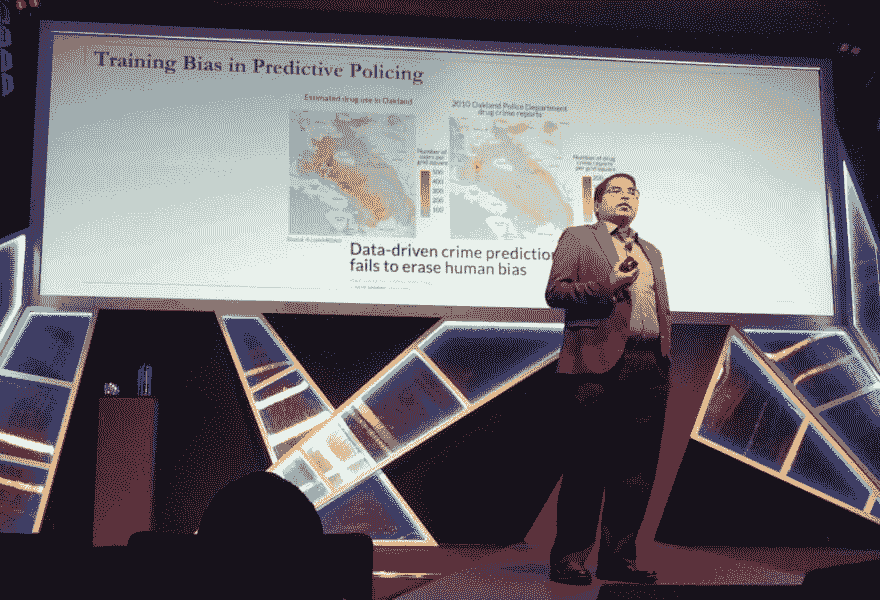
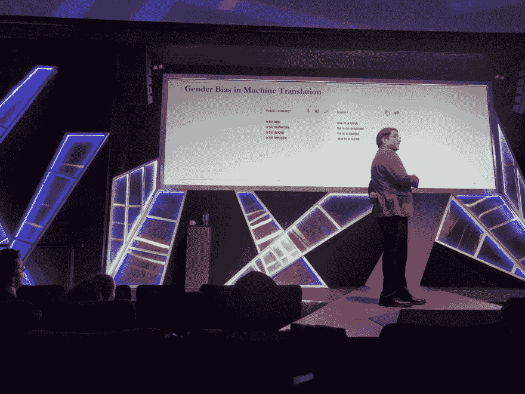

# 构建更好的人工智能的 3 个教训(来自 2019 年图灵演讲)

> 原文：<https://dev.to/matmooredev/3-lessons-for-building-better-ai-from-the-2019-turing-talk-3dd1>

周一，我参加了由英国计算机学会(BCS)和工程技术研究所(IET)主办的 2019 年图灵演讲(T1)。这是他们每年组织的一次免费讲座。今年，他们邀请了[Krishna gum madi](https://people.mpi-sws.org/~gummadi/)博士谈论人工智能中的偏见:

> 机器(数据驱动的基于学习的算法)决策正在越来越多地用于帮助或取代人类在各种领域的决策，从银行(评估用户信用)和招聘(排列申请人)，到司法(罪犯特征分析)和新闻(推荐新闻故事)。最近，人们开始关注这种算法决策中潜在的偏见和不公平。
> 
> 在此背景下，在本次演讲中，我们将尝试解决以下关于人机决策的基本问题:
> 
> (a)机器如何学会做出有偏见或不公平的决定？
> (b)我们如何量化(测量)和控制(减轻)机器决策中的偏差或不公平？
> (c)机器决策可以被设计来帮助人类控制(减轻)他们自己决策中的偏见或不公平吗？

# 那么，会出什么差错呢？

这个演讲集中在有偏见的机器学习的真实世界的例子上。其中一个例子是 COMPAS。这是一个预测累犯(罪犯是否有可能再次犯罪)的工具，它对黑人被告有偏见。你可以在 Propublica 的[机器偏见](https://www.propublica.org/article/machine-bias-risk-assessments-in-criminal-sentencing)文章中读到更多。分析的细节也包含在附带的文章[我们如何分析 COMPAS 累犯算法](https://www.propublica.org/article/how-we-analyzed-the-compas-recidivism-algorithm)中。

我以前听说过这一点，但从这次演讲中让我印象深刻的是，设计者不仅仅是在实现过程中粗心大意。他们已经考虑了如何使算法公平，但他们仍然错了。

他们认为，如果他们从机器学习中删除种族作为一个特征，它的决定将是公平的，因为所有其他因素都相同，算法应该为不同种族的人提供相同的输出。但在实践中，如果是白人，重新犯罪的被告更有可能获得较低的风险分数，如果是黑人，没有重新犯罪的被告更有可能获得较高的风险分数。

# 第一课:整体最优！=子组的最佳选择

显然，一个大问题是他们定义目标函数的方式。这意味着该算法针对整个群体进行了优化，但该算法仍被允许针对一些子群体和其他子群体进行不同的执行。

这让我想到了 youtube [无意中推广的大量点击诱饵、极端主义和阴谋论](https://threadreaderapp.com/thread/1094359564559044610.html)。它并不是为了区别对待这些视频而设计的，但推广它们恰好是实现其目标(大量观看)的最佳方式。

可以约束目标函数，用整体准确性换取公平，但这似乎有很多微妙之处，你必须理解“公平”对你工作的领域真正意味着什么。

# 第二课:训练数据中的采样偏差会使结果产生偏差

另一个例子是“预测性警务”(你让警察去哪里处理与毒品有关的犯罪？)-问题是训练数据来自警方报告，如果你与其他药物使用的估计相比，警察已经不成比例地针对黑人社区。当人们根据算法的结果采取行动时，这就形成了一个恶性循环，算法使已经存在的偏见永久化。

# 第三课:潜在表征捕捉人类偏见

演讲的最后部分解释了在机器学习中使用潜在表征的问题。当你使用类似于 [word2vec](https://p.migdal.pl/2017/01/06/king-man-woman-queen-why.html) 的东西时，你是在将每个单词的信息提取到一个向量中，而这个向量对人类来说并没有内在的意义。这个单词的这种表示法编码了大量的信息，其结果是非常不可预测的。

例如，在机器翻译中，当从具有中性代词(土耳其语)的语言转换为英语时，算法(在新闻文章上训练)只是根据它所选取的文化定型来组成代词。

# 怎样才能做得更好？

这个演讲令我着迷，因为它展示了人工智能研究的现状以及机器学习在现实世界中可能失败的方式。

我在公共部门工作，人工智能基本上被视为神奇的仙尘，你可以撒在你的官僚机构上，让它更有效率。但是，不管算法有多复杂，如果一个系统对人们的生活做出了重要的决定，如果你认为它一直完美地工作，你就会遇到问题。即使你有一个人在循环中，你也很容易相信算法给出的任何东西。

任何复杂的系统都会有失败的情况。我认为要构建质量更好的软件，我们需要承认我们不能消除所有的失败来源，但是我们可以让系统更能容忍失败。如果错误可以通过其他系统或流程来纠正，那么一定数量的错误可能是可以接受的(就像法律系统如何有上诉法院)。您可以在系统中设计约束或安全措施来防止不良后果。即使问题在很久以后才变得明显，随着时间的推移，您仍然应该找到使用该反馈来改进系统的方法。