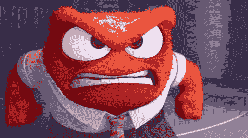
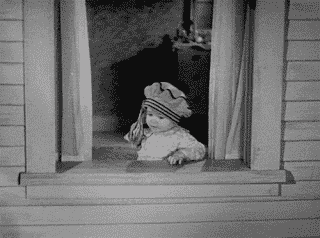

# 为什么可访问性不是一个边缘案例的 3 个原因

> 原文：<https://dev.to/lkopacz/3-reasons-why-accessibility-is-not-an-edge-case-3da4>

[https://api.parler.io/ss/player?url=https://www.parler.io/audio/7119149108/68a55ac9f32155276ec3f8fd63b57e87ab25acf6.05adf8b2-34cd-4a74-8a95-5ed875db72db.mp3](https://api.parler.io/ss/player?url=https://www.parler.io/audio/7119149108/68a55ac9f32155276ec3f8fd63b57e87ab25acf6.05adf8b2-34cd-4a74-8a95-5ed875db72db.mp3)

我从开发人员那里得到的主要问题是“我如何让我的客户参与进来”或者有时是“我如何让我的老板相信这是值得投资的？”在一次讨论会上，有人问我这个问题，我的回答是“我不知道，我只是这么做。”因为我非常了解可访问性，并且从一开始就考虑到了可访问性，所以我通常能够相对快速地解决可访问性问题，而人们甚至不会注意到我在这上面花了额外的时间。但是，当对可访问性还比较陌生的开发人员试图说服他们的老板时，有时他们会回以“这是一个低优先级”或“这是一个边缘情况”

哦，天哪，没有什么比有人无视他们用户的需求更让我愤怒的了。如果你的产品或网站对任何一个想使用它的人都不起作用，这不是一个边缘案例。这是一个严重的可用性问题，会让你付出金钱代价，甚至可能引发诉讼。

我以前向客户提出过关于可访问性的问题，他们问我需要多长时间来解决这个问题。我知道他们的预算有限；然而，最终解决问题的成本要低于损失的业务，甚至诉讼。虽然我个人是出于同情的天性，但告诉你的客户或老板“你为什么不能关心别人，这不是一个边缘案例！”通常不会有好结果

下面我想出了可访问性不是一个边缘案例的三个主要原因。

## 业务

让我们想一个简单的用户体验练习。在我关于预扣表单标签的负面影响的帖子中，我写了 2016 年我对两个候选人捐赠网站的审计。虽然从技术上来说，T2 不是一家企业，但它仍然是一个他们向你要钱的地方。

我的主要观点是，如果他们的网站是不可访问的，特别是在他们向你要钱的地方，你认为你的用户在放弃之前会花多少时间来解决这个问题？如果你是 UX 专家，你可能有一些具体的指标可以告诉我，但我的猜测是…很快。

我感到震惊的是，有多少电子商务网站在可访问性方面惨败。例如，我碰巧在[租跑道的网站](https://www.renttherunway.com/)上寻找一件要租的衣服，我打开了[的波动工具](https://wave.webaim.org/)，截至本文撰写时，它已经检测到 **54 个错误**。不是警报或警告，**错误**。我也不能用键盘访问它们的导航，焦点状态也不见了。

大约五分之一的人患有残疾，这意味着你可能会失去 20%的目标受众。如果你的企业一个月有 500，000 美元的收入，而网站无法访问，你可能会损失超过 125，000 美元的潜在收入。这是我想要的一大块馅饼。当你的生意是数百万美元的生意时，这个数字会更高。

## 合法

当我想到可访问性的法律含义时，我想到了三起诉讼。最近的一次是碧昂斯的诉讼，她的网站被视障用户访问不了。还有塔吉特诉讼案和温·迪克西诉讼案。《康复法案》第 508 条总是强制要求美国政府机构无障碍。但是这些诉讼使人们对《美国反倾销法》在网络方面的覆盖范围产生了疑问。在温·迪克西诉讼案之后， [Title III](https://www.ada.gov/regs2010/titleIII_2010/titleIII_2010_regulations.htm) 被添加到《美国残疾人法案》中，其中包括有关公共住宿的网络无障碍。虽然从技术上讲，你的网站可能没有违反法律，但你难道不想在律师和和解上省钱吗？虽然我可以继续谈论这三个问题，但这篇文章会变得很长。我主要是要去看看最近的碧昂斯诉讼，并提供链接，以了解更多关于温迪克西诉讼。

### Beyoncé.com 官司

玛丽·康纳，一个被描述为没有视力的女人，因为几个原因无法从 beyonce.com 买一件连帽衫。一个是，不使用鼠标就无法购物。另一个问题是“她无法选择某件商品的尺寸，也无法确认该商品是否已被添加到她的购物车中”(直接引用下面链接的文章)。

> 我很崇拜碧昂斯，所以得知她的网站不能被盲人粉丝访问，我很失望。我希望她的团队能解决这个问题。致所有艺术家:请让您的网站易于访问。[https://t.co/inGMDjvdEk](https://t.co/inGMDjvdEk)
> 
> — Haben Girma (@HabenGirma) [January 6, 2019](https://twitter.com/HabenGirma/status/1081825648274956288?ref_src=twsrc%5Etfw)

虽然从情感的角度来看，这让我很难过，但也让我难过的是，像我一样热爱碧昂斯的视障用户甚至都很难学会买票去看她，这也是 it 的另一个商业案例。

这也帮助我记住，我们绝对不能掩盖忽视它的含义。在以前的一家公司，我曾经告诉一位项目经理，忽视我提出的问题可能会有潜在的法律后果。他对允许我使用合法这个词犹豫不决，因为他害怕我散布恐惧。我告诉他，这是不负责任的，尤其是如果这会让他们陷入法律纠纷。这是一个例子，说明解决几个问题会让公司花费更少的钱和负面宣传。

来源:[Beyonce.com 诉讼提醒我们，对于有视觉障碍的用户来说，网络有多糟糕](https://gizmodo.com/beyonce-com-lawsuit-reminds-us-how-shitty-the-web-is-fo-1831493336)

### 关于温·迪克西和塔吉特诉讼案的链接

*   [W3C WAI -数字可访问性的商业案例](https://www.w3.org/WAI/business-case/)(转到最小化法律风险部分)
*   [Ars Technica - Target 支付 600 万美元解决场地无障碍诉讼](https://arstechnica.com/uncategorized/2008/08/target-to-pay-6-million-to-settle-site-accessibility-suit/)
*   [网站无障碍案件的被告在 2018 年面临一场艰苦的战斗](https://www.adatitleiii.com/tag/winn-dixie/)
*   首次此类审判对原告有利；温-迪克西必须更新盲人网站

## 好 HTML

我要切入正题，做一个有主见的开发者。如果你说 HTML 很容易，那你就错了。它在语法上比其他语言简单，但是和大多数编程语言一样，它需要策略、语义和正确的命名。我看到的大多数最小化 HTML 的人都是误用它的人。

即使是 MDN 文档也用大量的文档证明了这一点。我不再重复他们的文档，而是强调我最喜欢的部分:

1.  对按钮使用 HTML `<button>`比使用`
`要好，因为它们有内置的键盘可访问性。不需要添加一个额外的 JS 事件，使其与回车键一起工作！只需轻轻一点，它就能工作！
2.  他们关于[良好语义](https://developer.mozilla.org/en-US/docs/Learn/Accessibility/HTML#Good_semantics)的部分确实有助于教育人们如何通过可访问性**迭代**，并在做出高于一切的改进时真正关注语义 HTML。
3.  我喜欢他们的定位，即使用更容易开发**。它不仅对你的用户更有帮助，对你的开发者也更有帮助。**

## 结论

如您所见，这不是一个边缘案例的原因有很多。“让它工作”是主观的，这种偏见最终会让你损失很多钱，疏远你的用户。请记住，您的目标受众总是有一些来自这些社区的人，所以最好不要忽略他们。

你如何与你的利益相关者谈论可访问性？如果你对这篇博文有任何疑问，请在 Twitter 上告诉我。