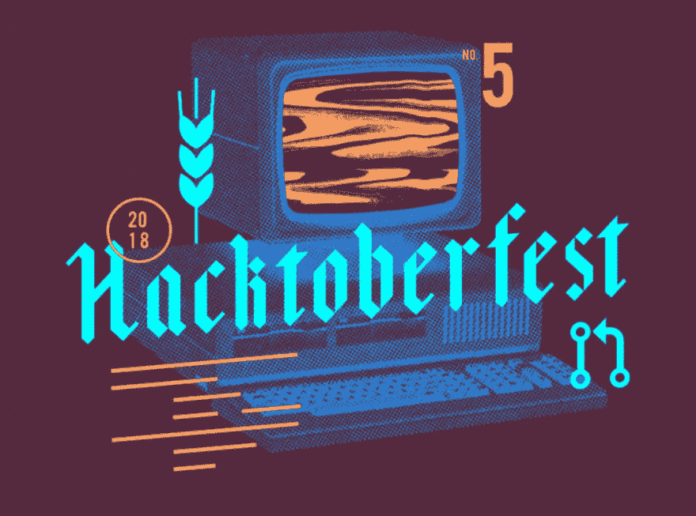

# 开始使用开源软件的 3 个步骤

> 原文：<https://dev.to/ryanharris/3-steps-to-getting-started-with-open-source-4f37>

在成为一名开发人员之前，我在电影和电视行业工作了十年，所以当我第一次开始过渡到技术行业时，我花了很多时间建立关系网，参加聚会，并与其他开发人员一起喝咖啡。我主要感兴趣的是**找出我需要知道什么才能被雇用，以及我如何着手学习那些技能**。我听到几个一致的答案:做在线教程，建立你的作品集，为开源项目做贡献。

前两个相对简单，但是为开源软件(OSS)做贡献有点不透明，特别是对于新的开发者。虽然“如何”做出贡献可能有点不清楚，但“为什么”却更加具体。

图像来源[raw pixel](https://pixabay.com/users/rawpixel-4283981/)T3】

雇主经常寻找以前在一个团队中工作过的开发人员，这对于那些只做过兼职项目或自己做自由职业者的新开发人员来说是一个难题。通过对 OSS 的贡献，你会学到团队使用的行业范围的协作工具，包括版本控制系统和平台，如 GitHub。

您还将获得工程“软技能”方面的经验，如如何与其他开发人员沟通和协作。这也给了你一个机会来回馈社区，帮助那些更早踏上开发之旅的人，就像你以前一样。

开源项目为开发者提供了一个学习技能的机会，这将使他们更容易被雇佣。以下是你可以开始的方法！

### 我如何找到一个开源项目？

弄清楚从哪里开始很难。目前有大量的项目正在进行中，但是你怎么知道哪一个是适合你的呢？有几个小方法可以让搜索变得简单一点。

首先，我建议在库中寻找你日常使用的工具。这将给你一个优势，因为你会更熟悉产品，它的目的是什么，以及如何改进它。

找到好项目的另一个方法是在 GitHub 中搜索使用你最强的编程语言构建的 repos。刚开始的时候，**你想降低你的进入门槛**，所以加入一门全新的语言会大大减缓你的进度。

最后，我建议寻找正在积极开发的项目。你最不想做的事情就是花大量的时间和精力去做一个已经被弃用的项目。确定项目活力的一些简单方法是:

1.  看看最后一次提交是什么时候。如果已经过了很长时间，这个项目很可能已经失去了动力。
2.  看看回购有多少颗星。星号表示社区对项目的兴趣。
3.  查看项目有多少贡献者。越多越好，因为你会有很多人寻求帮助。

图像来源[raw pixel](https://pixabay.com/users/rawpixel-4283981/)T3】

### 我如何为一个开源项目做贡献？

既然你已经找到了一个工作项目，让我们来谈谈 OSS 工作流程以及如何合并你的代码。

首先，**查看项目网站(或自述文件)以获取投稿指南**。这些指南通常会描述项目的首选代码风格、一般工作流程，并为设置您的本地开发环境提供指导。

开源项目中使用的一个非常常见的工作流是这样的:

1.  叉项目回购，给自己做一份
2.  将 repo 克隆到您的本地机器上，并启动开发环境
3.  将您的代码更改提交给 git
4.  将您的工作推向您的分支中的一个功能分支
5.  根据原始项目回购打开采购申请

这里需要注意的一点是，您的本地 git 回购将在 GitHub 上跟踪两个不同的回购，它们通常被称为“origin”和“upstream”。Origin 指的是您 GH 账户中的分叉回购，而“upstream”指的是原始项目回购。为了让您的本地副本保持最新，您需要在开始新一期之前`git pull upstream [branch]`。然后，当您完成并准备好推送您的代码时，您将运行`git push origin [branch]`，然后打开一个 pull 请求。

如果上面的段落让你困惑，不要担心——你肯定不是一个人！**我每天都在使用 git，但仍然发现自己需要定期参考文档**。在你继续之前，如果你想温习一下，请随意查看来自 Atlassian 的[git 指南。](https://www.atlassian.com/git/tutorials/syncing)

一旦你打开了你的拉请求，项目维护人员将会检查你的代码，可能会要求修改并合并你的代码。这个过程是一个向更有经验的开发人员学习的好机会，这可以帮助您构建真实世界的开发技能集。

### 如何找到需要解决的问题？

现在你已经找到了一个项目，并且理解了一般的工作流程，那么你在哪里找到需要解决的问题呢？最好的地方是项目回购的问题页面。对于大型项目，该页面可能有数百个(如果不是数千个)开放问题供您选择。

像 [Gatsby](https://github.com/gatsbyjs/gatsby/issues) 这样的大型存储库通常会组织良好，并利用 GitHub 的项目管理特性，如标签和受托人。这种规模的项目通常有一个核心团队维护项目，同时协调社区贡献者所做的工作。

当试图找到您的第一个问题时，标签会非常有帮助。许多项目会使用“好的第一个问题”、“初学者”或“需要帮助”这样的标签来表示维护人员正在寻求帮助的问题。如果某人已经开始处理某个问题，您通常会看到他们被分配到该问题，或者看到一个状态标签，指示该问题正在处理中。

另一个很好的地方是项目的 Slack 频道或 Discord 服务器。通常，**项目的核心团队会提供指导，回答问题，并对你的工作提供总体反馈**。因为他们对代码库有更深入的了解，所以他们也是很好的资源，尤其是在刚入门的时候。

如果你在某个特定的回购中没有找到问题，那就留心季节性的社区活动，比如 [Hacktoberfest](https://hacktoberfest.digitalocean.com/) 或 [24 Pull Requests](https://24pullrequests.com/) 。这些事件聚集了来自各种项目的初学者友好的问题，这有助于更容易地找到工作。厉害！

图片来源[数字海洋](https://hacktoberfest.digitalocean.com/)T3】

### 开源学习

我对开源项目的第一个贡献是对我当时使用的构建工具早午餐的一个简单的文档修改。仅仅因为我正在使用它，我注意到文档中的一个错别字，并决定修复它。这当然不是令人兴奋的增强，但至少下一个阅读文档的人会有稍微好一点的体验。

没过多久，我发现了 GitLab repo，它有很多与开放风格相关的问题。由于 CSS 是我当时的强项，我养成了定期向项目提交 PRs 的习惯。最终，这帮助我获得了第一份开发工作，因为我已经熟悉了基于团队的工作流程。如果我没有从事开源项目，我就不会有这样的经历。

最近，我通过更新一些 Gatsby 文档并登录到他们的 Discord 服务器，重新回到了开源世界。在很短的时间内，我已经能够帮助一些新的盖茨比开发者，这是一个伟大的提醒，我已经走了多远。我知道的比一些人多，比另一些人少，这让我在帮助前者的同时也向后者学习。这就是开源如此伟大的原因！

所以，去找个项目，学点东西，享受编码的乐趣吧！