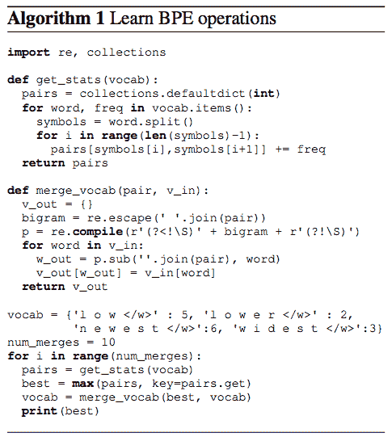

# 3 子字算法有助于提高 NLP 模型的性能

> 原文：<https://dev.to/makcedward/3-subword-algorithms-help-to-improve-your-nlp-model-performance-333n>

#### 子词介绍

[](https://res.cloudinary.com/practicaldev/image/fetch/s--yx3riG2Q--/c_limit%2Cf_auto%2Cfl_progressive%2Cq_auto%2Cw_880/https://cdn-images-1.medium.com/max/1024/0%2AOzrGnF_f8bj3nqAf) 

<figcaption>照片由上[下](https://unsplash.com?utm_source=medium&utm_medium=referral)</figcaption>

经典单词表示法不能很好地处理未见过的单词或生僻字。[字符嵌入](https://towardsdatascience.com/besides-word-embedding-why-you-need-to-know-character-embedding-6096a34a3b10)是克服词汇量不足的解决方案之一(OOV)。然而，它可能太细粒度任何遗漏一些重要信息。子词在单词和字符之间。它不是太细粒度的，但能够处理未见过的词和生僻字。

比如我们可以把“子字”拆分成“子”和“字”。换句话说，我们使用两个向量(即“sub”和“word”)来表示“子字”。你可能会说它使用更多的资源来计算它，但事实是，与单词表示相比，我们可以使用更少的内存。

这个故事将讨论关于 [SentencePiece:一个用于神经文本处理的简单且独立于语言的子词分词器和去分词器](https://arxiv.org/pdf/1808.06226.pdf) (Kudo 等人，2018)，并进一步讨论不同的子词算法。将涵盖以下内容:

*   字节对编码(BPE)
*   工件
*   单语法语言模型
*   句子片断

### ***【BPE】***字节对编码

Sennrich 等人(2016)提出使用字节对编码(BPE)来构建子词词典。Radfor 等人采用 BPE 构建子词向量，于 2019 年建成 [GPT-2](https://towardsdatascience.com/too-powerful-nlp-model-generative-pre-training-2-4cc6afb6655) 。

#### 算法

1.  准备足够大的训练数据(即语料库)
2.  定义所需的子词词汇大小
3.  将单词拆分为字符序列，并在单词末尾添加后缀“”和词频。所以这个阶段的基本单位是性格。例如,“low”的频率是 5，那么我们把它重新表述为“l o w”:5
4.  根据高频出现生成新子词。
5.  重复步骤 4，直到达到步骤 2 中定义的子词词汇大小，或者下一个最高频率对是 1。

[](https://res.cloudinary.com/practicaldev/image/fetch/s---hwO-9A7--/c_limit%2Cf_auto%2Cfl_progressive%2Cq_auto%2Cw_880/https://cdn-images-1.medium.com/max/485/1%2A_bpIUb6YZr6DOMLAeSU2WA.png)

<figcaption>BPE 算法(森里奇等，2015)</figcaption>

#### 举例

以“低:5”、“低:2”、“最新:6”、“最宽:3”为例，最高频率的子词对是 e 和 s，是因为我们从最新得到 6 个计数，从最宽得到 3 个计数。然后形成新的子词，它将在下一次迭代中成为候选词。

在第二次迭代中，下一个高频子字对是 es(从前一次迭代生成)和 t。这是因为我们从最新的得到 6 个计数，从最宽的得到 3 个计数。

不断迭代，直到建立一个期望大小的词汇量或下一个最高频率对是 1。

### 词块

词块是另一种分词算法，它与 BPE 相似。Schuster 和 Nakajima 在 2012 年通过解决日本和韩国语音问题推出了 WordPiece。基本上，WordPiece 与 BPE 是相似的，不同的部分是通过可能性形成一个新的子词，而不是下一个最高频率对。

#### 算法

1.  准备足够大的训练数据(即语料库)
2.  定义所需的子词词汇大小
3.  将单词拆分成字符序列
4.  基于步骤 3 的数据建立语言模型
5.  从所有可能的单词单元中选择新的单词单元，该新的单词单元在被添加到模型中时最大程度地增加了训练数据的可能性。
6.  重复步骤 5，直到达到步骤 2 中定义的子词词汇大小，或者可能性增加低于某个阈值。

### Unigram 语言模型

工藤。引入了 unigram 语言模型作为子词分割的另一种算法。假设之一是所有子词的出现是独立的，并且子词序列是由子词出现概率的乘积产生的。单词块和 Unigram 语言模型都利用语言模型来构建子单词词汇表。

#### 算法

1.  准备足够大的训练数据(即语料库)
2.  定义所需的子词词汇大小
3.  通过给出一个单词序列来优化单词出现的概率。
4.  计算每个子字的损失
5.  按损失对符号进行排序，保留单词的前 X %(例如，X 可以是 80)。为了避免超出词汇表，建议将字符级作为子词子集包括在内。
6.  重复步骤 3–5，直到达到步骤 2 中定义的子词词汇大小或步骤 5 中没有变化。

### 例句

那么，我们可以利用任何现有的库来进行文本处理吗？Kudo 和 Richardson 实现了 [SentencePiece](https://github.com/google/sentencepiece) 库。您必须根据您的数据训练您的标记器，以便您可以为下游任务编码和解码您的数据。

首先，准备一个包含您的数据的纯文本，然后触发以下 API 来训练模型

```
import sentencepiece as spm
spm.SentencePieceTrainer.Train('--input=test/botchan.txt --model\_prefix=m --vocab\_size=1000') 
```

它非常快，您可以通过以下方式加载模型

```
sp = spm.SentencePieceProcessor()
sp.Load("m.model") 
```

要对文本进行编码，你只需要

```
sp.EncodeAsIds("This is a test") 
```

更多例子和用法，可以访问这个 [repo](https://github.com/google/sentencepiece/blob/master/python/README.md) 。

### 带走

*   子字平衡了词汇量和占用空间。极端的情况是我们只能用 26 个记号(即字符)来表示所有的英语单词。建议使用 16k 或 32k 的子字来获得好的结果。
*   许多亚洲语言单词不能用空格分隔。因此，最初的词汇量比英语大很多。你可能需要准备超过 10k 的初始单词来开始分词。根据 Schuster 和 Nakajima 的研究，他们建议分别对日语和韩语使用 22k 单词和 11k 单词。

### 喜欢学习？

我是湾区的数据科学家。专注于数据科学、人工智能，尤其是 NLP 和平台相关领域的最新发展。欢迎在 [LinkedIn](https://www.linkedin.com/in/edwardma1026) 上与 [me](https://makcedward.github.io/) 联系，或者在 [Medium](http://medium.com/@makcedward/) 或 [Github](https://github.com/makcedward) 上关注我。

### 延伸阅读

*   [经典单词表示法](https://towardsdatascience.com/3-silver-bullets-of-word-embedding-in-nlp-10fa8f50cc5a)
*   [字符嵌入](https://towardsdatascience.com/besides-word-embedding-why-you-need-to-know-character-embedding-6096a34a3b10)
*   [过于强大的 NLP 模型(GPT-2)](https://towardsdatascience.com/too-powerful-nlp-model-generative-pre-training-2-4cc6afb6655)
*   [句子 GIT repo](https://github.com/google/sentencepiece)

### 引用

*   T.工藤和 j .理查森。一个简单且独立于语言的子词分词器和去分词器，用于神经文本处理。2018
*   R.森里奇 b .哈多和 a .伯奇。[带子词单元的生僻字神经机器翻译](http://aclweb.org/anthology/P16-1162)。2015
*   米（meter 的缩写））舒斯特和中岛康介。[日韩语音搜索](https://storage.googleapis.com/pub-tools-public-publication-data/pdf/37842.pdf)。2012
*   多久工藤。[子词正则化:用多个候选子词改进神经网络翻译模型](https://arxiv.org/pdf/1804.10959.pdf)。2018

* * *