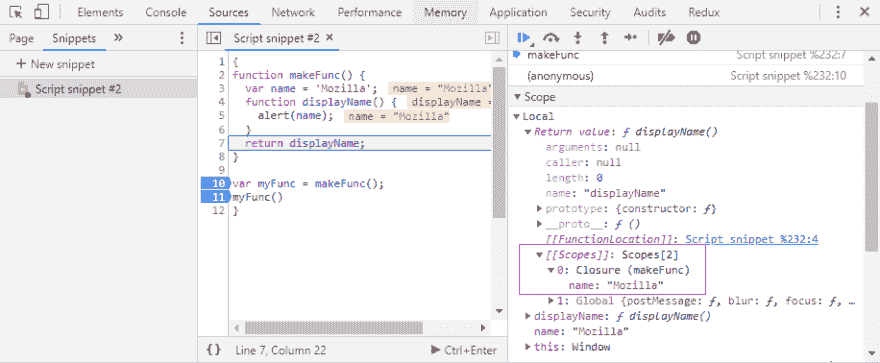

# 1 个 JavaScript 面试问题中的 3 个主题

> 原文：<https://dev.to/maciekchmura/3-topics-in-1-javascript-interview-question-1gd7>

编程面试很难。面试时的现场编码就更难了。
我有一种感觉，在我现在的公司，一旦我必须在另一个人`myIntelligence -= 10;`
面前键入代码，首席开发人员就会定期对潜在的新候选人进行面试。为 JavaScript 开发者准备了一些问题，但是有一个问题几乎总是被问到:

```
 // what will be logged in the console
    // and how to fix it to log 0, 1, 2??
    for (var i = 0; i < 3; i++) {
      setTimeout(function() {
        console.log(i);
      }, 1000);
    } 
```

这是一个非常典型的问题。它有什么特别之处？在我看来，这 5 行涉及了 JavaScript 的 3 个有趣的方面。

*   var，let 和 const
*   关闭
*   事件循环

让我们分解一下，看看这里发生了什么。

## 是一个时代的 const

ES6 引入了新的变量赋值关键字:`const`和`let`。你可能已经知道它们是块作用域的，而`var`是函数作用域的。
一些简单的案例来说明这种行为。

```
 // simplest JavaScript example in the world:
    {
      var name = 'maciek';
      let surname = 'chmura';
    }
    console.log(name); // -> maciek
    console.log(surname); // -> surname is not defined

    // what's happening under the hood:
    var name;
    {
      let surname;
      name = 'maciek';
      surname = 'chmura';
    }
    console.log(name);
    console.log(surname); 
```

好，让我们把它放在 for 循环的上下文中。

```
 for (var i = 0; i < 3; i++) {
      console.log(i); // -> 0 1 2
    }

    // what will happen when var is changed to let?
    for (let j = 0; j < 3; j++) {
      console.log(j); // -> 0 1 2
    } 
```

两个循环都产生右输出。但方式略有不同。`var`“跳转”到`global scope`，`let`“跳转”到循环中，并在每次迭代中初始化。
可以这样说明:

```
 // var lives here
    for (var i = 0; i < 3; i++) {
      console.log(i); // -> 0 1 2
    }
    console.log(i); // -> 3

    for (let j = 0; j < 3; j++) {
      // let is available only from here
      console.log(j); // -> 0 1 2
    }
    console.log(j); // ReferenceError: j is not defined 
```

好的，简单...这就是块作用域的工作方式...继续前进。

## 关闭

JavaScript 闭包的神秘之地。闭包的原始定义是什么？
让我们检查一下 [MDN](https://developer.mozilla.org/en-US/docs/Web/JavaScript/Closures)

> 闭包是函数和声明该函数的词法环境的组合。

请深入阅读 MDN 的这篇文章。非常聪明的人为这个知识库做出了贡献，让我们相信他们:)

*   这个`lexical environment`到底是什么？
*   它会在某个时候消失吗？
*   由谁以及何时决定？
*   我该怎么控制？

很长一段时间，我都无法理解这件事。直到我添加了两个视觉辅助工具来帮助我理解它。

1.  🎒一个背包。我喜欢把闭包看作是功能的背包。当一个函数被定义时，它会将所有将来可能需要的值添加到它的背包中。
2.  🚚垃圾收集者。移除旧代码的卡车。不像在 C 语言中，不用做`malloc()`和`free()`，会自动处理。

当某个函数已经执行并返回值时，我们可以安全地从内存中删除这个函数定义🚚🗑.同样的事情也适用于那些不再可及的值。当一个函数返回一个函数时，事情变得有趣了。
我不想重新发明新的例子和定义，所以我将只添加一些可视化助手层。
MDN 示例(带行号):

```
 function makeFunc() {          // 1
      var name = 'Mozilla';        // 2
      function displayName() {     // 3
        alert(name);               // 4
      }                            // 5
      return displayName;          // 6
    }                              // 7
                                   // 8
    var myFunc = makeFunc();       // 9
    myFunc();                      // 10 
```

让我们想象一个简化的 JavaScript 解释器工作流。运行代码时，JavaScript 运行时在“思考”什么。

*   `makeFunc`(第 1 行)函数定义，继续。
*   (9)声明`myFunc`变量并将运行`makeFunc`的结果赋给它，执行`makeFunc`
*   (1)跳入`makeFunc`定义。
*   (2)好，一个值为`Mozilla`的变量`name`。
*   (3) `displayName`功能定义，继续。
*   (4) `return` `displayName`功能定义

**第一个剧情转折**。这里返回整个函数定义。`displayName`的末尾没有()。
**第二个剧情转折**。观察到闭合。在哪里？`displayName`投入其🎒`var name`(在`displayName`的词汇范围内)

[](https://res.cloudinary.com/practicaldev/image/fetch/s--q000OVsa--/c_limit%2Cf_auto%2Cfl_progressive%2Cq_auto%2Cw_880/https://thepracticaldev.s3.amazonaws.com/i/7jhdi37mxrjbssjuyfvg.png)

`makeFunc`执行并返回了`displayName`的整个函数定义及其闭包(a🎒)持有对`name`中的值的引用。
垃圾收集器不能从内存中删除第 1 行到第 7 行，因为在将来的某个时候`myFunc`可能会被执行，然后需要`displayName`及其闭包。

*   (10)执行`myFunc`

这是我对闭包的理解。现在我看到了！

[](https://res.cloudinary.com/practicaldev/image/fetch/s--bGIDPwJc--/c_limit%2Cf_auto%2Cfl_progressive%2Cq_66%2Cw_880/https://thepracticaldev.s3.amazonaws.com/i/bb3dua6vjqupmuciycq3.gif)

让我们进入谜题的最后一部分。

## 事件循环

要了解事件循环，没有比在 JSConf EU 上听菲利普·罗伯茨演讲更好的方法了。看着吧...
[https://www.youtube.com/embed/8aGhZQkoFbQ](https://www.youtube.com/embed/8aGhZQkoFbQ)
🤯令人兴奋吧。
好吧！最后，有了所有的知识，我们来分解一下面试问题中正在发生的事情。

```
 for (var i = 0; i < 3; i++) {
      setTimeout(function() {
        console.log(i);
      }, 1000);
    } 
```

随着循环的每次迭代，`setTimeout`将带有`console.log(i)`的函数发送到 web APIs，并开始倒计时。与此同时，我们将继续循环。另一个`console.log(i)`将被推送到 web APIs 等等...
循环执行完毕。调用堆栈为空。
在 web APIs 中，1 秒钟后`console.log(i)`被推送到回调队列。又一个，又一个。
由于调用栈为空，回调队列可以将其第一个元素推送到调用栈中执行。
于是第一个`console.log(i)`执行了。
它寻找一个`i`。
`i`的值是多少？已经 3 点了。从全球范围来看。
*为什么？*
循环结束迭代，最后将`i`更新为 3。
var `i`是函数作用域(for 循环不是函数)，被提升到循环外的`global scope`。
调用栈又空了。
第二个`console.log(i)`移动到调用堆栈。
`i`的值是多少？又是 3。是一样的价值。

[](https://res.cloudinary.com/practicaldev/image/fetch/s--uLKPD_gj--/c_limit%2Cf_auto%2Cfl_progressive%2Cq_66%2Cw_880/https://thepracticaldev.s3.amazonaws.com/i/w74lv15u6nn3ntrz2apl.gif)

如何修复到 log 0，1，2？
一种解决方法是将`var`改为`let`。
现在当循环时，每个`i`被初始化并被赋予一个当前迭代的值，并被放入闭包(a🎒)的函数，该函数将记录它。
1 秒钟后，当调用栈为空时，回调队列将把带有`console.log(i)`且关闭了`i`值的函数推回调用栈并执行。
将分别记录 0、1、2。
*搞定。*

请回答下一个问题。

现在，当你确切地知道发生了什么，还能做什么来修复它呢？

*免责声明:*
*我写这个主要是为了自己研究这些课题。如果这里有什么不对的地方，请在评论中指出来，这样我们都可以学习:)*