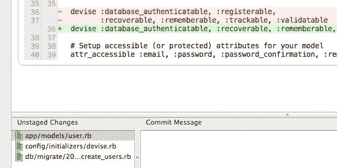

# 在两次会议之间保持开发流程的 3 种方法💪

> 原文：<https://dev.to/jerodsanto/3-ways-to-retain-your-dev-flow-between-sessions--4if2>

上下文切换。计算机在这方面很棒，人类在这方面很差劲。

每次我们开发人员丢失当前任务的上下文，我们都被迫浪费宝贵的时间来找回它。我们试图解决的问题越困难，就需要越长的时间才能在我们的脑海中重现它的背景。这就是为什么许多开发人员努力减少干扰，留出大量时间，并创造一个环境来帮助他们进入[流](https://amzn.to/hL0XDk) *并停留在那里*。

问题是，有些时候我们绝对必须把我们的开发环境留在身后，以后再捡起来。有时是 30 分钟，有时是一夜。我发现这些时候非常令人沮丧，我发现了一些技巧，可以帮助我在回来的时候快速恢复我的心流。

## 1。自我提醒

给自己留个便条，说明你在忙什么。这可能是最显而易见的技巧，而且非常有效。我发现的问题是，我经常忘记做这件事，或者在一天结束时太累/太懒，无法坚持做下去。

我需要给自己写张便条，提醒自己给自己写便条。是啊。

## 2。总是失败

让您的测试套件中的一个或多个测试失败(您正在编写测试，对吗？).当您返回到项目时，您的第一步是运行测试套件，您将看到失败的测试。这个真的很好，但是就像给自己留笔记一样，这是你必须积极参与的事情。实际上，这比留便条花费更多的时间和精力。

## 3。去吧，臭小子

这是我最喜欢和最常用的技术。让您的 Git(或者您选择的 DVCS)暂存区处于肮脏状态。

当您返回时，您将看到在您离开之前最近所做的所有更改。结合对提交日志的快速阅读，这将很快恢复您的上下文。与其他方法相比，这种方法的优势在于它在某种程度上是无需参与的。只需*不要*提交你最后的更改，它们就会在那里等着你。至少对我来说，这比技术 1 或 2 更有可能发生。

## 4。？？？

这是我为快速恢复开发流所做的一些事情，但我确信还有其他的事情。你有锦囊妙计吗？我很想听听！