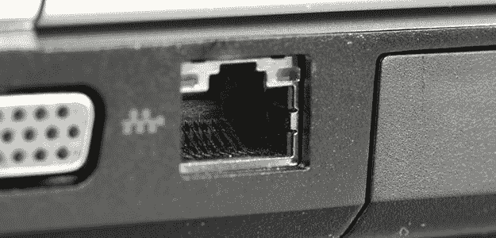
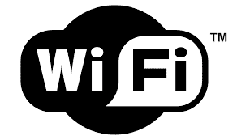

# 将 Linux PC 连接到互联网的 3 种可行方法。

> 原文：<https://dev.to/xeroxism/3-workable-ways-of-connecting-linux-pc-to-the-internet-4mn4>

互联网已经成为我们数字生活不可或缺的一部分。随着网络浏览器的出现，以及随之兴起的其他网络技术，保持离线在目前几乎是不可能的。

发送和接收电子邮件，媒体流，到处都有许多社交网络，毫无疑问需要一个工作互联网连接。

在这篇文章中，我将向你展示将你的 [Linux](https://dev.to/xeroxism/ubuntu-linux-is-everywhere-and-connecting-everything-3dm3) 系统连接到互联网的各种常用方法。

## #1 有线连接。

这意味着你必须用电缆将你的 Linux 电脑通过以太网端口连接到墙上的 RJ45 端口(使用 DSL)来访问互联网。

所以它只能在带有以太网接口卡的个人电脑上工作。数据通过铜电话线传输。以这种方式连接互联网在大型企业、公司或企业环境中很常见。它最有可能被用在工作或你的办公室。这对于个人来说是非常昂贵的。

## 无线连接。

无线连接近来已经成为最流行的方式，人们把他们的个人电脑连接到互联网上，这种方式对个人电脑用户来说非常有吸引力。顾名思义，“无线”连接不需要任何网络电缆来连接到互联网。尤其是现在，随着每一次模型迭代，计算机变得越来越小，越来越移动。现在让我们来谈谈一些无线连接方法。

### #2 拨号调制解调器。

要使用这种方法，您需要将 USB 调制解调器连接到您的 PC，然后调制解调器将拨号到您的互联网服务提供商(ISP)网络(一种连接到互联网的代理)。

这些调制解调器通常预先配置了 ISP 提供的设置。有些调制解调器不能与特定的 Linux 发行版一起工作，因为制造商(和 ISP)不提供 Linux 驱动程序和软件。你可以使用调制解调器设备名称进行彻底的谷歌网络搜索，看看其他人是如何解决特定调制解调器的问题的。但是你可以看看这篇文章，看看如何在 ubuntu Linux 上设置中兴 USB 调制解调器。

### #3 Wi-Fi。

这是当今最流行的方法。你只需从你的 Linux 电脑上扫描可用的 Wi-Fi 网络并连接。大多数情况下，它们是关闭的(有密码保护),这需要密码，有些可能是打开的(没有密码)。原因之一是，与提供互联网连接的长距离布线相比，无线网络设备已经变得很便宜。

最重要的是，许多计算机和基于计算机的附件都带有无线功能。Linux 是无线兼容的。点击此处[查看如何连接 wifi 网络](https://fossnaija.com/setting-up-wi-fi-on-linux-using-android/)。随着手机和平板电脑等支持互联网的移动设备的激增，你可以通过无线方式[与你的 Linux PC](https://fossnaija.com/setting-up-wi-fi-on-linux-using-android/) 共享移动互联网连接。

这就是了。尝试一下。

快乐时光

将 Linux PC 连接到互联网的 3 种可行方法。最早出现在[福斯奈亚](https://fossnaija.com)上。