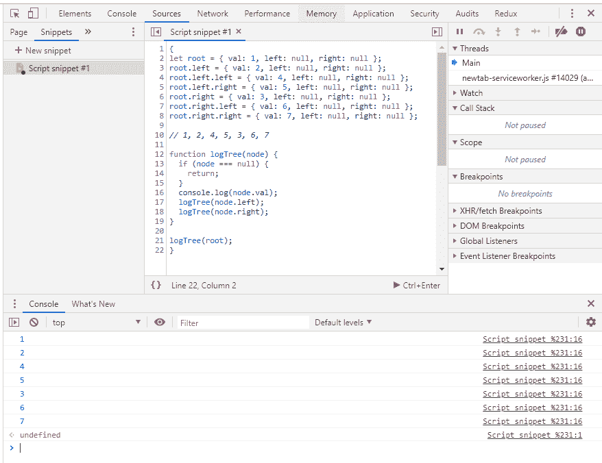
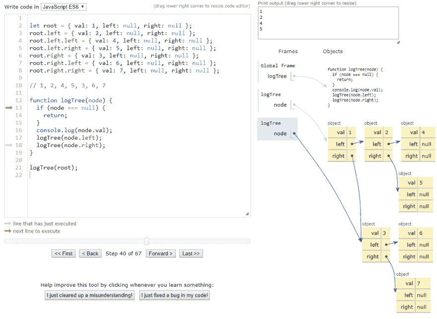

# 运行 JavaScript 的 4 种快速方法

> 原文：<https://dev.to/maciekchmura/4-fast-ways-to-run-javascript-1h45>

我喜欢学习新东西。当我进行实验时，我需要一种快速的方法来运行代码片段，进行一些调试，并找出哪些可以，哪些不可以。
视情况和心情而定🌅我在这些设置之间切换:

## VSCode

大多数时候我会在我的 code_notes 存储库中编写代码。
我有最简单的 VSCode 配置:

```
{  "type":  "node",  "request":  "launch",  "name":  "single file",  "program":  "${file}"  } 
```

使用此配置，VSCode 将在调试器中运行当前打开的文件。

只需点击`F5`，在`DEBUG CONSOLE`中寻找输出。
当然，你将拥有所有的调试好东西——在这里阅读更多

## VSCode + Quokka.js

要让“实时重新加载”进行代码评估，请查看 [Quokka.js](https://quokkajs.com/)

> js 是 JavaScript 和 TypeScript 的快速原型开发平台。它会在您键入代码时立即运行您的代码，并在代码编辑器中显示各种执行结果。

当我刚开始有一个想法时，我会用它。理解代码的每一行有什么影响真的很有帮助。

## 镀铬片段

有时候直接在 Chrome 中运行 JavaScript 是最快的方法。
[](https://res.cloudinary.com/practicaldev/image/fetch/s--8vqTtPVg--/c_limit%2Cf_auto%2Cfl_progressive%2Cq_auto%2Cw_880/https://thepracticaldev.s3.amazonaws.com/i/lne5bhe3zrd57g513hz1.PNG) 
只需打开`Developer Tools`，切换到`Sources`选项卡，创建一个新的代码片段。`Snippets`可能隐藏在`>>`图标下。
记得将代码包装在`{}`中，以便每次运行时都有一个新的局部作用域。

## Python 导师

[](https://res.cloudinary.com/practicaldev/image/fetch/s--SfxEywUW--/c_limit%2Cf_auto%2Cfl_progressive%2Cq_auto%2Cw_880/https://thepracticaldev.s3.amazonaws.com/i/5qkkz9wdrlbhrqxlklps.PNG) 
不要被名字所迷惑！它也可以运行 JavaScript。它甚至还有实时模式。
这个工具很酷的一点是，它将每一步发生的事情可视化。
非常适合教育目的。
[链接](http://pythontutor.com/live.html#mode=edit)