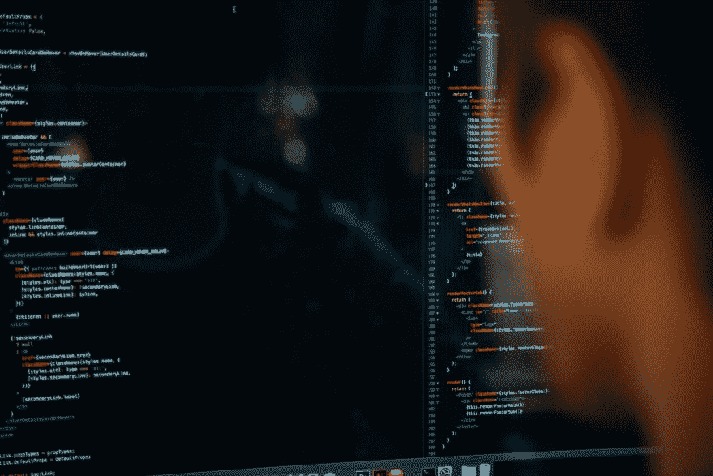

# 提高编程关注度的 4 个实用技巧

> 原文：<https://dev.to/vinibrsl/4-practical-tips-for-improving-your-programming-focus-260k>

你在 Spotify 上选择最好的焦点播放列表，使用金钱能买到的最好的工具，打开你所有设备上的“请勿打扰”。但是，在一天结束的时候，你真的很累，但是你什么也没做。这种情况每天都在发生。

很长一段时间我都面临着注意力不集中的问题，但是我在编程的时候用了一些技巧来提高我的注意力。事不宜迟，让我们把重点放在提示上:

[](https://res.cloudinary.com/practicaldev/image/fetch/s--EjqEXh4F--/c_limit%2Cf_auto%2Cfl_progressive%2Cq_auto%2Cw_880/https://i.imgur.com/M93AK4d.jpg)

# 1。准备好你的一天

这可能听起来很老套，但是你必须计划好你一天要做什么。要么你喜欢网上的待办事项清单，要么纸和笔，列出你一天要做的事情。例如:

```
* Write tests for the Users API
* Investigate on yesterday's lag spikes
* Start working on the Google Analytics feature 
```

Enter fullscreen mode Exit fullscreen mode

它不需要非常详细，但足以让你回忆起你要做的事情。

# 2。分解你的任务，集中注意力

现在你有一个待办事项列表。让我们假设您将开始“为用户 API 编写测试”的工作。我的建议是将任务分解成子任务。例如:

```
* Write tests for the Users API
    * Test unauthorized requests are blocked
    * Test admin users are filtered 
```

Enter fullscreen mode Exit fullscreen mode

一旦任务被分解，你将开始我所说的“焦点会议”。这是一个有时间限制的时刻，你将只把**注意力放在那个子任务上。**

专注的主要问题是我们试图同时填补许多漏洞。我必须学会专注于一件非常具体的事情并完成它。这是我能给的最好的建议:一次做一件事。

# 3。改善您的焦点会议

[](https://res.cloudinary.com/practicaldev/image/fetch/s--3CvaPmOf--/c_limit%2Cf_auto%2Cfl_progressive%2Cq_auto%2Cw_880/https://i.imgur.com/p6aArxA.jpg)

对我来说，[番茄工作法](https://en.wikipedia.org/wiki/Pomodoro_Technique)效果最好。当我专注于我非常具体的子任务时，我使用这种技术进行时间管理。如果你从未听说过，它包括 25 分钟的深度工作会议，然后休息 5 分钟，再回到另一个 25 分钟的深度工作会议。在 4 次工作会议之后，你有更长的休息时间。

这改变了我的工作生活。这帮助我专注于特定的任务，甚至是无聊的任务。

# 4。别分心了！

如果你一天中仍然有很多令人分心的事情，那么任何小费都没有用。只有你知道什么让你分心，如果你想成为一个专注的开发者，你必须减少干扰。

对我来说，浏览 Instagram、Reddit、GitHub 或 StackOverflow 真的摧毁了我的生产力。通过使用番茄工作法，我只能在休息 5 分钟的时候访问这些网站。对我有用的是:

*   聚焦时打开我的设备上的“请勿打扰”
*   确保我的同事不会因为在别处工作或戴着耳机而打扰我
*   听器乐，或者我不知道的歌曲(这样我就不会被它分散注意力)

做最适合你的事！

* * *

不在于你工作了多少时间，而在于你交付了多少。长时间不集中精力工作只会让你感到疲劳，而不是工作完成。

尽管不要求注明出处，我还是要感谢那些在 Unsplash 上免费发布他们照片的摄影师。感谢查尔斯·德鲁维奥和安德里亚·里佐。

如果你想看更多我的帖子，请查看[我的开发者简介](https://dev.to/vnbrs)。如果你真的喜欢，请在推特上关注我😅。