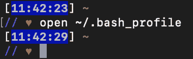
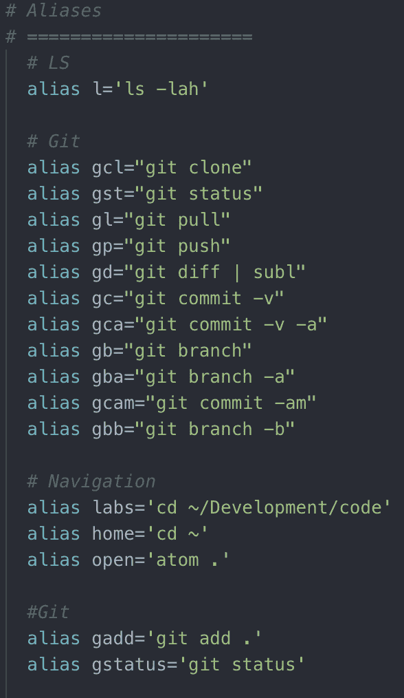
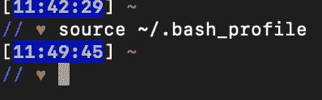

# 定制 Bash 命令的 4 个简单步骤

> 原文：<https://dev.to/mollynem/4-simple-steps-for-custom-bash-commands-4c58>

终端不是最用户友好的——对错误敏感，阅读困难，并且需要大量的输入！我经常发现自己在终端上一遍又一遍地输入相同的命令。如果有一种方法可以创建我自己的快捷方式，只需输入一个关键字就可以访问我的主文件夹…

幸运的是，这个功能已经存在！让我们通过 4 个简单的步骤来创建您的个性化 bash 命令:

#### 1。找到你的。bash_profile (OSX)或者。bashrc (Linux)

*   通过您的终端导航到您的。bash_profile 文件或。bashrc 取决于您的操作系统。您的快捷方式将保存在这些文件中，这样每次您打开新的终端会话时，都可以访问快捷方式。

<figure> 

<figcaption>导航到。bash_profile 内 OSX</figcaption>

</figure>

#### 2。添加您的命令

*   在文件里面开始创建你自己的命令！使用它们来帮助你导航到经常访问的文件夹，缩短 git 命令，打开应用程序，或者任何你认为有帮助和节省时间的事情。以下示例:

<figure>

<figcaption>a few examples of personalized bash commands</figcaption>

</figure>

#### 3。通过终端更新您的命令文件

*   最佳实践是，在您向快捷方式文件添加新命令后，确保通过终端运行下面的命令来刷新您的文件: *source ~/。您在此处的文件名*

<figure> 

<figcaption>编辑完你的文件后运行此命令</figcaption>

</figure>

#### 4。运行您的命令！

*   使用你的命令，享受你通过更聪明地工作而不是更努力地工作所节省的时间！返回并在将来需要时添加命令。

T3】