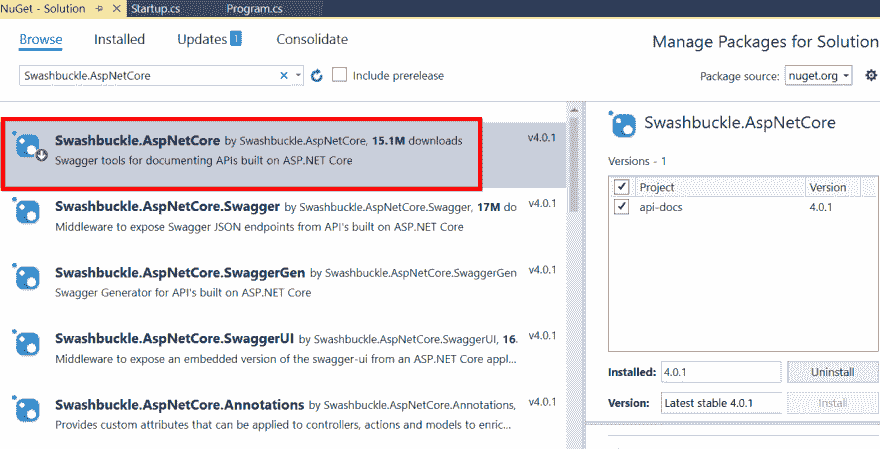
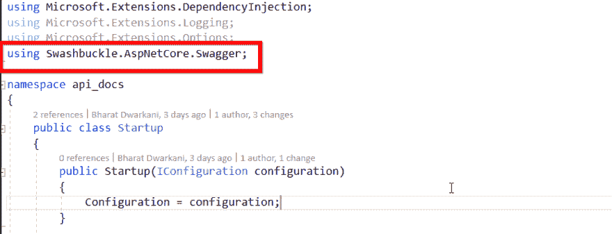
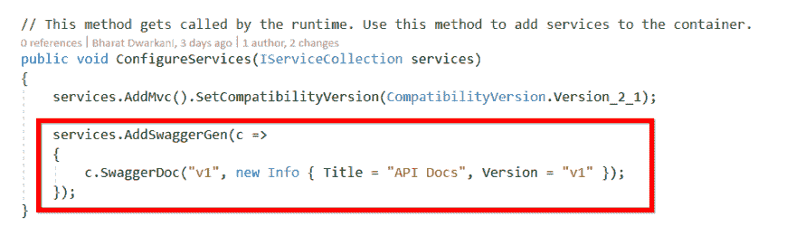
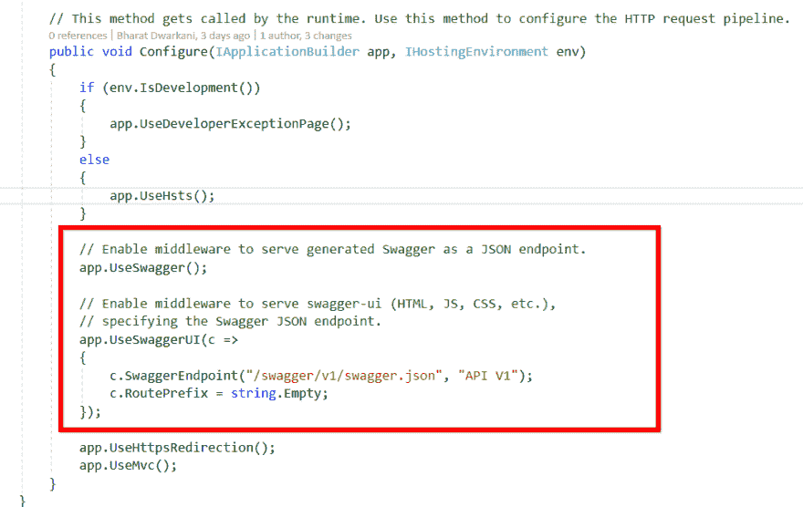
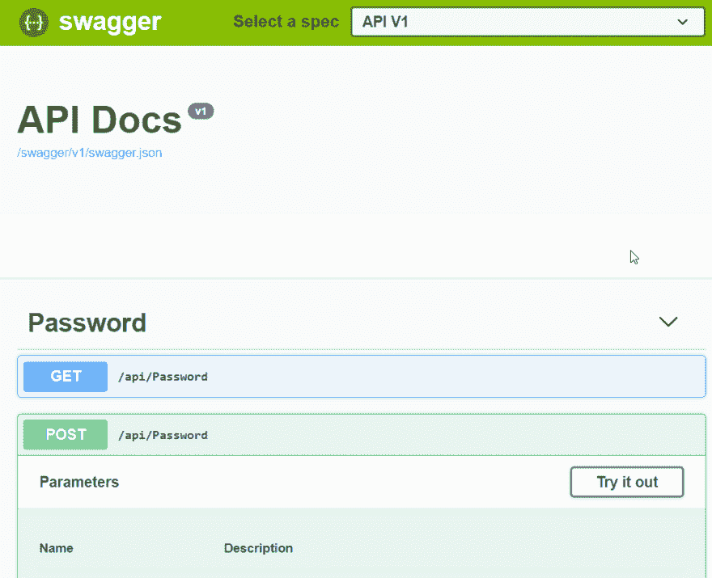

# 为 ASP.NET 核心项目自动生成 API 文档的 4 个步骤

> 原文：<https://dev.to/syncfusion/4-steps-to-automatically-generate-api-documentation-for-asp-net-core-projects-3m6l>

您是否曾经想过在编写代码时是否可以自动生成 API 文档？是的，这是可能的。对于开发人员来说，编写文档是一个痛苦的过程。 [Swagger](https://swagger.io/) ，也被称为 [OpenAPI](https://www.openapis.org/) ，通过为 web APIs 生成有用的文档和帮助页面来解决这个问题。它不仅生成只读的帮助页面，还生成交互式的帮助页面，甚至可以用于测试 API。

我将带您了解为您的 API 使用文档生成功能所需的步骤。我们将使用 **Swashbuckle** NuGet 包为我们的 ASP.Net 核心项目添加文档生成功能。

首先，我们在项目中安装一个 NuGet 包。这里使用的 NuGet 包是 [Swashbuckle。AspNetCore](https://www.nuget.org/packages/Swashbuckle.AspNetCore) 。

在 Visual Studio 中，进入**工具- > NuGet 包管理器- >管理解决方案**的 NuGet 包。搜索名为 **Swashbuckle 的包裹。AspNetCore** 并将其安装到您的项目中。

 

<figcaption>安装霸王花。AspNetCore NuGet 包</figcaption>

接下来的几个步骤将向您展示如何通过在项目 **Startup.cs** 文件中添加几行代码来配置 Swagger。

**步骤 1:** 包含 Swagger 名称空间。

 

<figcaption>包括招摇命名空间</figcaption>

**第二步:**然后，在 **ConfigureServices** 方法中注册 Swagger 服务。

 

<figcaption>配置招摇服务</figcaption>

**第三步:**启用**配置**方法中的 Swagger 中间件，配置 [Swagger UI](https://swagger.io/tools/swagger-ui/) 。就这样，配置现在结束了。

 

<figcaption>配置霸气 UI</figcaption>

**步骤 4:** 现在在浏览器中运行您的 API，并导航到您的 API 基本 URL。在我的例子中，它是 localhost:44314。你会看到一个交互式的文档页面，你的 API 马上就可以运行了，你甚至不用为文档写一行字。

 查看此工作样本项目[此处](https://github.com/SyncfusionExamples/api-docs-swagger-sample)。

## 结论

因此，开始按照这些简单的步骤将文档添加到您现有的 API 中。使用它，您甚至可以为您的 API 创建基于版本的文档。此外，一定要给 API 文档添加授权，以防止外人滥用它们。

补充参考:[https://docs . Microsoft . com/en-us/aspnet/core/tutorials/we b-API-help-pages-using-swagger？view=aspnetcore-2.2](https://docs.microsoft.com/en-us/aspnet/core/tutorials/web-api-help-pages-using-swagger?view=aspnetcore-2.2)

帖子[为 ASP.NET 核心项目自动生成 API 文档的 4 个步骤](https://blog.syncfusion.com/post/automatically-generate-api-docs-for-asp-net-core.aspx)首先出现在 [Syncfusion 博客](https://blog.syncfusion.com)上。