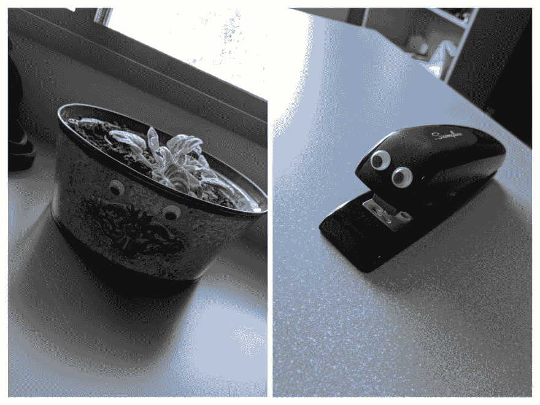
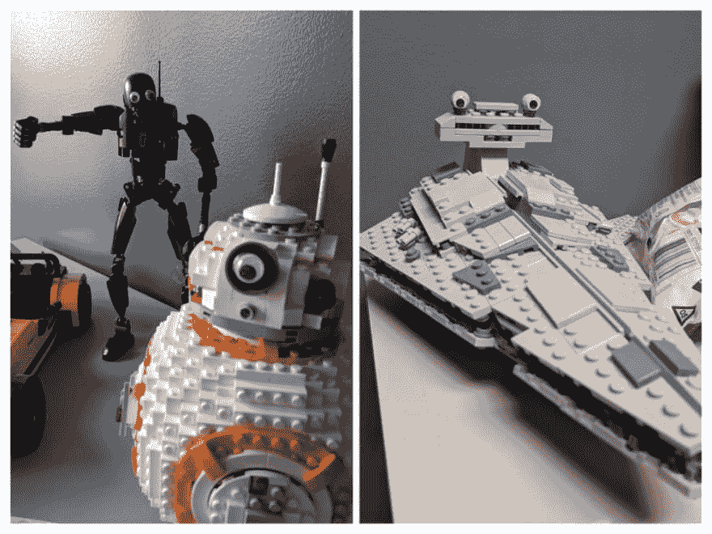
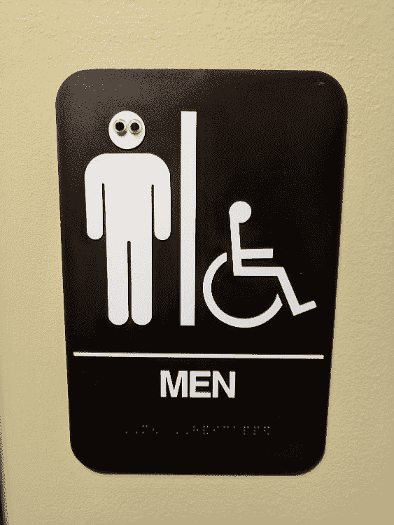

# 职场恶作剧的 4 个小贴士

> 原文：<https://dev.to/davefollett/4-tips-for-workplace-pranks-5cc8>

任何工作场所都会变得陈腐、无聊或一成不变。我认为软件开发特别容易受到影响，因为编写代码需要高度的专注。这些年来，我发现日常事务中的小突破可以帮助我理清思路，让我更好地专注于工作。这通常意味着在休息室喝咖啡的时候花几分钟时间做填字游戏或拼图游戏。有时候，不仅仅是一个谜题就能让事情发生变化。那是我喜欢对我的同事进行无害的恶作剧的时候。如果做得好，这不仅能打破常规，还能让你开怀大笑。

## 1️⃣挑选合适的人

挑一个和你关系好的人。你认识的有幽默感的人，不会感到不安的人。不要选择新的男人或女人。如果你认为他们有一丁点可能会不高兴，把你自己和 HR 从潜在的闹剧中解救出来，选择一个新的目标。

## 2️⃣保持中立，不进攻

恶作剧应该是无害的。你应该在目标不在目标的情况下笑。避开宗教、政治或任何其他个人话题。总是小心为上。

## 3️⃣不妨碍工作日

恶作剧应该会引起一些笑声，然后很快结束，这样一天的工作才能继续。你最不想做的事情就是通过让同事长时间无法工作来影响雇主的底线。那是被解雇的好方法。如果恶作剧需要精心策划，那就利用你的时间而不是雇主的时间来做。要么早来，要么晚下班。此外，一个好的恶作剧不应该造成任何损害。一旦结束，就应该像没发生过一样。

## 4️⃣一点点大有作为

不要过分经常恶作剧。如果你过于频繁地恶作剧，即使是无害的恶作剧也会很快过时。

## 👀入门指南

如果你想知道如何开始遵守我的规则，我会和你分享我最好的恶作剧之一。在一个同伙的帮助下，我们偷偷溜进办公室，用眼睛盯着各种各样的东西。看看这个订书机和盆栽。我谅你也不敢笑。

<figure>

<figcaption>Googly eyes on potted plant and stapler</figcaption>

</figure>

乐高在我工作的地方很受欢迎，而且被证明是容易攻击的目标。特别感谢他们的主人是好运动！

<figure>

<figcaption>Googly eyes on Star Wars LEGO sets (BB-8, K-2SO, Star Destroyer)</figcaption>

</figure>

什么是比公共区域浴室标志更安全的目标？

<figure>

<figcaption>Googly eyes on bathroom sign</figcaption>

</figure>

花了几个小时才发现第一双眼睛，没多久调查就锁定了我。当被问到时，我立即屈服了，我就是忍不住。

也许我和我的同伙玩得最开心，寻找目标并分散注意力，这样另一个人就可以用眼睛盯着我们，但最重要的是，我们以一种无害的方式在办公室里创造了一些乐趣。如果我们都要日复一日地在一起工作，那么在工作的过程中能够分享一些欢笑是很好的。

你有什么好的职场恶作剧？拜托，拜托，请与我分享。